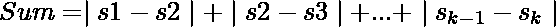

# 连续元素绝对差之和最大的最小子序列

> 原文:[https://www . geeksforgeeks . org/具有连续元素绝对差值总和的最小子序列-最大化/](https://www.geeksforgeeks.org/smallest-subsequence-with-sum-of-absolute-difference-of-consecutive-elements-maximized/)

给定一个长度为 **N** 的数组**arr【】**,包含范围为**【1，N】**的值，任务是找到一个子序列 **s <sub>1</sub> ，s <sub>2</sub> ，…，s <sub>k</sub>** ，使得

最大化**。如果多个子序列具有最大可能和，打印最小的一个。** 

> **输入:** N = 3，P = {3，2，1}
> **输出:** K = 2，S = {3，1}
> **解释:**
> 最大可能和= 2
> 子序列{3，2，1}和{3，1}达到该和。
> 因此，子序列{3，1}被认为长度较小。
> **输入:** N = 4，P = {1，3，4，2}
> **输出:** K = 3，S = {1，4，2}
> **解释:**
> 最大可能和= 5
> 子序列{1，3，4，2}和{1，4，2}达到该和。
> 因此，子序列{1，4，2}被认为长度较小。

**天真方法:**
生成所有长度为> = 2 的子序列，并计算它们各自的**和**。跟踪任何子序列获得的最大和。在多个子序列具有最大和的情况下，保持更新最小长度，并保持该子序列。最后打印子序列。
***时间复杂度:**O(2<sup>N</sup>)*
**高效方法:**
有几个关键的观察将帮助我们进行:

1.  当考虑置换中的所有元素时，将获得最大和。
    例如:

> **N** = 4，**P**=【1，3，4，2】
> **最大和**= | 1–3 |+| 3–4 |+| 4–2 | = 2+1+2 = 5
> 这里，长度为 **N** ，所需子序列为排列 **P** 本身。

1.  现在我们知道了最大可能和，目标是在不影响这个最大和的情况下最小化子序列长度。
2.  对于单调递增或递减的子序列，只考虑第一个和最后一个元素就可以得到最大和，例如:

> **S**=【1，3，5，7】
> **最大和**= | 1–3 |+| 3–5 |+| 5–7 | = 2+2+2 = 6， **K** = 4
> 仅考虑第一个和最后一个元素，
> T9】S=【1，7】
> **最大和**= | 1–7 | = 6，**K**= 2

这样，在不影响**最大和**的情况下，可以减少子序列的长度。
因此，从给定的数组中，继续提取单调递增或递减子序列的端点，并以下列方式将它们添加到子序列中:

*   排列的第一个**元素和最后一个**元素是默认端点****

*   如果**P[I–1]<P[I]>P[I+1]**，则元素 **P[ i ]** 是**单调递增端点**

*   如果**P[I–1]>P[I]<P[I+1]**，则元素 **P[ i ]** 是**单调递减端点**

这样获得的子序列将具有最大和和最小长度。
以下是上述方法的实现:

## C++

```
// C++ program to find
// smallest subsequence
// with sum of absolute
// difference of consecutive
// elements maximized
#include <bits/stdc++.h>
using namespace std;

// Function to print the smallest
// subsequence and its sum
void getSubsequence(vector<int>& arr,
                    int n)
{
    // Final subsequence
    vector<int> req;

    // First element is
    // a default endpoint
    req.push_back(arr[0]);

    // Iterating through the array
    for (int i = 1; i < n - 1; i++) {

        // Check for monotonically
        // increasing endpoint
        if (arr[i] > arr[i + 1]
            && arr[i] > arr[i - 1])
            req.push_back(arr[i]);

        // Check for monotonically
        // decreasing endpoint
        else if (arr[i] < arr[i + 1]
                 && arr[i] < arr[i - 1])
            req.push_back(arr[i]);
    }

    // Last element is
    // a default endpoint
    req.push_back(arr[n - 1]);

    // Length of final subsequence
    cout << req.size() << endl;

    // Print the subsequence
    for (auto x : req)
        cout << x << " ";
}

// Driver Program
int main()
{
    vector<int> arr = { 1, 2, 5, 3,
                        6, 7, 4 };
    int n = arr.size();
    getSubsequence(arr, n);

    return 0;
}
```

## Java 语言(一种计算机语言，尤用于创建网站)

```
// Java program to find smallest
// subsequence with sum of absolute
// difference of consecutive
// elements maximized
import java.util.*;

class GFG{

// Function to print the smallest
// subsequence and its sum
static void getSubsequence(int []arr, int n)
{

    // Final subsequence
    Vector<Integer> req = new Vector<Integer>();

    // First element is
    // a default endpoint
    req.add(arr[0]);

    // Iterating through the array
    for(int i = 1; i < n - 1; i++)
    {

       // Check for monotonically
       // increasing endpoint
       if (arr[i] > arr[i + 1] &&
           arr[i] > arr[i - 1])
           req.add(arr[i]);

       // Check for monotonically
       // decreasing endpoint
       else if (arr[i] < arr[i + 1] &&
                arr[i] < arr[i - 1])
           req.add(arr[i]);
    }

    // Last element is
    // a default endpoint
    req.add(arr[n - 1]);

    // Length of final subsequence
    System.out.print(req.size() + "\n");

    // Print the subsequence
    for(int x : req)
       System.out.print(x + " ");
}

// Driver code
public static void main(String[] args)
{
    int []arr = { 1, 2, 5, 3,
                  6, 7, 4 };
    int n = arr.length;

    getSubsequence(arr, n);
}
}

// This code is contributed by Amit Katiyar
```

## 蟒蛇 3

```
# Python3 program to find smallest
# subsequence with sum of absolute
# difference of consecutive
# elements maximized

# Function to print the smallest
# subsequence and its sum
def getSubsequence(arr, n):

    # Final subsequence
    req = []

    # First element is
    # a default endpoint
    req.append(arr[0])

    # Iterating through the array
    for i in range(1, n - 1):

        # Check for monotonically
        # increasing endpoint
        if (arr[i] > arr[i + 1] and
            arr[i] > arr[i - 1]):
            req.append(arr[i])

        # Check for monotonically
        # decreasing endpoint
        elif (arr[i] < arr[i + 1] and
              arr[i] < arr[i - 1]):
            req.append(arr[i]);

    # Last element is
    # a default endpoint
    req.append(arr[n - 1]);

    # Length of final subsequence
    print(len(req))

    # Print the subsequence
    for x in req:
        print(x, end = ' ')

# Driver code
if __name__=='__main__':

    arr = [ 1, 2, 5, 3, 6, 7, 4 ]
    n = len(arr)

    getSubsequence(arr, n)

# This code is contributed by rutvik_56
```

## C#

```
// C# program to find smallest
// subsequence with sum of absolute
// difference of consecutive
// elements maximized
using System;
using System.Collections.Generic;

class GFG{

// Function to print the smallest
// subsequence and its sum
static void getSubsequence(int []arr, int n)
{

    // Final subsequence
    List<int> req = new List<int>();

    // First element is
    // a default endpoint
    req.Add(arr[0]);

    // Iterating through the array
    for(int i = 1; i < n - 1; i++)
    {

       // Check for monotonically
       // increasing endpoint
       if (arr[i] > arr[i + 1] &&
           arr[i] > arr[i - 1])
           req.Add(arr[i]);

       // Check for monotonically
       // decreasing endpoint
       else if (arr[i] < arr[i + 1] &&
                arr[i] < arr[i - 1])
           req.Add(arr[i]);
    }

    // Last element is
    // a default endpoint
    req.Add(arr[n - 1]);

    // Length of readonly subsequence
    Console.Write(req.Count + "\n");

    // Print the subsequence
    foreach(int x in req)
       Console.Write(x + " ");
}

// Driver code
public static void Main(String[] args)
{
    int []arr = { 1, 2, 5, 3,
                  6, 7, 4 };
    int n = arr.Length;

    getSubsequence(arr, n);
}
}

// This code is contributed by Amit Katiyar
```

## java 描述语言

```
<script>
        // JavaScript code for the above approach

        // Function to print the smallest
        // subsequence and its sum
        function getSubsequence(arr, n)
        {

            // Final subsequence
            let req = [];

            // First element is
            // a default endpoint
            req.push(arr[0]);

            // Iterating through the array
            for (let i = 1; i < n - 1; i++) {

                // Check for monotonically
                // increasing endpoint
                if (arr[i] > arr[i + 1]
                    && arr[i] > arr[i - 1])
                    req.push(arr[i]);

                // Check for monotonically
                // decreasing endpoint
                else if (arr[i] < arr[i + 1]
                    && arr[i] < arr[i - 1])
                    req.push(arr[i]);
            }

            // Last element is
            // a default endpoint
            req.push(arr[n - 1]);

            // Length of final subsequence
            document.write(req.length + '<br>');

            // Print the subsequence
            for (let x of req)
                document.write(x + " ");
        }

        // Driver Program
        let arr = [1, 2, 5, 3,
            6, 7, 4];
        let n = arr.length;
        getSubsequence(arr, n);

  // This code is contributed by Potta Lokesh
    </script>
```

**Output:** 

```
5
1 5 3 7 4
```

***时间复杂度:**O(N)*T4】