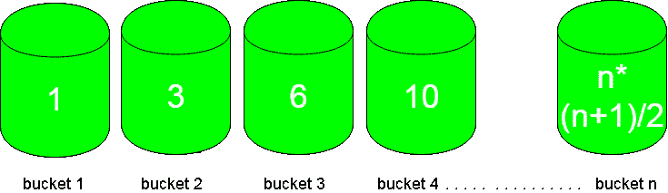

# 大于 p 的最小三角数

> 原文:[https://www . geeksforgeeks . org/minist-triangular-number-bible-p/](https://www.geeksforgeeks.org/smallest-triangular-number-larger-than-p/)

给定 n 个桶，每个桶从 1 到 n 编号，其中的花等于[三角数](https://www.geeksforgeeks.org/triangular-numbers/)。你必须选择从桶里摘下 p 花后剩下最少花的桶。



第一个桶只包含 1 朵花，第二个桶包含 3 朵，第三个桶包含 6 朵，依此类推，模式为 n(n+1)/2。
**例:**

```
Input : p = 4
Output : bucket 3 
Explanation :
Buckets with flowers : 1 3 6 10 ....
So, bucket 3 is left with only two flowers after 
selecting p flowers from it which is minimum.

Input : p = 10
Output : bucket 4
Explanation :
Bucket with flowers : 1 3 6 10 15 ...
So, selecting 10 flowers from 4th bucket leave
it with 0 flowers.
```

**进场:**
观察不同情况下的输入/输出，可使用公式计算铲斗数:

```
n = ceil( (sqrt(8*p+1)-1)/2 ) ;
```

它是如何工作的？
我们需要比 n*(n+1)/2 > = p
更小的 n，所以我们需要求方程 n<sup>2</sup>+n–2 * p>= 0 的根。
通过应用这里讨论的公式，我们得到 n = ceil( (sqrt(8*p+1)-1)/2 )

## C++

```
// CPP code to find the bucket to choose
// for picking flowers out of it
#include<bits/stdc++.h>
using namespace std;

int findBucketNo(int p)
{
   return ceil( ( sqrt( 8*p + 1 ) -1 ) / 2 ) ;
}

// Driver code
int main()
{
  int p = 10 ;   
  cout << findBucketNo(p);
  return 0;
}
```

## Java 语言(一种计算机语言，尤用于创建网站)

```
//Java code to find the bucket to choose
// for picking flowers out of it
import java.lang.System.*;

class GFG {

    static int findBucketNo(int p)
    {
        return (int)Math.ceil((
        Math.sqrt( 8*p + 1 ) -1 ) / 2 ) ;
    }

    // Driver code
    public static void main(String[] args)
    {
        int p = 10 ;

        System.out.println(findBucketNo(p));
    }
}

// This code is contributed by
// Smitha Dinesh Semwal
```

## 蟒蛇 3

```
# Python 3 code to find the bucket
# to choose for picking flowers
# out of it
import math

def findBucketNo(p):

    return math.ceil( ( math.sqrt(
               8*p + 1 ) -1 ) / 2 )

# Driver code
p = 10

print(findBucketNo(p))

# This code is contributed by
# Smitha Dinesh Semwal
```

## C#

```
// C# code to find the bucket to choose
// for picking flowers out of it
using System;

class GFG {

    static int findBucketNo(int p)
    {
        return (int)Math.Ceiling((
        Math.Sqrt( 8*p + 1 ) -1 ) / 2 );
    }

    // Driver code
    static public void Main ()
    {
        int p = 10 ;
        Console.WriteLine(findBucketNo(p));
    }
}

// This code is contributed by Ajit.
```

## 服务器端编程语言（Professional Hypertext Preprocessor 的缩写）

```
<?php
// PHP code to find the bucket
// to choose for picking
// flowers out of it

function findBucketNo($p)
{
    return ceil( ( sqrt( 8 * $p +
                  1 ) -1 ) / 2 ) ;
}

// Driver code
$p = 10 ;
echo(findBucketNo($p));

// This code is contributed by Ajit.
?>
```

## java 描述语言

```
<script>
// javascript code to find the bucket to choose
// for picking flowers out of it
function findBucketNo( p)
{
   return Math.ceil( ( Math.sqrt( 8 * p + 1 ) -1 ) / 2 ) ;
}

// Driver code
let p = 10 ;   
   document.write(findBucketNo(p));

    // This code is contributed by gauravrajput1

</script>
```

**Output :** 

```
4
```

时间复杂度:O(1)