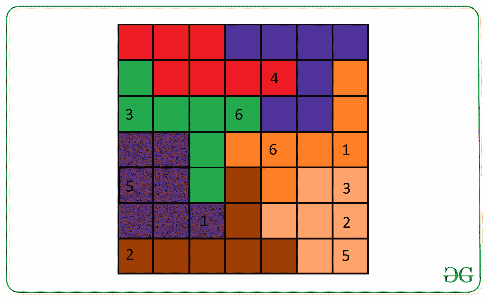
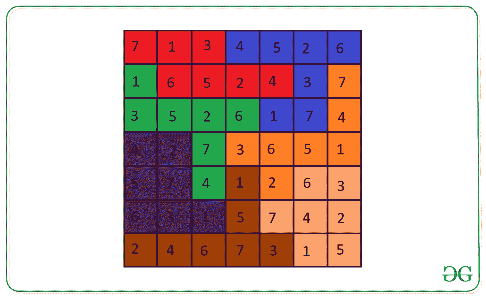

# 基于给定的不规则区域求解数独

> 原文:[https://www . geeksforgeeks . org/求解-基于给定不规则区域的数独/](https://www.geeksforgeeks.org/solve-sudoku-on-the-basis-of-the-given-irregular-regions/)

给定大小为 **N * N** 的两个矩阵**数独[][]** 和**区域[][]** ，任务是在给定的不规则区域的基础上填充给定的数独。如果无法填充**索多库[][]** 矩阵，则打印 **-1** 。以下是矩阵的定义:

**数独矩阵(数独[][]):** 它是一个 **N×N** 矩阵，包含了从 **0 到 N** 的元素，其中 **0** 表示为了解数独需要填充的空单元格。
解决数独的规则:

*   每行和每列必须有从 **1 到 N** 的唯一数字。
*   每个区域必须有从 **1 到 N** 的唯一数字。

**区域矩阵(区域[][]):** 它是一个包含表示数独区域的字符的 **N×N** 矩阵。矩阵中相同的字符表示数独的一个区域。

**示例:**

> **输入:**数独[][]= {
> } { 0，0，0，0，0，0}，
> {0，0，0，0，0，4，0，0}，
> {3，0，0，6，0，0，0}，
> {0，0，0，0，6，0，0，0，1}，
> {5，0，0，0，0，0，0，0，3}，
> {0，0，1，0，0，0，0，0 b，o}，
> {g，g，g，g，b，b，o}，
> {p，p，g，o，o，o，o}，
> {p，p，g，d，o，l，l}，
> {p，p，p，p，d，l，l，l}，
> {d，d，d，d，d，d，d，l， l} }
> **输出:**
> 7 1 3 4 5 2 6
> 1 6 5 2 4 3 7
> 3 5 2 6 1 7 4
> 4 2 7 3 6 5 1 4 2 6 3
> 6 3 1 5 7 4 2
> 2 4 6 7 3 1 5
> **解释:**
> 未解的数独难题与区域:
> 
> 
> 
> 用以下区域解决了数独难题:
> 
> 
> 
> **输入:**数独[][] = {
> { 0，0 }，
> { 0，1 } }，
> 区域[][] = {
> {r，r}，
> {b，b}}
> **输出:**
> 1 2
> 2 1
> **说明:**
> 输出矩阵行的元素:{1，2}，{2，1}
> 列的元素
> 所以是数独的有效解。

**方法:**思路是使用[回溯](https://www.geeksforgeeks.org/backtracking-algorithms/)通过给空单元格逐个赋值来解决数独问题[递归](https://www.geeksforgeeks.org/recursion/)如果违反任何规则就回溯，即每一行、每一列、每一区域必须有从 **1 到 N** 的唯一数字。下面是借助步骤的图示:

*   创建一个函数来检查分配给单元格的数字是否安全:
    *   若要签入当前行和列，请遍历行和列，并检查单元格中是否存在分配的数字。
    *   使用[广度优先搜索](https://www.geeksforgeeks.org/breadth-first-search-or-bfs-for-a-graph/)检查当前区域是否有该号码。
*   遍历网格，检查任何未分配的单元格，并将值从 **1 分配到 N** ，并检查分配的数字是否安全。如果分配的号码不安全，则返回到未分配的小区。
*   如果所有未分配的单元格都由某个数字分配，则打印数独。否则，没有解决的可能。

下面是上述方法的实现:

## C++

```
// C++ program for the above approach

#include <bits/stdc++.h>
using namespace std;

// Grid dimension
const int N = 2;

// Function to check if the number to be present
// in the current cell is safe or not
bool issafe(int sudoku[N][N], int i, int j, int n,
            int number, char region[N][N])
{

    // Check if the number is present in
    // i-th row or j-th column or not
    for (int x = 0; x < n; x++) {
        if (sudoku[x][j] == number
            || sudoku[i][x] == number) {
            return false;
        }
    }

    // Check if the number to be filled
    // is safe in current region or not
    char r = region[i][j];

    // Initialize the queue for the BFS
    queue<pair<int, int> > q;

    // Insert the current cell into queue
    q.push(make_pair(i, j));

    // Check if the neighbours cell is
    // visited or not
    int visited[N][N];

    // Initialize visited to 0
    memset(visited, 0, sizeof visited);

    // Mark current cell is visited
    visited[i][j] = 1;

    // Performing the BFS technique
    // Checking for 4 neighbours at a time
    while (!q.empty()) {

        // Stores front element of the queue
        pair<int, int> front = q.front();

        // Pop top element of the queue
        q.pop();

        // Check for neighbours cell
        if (front.first + 1 < N
            && region[front.first + 1][front.second] == r
            && !visited[front.first + 1][front.second]) {

            // If already contains the same number
            if (sudoku[front.first + 1][front.second]
                == number) {
                return false;
            }
            q.push(make_pair(front.first + 1,
                             front.second));

            // Mark as neighbour cell as visited
            visited[front.first + 1][front.second] = 1;
        }

        // Checking for 2nd neighbours
        if (front.first - 1 >= 0
            && region[front.first - 1][front.second] == r
            && !visited[front.first - 1][front.second]) {

            // If neighbours contains the same number
            if (sudoku[front.first - 1][front.second]
                == number) {
                return false;
            }

            // Insert neighbour cell into queue
            q.push(make_pair(front.first - 1,
                             front.second));

            // Mark neighbour cell as visited
            visited[front.first - 1][front.second] = 1;
        }

        // Checking for 3rd neighbours
        if (front.second + 1 < N
            && region[front.first][front.second + 1] == r
            && !visited[front.first][front.second + 1]) {

            // If neighbours contains the same number
            if (sudoku[front.first][front.second + 1]
                == number) {
                return false;
            }

            // Insert neighbour cell into queue
            q.push(make_pair(front.first,
                             front.second + 1));

            // Mark neighbour cell as visited
            visited[front.first][front.second + 1] = 1;
        }

        // Checking for 4th neighbours
        if (front.second - 1 >= 0
            && region[front.first][front.second - 1] == r
            && !visited[front.first][front.second - 1]) {

            // If neighbours contains the same number
            if (sudoku[front.first][front.second - 1]
                == number) {
                return false;
            }

            // Insert neighbour cell into queue
            q.push(make_pair(front.first,
                             front.second - 1));

            // Mark neighbour cell as visited
            visited[front.first][front.second - 1] = 1;
        }
    }
    return true;
}

// Recursive function to solve the sudoku
bool solveSudoku(int sudoku[N][N], int i, int j,
                 int n, char region[N][N])
{

    // If the given sudoku already solved
    if (i == n) {

        // Print the solution of sudoku
        for (int a = 0; a < n; a++) {
            for (int b = 0; b < n; b++) {
                cout << sudoku[a][b] << " ";
            }
            cout << endl;
        }
        return true;
    }

    // If the numbers in the current row
    // already filled
    if (j == n) {
        return solveSudoku(sudoku, i + 1, 0, n, region);
    }

    // If current cell is not empty
    if (sudoku[i][j] != 0) {
        return solveSudoku(sudoku, i, j + 1, n, region);
    }
    else {

        // Iterate over all possible value of numbers
        for (int number = 1; number <= n; number++) {

            // If placing the current number is safe
            // in the current cell
            if (issafe(sudoku, i, j, n, number, region)) {

                // Update sudoku[i][j]
                sudoku[i][j] = number;

                // Fill the ramining cells of the sudoku
                bool rest
                    = solveSudoku(sudoku, i,
                                  j + 1, n, region);

                // If remaining cells has been filled
                if (rest == true) {
                    return true;
                }
            }
        }

        // Otherwise No Solution
        sudoku[i][j] = 0;
        return false;
    }
}

// Driver Code
int main()
{

    // Given sudoku array
    int sudoku[N][N] = {
        { 0, 1 },
        { 0, 0 }
    };

    // Given region array
    char region[N][N] = {
        { 'r', 'r' },
        { 'b', 'b' }
    };

    // Function call
    int ans = solveSudoku(
        sudoku, 0, 0, N, region);

    // No answer exist
    if (ans == 0) {
        cout << "-1";
    }
    return 0;
}
```

## java 描述语言

```
<script>
// Javascript program for the above approach

// Grid dimension
const N = 2;

// Function to check if the number to be present
// in the current cell is safe or not
function issafe(sudoku, i, j, n, number, region)
{

  // Check if the number is present in
  // i-th row or j-th column or not
  for (let x = 0; x < n; x++) {
    if (sudoku[x][j] == number || sudoku[i][x] == number) {
      return false;
    }
  }

  // Check if the number to be filled
  // is safe in current region or not
  let r = region[i][j];

  // Initialize the queue for the BFS
  let q = [];

  // Insert the current cell into queue
  q.push([i, j]);

  // Check if the neighbours cell is
  // visited or not
  let visited = new Array(N).fill(0).map(() => new Array(N).fill(0));

  // Mark current cell is visited
  visited[i][j] = 1;

  // Performing the BFS technique
  // Checking for 4 neighbours at a time
  while (!q.length)
  {

    // Stores front element of the queue
    let front = q.front();

    // Pop top element of the queue
    q.pop();

    // Check for neighbours cell
    if (
      front[0] + 1 < N &&
      region[front[0] + 1][front[1]] == r &&
      !visited[front[0] + 1][front[1]]
    )
    {

      // If already contains the same number
      if (sudoku[front[0] + 1][front[1]] == number)
      {
        return false;
      }
      q.push([front[0] + 1, front[1]]);

      // Mark as neighbour cell as visited
      visited[front[0] + 1][front[1]] = 1;
    }

    // Checking for 2nd neighbours
    if (
      front[0] - 1 >= 0 &&
      region[front[0] - 1][front[1]] == r &&
      !visited[front[0] - 1][front[1]]
    ) {
      // If neighbours contains the same number
      if (sudoku[front[0] - 1][front[1]] == number) {
        return false;
      }

      // Insert neighbour cell into queue
      q.push([front[0] - 1, front[1]]);

      // Mark neighbour cell as visited
      visited[front[0] - 1][front[1]] = 1;
    }

    // Checking for 3rd neighbours
    if (
      front[1] + 1 < N &&
      region[front[0]][front[1] + 1] == r &&
      !visited[front[0]][front[1] + 1]
    ) {
      // If neighbours contains the same number
      if (sudoku[front[0]][front[1] + 1] == number) {
        return false;
      }

      // Insert neighbour cell into queue
      q.push([front[0], front[1] + 1]);

      // Mark neighbour cell as visited
      visited[front[0]][front[1] + 1] = 1;
    }

    // Checking for 4th neighbours
    if (
      front[1] - 1 >= 0 &&
      region[front[0]][front[1] - 1] == r &&
      !visited[front[0]][front[1] - 1]
    ) {
      // If neighbours contains the same number
      if (sudoku[front[0]][front[1] - 1] == number) {
        return false;
      }

      // Insert neighbour cell into queue
      q.push([front[0], front[1] - 1]);

      // Mark neighbour cell as visited
      visited[front[0]][front[1] - 1] = 1;
    }
  }
  return true;
}

// Recursive function to solve the sudoku
function solveSudoku(sudoku, i, j, n, region) {
  // If the given sudoku already solved
  if (i == n) {
    // Prlet the solution of sudoku
    for (let a = 0; a < n; a++) {
      for (let b = 0; b < n; b++) {
        document.write(sudoku[a][b] + " ");
      }
      document.write("<br>");
    }
    return true;
  }

  // If the numbers in the current row
  // already filled
  if (j == n) {
    return solveSudoku(sudoku, i + 1, 0, n, region);
  }

  // If current cell is not empty
  if (sudoku[i][j] != 0) {
    return solveSudoku(sudoku, i, j + 1, n, region);
  } else {
    // Iterate over all possible value of numbers
    for (let number = 1; number <= n; number++) {
      // If placing the current number is safe
      // in the current cell
      if (issafe(sudoku, i, j, n, number, region)) {
        // Update sudoku[i][j]
        sudoku[i][j] = number;

        // Fill the ramining cells of the sudoku
        let rest = solveSudoku(sudoku, i, j + 1, n, region);

        // If remaining cells has been filled
        if (rest == true) {
          return true;
        }
      }
    }

    // Otherwise No Solution
    sudoku[i][j] = 0;
    return false;
  }
}

// Driver Code

// Given sudoku array
let sudoku = [
  [0, 1],
  [0, 0],
];

// Given region array
let region = [
  ["r", "r"],
  ["b", "b"],
];

// Function call
let ans = solveSudoku(sudoku, 0, 0, N, region);

// No answer exist
if (ans == 0) {
  document.write(cout + "-1");
}

// This code is contributed by gfgking
</script>
```

**Output:** 

```
2 1 
1 2
```

***时间复杂度:**O(N<sup>N2</sup>)*
*T8】辅助空间: O(N <sup>2</sup> )*