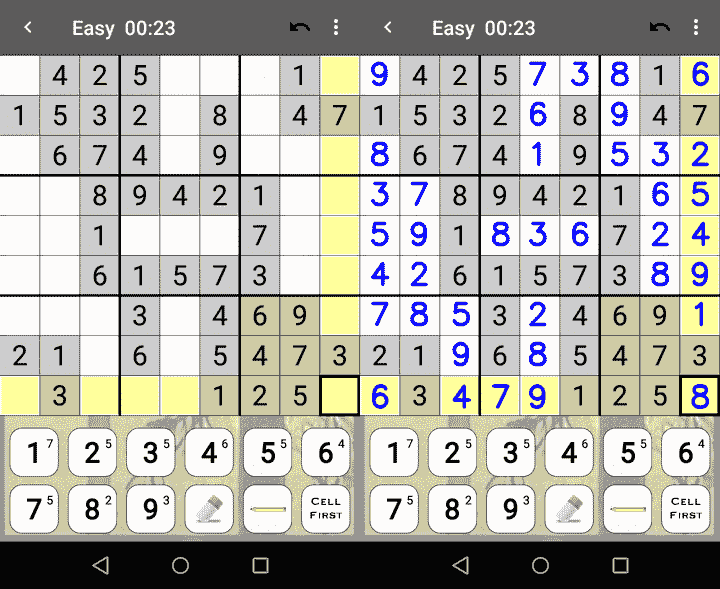
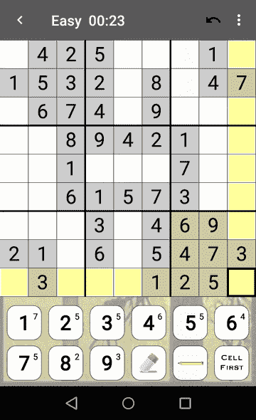
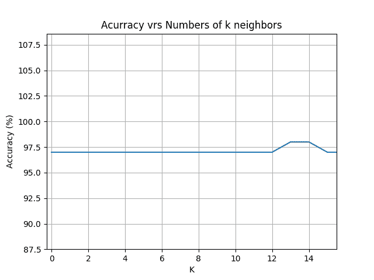
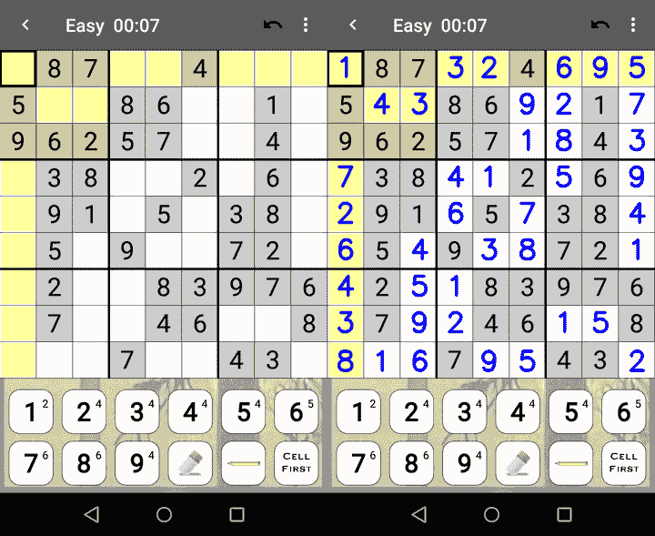
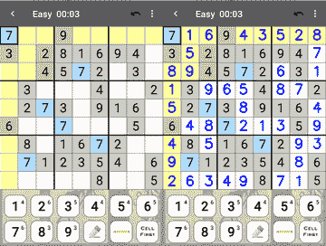

# 用计算机视觉和约束满足算法求解数独

> 原文:[https://www . geesforgeks . org/solve-sudoku-用计算机视觉和约束满足算法/](https://www.geeksforgeeks.org/solve-sudoku-with-computer-vision-and-constraint-satisfaction-algorithm/)

本文用 python 2.7 解释了一个解决 genina.com Android 应用程序“数独”的数独 9×9 的程序。为了解决 genina.com 安卓应用程序“数独”的数独问题，拍摄游戏截图(获得 720×1280 的图像)，然后使用 KNN 算法获得在 81 个正方形中的每个正方形中找到的数字，一旦确定了每个元素，就使用带有回溯的约束满足算法来解决数独问题。



左边是我们的输入:我们要分析的截图。右边是解决方案。

**这是怎么工作的？**
**第一步:图像预处理**
第一步，图像预处理:单独提取每个数独方块，依次保存为照片#。png(其中#从 0 到 80)。获得了 80×75 像素的图像。

**代码:**



**输入:**photo0.png。这是我们要分析的照片。

**代码:**

```
#/Preprocessing.py / import cv2
import numpy as np
import Functions

# Relative path
path ="./Screenshots/"

# Image to analize
number = input("Enter image number: ")
globalPath = path+"photo"+str(number)+".png"
image = cv2.imread(globalPath)

# Save the name of the image to analize after in Main.py
file = open("image.txt", "w")
file.write(globalPath)
file.close()

# MAIN
if __name__ == '__main__':    

    # PREPROCESSING -> Crop the edges, ads and all 
    # the images outside the sudoku board
    image = Functions.cropImage(image, 218)
    image = Functions.rotateImage(image, 180)
    image = Functions.cropImage(image, 348)
    image = Functions.rotateImage(image, 180)

    # Crop each box in the sudoku board
    cont = 0
    w = 0
    for j in range(9):
        h = 0

        for i in range(9):

            nombre = "image"+ str(cont) + ".png"
            image1 = Functions.cropBox(image, w, h, 75, 80)

            # Save the image
            Functions.saveImage(image1, nombre)
            h = h + 80
            cont = cont + 1

        # Position of the pixel where start the image
        w = 80*(j + 1)
```

**代码:创建一个只有预处理和图像变换功能的库，称为“functions”。**

```
#/Functions.py / import cv2
import numpy as np

# Function to rotate the image
def rotateImage(image, angle):
     image_center = tuple(np.array(image.shape[1::-1]) / 2)
     rot_mat = cv2.getRotationMatrix2D(image_center, angle, 1.0)
     result = cv2.warpAffine(image, rot_mat, image.shape[1::-1], flags = cv2.INTER_LINEAR)
     return result

# Function to crop top border in the image
def cropImage(image, x):

    # x determine how far to cut the image
    # fileb determines with what name we are going to save the image
    # Determine image dimensions
    height, width, channels = image.shape
    crop_img = image[x:height, 0:width]
    return crop_img

# Function to crop every box (there are 81 boxes in total) 
def cropBox(image, x, y, h, w):
    # Each side of the square / box has a side of length 10
    crop_img = image[x:(x + h), y:(y + w)]
    return crop_img

# Function to save the image 
def saveImage(image, fileb):
    new_path = "./Images/"
    cv2.imwrite(new_path + fileb, image)
    cv2.waitKey(0)
    cv2.destroyAllWindows()

# Function to crop all borders of each box
def cropBorder(image):

    # Determine image dimensions
    height, width, channels = image.shape
    crop_img = image[12:height-12, 12:width-12]
    return crop_img
```

**第二步:图像变换**
裁剪出每个方框的边框，以防有我们分析可以推断出的黑色边框。每个图像都有 *56×51* 像素。

**代码:**

```
#/Transformation.py / import cv2
import numpy as np
import Functions

# Relative path 
path ="./Images/"

if __name__ == '__main__':

    for x in range(81):

        # Image to analize
        nameImage = "image" + str(x) + ".png"
        image = cv2.imread(path + nameImage)
        image = Functions.cropBorder(image)
        Functions.saveImage(image, nameImage)
```

**第三步:KNN 分类**

分析盒子里是什么数字。这种情况下，使用 **Canny 算法**判断是否有数字或者是空盒子。然后通过 KNN 算法确定盒子里是哪个数字。在特征提取方面，采用了 Hu: 1 和 Hu:2 矩、高斯滤波和无监督阈值法。

**代码:**

```
#/Main.py / import numpy as np
from matplotlib import pyplot as plt
import matplotlib.patches as mpatches
plt.rcParams['image.cmap'] = 'gray'
from mpl_toolkits.mplot3d import Axes3D
from skimage import io, color, img_as_float, filters
from skimage.feature import hog
import cv2
import mahotas

# Function to extract characteristics of the images
# to later use them in the Knn algorithm
def extraction(image):

    # PREPROCESSING -> Convert image to grayscale
    aux = cv2.cvtColor(image, cv2.COLOR_BGR2GRAY) 

    # FILTERING -> Apply Gauss Filter
    aux = cv2.GaussianBlur(aux, (3, 3), 0)   

    # SEGMENTATION -> Apply Thresholding simple
    ret, th = cv2.threshold(aux, 0, 255, cv2.THRESH_BINARY + cv2.THRESH_OTSU)
    aux = th

    # FEATURE EXTRACTION -> Obtain Hu Moments
    hu = cv2.HuMoments(cv2.moments(aux)).flatten()

    # Analysis the features (Hu Moments)
    return aux, [hu[0], hu[1]]

# Training Data Base (YTrain)
# Load all images of each numbers that appears in sudoku board 
number1 = io.ImageCollection('./Images / Train / Y1/*.png:./Images / Train / Y1/*.jpg')
number2 = io.ImageCollection('./Images / Train / Y2/*.png:./Images / Train / Y2/*.jpg')
number3 = io.ImageCollection('./Images / Train / Y3/*.png:./Images / Train / Y3/*.jpg')
number4 = io.ImageCollection('./Images / Train / Y4/*.png:./Images / Train / Y4/*.jpg')
number5 = io.ImageCollection('./Images / Train / Y5/*.png:./Images / Train / Y5/*.jpg')
number6 = io.ImageCollection('./Images / Train / Y6/*.png:./Images / Train / Y6/*.jpg')
number7 = io.ImageCollection('./Images / Train / Y7/*.png:./Images / Train / Y7/*.jpg')
number8 = io.ImageCollection('./Images / Train / Y8/*.png:./Images / Train / Y8/*.jpg')
number9 = io.ImageCollection('./Images / Train / Y9/*.png:./Images / Train / Y9/*.jpg')

# Create a class for each element
class Element:
    def __init__(self):
        self.number = None
        self.image = None
        self.feature = []
        self.distance = 0

# Analize data
data = []
i = 0

# Analize number 1
iter = 0

for object in number1:
    data.append(Element())
    data[i].number = '1'
    data[i].image, data[i].feature = extraction(object)
    i += 1
    iter += 1
print("number1 is OK")

# Analize number 2
iter = 0

for object in number2:
    data.append(Element())
    data[i].number = '2'
    data[i].image, data[i].feature = extraction(object)
    i += 1
    iter += 1
print("number2 is OK")

# Analize number 3
iter = 0

for object in number3:
    data.append(Element())
    data[i].number = '3'
    data[i].image, data[i].feature = extraction(object)
    i += 1
    iter += 1
print("number3 is OK")

# Analize number 4
iter = 0

for object in number4:
    data.append(Element())
    data[i].number = '4'
    data[i].image, data[i].feature = extraction(object)
    i += 1
    iter += 1
print("number4 is OK")

# Analize number 5
iter = 0

for object in number5:
    data.append(Element())
    data[i].number = '5'
    data[i].image, data[i].feature = extraction(object)
    i += 1
    iter += 1
print("number5 is OK")

# Analize number 6
iter = 0

for object in number6:
    data.append(Element())
    data[i].number = '6'
    data[i].image, data[i].feature = extraction(object)
    i += 1
    iter += 1
print("number6 is OK")

# Analize number 7
iter = 0

for object in number7:
    data.append(Element())
    data[i].number = '7'
    data[i].image, data[i].feature = extraction(object)
    i += 1
    iter += 1
print("number7 is OK")

# Analize number 8
iter = 0

for object in number8:
    data.append(Element())
    data[i].number = '8'
    data[i].image, data[i].feature = extraction(object)
    i += 1
    iter += 1
print("number8 is OK")

# Analize number 9
iter = 0

for object in number9:
    data.append(Element())
    data[i].number = '9'
    data[i].image, data[i].feature = extraction(object)
    i += 1
    iter += 1
print("number9 is OK")

print("Complete analysis of the Train database")

# KNN
print("\nInitialization KNN")

# Element to analize
# Remember to apply Transformation.py when you 
# want to evaluate a new image.
test = Element()

for aux in range(81):

    name = './Images / image'+str(aux)+'.png'
    image = io.imread(name)

    # COUNTING OBJECTS WITHIN THE IMAGE WITH CANNY ALGORITHM
    borders = cv2.Canny(image, 10, 140)                                            

    # OpenCV4    
    ctns, _ = cv2.findContours(borders, cv2.RETR_EXTERNAL, cv2.CHAIN_APPROX_SIMPLE)
    contours = len(ctns)

    # If it is different from an empty box -> in empty boxes the algorithm 
    # marks zero because it does not find anything
    if (contours != 0): 
        test.image, test.feature = extraction(image)
        test.number = '1' # label initial 

        i = 0
        sum = 0

        for ft in data[0].feature:
            sum = sum + np.power(np.abs(test.feature[i] - ft), 2)
            i += 1
        d = np.sqrt(sum)

        for element in data:
            sum = 0
            i = 0

            for ft in (element.feature):
                sum = sum + np.power(np.abs((test.feature[i]) - ft), 2)
                i += 1    
            element.distance = np.sqrt(sum)
            if (sum < d):
                d = sum
                test.number = element.number
    else:
        test.number = '.'

    if (aux == 0): vector = str(test.number)
    else: vector = vector + str(test.number)

print(vector)

# Save in a string all the boxes in the sudoku board 
archivo = open("vector.txt", "w")
archivo.write(vector)
archivo.close()
```



显示 KNN 算法的性能

*Vector.txt* 包含从截图中提取的所有元素(其中框从左到右，从上到下滚动)。在这个项目中，相对于测试中分析的所有图像，KNN 算法的性能表现出 97%的准确性。如果在识别数字时出现任何错误，可以选择手动更改*矢量. txt* 中方框的预测。

<center>

识别图像 photo0.jpg 的数独网格的所有数字的结果

</center>

**第四步:现在解数独！**
提出了一种带回溯的约束满足算法来求解数独。
T4【代码:

```
#/Solver.py / import numpy as np

# Dictionary with grid numbers
def solverGrid(grid):

    values = valuesGrid(grid)
    return searchValues(values)

# Exchange of items
def exchangeValues(A, B):

    return [a + b for a in A for b in B]

# Define initial values
def initialValues(grid):
    return dict(zip(sections, grid))

# Define values in the grid
def valuesGrid(grid):
    numbers = []

    for c in grid:
        if c == '.':
            numbers.append('123456789')
        elif c in '123456789':
            numbers.append(c)

    return dict(zip(sections, numbers))

# Delete the values that are already inside the grid
def eliminateValues(numbers):

    solved_values = [box for box in numbers.keys() if len(numbers[box]) == 1]
    for box in solved_values:
        digit = numbers[box]
        for vecino in neighbors[box]:
            numbers[vecino] = numbers[vecino].replace(digit, '')
    return numbers

def onlyOption(numbers):
    for unit in unitlist:
        for digit in '123456789':
            dplaces = [box for box in unit if digit in numbers[box]]
            if len(dplaces) == 1:
                numbers[dplaces[0]] = digit
    return numbers

def reduceSudoku(numbers):
    stalled = False
    while not stalled:
        # Check how many boxes have a determined value
        solved_values_before = len([box for box in numbers.keys() if len(numbers[box]) == 1])

        # Set the Eliminate Strategy
        numbers = eliminateValues(numbers)

        # Use the Only Choice Strategy
        numbers = onlyOption(numbers)

        # Check how many boxes have a determined value, to compare
        solved_values_after = len([box for box in numbers.keys() if len(numbers[box]) == 1])

        # If no new values were added, stop the loop.
        stalled = solved_values_before == solved_values_after

        # Sanity check, return False if there is a box with zero available values:
        if len([box for box in numbers.keys() if len(numbers[box]) == 0]):
            return False

    return numbers

def searchValues(numbers):

    numbers = reduceSudoku(numbers)

    if numbers is False:
        return False    ## Failure
    if all(len(numbers[s]) == 1 for s in sections): 
        return numbers  ## Ok

    # Choose one of the unfilled boxes
    unfilled_squares = [(len(numbers[s]), s) for s in sections if len(numbers[s]) > 1]
    n, s = min(unfilled_squares)

    # Solve the next boxes
    for value in numbers[s]:
        nova_sudoku = numbers.copy()
        nova_sudoku[s] = value
        attempt = searchValues(nova_sudoku)
        if attempt:
            return attempt

# Define values
rows = 'ABCDEFGHI'
columns = '123456789'

sections = exchangeValues(rows, columns)
rowsUnit = [exchangeValues(r, columns) for r in rows]
columnUnits = [exchangeValues(rows, c) for c in columns]
boxUnits = [exchangeValues(rs, cs) for rs in ('ABC', 'DEF', 'GHI') for cs in ('123', '456', '789')]

unitlist = rowsUnit + columnUnits + boxUnits

units = dict((s, [u for u in unitlist if s in u]) for s in sections)
neighbors = dict((s, set(sum(units[s], []))-set([s])) for s in sections)

# MAIN
if __name__ == '__main__':

    # With file manager to read the file vector.txt 
    # that has all the values of the screenshot
    file = open("vector.txt", "r")
    lines = file.read()
    file.close() 

    # Access the dictionary
    a = solverGrid(lines)
    b = sorted(a.items())

    # Save the dictionary solution
    np.save('Solution', b) 
```

**第五步:界面**
与原截图相比，改进了解决方案的显示方式。

**代码:**

```
#/Interface.py / 
import numpy as np
import matplotlib.pyplot as plt
import cv2

# Read dictionary from Solution.npy
readDictionary = np.load('Solution.npy')
values = (readDictionary[:, 1])

# Read vector.txt
file = open("vector.txt", "r")
lines = file.read()
file.close()

# Read the path of the image the we want to analize
fileTxt = open("image.txt", "r")
pathGlobal = fileTxt.read()
fileTxt.close()

# Obtain the coordinates to be able to 
# locate them in the image
row = ["A", "B", "C", "D", "E", "F", "G", "H", "I"]
column = ["1", "2", "3", "4", "5", "6", "7", "8", "9"]

# Assign the coordinates of each number within the image plane
def coordinate():
    positionx = list()
    positiony = list()

    for k in range(9):
        for i in range(9):

            if (row[k] == "A"): y = 270 
            elif (row[k] == "B"): y = 350
            elif (row[k] == "C"): y = 430
            elif (row[k] == "D"): y = 510
            elif (row[k] == "E"): y = 590
            elif (row[k] == "F"): y = 670
            elif (row[k] == "G"): y = 750
            elif (row[k] == "H"): y = 830
            elif (row[k] == "I"): y = 915

            if (column[i] == "1"): x = 19
            elif (column[i] == "2"): x = 98
            elif (column[i] == "3"): x = 182
            elif (column[i] == "4"): x = 261
            elif (column[i] == "5"): x = 335
            elif (column[i] == "6"): x = 419
            elif (column[i] == "7"): x = 499
            elif (column[i] == "8"): x = 580
            elif (column[i] == "9"): x = 660

            positionx.append(x)
            positiony.append(y)

    return (positionx, positiony)        

# Function to write value in each box in the image
def writeValue(image, valor, x, y):

    font = cv2.FONT_HERSHEY_SIMPLEX
    text = str(valor)

    # Write text in the image
    cv2.putText(image, text, (x, y), font, 2, (255, 0, 0), 5)
    # cv2.putText(image, text, (coordinates), size font, (color RGB), thickness)

    return image

# Load image
image = cv2.imread(pathGlobal)
image2 = image.copy()

# Load coordinates
positionx, positiony = coordinate()

for i in range(81):
    if (lines[i] == "."):
        image = writeValue(image, values[i], positionx[i], positiony[i])

# Concatenate images horizontally
image = np.concatenate((image2, image), axis = 1)

# Show image concatenation   
plt.imshow(image)
plt.axis("off")
plt.show()

# Save image
cv2.imwrite("./Interface / example.png", image)
```

**输出:**



photo1.png 的结果



photo2.png 的结果

All the images for the training of the KNN algorithm and the screenshots of example can be found in [given repository](https://github.com/cabustillo13/Resolvedor-de-Sudoku)