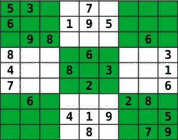

# 使用按位算法求解数独

> 原文:[https://www . geesforgeks . org/solution-sudoku-using-bitwise-algorithm/](https://www.geeksforgeeks.org/solving-sudoku-using-bitwise-algorithm/)

给定一个部分填充的 9×9 矩阵，数字(从 1 到 9)必须分配给空单元格，这样大小为 3×3 的每一行、每一列和每一子矩阵都恰好包含 1 到 9 数字的一个实例。



这个问题的**纯回溯**解决方案在这里[描述](https://www.geeksforgeeks.org/sudoku-backtracking-7/)。强烈建议读者在继续阅读之前了解纯回溯解决方案是如何工作的。

在纯回溯解决方案中，我们遍历矩阵，每当发现一个空单元格(没有任何数字的单元格)时，我们为该单元格分配一个数字，其中该数字不存在于当前的列、行和 3×3 子矩阵中。在给当前单元格赋值后，我们递归地检查这个赋值是否导致有效的解。如果赋值没有得到有效的解，那么我们尝试当前空单元格的下一个有效数字。如果没有一个数字导致有效的解决方案，那么这个实例是不可行的。

```
1\. If there is no empty cell in the matrix M:
    return true
2\. Let (i, j) be an empty cell in the matrix M
3\. For i from 1 to 9:
    3.1\. If i is not present in the row r, in column c, and the 3x3
    submatrix of (r, c):
        a) M(r, c) = i 
        b) recursively try fill in remaining empty cells
        c) If recursion was successful:
            return true
        d) M(r, c) = 0
4\. return false

```

*   The step (3.1) can be performed by traversing the respective row, column, and 3×3 submatrix. However, we can make this step faster by preprocessing those digits before the backtracking, and this is the main point of this article. So, let’s consider the matrix below as an example:

    

    我们可以在整数的位中跟踪行、列和 3×3 子矩阵的数字，例如，考虑前一个矩阵的第一行，我们可以通过以下方式存储这些数字:

    ```
    bits order - 9 8 7 6 5 4 3 2 1
    bits       - 0 0 1 0 1 0 1 0 0

    ```

    然后在步骤(3.1)中，我们可以使用按位运算来确定数字 I 是否在行、列和 3×3 子矩阵中。假设行数字[r]是包含行 r 的数字的整数，那么我们可以用下面的表达式来检查数字 I 是否在行 r 中:

    ```
    rowsDigits[r] & (1<<(i - 1))

    ```

    如果上面的表达式等于 0，则数字 I 不在行 r 中。例如，如果 r = 0，而 i = 1，则:

    ```
    bits order                - 9 8 7 6 5 4 3 2 1
    rowDigits[r]              - 0 0 1 0 1 0 1 0 0
    1<<(i - 1)                - 0 0 0 0 0 0 0 0 1
    rowDigits[r]&(1<<(i - 1)) - 0 0 0 0 0 0 0 0 0

    ```

*   Once the condition of step (3.1) is true, the step (3.1a) is executed, and then we need to insert the digit i in rowDigits, columnDigits, and subMatrixDigits, we can do this with the following expression:

    ```
    rowsDigits[r] | (1<<(i - 1))

    ```

    例如，如果 r = 0，i = 1，则:

    ```
    bits order                - 9 8 7 6 5 4 3 2 1
    rowDigits[r]              - 0 0 1 0 1 0 1 0 0
    1<<(i - 1)                - 0 0 0 0 0 0 0 0 1
    rowDigits[r]|(1<<(i - 1)) - 0 0 1 0 1 0 1 0 1

    ```

*   In the case where the condition of step (3.1c) is false, the step (3.1d) is executed, and then we need to remove the digit i from rowDigits, columnDigits, and subMatrixDigits, we can do this with the following expression:

    ```
    rowsDigits[r] & ~(1<<(i - 1))

    ```

    例如，如果 r = 0，i = 1，则:

    ```
    bits order                - 9 8 7 6 5 4 3 2 1
    rowDigits[r]              - 0 0 1 0 1 0 1 0 0
    1<<(i - 1)                - 0 0 0 0 0 0 0 0 1
    ~(1<<(i - 1))             - 1 1 1 1 1 1 1 1 0
    rowDigits[r]&~(1<<(i - 1) - 0 0 1 0 1 0 1 0 0

    ```

下面是上述方法的实现。

```
// C++ program to solve sudoku
#include <iostream>
#include <string.h>

// N is used for the size of Sudoku grid.  
// Size will be NxN  
#define N 9

using namespace std;

/* A utility function to print grid */
void printGrid(int grid[N][N])  
{  
    for (int row = 0; row < N; row++)  
    {  
    for (int col = 0; col < N; col++)  
            cout << grid[row][col] << " ";  
        cout << endl; 
    }  
}
/* Takes a partially filled-in grid and attempts  
to assign values to all unassigned locations in  
such a way to meet the requirements for 
Sudoku solution (non-duplication across rows, 
columns, and boxes) */
bool solve(int r, int c, int board[9][9], 
           int submatrixDigits[3][3], 
           int rowDigits[9], 
           int columnDigits[9])
{
    if (r == 9)
    {

        return true;
    }
    if (c == 9)
    {
        return solve(r + 1, 0, board, submatrixDigits, 
                     rowDigits, columnDigits);
    }

    if (board[r] == 0) {
        for (int i = 1; i <= 9; i++)
        {
            int digit = 1 << (i - 1);

            if (!((submatrixDigits[r / 3] & digit) 
                  || (rowDigits[r] & digit) 
                  || (columnDigits & digit)))
            {
                // set digit
                submatrixDigits[r / 3] |= digit;
                rowDigits[r] |= digit;
                columnDigits |= digit;
                board[r] = i;

                if (solve(r, c + 1, board, submatrixDigits,
                          rowDigits, columnDigits))
                {
                    return true;
                }
                else
                {
                    submatrixDigits[r / 3] &= ~digit;
                    rowDigits[r] &= ~digit;
                    columnDigits &= ~digit;
                    board[r] = 0;
                }
            }
        }
        return false;
    }
    return solve(r, c + 1, board, submatrixDigits, 
                 rowDigits, columnDigits);
}

// Function checks if Sudoku can be
// solved or not
bool SolveSudoku(int board[9][9])
{
    int submatrixDigits[3][3];
    int columnDigits[9];
    int rowDigits[9];

    for (int i = 0; i < 3; i++)
        memset(submatrixDigits[i], 0, 3 * sizeof(int));

    memset(rowDigits, 0, 9 * sizeof(int));
    memset(columnDigits, 0, 9 * sizeof(int));

    // get 3x3 submatrix, row and column digits
    for (int i = 0; i < 9; i++)
        for (int j = 0; j < 9; j++)
            if (board[i][j] > 0)
            {
                int value = 1 << (board[i][j] - '1');
                submatrixDigits[i / 3][j / 3] |= value;
                rowDigits[i] |= value;
                columnDigits[j] |= value;
            }
    // Backtrack
    if (solve(0, 0, board, submatrixDigits,
              rowDigits, columnDigits))
        return true;
    else
        return false;
}

// Driver Code 
int main()  
{  
    // 0 means unassigned cells  
    int grid[N][N] = {{3, 0, 6, 5, 0, 8, 4, 0, 0},  
                      {5, 2, 0, 0, 0, 0, 0, 0, 0},  
                      {0, 8, 7, 0, 0, 0, 0, 3, 1},  
                      {0, 0, 3, 0, 1, 0, 0, 8, 0},  
                      {9, 0, 0, 8, 6, 3, 0, 0, 5},  
                      {0, 5, 0, 0, 9, 0, 6, 0, 0},  
                      {1, 3, 0, 0, 0, 0, 2, 5, 0},  
                      {0, 0, 0, 0, 0, 0, 0, 7, 4},  
                      {0, 0, 5, 2, 0, 6, 3, 0, 0}};  
    if (SolveSudoku(grid) == true)  
        printGrid(grid);  
    else
        cout << "No solution exists";  

    return 0;  
}  
```

**Output:**

```
3 1 6 5 2 8 4 3 4 
5 2 2 1 3 4 5 6 7 
3 8 7 5 6 7 1 3 1 
1 2 3 3 1 5 4 8 6 
9 3 4 8 6 3 2 1 5 
5 5 6 2 9 1 6 7 3 
1 3 1 4 5 2 2 5 8 
2 4 3 6 1 8 7 7 4 
6 5 5 2 7 6 3 2 1

```