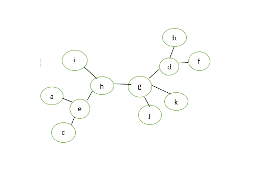
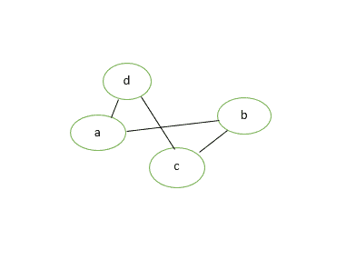
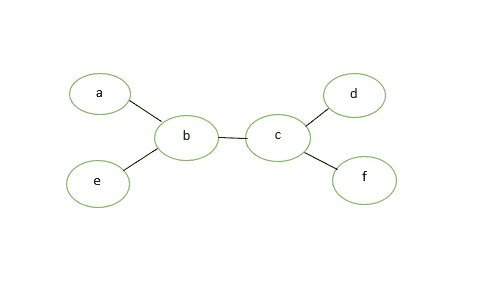
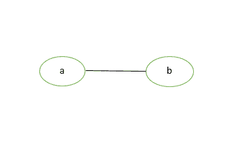
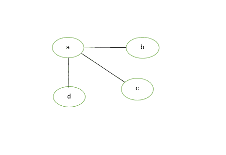
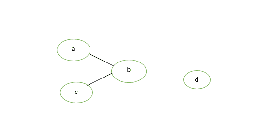
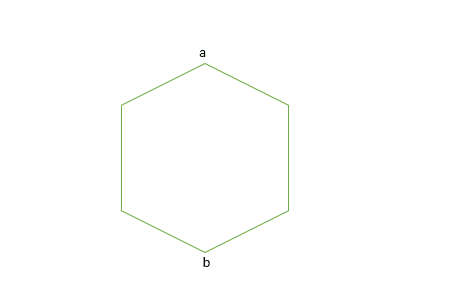
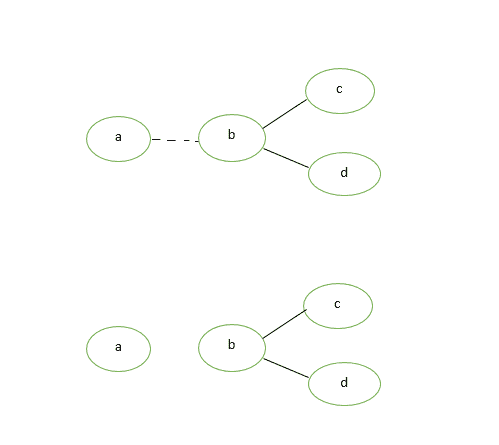
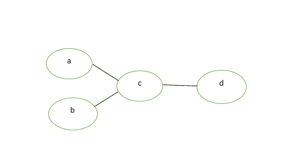
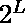

# 关于树的一些基本定理

> 原文:[https://www.geeksforgeeks.org/some-theorems-on-trees/](https://www.geeksforgeeks.org/some-theorems-on-trees/)

**树:-** 没有任何回路的连通图称为树。换句话说，树是一个无向图 G，它满足以下任何等价条件:

*   G 中的任意两个顶点可以通过唯一的简单路径连接。
*   g 是无环的，如果在 g 上加任何边，就形成了一个简单的循环。
*   g 是连通的，没有循环。
*   g 是连通的，但如果从 g 中去掉任何一条边，g 就会断开
*   g 是连通的，3 顶点完全图 K3 不是 g 的次图。

**例如**:

*   此图是一棵树:



*   此图不是树:



与树相关的一些定理是:

*   **Theorem 1**: Prove that for a tree (T), there is one and only one path between every pair of vertices in a tree. 

    **证明:**由于树(T)是连通图，所以树(T)中每对顶点之间至少存在一条路径。现在，假设在树(T)的两个顶点 a 和 b 之间存在两条路径。这两条路径的并集将包含一个回路，树(T)不能是树。由此证明了上述说法。


图 3:树

*   **Theorem 2:** If in a graph G there is one and only one path between every pair of vertices than graph G is a tree. 

    **证明:**每对顶点之间都存在一条路径，所以我们假设图 G 是连通的。图中的回路意味着至少有一对顶点 a 和 b，因此 a 和 b 之间有两条不同的路径。因为 G 在每对顶点之间只有一条路径。g 不能有任何电路。因此图 G 是一棵树。



图 4:给定的图表

*   **Theorem 3:** Prove that a tree with n vertices has (n-1) edges. 

    **证明:**设 n 为一棵树的顶点数(T)。
    如果 n=1，那么边数=0。
    如果 n=2，则边数=1。
    如果 n=3，则边数=2。

    因此，对于 n=1，2，3，该语句(或结果)为真。

    让这个陈述对 n=m 成立，现在我们要证明它对 n=m+1 成立。

    假设是连接顶点的边，比如 Vi 和 Vj。由于 G 是一棵树，那么顶点 Vi 和 Vj 之间只存在一条路径。因此，如果我们删除边 e，它将是一个断开的图，分成两个部分，比如 G1 和 G2。这些分量具有少于 m+1 个顶点，并且没有电路，因此每个分量 G1 和 G2 具有 m1 和 m2 个顶点。

```
Now, the total no. of edges = (m1-1) + (m2-1) +1
                            = (m1+m2)-1
                            = m+1-1
                            = m.
```

*   因此对于 **n=m+1** 顶点，一棵树(T)中有 m 条边。通过数学归纳法，这个图正好有 n-1 条边。



图 5:给定一个树测试

*   **Theorem 4:** Prove that any connected graph G with n vertices and (n-1) edges is a tree. 

    **证明:**我们知道，使 n 个顶点的图连通所需的最小边数是(n-1)条边。我们可以观察到，从图 G 中去掉一条边会使它断开。因此，由 n 个顶点和(n-1)条边组成的连通图不能有回路。因此，图 G 是一棵树。



图 6:曲线图 G

*   **Theorem 5:** Prove that a graph with n vertices, **(n-1)** edges and no circuit is a connected graph. 

    **证明:**假设图 G 是断开的，那么至少存在两个分量 G1 和 G2。每个组件都是无电路的，就像 G 是无电路的一样。现在，为了使图 G 连通，我们需要在顶点 Vi 和 Vj 之间添加一条边 e，其中 Vi 是 G1 的顶点，Vj 是分量 G2 的顶点。
    现在**中的边数 G =(n–1)+1 = n .**



图 7:断开图

*   现在，G 是有 n 个顶点 n 条边的连通图和无回路图，这是不可能的，因为有 n 个顶点的连通图和无回路图是树，树有 **(n-1)** 条边。所以图 G 有 n 个顶点， **(n-1)** 边与无回路相连。由此证明了给定的陈述。



图 8:连通图 G

*   **Theorem 6:** A graph G is a tree if and only if it is minimally connected. 

    **证明:**让图 G 最小连通，即；移除一个边缘使其断开。因此，没有电路。因此图 G 是一棵树。
    反过来，让图 G 是树即；每对顶点之间都存在且只有一条路径，我们知道从路径中去掉一条边会使图断开。因此图 G 是最小连通的。



图 9:最小连通图

*   **Theorem 7:** Every tree with at-least two vertices has at-least two pendant vertices. 

    **证明:**设给定树中的顶点数 T 为 n，n > =2。因此，利用上述定理，树的边数 T=n-1。

```
summation of (deg(Vi)) = 2*e
                       = 2*(n-1)
                       =2n-2
```

*   度和将在 n 个顶点之间划分。因为树 T 是连通图，所以它不能有零度的顶点。每个顶点对上述总和至少有一个贡献。因此，必须至少有两个 1 度的顶点。因此，每个至少有两个顶点的树都至少有两个悬挂顶点。



图 10:这里 a、b 和 d 是给定图的悬挂顶点

*   **Theorem 8:** Show that every tree has either one or two centres. 

    **证明:**我们将使用一个观察，即从给定顶点 v 到任何其他顶点 w 的最大距离 max d(v，w)仅在 w 是悬垂顶点时出现。

    现在，假设 T 是一棵有 n 个顶点的树(n>=2)

    t 必须至少有两个悬垂顶点。从 T 中删除所有悬挂顶点，那么得到的图 T’仍然是一棵树。再次从“T”中删除悬垂顶点，这样得到的“T”仍然是具有相同中心的树。

    请注意，以 T 为中心的所有顶点仍将保持在 T '–> T "–> T "–>中的中心。

    继续这个过程，直到剩下的树有一个顶点或一条边。所以最后，如果有一个顶点，这意味着树 T 有一个中心。如果有一条边，那么树 T 有两个中心。

*   **Theorem 9:** Prove the maximum number of vertices at level ‘L’ in a binary tree is , where L>=0. 

    **证明:**借助数学归纳法证明给定定理。在层级 0 (L=0)，层级只有一个顶点(L=1)，只有

    ```
    *** QuickLaTeX cannot compile formula:

    *** Error message:
    Error: Nothing to show, formula is empty

    ```

    顶点。

    现在我们假设该陈述对于级别(L-1)是正确的。

    因此，级别(L-1)上的最大顶点数为

    ```
    *** QuickLaTeX cannot compile formula:

    *** Error message:
    Error: Nothing to show, formula is empty

    ```

    。由于我们知道二叉树中的每个顶点在下一级最多有 2 个顶点，因此 L 级上的顶点数是 L-1 级的两倍。

    因此，在第一级，顶点的数量是:-

```
* = .
```