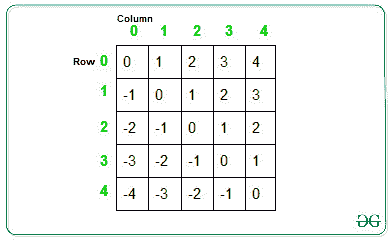

# 对角排序 2D 向量

> 原文:[https://www.geeksforgeeks.org/sort-a-2d-vector-diagonally/](https://www.geeksforgeeks.org/sort-a-2d-vector-diagonally/)

给定 NxM 整数的 2D 向量。任务是按照从左上方到右下方的降序对向量的元素进行对角排序。
**例:**

> **输入:** arr[][] = { { 10，2，3 }，{ 4，5，6 }，{7，8，9 } }
> **输出:**
> 10 6 3
> 8 9 2
> 7 4 5
> **输入:** arr[][] = { { 10，2，43 }，{ 40，5，16 }，{ 71，8，29 }，{ 1，100，5} } 【T11

**进场:**
**观察:**



上图显示了每个单元格的列索引和行索引之间的差异。从左上到下单元格具有相同差异的单元格形成对角线。
以下是按降序排列对角线的步骤:

1.  将具有正差的对角线元素存储在一个向量数组中(比如说**位置[]** )，使得具有差的单元格中的元素(比如说 **a** )存储在**位置[]** 数组的索引 an 处。
2.  将具有负差的对角线元素存储在另一个向量数组中(比如说 **Neg[]** )，使得具有差的单元格中的元素(比如说 **-b** )存储在**Neg[**数组的索引 **abs(-b) = b** 处。
3.  按递增顺序对向量数组进行排序。
4.  遍历给定的 2D 向量，并用存储在位置[]和 Neg[]数组中的值更新当前单元格的值。
    *   如果列索引和行索引之间的差异(比如 **d** )为正，则更新位置【d】数组中的值，并将最后一个元素删除为:

```
d = i - j
arr[i][j] = Pos[d][Pos.size()-1]
Pos[d].pop_back()
```

*   如果列索引和行索引之间的差异(比如说 **d** )为负，则更新 Neg[d]数组中的值，并将最后一个元素删除为:

```
d = j - i
arr[i][j] = Neg[d][Neg.size()-1]
Neg[d].pop_back()
```

下面是上述方法的实现:

## 卡片打印处理机（Card Print Processor 的缩写）

```
// C++ program to sort the 2D vector
// diagonally in decreasing order
#include "bits/stdc++.h"
using namespace std;

// Function that sort the elements
// of 2D vector
void diagonalSort(vector<vector<int> >& mat)
{

    // Calculate the rows and column
    int row = mat.size();
    int col = mat[0].size();

    // Array of vectors to store the
    // diagonal elements
    vector<int> Neg[row];
    vector<int> Pos[col];

    // Traverse the 2D vector and put
    // element in Array of vectors at
    // index difference between indexes
    for (int i = 0; i < row; i++) {
        for (int j = 0; j < col; j++) {

            // If diff is negative, then
            // push element to Neg[]
            if (j < i) {
                Neg[i - j].push_back(mat[i][j]);
            }

            // If diff is positive, then
            // push element to Pos[]
            else if (j > i) {
                Pos[j - i].push_back(mat[i][j]);
            }

            // If diff is 0, then push
            // element to Pos[0]
            else {
                Pos[0].push_back(mat[i][j]);
            }
        }
    }

    // Sort the Array of vectors
    for (int i = 0; i < row; i++) {
        sort(Neg[i].begin(), Neg[i].end());
    }
    for (int i = 0; i < col; i++) {
        sort(Pos[i].begin(), Pos[i].end());
    }

    // Update the value to arr[][]
    // from the sorted Array of vectors
    for (int i = 0; i < row; i++) {
        for (int j = 0; j < col; j++) {

            // If diff is positive
            if (j < i) {
                int d = i - j;
                int l = Neg[d].size();
                mat[i][j] = Neg[d][l - 1];
                Neg[d].pop_back();
            }

            // If diff is negative
            else if (j > i) {
                int d = j - i;
                int l = Pos[d].size();
                mat[i][j] = Pos[d][l - 1];
                Pos[d].pop_back();
            }

            // If diff is 0
            else {
                int l = Pos[0].size();
                mat[i][j] = Pos[0][l - 1];
                Pos[0].pop_back();
            }
        }
    }
}

// Function to print element
void printElement(vector<vector<int> >& arr)
{

    // Traverse the 2D vector
    for (int i = 0; i < arr.size(); i++) {
        for (int j = 0; j < arr[0].size(); j++) {
            cout << arr[i][j] << ' ';
        }
        cout << endl;
    }
}

// Driver Code
int main()
{
    vector<vector<int> > arr
        = { { 10, 2, 3 }, { 4, 5, 6 }, { 7, 8, 9 } };
    diagonalSort(arr);

    // Function call to print elements
    printElement(arr);
}
```

## 蟒蛇 3

```
# Python program for the above approach
from collections import defaultdict

def diagonalSort(matrix, n, m):

    # make a dict of list, where we
    # wil store the diagonal elements
    to = defaultdict(list)

    # store the diagonal elements with
    # respect to their row-col value
    # remember every row-col value for
    # each diagonal will be different
    for row in range(n):
        for col in range(m):
            to[row-col].append(matrix[row][col])

    # sort the elements of each
    # diagonal as required
    for i in to:
        to[i].sort(reverse=True)

    # store the new diagonal elements to
    # their respective position in the matrix
    for row in range(n):
        for col in range(m):
            matrix[row][col] = to[row-col].pop(0)

    return matrix

# Driver Code
if __name__ == "__main__":
    matrix = [[10, 2, 3],
              [4, 5, 6],
              [7, 8, 9]]

    n = len(matrix)
    m = len(matrix[0])
    matrix = diagonalSort(matrix, n, m)

    for row in range(n):
        for col in range(m):
            print(matrix[row][col], end=' ')
        print()
```

**Output**

```
10 6 3 
8 9 2 
7 4 5 
```

**时间复杂度:** O(N*M*log(min(N，M)))

**空间复杂度** : O(N*M)

**方法二:**

在这个方法中，我们将在上面的方法中进行空间优化。这里，我们遍历矩阵对角线，并将它们的值存储在额外的 1D 数组中，因此对于每个对角线，我们需要在我们的 1D 数组中存储最大 min(n，m)元素，因此这是上述解决方案中的空间优化

## C++

```
// C++ program to sort the 2D vector
// diagonally in decreasing order
#include <bits/stdc++.h>
using namespace std;

// Function that sort 2D matrix Diagonally In Descending order
void diagonalSort(vector<vector<int> >& mat)
{
    // Calculate the rows and column
    int n = mat.size();
    int m = mat[0].size();
    // 1D array for extra space
    vector<int> v;

    // start traversing from first row to nth row
    // where first row to nth row is first member of diagonal
    for (int row = 0; row < n; row++) {
        // take all diagonal element where first element is
        // mat[row][0] means left column of matrix
        for (int j = 0, i = row; i < n && j < m; i++, j++) {
            v.push_back(mat[i][j]);
        }
        // sort element in reverse order because we need
        // decreasing order in diagonal
        sort(v.rbegin(), v.rend());
        int t = 0;
        // putting this all values to matrix in descending sorted order
        for (int j = 0, i = row; i < n && j < m; i++, j++) {
            mat[i][j] = v[t++];
        }
        v.clear();
    }
    // start traversing from second column to mth column
    // where second column to mth column is first member of diagonal
    // note that here we can't start from first column
    // because it is already sorted by first row processing
    for (int col = 1; col < m; col++) {
        // take all diagonal element where first element is
        // mat[0][col] means first row of matrix
        for (int j = col, i = 0; i < n && j < m; i++, j++) {
            v.push_back(mat[i][j]);
        }
        // sort element in reverse order because we need
        // decreasing order in diagonal
        sort(v.rbegin(), v.rend());
        int t = 0;
        // putting this all values to matrix in descending sorted order
        for (int j = col, i = 0; i < n && j < m; i++, j++) {
            mat[i][j] = v[t++];
        }
        v.clear();
    }
}

// Function to print element
void printElement(vector<vector<int> >& arr)
{

    // Traverse the 2D vector
    for (int i = 0; i < arr.size(); i++) {
        for (int j = 0; j < arr[0].size(); j++) {
            cout << arr[i][j] << ' ';
        }
        cout << endl;
    }
}

// Driver Code
int main()
{
    vector<vector<int> > arr = {{ 10, 2, 3 },
                                { 4, 5, 6 },
                                { 7, 8, 9 } };
    diagonalSort(arr);

    // Function call to print elements
    printElement(arr);
}
```

**Output**

```
10 6 3 
8 9 2 
7 4 5 
```

**时间复杂度:** O(N*M*log(min(N，M)))
T3】辅助空间: O(min(N，M))