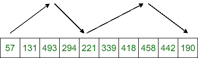

# 排序一个 K 递增递减数组

> 原文:[https://www . geeksforgeeks . org/sort-一个增-减-数组/](https://www.geeksforgeeks.org/sort-an-increasing-decreasing-array/)

给定一个 **K 增-减**数组 **arr[]** ，任务是对给定的数组进行排序。一个数组被称为**增-减 K**如果元素重复增加到某个指数，然后它们减少，然后再次增加，总共是 **K** 次。下图显示了一个 4 递增递减的数组。



**例:**

> **输入:** arr[] = {57，131，493，294，221，339，418，458，442，190}
> **输出:**57 131 190 221 294 339 418 442 458 493
> **输入:** arr[] = {1，2，3，4，3，2，1}
> **输出**

**方式:**蛮力方式是[排序](https://www.geeksforgeeks.org/merge-sort/)数组，不利用 k 递增递减的特性。这种方法的时间复杂度是 O(n logn)，其中 n 是数组的长度。
如果 k 明显小于 n，则可以用更少的时间复杂度找到更好的方法。例如，如果 k=2，输入阵列由两个子阵列组成，一个增加，另一个减少。反转第二子阵列产生两个排序的阵列，然后合并结果，这可以在 O(n)时间内完成。概括来说，我们可以首先反转每个递减子阵列的顺序。例如，在上图中，数组可以分解为四个排序数组，分别为{57，131，493}、{221，294}、{339，418，458}和{190，442}。现在最小堆技术可以用来[合并这些排序的数组](https://www.geeksforgeeks.org/merge-k-sorted-arrays-set-2-different-sized-arrays/)。
以下是上述方法的实施:

## 卡片打印处理机（Card Print Processor 的缩写）

```
// C++ implementation of the approach
#include <bits/stdc++.h>
using namespace std;

// A pair of pairs, first element is going to
// store value, second element index of array
// and third element index in the array
typedef pair<int, pair<int, int> > ppi;

// This function takes an array of arrays as an
// argument and all arrays are assumed to be
// sorted
// It merges them together and returns the
// final sorted output
vector<int> mergeKArrays(vector<vector<int> > arr)
{
    vector<int> output;

    // Create a min heap with k heap nodes
    // Every heap node has first element of an array
    priority_queue<ppi, vector<ppi>, greater<ppi> > pq;

    for (int i = 0; i < arr.size(); i++)
        pq.push({ arr[i][0], { i, 0 } });

    // Now one by one get the minimum element
    // from min heap and replace it with next
    // element of its array
    while (pq.empty() == false) {
        ppi curr = pq.top();
        pq.pop();

        // i ==> Array Number
        // j ==> Index in the array number
        int i = curr.second.first;
        int j = curr.second.second;

        output.push_back(curr.first);

        // The next element belongs to same array as
        // current
        if (j + 1 < arr[i].size())
            pq.push({ arr[i][j + 1], { i, j + 1 } });
    }

    return output;
}

// Function to sort the alternating
// increasing-decreasing array
vector<int> SortKIncDec(const vector<int>& A)
{
    // Decompose the array into a
    // set of sorted arrays
    vector<vector<int> > sorted_subarrays;
    typedef enum { INCREASING,
                   DECREASING } SubarrayType;
    SubarrayType subarray_type = INCREASING;
    int start_idx = 0;
    for (int i = 0; i <= A.size(); i++) {

        // If the current subarrays ends here
        if (i == A.size()
            || (i>0 && A[i - 1] < A[i]
                && subarray_type == DECREASING)
            || (i>0 && A[i - 1] >= A[i]
                && subarray_type == INCREASING)) {

            // If the subarray is increasing
            // then add from the start
            if (subarray_type == INCREASING) {
                sorted_subarrays.emplace_back(A.cbegin() + start_idx,
                                              A.cbegin() + i);
            }

            // If the subarray is decreasing
            // then add from the end
            else {
                sorted_subarrays.emplace_back(A.crbegin()
                                                  + A.size() - i,
                                              A.crbegin()
                                                  + A.size()
                                                  - start_idx);
            }
            start_idx = i;
            subarray_type = (subarray_type == INCREASING
                                 ? DECREASING
                                 : INCREASING);
        }
    }

    // Merge the k sorted arrays`
    return mergeKArrays(sorted_subarrays);
}

// Driver code
int main()
{
    vector<int> arr = { 57, 131, 493, 294, 221,
                        339, 418, 458, 442, 190 };

    // Get the sorted array
    vector<int> ans = SortKIncDec(arr);

    // Print the sorted array
    for (int i = 0; i < ans.size(); i++)
        cout << ans[i] << " ";

    return 0;
}
```

**Output:** 

```
57 131 190 221 294 339 418 442 458 493
```

**时间复杂度:** O(n*logk)，其中 n 为数组长度。