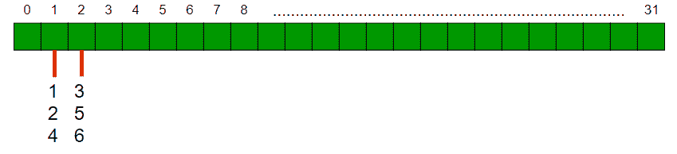

# 根据设置位的计数对数组进行排序

> 原文:[https://www . geesforgeks . org/sort-array-account-set-bits/](https://www.geeksforgeeks.org/sort-array-according-count-set-bits/)

给定一个正整数数组，在数组元素的二进制表示中，按照集合位数的递减顺序对数组进行排序。对于二进制表示中具有相同位数的整数，根据它们在原始数组中的位置进行排序，即稳定排序。例如，如果输入数组是{3，5}，那么输出数组也应该是{3，5}。请注意，3 和 5 具有相同数量的设置位。

**示例:**

```
Input: arr[] = {5, 2, 3, 9, 4, 6, 7, 15, 32};
Output: 15 7 5 3 9 6 2 4 32
Explanation:
The integers in their binary representation are:
    15 -1111
    7  -0111
    5  -0101
    3  -0011
    9  -1001
    6  -0110
    2  -0010
    4- -0100
    32 -10000
hence the non-increasing sorted order is:
{15}, {7}, {5, 3, 9, 6}, {2, 4, 32}

Input: arr[] = {1, 2, 3, 4, 5, 6};
Output: 3 5 6 1 2 4
Explanation:
    3  - 0011
    5  - 0101
    6  - 0110
    1  - 0001
    2  - 0010
    4  - 0100
hence the non-increasing sorted order is
{3, 5, 6}, {1, 2, 4}
```

**方法一:简单**

1.  创建一个辅助数组，并将所有整数的设置位计数存储在辅助数组中
2.  同时按照辅助数组的非递增顺序对两个数组进行排序。(注意，我们需要使用稳定的排序算法)

```
Before sort:
int arr[] = {1, 2, 3, 4, 5, 6};
int aux[] = {1, 1, 2, 1, 2, 2}
After sort:
arr = {3, 5, 6, 1, 2, 4}
aux = {2, 2, 2, 1, 1, 1}
```

**实施:**

## C++

```
// C++ program to implement simple approach to sort
// an array according to count of set bits.
#include <iostream>

using namespace std;

// a utility function that returns total set bits
// count in an integer
int countBits(int a)
{
    int count = 0;
    while (a)
    {
        if (a & 1 )
            count+= 1;
        a = a>>1;
    }
    return count;
}

// Function to simultaneously sort both arrays
// using insertion sort
// ( https://www.geeksforgeeks.org/insertion-sort/ )
void insertionSort(int arr[],int aux[], int n)
{
    for (int i = 1; i < n; i++)
    {
        // use 2 keys because we need to sort both
        // arrays simultaneously
        int key1 = aux[i];
        int key2 = arr[i];
        int j = i-1;

        /* Move elements of arr[0..i-1] and aux[0..i-1],
           such that elements of aux[0..i-1] are
           greater than key1, to one position ahead
           of their current position */
        while (j >= 0 && aux[j] < key1)
        {
            aux[j+1] = aux[j];
            arr[j+1] = arr[j];
            j = j-1;
        }
        aux[j+1] = key1;
        arr[j+1] = key2;
    }
}

// Function to sort according to bit count using
// an auxiliary array
void sortBySetBitCount(int arr[],int n)
{
    // Create an array and store count of
    // set bits in it.
    int aux[n];
    for (int i=0; i<n; i++)
        aux[i] = countBits(arr[i]);

    // Sort arr[] according to values in aux[]
    insertionSort(arr, aux, n);
}

// Utility function to print an array
void printArr(int arr[], int n)
{
    for (int i=0; i<n; i++)
        cout << arr[i] << " ";
}

// Driver Code
int main()
{
    int arr[] = {1, 2, 3, 4, 5, 6};
    int n = sizeof(arr)/sizeof(arr[0]);
    sortBySetBitCount(arr, n);
    printArr(arr, n);
    return 0;
}
```

## Java 语言(一种计算机语言，尤用于创建网站)

```
// Java program to implement
// simple approach to sort
// an array according to
// count of set bits.
import java.io.*;

class GFG
{

// a utility function that
// returns total set bits
// count in an integer
static int countBits(int a)
{
    int count = 0;
    while (a > 0)
    {
        if ((a & 1) > 0)
            count+= 1;
        a = a >> 1;
    }
    return count;
}

// Function to simultaneously
// sort both arrays using
// insertion sort
// (https://www.geeksforgeeks.org/insertion-sort/ )
static void insertionSort(int arr[],
                          int aux[], int n)
{
    for (int i = 1; i < n; i++)
    {
        // use 2 keys because we
        // need to sort both
        // arrays simultaneously
        int key1 = aux[i];
        int key2 = arr[i];
        int j = i - 1;

        /* Move elements of arr[0..i-1]
        and aux[0..i-1], such that
        elements of aux[0..i-1] are
        greater than key1, to one
        position ahead of their current
        position */
        while (j >= 0 && aux[j] < key1)
        {
            aux[j + 1] = aux[j];
            arr[j + 1] = arr[j];
            j = j - 1;
        }
        aux[j + 1] = key1;
        arr[j + 1] = key2;
    }
}

// Function to sort according
// to bit count using an
// auxiliary array
static void sortBySetBitCount(int arr[],
                              int n)
{
    // Create an array and
    // store count of
    // set bits in it.
    int aux[] = new int[n];
    for (int i = 0; i < n; i++)
        aux[i] = countBits(arr[i]);

    // Sort arr[] according
    // to values in aux[]
    insertionSort(arr, aux, n);
}

// Utility function
// to print an array
static void printArr(int arr[], int n)
{
    for (int i = 0; i < n; i++)
        System.out.print(arr[i] + " ");
}

// Driver Code
public static void main (String[] args)
{
    int arr[] = {1, 2, 3, 4, 5, 6};
    int n = arr.length;
    sortBySetBitCount(arr, n);
    printArr(arr, n);
}
}

// This code is contributed by anuj_67.
```

## 蟒蛇 3

```
# Python 3 program to implement simple approach to sort
# an array according to count of set bits.

# a utility function that returns total set bits
# count in an integer
def countBits(a):
    count = 0
    while (a):
        if (a & 1):
            count+= 1
        a = a>>1

    return count

# Function to simultaneously sort both arrays
# using insertion sort
# ( http:#quiz.geeksforgeeks.org/insertion-sort/ )
def insertionSort(arr,aux, n):
    for i in range(1,n,1):
        # use 2 keys because we need to sort both
        # arrays simultaneously
        key1 = aux[i]
        key2 = arr[i]
        j = i-1

        # Move elements of arr[0..i-1] and aux[0..i-1],
        #  such that elements of aux[0..i-1] are
        # greater than key1, to one position ahead
        #  of their current position */
        while (j >= 0 and aux[j] < key1):
            aux[j+1] = aux[j]
            arr[j+1] = arr[j]
            j = j-1

        aux[j+1] = key1
        arr[j+1] = key2

# Function to sort according to bit count using
# an auxiliary array
def sortBySetBitCount(arr, n):
    # Create an array and store count of
    # set bits in it.
    aux = [0 for i in range(n)]
    for i in range(0,n,1):
        aux[i] = countBits(arr[i])

    # Sort arr[] according to values in aux[]
    insertionSort(arr, aux, n)

# Utility function to print an array
def printArr(arr, n):
    for i in range(0,n,1):
        print(arr[i],end = " ")

# Driver Code
if __name__ =='__main__':
    arr = [1, 2, 3, 4, 5, 6]
    n = len(arr)
    sortBySetBitCount(arr, n)
    printArr(arr, n)

# This code is contributed by
# Surendra_Gangwar
```

## C#

```
// C# program to implement
// simple approach to sort
// an array according to
// count of set bits.
using System;
public class GFG
{

  // a utility function that
  // returns total set bits
  // count in an integer
  static int countBits(int a)
  {
    int count = 0;
    while (a > 0)
    {
      if ((a & 1) > 0)
        count += 1;
      a = a >> 1;
    }
    return count;
  }

  // Function to simultaneously
  // sort both arrays using
  // insertion sort
  // (https://www.geeksforgeeks.org/insertion-sort/ )
  // Function to simultaneously
  // sort both arrays using
  // insertion sort
  // (https://www.geeksforgeeks.org/insertion-sort/ )
  static void insertionSort(int []arr,
                            int []aux, int n)
  {
    for (int i = 1; i < n; i++)
    {

      // use 2 keys because we
      // need to sort both
      // arrays simultaneously
      int key1 = aux[i];
      int key2 = arr[i];
      int j = i - 1;

      /* Move elements of arr[0..i-1]
        and aux[0..i-1], such that
        elements of aux[0..i-1] are
        greater than key1, to one
        position ahead of their current
        position */
      while (j >= 0 && aux[j] < key1)
      {
        aux[j + 1] = aux[j];
        arr[j + 1] = arr[j];
        j = j - 1;
      }
      aux[j + 1] = key1;
      arr[j + 1] = key2;
    }
  }

  // Function to sort according
  // to bit count using an
  // auxiliary array
  static void sortBySetBitCount(int []arr,
                                int n)
  {

    // Create an array and
    // store count of
    // set bits in it.
    int []aux = new int[n];
    for (int i = 0; i < n; i++)
      aux[i] = countBits(arr[i]);

    // Sort arr[] according
    // to values in aux[]
    insertionSort(arr, aux, n);
  }

  // Utility function
  // to print an array
  static void printArr(int []arr, int n)
  {
    for (int i = 0; i < n; i++)
      Console.Write(arr[i] + " ");
  }

  // Driver Code
  static public void Main ()
  {
    int []arr = {1, 2, 3, 4, 5, 6};
    int n = arr.Length;
    sortBySetBitCount(arr, n);
    printArr(arr, n);
  }
}

// This code is contributed by divyeshrabadiya07.
```

## java 描述语言

```
<script>

// Javascript program to implement
// simple approach to sort
// an array according to
// count of set bits.

    // a utility function that
    // returns total set bits
    // count in an integer
    function countBits(a)
    {
        let count = 0;
    while (a > 0)
    {
        if ((a & 1) > 0)
            count+= 1;
        a = a >> 1;
    }
    return count;
    }

    // Function to simultaneously
// sort both arrays using
// insertion sort
// (https://www.geeksforgeeks.org/insertion-sort/ )
function insertionSort(arr,aux,n)
{
    for (let i = 1; i < n; i++)
    {
        // use 2 keys because we
        // need to sort both
        // arrays simultaneously
        let key1 = aux[i];
        let key2 = arr[i];
        let j = i - 1;

        /* Move elements of arr[0..i-1]
        and aux[0..i-1], such that
        elements of aux[0..i-1] are
        greater than key1, to one
        position ahead of their current
        position */
        while (j >= 0 && aux[j] < key1)
        {
            aux[j + 1] = aux[j];
            arr[j + 1] = arr[j];
            j = j - 1;
        }
        aux[j + 1] = key1;
        arr[j + 1] = key2;
    }
}

// Function to sort according
// to bit count using an
// auxiliary array
function sortBySetBitCount(arr,n)
{
    // Create an array and
    // store count of
    // set bits in it.
    let aux = new Array(n);
    for (let i = 0; i < n; i++)
        aux[i] = countBits(arr[i]);

    // Sort arr[] according
    // to values in aux[]
    insertionSort(arr, aux, n);
}

// Utility function
// to print an array
function printArr(arr,n)
{
    for (let i = 0; i < n; i++)
        document.write(arr[i] + " ");
}

// Driver Code
let arr=[1, 2, 3, 4, 5, 6];
let n = arr.length;
sortBySetBitCount(arr, n);
printArr(arr, n); 

    // This code is contributed by unknown2108

</script>
```

**输出:**

```
3 5 6 1 2 4
```

**辅助空间:**O(n)
T3】时间复杂度: O(n <sup>2</sup> )
**注意:**时间复杂度可以通过使用稳定的 O(nlogn)排序算法提升到 O(nLogn)。

**方法二:使用**[**【STD::sort()**](https://www.geeksforgeeks.org/sort-c-stl/)

使用标准::sort 的自定义比较器根据设置的位计数对数组进行排序

## C++

```
// C++ program to sort an array according to
// count of set bits using std::sort()
#include <bits/stdc++.h>

using namespace std;

// a utility function that returns total set bits
// count in an integer
int countBits(int a)
{
    int count = 0;
    while (a) {
        if (a & 1)
            count += 1;
        a = a >> 1;
    }
    return count;
}

// custom comparator of std::sort
int cmp(int a, int b)
{
    int count1 = countBits(a);
    int count2 = countBits(b);

    // this takes care of the stability of
    // sorting algorithm too
    if (count1 <= count2)
        return false;
    return true;
}

// Function to sort according to bit count using
// std::sort
void sortBySetBitCount(int arr[], int n)
{
    stable_sort(arr, arr + n, cmp);
}

// Utility function to print an array
void printArr(int arr[], int n)
{
    for (int i = 0; i < n; i++)
        cout << arr[i] << " ";
}

// Driver Code
int main()
{
    int arr[] = { 1, 2, 3, 4, 5, 6 };
    int n = sizeof(arr) / sizeof(arr[0]);
    sortBySetBitCount(arr, n);
    printArr(arr, n);
    return 0;
}
```

## Java 语言(一种计算机语言，尤用于创建网站)

```
// Java program to sort an array according to
// count of set bits using std::sort()
import java.util.Arrays;
import java.util.Comparator;

public class Test {

    public static void main(String[] args)
    {
        // TODO Auto-generated method stub
        Integer arr[] = { 1, 2, 3, 4, 5, 6 };
        int n = 6;
        sortBySetBitCount(arr, n);
        printArr(arr, n);
        System.out.println();
    }

    private static void printArr(Integer[] arr, int n)
    {
        // TODO Auto-generated method stub
        for (int i = 0; i < n; i++)
            System.out.print(arr[i] + " ");
        // cout << arr[i] << " ";
    }

    private static Integer[] sortBySetBitCount(
        Integer[] arr, int n)
    {
        // TODO Auto-generated method stub
        Arrays.sort(arr, new Comparator<Integer>() {
            @Override
            public int compare(Integer arg0, Integer arg1)
            {
                // TODO Auto-generated method stub
                int c1 = Integer.bitCount(arg0);
                int c2 = Integer.bitCount(arg1);
                if (c1 <= c2)
                    return 1;
                else
                    return -1;
            }
        });
        return arr;
    }
}

// This code is contributed by 4-Bit-R
```

## 蟒蛇 3

```
# Using custom comparator lambda function
arr = [1, 2, 3, 4, 5, 6]

# form a tuple with val, index
n = len(arr)
arr = [(arr[i], i) for i in range(n)]

def countSetBits(val):
    cnt = 0
    while val:
        cnt += val % 2
        val = val//2
    return cnt

# first criteria to sort is number of set bits,
# then the index
sorted_arr = sorted(arr, key=lambda val: (
    countSetBits(val[0]), n-val[1]), reverse=True)
sorted_arr = [val[0] for val in sorted_arr]
print(sorted_arr)
```

## java 描述语言

```
<script>
// Javascript program to sort an array according to
// count of set bits using std::sort()

function  printArr(arr,n)
{
    // TODO Auto-generated method stub
        for (let i = 0; i < n; i++)
            document.write(arr[i] + " ");

}

function sortBySetBitCount(arr,n)
{
    arr.sort(function(a,b){
        c1 = Number(a.toString(2).split("").sort().join("")).toString().length;
        c2 = Number(b.toString(2).split("").sort().join("")).toString().length;

        return c2-c1;
    })
}

let arr = [1, 2, 3, 4, 5, 6 ];
let  n = 6;
sortBySetBitCount(arr, n);
printArr(arr, n);
document.write();

// This code is contributed by ab2127
</script>
```

**输出:**

```
3 5 6 1 2 4
```

**辅助空间:**O(1)
T3】时间复杂度: O(n log n)

**方法三:** [**计数排序**](https://www.geeksforgeeks.org/counting-sort/) **基础**

这个问题可以在 O(n)时间内解决。这个想法类似于计数排序。
**注意:**一个整数中可以有最少 1 个设定位，最多只能有 31 个设定位。
**步数(假设整数取 32 位):**

1.  创建一个大小为 32 的向量“计数”。每个计数单元，即计数[i]是另一个向量，它存储其设定位计数为 I 的所有元素
2.  遍历数组，并对每个元素执行以下操作:
    1.  计算这个元素的设置位数。让它成为“setbitcount”
    2.  计数[setbitcount]。推回(元素)
3.  以相反的方式遍历“计数”(因为我们需要以非递增的顺序排序)并修改数组。



## C++

```
// C++ program to sort an array according to
// count of set bits using std::sort()
#include <bits/stdc++.h>
using namespace std;

// a utility function that returns total set bits
// count in an integer
int countBits(int a)
{
    int count = 0;
    while (a)
    {
        if (a & 1 )
            count+= 1;
        a = a>>1;
    }
    return count;
}

// Function to sort according to bit count
// This function assumes that there are 32
// bits in an integer.
void sortBySetBitCount(int arr[],int n)
{
    vector<vector<int> > count(32);
    int setbitcount = 0;
    for (int i=0; i<n; i++)
    {
        setbitcount = countBits(arr[i]);
        count[setbitcount].push_back(arr[i]);
    }

    int j = 0;  // Used as an index in final sorted array

    // Traverse through all bit counts (Note that we
    // sort array in decreasing order)
    for (int i=31; i>=0; i--)
    {
        vector<int> v1 = count[i];
        for (int i=0; i<v1.size(); i++)
            arr[j++] = v1[i];
    }
}

// Utility function to print an array
void printArr(int arr[], int n)
{
    for (int i=0; i<n; i++)
        cout << arr[i] << " ";
}

// Driver Code
int main()
{
    int arr[] = {1, 2, 3, 4, 5, 6};
    int n = sizeof(arr)/sizeof(arr[0]);
    sortBySetBitCount(arr, n);
    printArr(arr, n);
    return 0;
}
```

## Java 语言(一种计算机语言，尤用于创建网站)

```
// Java program to sort an
// array according to count
// of set bits using std::sort()
import java.util.*;
class GFG{

// a utility function that
// returns total set bits
// count in an integer
static int countBits(int a)
{
  int count = 0;
  while (a > 0)
  {
    if ((a & 1) > 0 )
      count += 1;
    a = a >> 1;
  }
  return count;
}

// Function to sort according to
// bit count. This function assumes
// that there are 32 bits in an integer.
static void sortBySetBitCount(int arr[],
                              int n)
{
  Vector<Integer> []count =
         new Vector[32];

  for (int i = 0;
           i < count.length; i++)
    count[i] = new Vector<Integer>();

  int setbitcount = 0;

  for (int i = 0; i < n; i++)
  {
    setbitcount = countBits(arr[i]);
    count[setbitcount].add(arr[i]);
  }

  // Used as an index in
  // final sorted array
  int j = 0; 

  // Traverse through all bit
  // counts (Note that we sort
  // array in decreasing order)
  for (int i = 31; i >= 0; i--)
  {
    Vector<Integer> v1 = count[i];

    for (int p = 0; p < v1.size(); p++)
      arr[j++] = v1.get(p);
  }
}

// Utility function to print
// an array
static void printArr(int arr[],
                     int n)
{
  for (int i = 0; i < n; i++)
    System.out.print(arr[i] + " ");
}

// Driver Code
public static void main(String[] args)
{
  int arr[] = {1, 2, 3, 4, 5, 6};
  int n = arr.length;
  sortBySetBitCount(arr, n);
  printArr(arr, n);
}
}

// This code is contributed by 29AjayKumar
```

## 蟒蛇 3

```
# Python3 program to sort an array according to
# count of set bits using std::sort()

# a utility function that returns total set bits
# count in an integer
def countBits(a):
    count = 0
    while (a):
        if (a & 1 ):
            count += 1
        a = a>>1
    return count

# Function to sort according to bit count
# This function assumes that there are 32
# bits in an integer.
def sortBySetBitCount(arr,n):
    count = [[] for i in range(32)]
    setbitcount = 0
    for i in range(n):
        setbitcount = countBits(arr[i])
        count[setbitcount].append(arr[i])

    j = 0 # Used as an index in final sorted array

    # Traverse through all bit counts (Note that we
    # sort array in decreasing order)
    for i in range(31, -1, -1):
        v1 = count[i]
        for i in range(len(v1)):
            arr[j] = v1[i]
            j += 1

# Utility function to pran array
def printArr(arr, n):
    print(*arr)

# Driver Code
arr = [1, 2, 3, 4, 5, 6]
n = len(arr)
sortBySetBitCount(arr, n)
printArr(arr, n)

# This code is contributed by mohit kumar 29
```

## C#

```
// C# program to sort an
// array according to count
// of set bits using std::sort()
using System;
using System.Collections.Generic;
class GFG{

// a utility function that
// returns total set bits
// count in an integer
static int countBits(int a)
{
  int count = 0;
  while (a > 0)
  {
    if ((a & 1) > 0 )
      count += 1;
    a = a >> 1;
  }
  return count;
}

// Function to sort according to
// bit count. This function assumes
// that there are 32 bits in an integer.
static void sortBySetBitCount(int []arr,
                              int n)
{
  List<int> []count =
       new List<int>[32];

  for (int i = 0;
           i < count.Length; i++)
    count[i] = new List<int>();

  int setbitcount = 0;

  for (int i = 0; i < n; i++)
  {
    setbitcount = countBits(arr[i]);
    count[setbitcount].Add(arr[i]);
  }

  // Used as an index in
  // readonly sorted array
  int j = 0; 

  // Traverse through all bit
  // counts (Note that we sort
  // array in decreasing order)
  for (int i = 31; i >= 0; i--)
  {
    List<int> v1 = count[i];

    for (int p = 0; p < v1.Count; p++)
      arr[j++] = v1[p];
  }
}

// Utility function to print
// an array
static void printArr(int []arr,
                     int n)
{
  for (int i = 0; i < n; i++)
    Console.Write(arr[i] + " ");
}

// Driver Code
public static void Main(String[] args)
{
  int []arr = {1, 2, 3, 4, 5, 6};
  int n = arr.Length;
  sortBySetBitCount(arr, n);
  printArr(arr, n);
}
}

// This code is contributed by Amit Katiyar
```

## java 描述语言

```
<script>
// Javascript program to sort an
// array according to count
// of set bits using std::sort()

// a utility function that
// returns total set bits
// count in an integer
function countBits(a)
{
    let count = 0;
  while (a > 0)
  {
    if ((a & 1) > 0 )
      count += 1;
    a = a >> 1;
  }
  return count;
}

// Function to sort according to
// bit count. This function assumes
// that there are 32 bits in an integer.
function sortBySetBitCount(arr,n)
{
let count = new Array(32);

  for (let i = 0;
           i < count.length; i++)
    count[i] = [];

  let setbitcount = 0;

  for (let i = 0; i < n; i++)
  {
    setbitcount = countBits(arr[i]);
    count[setbitcount].push(arr[i]);
   }

  // Used as an index in
  // final sorted array
  let j = 0;

  // Traverse through all bit
  // counts (Note that we sort
  // array in decreasing order)
  for (let i = 31; i >= 0; i--)
  {
    let v1 = count[i];

    for (let p = 0; p < v1.length; p++)
      arr[j++] = v1[p];
  }
}

// Utility function to print
// an array
function printArr(arr,n)
{
    for (let i = 0; i < n; i++)
        document.write(arr[i] + " ");
}

// Driver Code
let arr = [1, 2, 3, 4, 5, 6];
let n = arr.length;
sortBySetBitCount(arr, n);
printArr(arr, n);

// This code is contributed by patel2127
</script>
```

**输出:**

```
3 5 6 1 2 4
```

**方法 4:使用多地图**
**步骤:**

*   创建一个多映射，其键值将是元素的设置位数的负数。
*   遍历数组，并对每个元素执行以下操作:
    *   计算这个元素的设置位数。让它成为“设置位计数”
    *   count.insert({(-1) * setBitCount，element})
*   遍历“计数”并打印第二个元素。

下面是上述方法的实现:

## C++

```
// C++ program to implement
// simple approach to sort
// an array according to
// count of set bits.
#include<bits/stdc++.h>
using namespace std;

// Function to count setbits
int setBitCount(int num){
    int count = 0;
    while ( num )
    {
        if ( num & 1)
        count++;
        num >>= 1;
    }
    return count;
}

// Function to sort By SetBitCount
void sortBySetBitCount(int arr[], int n)
{   
    multimap< int, int > count;

    // Iterate over all values and
    // insert into multimap
    for( int i = 0 ; i < n ; ++i )
    {
        count.insert({(-1) *
            setBitCount(arr[i]), arr[i]});
    }

    for(auto i : count)
    cout << i.second << " " ;
    cout << "\n" ;
}

// Driver Code
int main()
{
    int arr[] = {1, 2, 3, 4, 5, 6};
    int n = sizeof(arr)/sizeof(arr[0]);
    sortBySetBitCount(arr, n);
}

// This code is contributed by Ashok Karwa
```

## Java 语言(一种计算机语言，尤用于创建网站)

```
// Java program to implement
// simple approach to sort
// an array according to
// count of set bits.
import java.io.*;
import java.util.*;
class GFG
{

  // Function to count setbits
  static int setBitCount(int num)
  {
    int count = 0;
    while ( num != 0 )
    {
      if ( (num & 1) != 0)
        count++;
      num >>= 1;
    }
    return count;
  }

  // Function to sort By SetBitCount
  static void sortBySetBitCount(int[] arr, int n)
  {
    ArrayList<ArrayList<Integer>> count = new ArrayList<ArrayList<Integer>>();

    // Iterate over all values and
    // insert into multimap
    for( int i = 0 ; i < n ; ++i )
    {
      count.add(new ArrayList<Integer>(Arrays.asList((-1) * setBitCount(arr[i]), arr[i])));
    }

    Collections.sort(count, new Comparator<ArrayList<Integer>>() {   
      @Override
      public int compare(ArrayList<Integer> o1, ArrayList<Integer> o2) {
        return o1.get(0).compareTo(o2.get(0));
      }              
    });

    for(int i = 0; i < count.size(); i++)
    {
      System.out.print(count.get(i).get(1) + " ");
    }

  }

  // Driver code
  public static void main (String[] args)
  {

    int arr[] = {1, 2, 3, 4, 5, 6};
    int n = arr.length;
    sortBySetBitCount(arr, n);
  }
}

// This code is contributed by avanitrachhadiya2155
```

## 蟒蛇 3

```
# Python3 program to implement
# simple approach to sort
# an array according to
# count of set bits.

# Function to count setbits
def setBitCount(num):

    count = 0

    while (num):
        if (num & 1):
            count += 1

        num = num >> 1

    return count

# Function to sort By SetBitCount
def sortBySetBitCount(arr, n):

    count = []

    # Iterate over all values and
    # insert into multimap
    for i in range(n):
        count.append([(-1) *
        setBitCount(arr[i]), arr[i]])

    count.sort(key = lambda x:x[0])

    for i in range(len(count)):
        print(count[i][1], end = " ")

# Driver Code
arr = [ 1, 2, 3, 4, 5, 6 ]
n = len(arr)

sortBySetBitCount(arr, n)

# This code is contributed by rag2127
```

## C#

```
// C# program to implement
// simple approach to sort
// an array according to
// count of set bits.
using System;
using System.Collections.Generic;
class GFG {

    // Function to count setbits
    static int setBitCount(int num){
        int count = 0;
        while ( num != 0)
        {
            if ( (num & 1) != 0)
            count++;
            num >>= 1;
        }
        return count;
    }

    // Function to sort By SetBitCount
    static void sortBySetBitCount(int[] arr, int n)
    {   
        List<Tuple<int, int>> count = new List<Tuple<int, int>>(); 

        // Iterate over all values and
        // insert into multimap
        for( int i = 0 ; i < n ; ++i )
        {
            count.Add(new Tuple<int,int>((-1) * setBitCount(arr[i]), arr[i]));
        }

        count.Sort();

        foreach(Tuple<int, int> i in count)
        {
            Console.Write(i.Item2 + " ");
        }
        Console.WriteLine();
    }

  static void Main() {
    int[] arr = {1, 2, 3, 4, 5, 6};
    int n = arr.Length;
    sortBySetBitCount(arr, n);
  }
}
```

**输出:**

```
3 5 6 1 2 4
```

**时间复杂度:** O(n log n)

**辅助空间:** O(n)

本文由**尼克尔·查克拉瓦图拉**供稿，经**阿肖克·卡瓦**修改。如果你喜欢 GeeksforGeeks 并想投稿，你也可以使用[write.geeksforgeeks.org](https://write.geeksforgeeks.org)写一篇文章或者把你的文章邮寄到 review-team@geeksforgeeks.org。看到你的文章出现在极客博客主页上，帮助其他极客。
如果发现有不正确的地方，或者想分享更多关于上述话题的信息，请写评论。