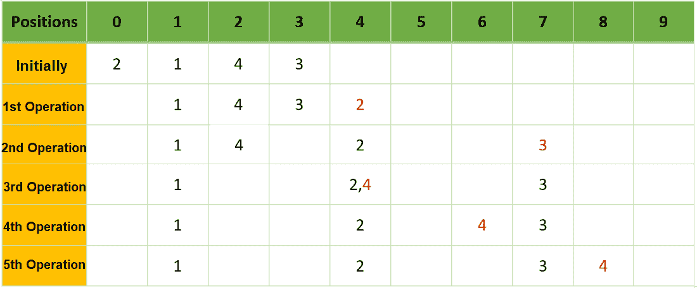

# 通过将第 I 个元素移动到第(i + B[i])个位置的最小次数

，对放置在数字线上的数组 A[]的元素进行排序

> 原文:[https://www . geesforgeks . org/sort-elements-of-array-a-placed-on-number-line-by-I-th-element-I-bit-positions-最小次数/](https://www.geeksforgeeks.org/sort-elements-of-an-array-a-placed-on-a-number-line-by-shifting-i-th-element-to-i-bith-positions-minimum-number-of-times/)

给定两个[数组](https://www.geeksforgeeks.org/introduction-to-arrays/) **A[]** 和 **B[]** 由 **N** 个正整数组成，使得每个数组元素**A【I】**被放置在数字线上的 **i <sup>第</sup>个**位置，任务是找到[对排列在数字线上的数组元素](https://www.geeksforgeeks.org/c-program-to-sort-an-array-in-ascending-order/)进行排序所需的最小操作数。在每次操作中，任何数组元素 **A[i]** 都可以移动到数字线上的位置 **(i + B[i]) <sup>第</sup>T21。两个或多个元素可以出现在同一数字线上。**

**示例:**

> **输入:** A[] = {2，1，4，3}，B[] = {4，1，2，4}
> **输出:** 5
> **解释:**
> 
> 
> 
> 最初，数组 2、1、4、3 分别放在数字线上的 0、1、2、3 位置。
> **操作 1:** 通过移动【0】(= 4)移动**arr【0】(= 2)**。现在，元素被排列为{1，4，3，2}，编号行上的索引分别为{1，2，3，4}。
> **操作 2:** 通过移动【3】(= 4)移动**arr【3】(= 3)**。现在，元素在编号行的索引处分别排列为{1，4，2，3}和{1，2，4，7}。
> **操作 3:** 移动 **arr[2](= 4)** 移动[2](= 2)。现在，元素在编号行的索引处分别排列为{1，2，4，3}和{1，4，4，7}。
> **操作 4:** 移动 **arr[3](= 4)** 移动[2](= 2)。现在，元素在编号行的索引处分别排列为{1，2，3，4}和{1，4，6，7}。
> **操作 5:** 在第一个操作中移动 arr[0](= 2)，即通过移动[0](= 4)移动 2。现在，元素在编号行的索引处分别排列为{1，4，3，2}和{1，4，7，8}。
> 
> **输入:** A[] = {1，2，3，4}，B[] = {4，1，2，4}
> **输出:** 0

**方法:**使用[贪婪方法](https://www.geeksforgeeks.org/greedy-algorithms/)可以解决给定的问题，方法是将较大的元素一个接一个地移动到其下一个可能的索引，然后找到所有所需操作的最小值。按照以下步骤解决给定的问题:

*   初始化一个 [2D 向量](https://www.geeksforgeeks.org/2d-vector-in-cpp-with-user-defined-size/)，比如说**arr【】**，这样每个 **i <sup>第</sup>元素**代表元素，对应的移动，当前位置为 **{arr[i]，A[i]，current_position}** 。
*   [按升序排列数组**arr[]**](https://www.geeksforgeeks.org/c-program-to-sort-an-array-in-ascending-order/)。
*   初始化两个变量，说 **cnt** 和 **f** ，标记**计数**为 **0** 和**标志**为 **1** 存储所需操作次数。
*   迭代至 **F** 不等于 **1** ，执行以下步骤:
    *   更新 **F** 等于 **0** 的值。
    *   对于向量中的每个元素 **arr[]** ，如果 **arr[i][2]** 的值至少为 **arr[i + 1][2]** ，那么将**计数**增加 **1** ， **f** = **1** 和 **(i + 1) <sup>第</sup>** 元素的当前位置，即**(**
*   完成上述步骤后，打印**计数**的值作为结果。

下面是上述方法的实现:

## C++

```
// C++ program for the above approach

#include <bits/stdc++.h>
using namespace std;

// Function to find minimum number of
// operations required to sort N array
// elements placed on a number line
int minHits(int arr[], int move[],
            int n)
{
    // Stores the value of
    // {A[i], B[i], current position}
    vector<vector<int> > V(n, vector<int>(3));

    // Populate the current position
    // every elements
    for (int i = 0; i < n; i++) {
        V[i] = { arr[i], move[i], i };
    }

    // Sort the vector V
    sort(V.begin(), V.end());

    // Stores the total number of
    // operations required
    int cnt = 0;
    int f = 1;

    // Iterate until f equals 1
    while (f == 1) {

        // Update f equals zero
        f = 0;

        // Traverse through vector
        // and check for i and i+1
        for (int i = 0; i < n - 1; i++) {

            // If current position of
            // i is at least current
            // position of i+1
            if (V[i][2] >= V[i + 1][2]) {

                // Increase the current
                // position of V[i+1][2]
                // by V[i+1][1]
                V[i + 1][2] += V[i + 1][1];

                // Increment the count
                // of operations
                cnt++;

                // Update the flag equals
                // to 1
                f = 1;

                // Break the for loop
                break;
            }
        }
    }

    // Return the total operations
    // required
    return cnt;
}

// Driver Code
int main()
{
    int A[] = { 2, 1, 4, 3 };
    int B[] = { 4, 1, 2, 4 };
    int N = sizeof(A) / sizeof(A[0]);

    cout << minHits(A, B, N);

    return 0;
}
```

## 蟒蛇 3

```
# python 3 program for the above approach

# Function to find minimum number of
# operations required to sort N array
# elements placed on a number line
def minHits(arr, move, n):
    # Stores the value of
    # {A[i], B[i], current position}
    temp = [0 for i in range(3)]
    V = [temp for i in range(n)]

    # Populate the current position
    # every elements
    for i in range(n):
        V[i] = [arr[i], move[i], i]

    # Sort the vector V
    V.sort()

    # Stores the total number of
    # operations required
    cnt = 0
    f = 1

    # Iterate until f equals 1
    while(f == 1):
        # Update f equals zero
        f = 0

        # Traverse through vector
        # and check for i and i+1
        for i in range(n - 1):
            # If current position of
            # i is at least current
            # position of i+1
            if (V[i][2] >= V[i + 1][2]):
                # Increase the current
                # position of V[i+1][2]
                # by V[i+1][1]
                V[i + 1][2] += V[i + 1][1]

                # Increment the count
                # of operations
                cnt += 1

                # Update the flag equals
                # to 1
                f = 1

                # Break the for loop
                break

    # Return the total operations
    # required
    return cnt

# Driver Code
if __name__ == '__main__':
    A = [2, 1, 4, 3]
    B = [4, 1, 2, 4]
    N = len(A)
    print(minHits(A, B, N))

    # This code is contributed by bgangwar59.
```

## java 描述语言

```
<script>

// JavaScript program for the above approach

// Function to find minimum number of
// operations required to sort N array
// elements placed on a number line
function minHits(arr, move, n) {
    // Stores the value of
    // {A[i], B[i], current position}
    let V = new Array(n).fill(0).map(() => new Array(3));

    // Populate the current position
    // every elements
    for (let i = 0; i < n; i++) {
        V[i] = [arr[i], move[i], i];
    }

    // Sort the vector V
    V.sort((a, b) => a[0] - b[0]);

    // Stores the total number of
    // operations required
    let cnt = 0;
    let f = 1;

    // Iterate until f equals 1
    while (f == 1) {

        // Update f equals zero
        f = 0;

        // Traverse through vector
        // and check for i and i+1
        for (let i = 0; i < n - 1; i++) {

            // If current position of
            // i is at least current
            // position of i+1
            if (V[i][2] >= V[i + 1][2]) {

                // Increase the current
                // position of V[i+1][2]
                // by V[i+1][1]
                V[i + 1][2] += V[i + 1][1];

                // Increment the count
                // of operations
                cnt++;

                // Update the flag equals
                // to 1
                f = 1;

                // Break the for loop
                break;
            }
        }
    }

    // Return the total operations
    // required
    return cnt;
}

// Driver Code

let A = [2, 1, 4, 3];
let B = [4, 1, 2, 4];
let N = A.length;

document.write(minHits(A, B, N));

</script>
```

**Output:** 

```
5
```

***时间复杂度:**O(N<sup>2</sup>)*
***辅助空间:** O(N)*