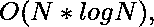

# 通过反转数组中的数字对数组进行排序

> 原文:[https://www . geeksforgeeks . org/通过反转数组中的数字对数组进行排序/](https://www.geeksforgeeks.org/sort-the-array-by-reversing-the-numbers-in-it/)

给定一个非负整数 **N** 的数组 **arr[]** ，任务是根据它们的反序对这些整数进行排序。

**示例:**

> **输入:** arr[] = {12，10，102，31，15}
> **输出:** 10 31 12 15 102
> 反转数字:
> 12->21
> 10->01
> 102->201
> 31->13
> 15->51
> 排序
> 
> **输入:** arr[] = {12，10 }
> T3】输出: 10 12

**方法:**思想是将每个元素及其逆存储在一个[向量对](https://www.geeksforgeeks.org/sorting-vector-of-pairs-in-c-set-1-sort-by-first-and-second/)中，然后根据存储的逆对向量的所有元素进行排序。最后，按顺序打印元素。

下面是上述方法的实现:

## C++

```
// C++ implementation of the approach

#include <bits/stdc++.h>
using namespace std;

// Function to return the
// reverse of n
int reversDigits(int num)
{
    int rev_num = 0;
    while (num > 0) {
        rev_num = rev_num * 10 + num % 10;
        num = num / 10;
    }
    return rev_num;
}

// Function to sort the array according to
// the reverse of elements
void sortArr(int arr[], int n)
{
    // Vector to store the reverse
    // with respective elements
    vector<pair<int, int> > vp;

    // Inserting reverse with elements
    // in the vector pair
    for (int i = 0; i < n; i++) {
        vp.push_back(
            make_pair(reversDigits(arr[i]),
                      arr[i]));
    }

    // Sort the vector, this will sort the pair
    // according to the reverse of elements
    sort(vp.begin(), vp.end());

    // Print the sorted vector content
    for (int i = 0; i < vp.size(); i++)
        cout << vp[i].second << " ";
}

// Driver code
int main()
{
    int arr[] = { 12, 10, 102, 31, 15 };
    int n = sizeof(arr) / sizeof(arr[0]);

    sortArr(arr, n);

    return 0;
}
```

## Java 语言(一种计算机语言，尤用于创建网站)

```
// Java implementation of the approach
import java.util.*;
import java.lang.*;
import java.io.*;

class GFG{

// Function to return the
// reverse of n
static int reversDigits(int num)
{
    int rev_num = 0;
    while (num > 0)
    {
        rev_num = rev_num * 10 + num % 10;
        num = num / 10;
    }
    return rev_num;
}

// Function to sort the array according
// to the reverse of elements
static void sortArr(int arr[], int n)
{

    // Vector to store the reverse
    // with respective elements
    ArrayList<int[]> vp = new ArrayList<>();

    // Inserting reverse with elements
    // in the vector pair
    for(int i = 0; i < n; i++)
    {
        vp.add(new int[]{reversDigits(arr[i]),
                                      arr[i]});
    }

    // Sort the vector, this will sort the pair
    // according to the reverse of elements
    Collections.sort(vp, (a, b) -> a[0] - b[0]);

    // Print the sorted vector content
    for(int i = 0; i < vp.size(); i++)
        System.out.print(vp.get(i)[1] + " ");
}

// Driver code
public static void main(String[] args)
{
    int arr[] = { 12, 10, 102, 31, 15 };
    int n = arr.length;

    sortArr(arr, n);
}
}

// This code is contributed by offbeat
```

## 蟒蛇 3

```
# Python3 implementation of the approach

# Function to return the
# reverse of n
def reversDigits(num) :

    rev_num = 0;
    while (num > 0) :
        rev_num = rev_num * 10 + num % 10;
        num = num // 10;

    return rev_num;

# Function to sort the array according to
# the reverse of elements
def sortArr(arr, n) :

    # Vector to store the reverse
    # with respective elements
    vp = [];

    # Inserting reverse with elements
    # in the vector pair
    for i in range(n) :
        vp.append((reversDigits(arr[i]),arr[i]));

    # Sort the vector, this will sort the pair
    # according to the reverse of elements
    vp.sort()

    # Print the sorted vector content
    for i in range(len(vp)) :
        print(vp[i][1],end= " ");

# Driver code
if __name__ == "__main__" :

    arr = [ 12, 10, 102, 31, 15 ];
    n = len(arr);

    sortArr(arr, n);

# This code is contributed by AnkitRai01
```

## C#

```
// C# implementation of the approach
using System;
using System.Collections.Generic;
class GFG
{

    // Function to return the
    // reverse of n
    static int reversDigits(int num)
    {
        int rev_num = 0;
        while (num > 0)
        {
            rev_num = rev_num * 10 + num % 10;
            num = num / 10;
        }
        return rev_num;
    }

    // Function to sort the array according to
    // the reverse of elements
    static void sortArr(int[] arr, int n)
    {

        // Vector to store the reverse
        // with respective elements
        List<Tuple<int, int>> vp = new List<Tuple<int, int>>();

        // Inserting reverse with elements
        // in the vector pair
        for (int i = 0; i < n; i++)
        {
            vp.Add(new Tuple<int, int>(reversDigits(arr[i]),arr[i]));
        }

        // Sort the vector, this will sort the pair
        // according to the reverse of elements
        vp.Sort();

        // Print the sorted vector content
        for (int i = 0; i < vp.Count; i++)
            Console.Write(vp[i].Item2 + " ");
    }

  // Driver code
  static void Main()
  {
    int[] arr = { 12, 10, 102, 31, 15 };
    int n = arr.Length;

    sortArr(arr, n);
  }
}

// This code is contributed by divyesh072019
```

## java 描述语言

```
<script>
// Javascript implementation of the
// above approach

// Function to return the
// reverse of n
function reversDigits(num)
{
    var rev_num = 0;
    while (num > 0) {
        rev_num = rev_num * 10 + num % 10;
        num = Math.floor(num / 10);
    }
    return rev_num;
}

// Function to sort the array according to
// the reverse of elements
function sortArr(arr, n)
{
    // Vector to store the reverse
    // with respective elements
    var vp = new Array(n);
    for (var i = 0; i < n; i++) {
        vp[i] = [];
    }
    // Inserting reverse with elements
    // in the vector pair
    for (var i = 0; i < n; i++) {
        var pair = [];
        pair.push(reversDigits(arr[i]));
        pair.push(arr[i]);
        vp[i] = pair;
    }

    // Sort the vector, this will sort the pair
    // according to the reverse of elements
    vp = vp.sort(function(a,b) {
        return a[0] - b[0];
    });

    // Print the sorted vector content
    for (var i = 0; i < n; i++){
        document.write(vp[i][1] + " ");
    }
}
// Driver code
var arr = [ 12, 10, 102, 31, 15 ];
var n = arr.length;

sortArr(arr, n);

// This code is contributed by Shivanisingh
</script>
```

**Output:** 

```
10 31 12 15 102
```

**时间复杂度:**

其中 N 是数组的大小

**辅助空间:** O(N)