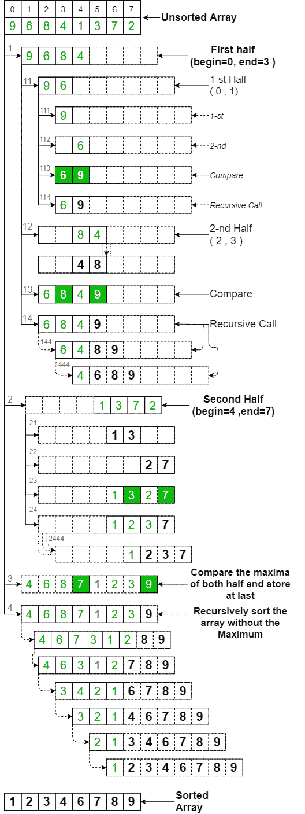
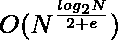
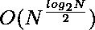

# 使用慢速排序对数组进行排序

> 原文:[https://www . geeksforgeeks . org/sort-the-array-use-slow-sort/](https://www.geeksforgeeks.org/sort-the-array-using-slow-sort/)

给定一个由 **N** 个整数组成的[数组](https://www.geeksforgeeks.org/introduction-to-arrays/) **arr[]** ，任务是[使用慢速排序以升序](https://www.geeksforgeeks.org/c-program-to-sort-an-array-in-ascending-order/)对给定数组进行排序。

**示例:**

> **输入:** arr[] = {6，8，9，4，12，1}
> **输出:** 1 4 6 8 9 12
> 
> **输入:** arr[] = {5，4，3，2，1 }
> T3】输出: 1 2 3 4 5

**进场:**像 [合并排序](https://www.geeksforgeeks.org/merge-sort/) 、**慢速排序**是一个 [分治](https://www.geeksforgeeks.org/divide-and-conquer-introduction/) 算法。它将输入数组分成两半，称自己为两半，然后比较两半的最大元素。它将子数组的最大元素存储在子数组的顶部位置，然后递归调用没有最大元素的子数组。按照以下步骤解决问题:

**SlowSort(arr[]，l，r):**

*   如果 **r > = l** ，执行以下步骤:
    *   求数组的中间值为 **m = (l + r) / 2** 。
    *   [递归调用](https://www.geeksforgeeks.org/recursive-functions/)函数 SlowSort 求前半部分元素的最大值: **SlowSort(arr，l，m)**
    *   [递归调用](https://www.geeksforgeeks.org/recursive-functions/)函数 SlowSort 求后半部分元素的最大值: **SlowSort(arr，m + 1，r)**
    *   将上述函数调用返回的两个最大值中最大的一个存储在最后作为 **arr[r] = max(arr[m]，arr[r])**
    *   [递归调用](https://www.geeksforgeeks.org/recursive-functions/)函数 SlowSort，不使用上一步得到的最大值: **SlowSort(arr，l，r-1)**

下图显示了完整的**慢速排序**过程。例如，数组 **{9，6，8，4，1，3，7，2}** 。从图中可以看到，数组被递归地分成两半，直到大小变成 1。一旦大小变为 1，比较过程开始。



慢速排序

下面是上述方法的实现:

## C++

```
// C++ program for the above approach
#include <iostream>
using namespace std;

// Function to swap two elements
void swap(int* xp, int* yp)
{
    int temp = *xp;
    *xp = *yp;
    *yp = temp;
}

// Function to sort the array using
// the Slow sort
void slow_sort(int A[], int i, int j)
{
    // Recursion break condition
    if (i >= j)
        return;

    // Store the middle value
    int m = (i + j) / 2;

    // Recursively call with the
    // left half
    slow_sort(A, i, m);

    // Recursively call with the
    // right half
    slow_sort(A, m + 1, j);

    // Swap if the first element is
    // lower than second
    if (A[j] < A[m]) {
        swap(&A[j], &A[m]);
    }

    // Recursively call with the
    // array excluding the maximum
    // element
    slow_sort(A, i, j - 1);
}

// Function to print the array
void printArray(int arr[], int size)
{
    int i;
    for (i = 0; i < size; i++)
        cout << arr[i] << " ";
    cout << endl;
}

// Driver Code
int main()
{
    // Given Input
    int arr[] = { 6, 8, 9, 4, 12, 1 };
    int n = sizeof(arr) / sizeof(arr[0]);

    // Function Call
    slow_sort(arr, 0, n - 1);

    // Print the sorted array
    printArray(arr, n);

    return 0;
}
```

## Java 语言(一种计算机语言，尤用于创建网站)

```
// Java program for the above approach
class GFG{

// Function to sort the array using
// the Slow sort
static void slow_sort(int A[], int i, int j)
{

    // Recursion break condition
    if (i >= j)
        return;

    // Store the middle value
    int m = (i + j) / 2;

    // Recursively call with the
    // left half
    slow_sort(A, i, m);

    // Recursively call with the
    // right half
    slow_sort(A, m + 1, j);

    // Swap if the first element is
    // lower than second
    if (A[j] < A[m])
    {
        int temp = A[j];
        A[j] = A[m];
        A[m] = temp;
    }

    // Recursively call with the
    // array excluding the maximum
    // element
    slow_sort(A, i, j - 1);
}

// Function to print the array
static void printArray(int arr[], int size)
{
    int i;
    for(i = 0; i < size; i++)
        System.out.print(arr[i] + " ");

    System.out.println();
}

// Driver code
public static void main(String[] args)
{
    int arr[] = { 6, 8, 9, 4, 12, 1 };
    int n = arr.length;

    // Function Call
    slow_sort(arr, 0, n - 1);

    // Print the sorted array
    printArray(arr, n);
}
}

// This code is contributed by abhinavjain194
```

## 蟒蛇 3

```
# Python3 program for the above approach

# Function to sort the array using
# the Slow sort
def slow_sort(A, i, j):

    # Recursion break condition
    if (i >= j):
        return

    # Store the middle value
    m = (i + j) // 2

    # Recursively call with the
    # left half
    slow_sort(A, i, m)

    # Recursively call with the
    # right half
    slow_sort(A, m + 1, j)

    # Swap if the first element is
    # lower than second
    if (A[j] < A[m]):
        temp = A[m]
        A[m] = A[j]
        A[j] = temp

    # Recursively call with the
    # array excluding the maximum
    # element
    slow_sort(A, i, j - 1)

# Function to print the array
def printArray(arr, size):

    for i in range(size):
        print(arr[i], end = " ")

# Driver Code
if __name__ == '__main__':

    arr = [ 6, 8, 9, 4, 12, 1 ]
    n = len(arr)

    # Function Call
    slow_sort(arr, 0, n - 1)

    # Print the sorted array
    printArray(arr, n)

# This code is contributed by SoumikMondal
```

## C#

```
// C# implementation of the approach
using System;

class GFG
{

// Function to sort the array using
// the Slow sort
static void slow_sort(int[] A, int i, int j)
{

    // Recursion break condition
    if (i >= j)
        return;

    // Store the middle value
    int m = (i + j) / 2;

    // Recursively call with the
    // left half
    slow_sort(A, i, m);

    // Recursively call with the
    // right half
    slow_sort(A, m + 1, j);

    // Swap if the first element is
    // lower than second
    if (A[j] < A[m])
    {
        int temp = A[j];
        A[j] = A[m];
        A[m] = temp;
    }

    // Recursively call with the
    // array excluding the maximum
    // element
    slow_sort(A, i, j - 1);
}

// Function to print the array
static void printArray(int[] arr, int size)
{
    int i;
    for(i = 0; i < size; i++)
        Console.Write(arr[i] + " ");

    Console.WriteLine();
}

    // Driver code
    public static void Main()
    {
    int[] arr = { 6, 8, 9, 4, 12, 1 };
    int n = arr.Length;

    // Function Call
    slow_sort(arr, 0, n - 1);

    // Print the sorted array
    printArray(arr, n);
    }
}

// this code is contributed by sanjoy_62.
```

## java 描述语言

```
<script>

    // JavaScript program for the above approach

    // Function to sort the array using
    // the Slow sort
    function slow_sort(A, i, j)
    {

        // Recursion break condition
        if (i >= j)
            return;

        // Store the middle value
        let m = parseInt((i + j) / 2, 10);

        // Recursively call with the
        // left half
        slow_sort(A, i, m);

        // Recursively call with the
        // right half
        slow_sort(A, m + 1, j);

        // Swap if the first element is
        // lower than second
        if (A[j] < A[m])
        {
            let temp = A[j];
            A[j] = A[m];
            A[m] = temp;
        }

        // Recursively call with the
        // array excluding the maximum
        // element
        slow_sort(A, i, j - 1);
    }

    // Function to print the array
    function printArray(arr, size)
    {
        let i;
        for(i = 0; i < size; i++)
            document.write(arr[i] + " ");

        document.write("</br>");
    }

    let arr = [ 6, 8, 9, 4, 12, 1 ];
    let n = arr.length;

    // Function Call
    slow_sort(arr, 0, n - 1);

    // Print the sorted array
    printArray(arr, n);

</script>
```

**Output:** 

```
1 4 6 8 9 12
```

***最佳病例时间复杂度:***  *，其中 e > 0* 
***平均病例时间复杂度:*** 
***辅助空间:** O(1)*