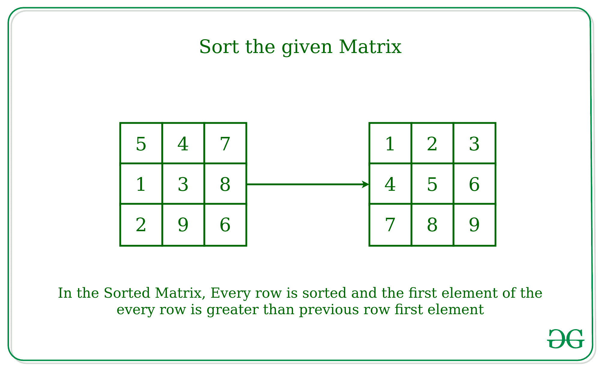

# 给定矩阵排序|内存高效方法

> 原文:[https://www . geeksforgeeks . org/排序给定矩阵内存高效方法/](https://www.geeksforgeeks.org/sort-the-given-matrix-memory-efficient-approach/)

给定一个由 **N** 行和 **M** 列组成的[矩阵](https://www.geeksforgeeks.org/category/data-structures/matrix/)，任务是[按照严格的顺序对矩阵](https://www.geeksforgeeks.org/sort-given-matrix/)进行排序，即每行按递增顺序排序，每行的第一个元素大于前一行的第一个元素。



**示例:**

```
Input: M[][] = { {5, 4, 7}, 
                 {1, 3, 8}, 
                 {2, 9, 6} }
Output: 1 2 3
        4 5 6
        7 8 9
Explanation:
Please refer above image

Input: M[][] = { {5, 4, 7},
                 {1, 3, 8} }
Output: 1 3 4
        5 7 8
```

**方法:**想法是把[2D-数组](https://www.geeksforgeeks.org/multidimensional-arrays-in-java/)当作 1D-数组来排序矩阵而不使用额外的空间。这也可以借助下面的例子来解释。

**例如:**

```
There is a 2*2 Matrix with 4 elements,
The idea is to treat the elements of the matrix
as 1D Array of 4 elements.
1 2
3 4

As In the given matrix each element can be accessed as -
1st Element - 0th Row, 0th Col
2nd Element - 0th Row, 1st Col
3rd Element - 1st Row, 0th Col
4th Element - 1st Row, 1st Col 
```

因此，对于访问矩阵的第 i <sup>个</sup>元素，关系可以定义为:

> 矩阵的第一<sup>个</sup>元素= Mat[ i / cols ][ i % cols ]

**算法:**

*   通过找到 2D 数组中行数的长度和数组中每行的元素，找到矩阵中的行数(比如说**行**)和列数(比如说**列**)。
*   从 0 到元素个数(行数*列数)迭代矩阵的每个元素。
*   使用上述公式为每个元素找到元素在矩阵中的适当位置。
*   将每个元素与矩阵中的下一个元素(对于行中的最后一个元素，下一个元素将是下一行的第一个元素)进行比较，如果下一个元素较少，则交换这些元素。

**举例说明:**

<figure class="table">

| 我 | J | 比较元素 | [数]矩阵 | 评论 |
| --- | --- | --- | --- | --- |
| Zero | Zero | (0, 0) & (0, 1) | **5**T2 67
1 4 8 | 不交换 |
| Zero | one | (0, 1) & (0, 2) | 5**6**T2 7T4 1 4 8 | 不交换 |
| Zero | Two | (0, 2) & (1, 0) | 5 6**1**T2**7**4 8 | 交换 |
| Zero | three | (1, 0) & (1, 1) | 5 6 1
T1 4T3 78 | 交换 |
| Zero | four | (1, 1) & (1, 2) | 5 6 1
4**7**T3】8 | 不交换 |
| one | Zero | (0, 0) & (0, 1) | **5**T2 61
4 7 8 | 不交换 |
| one | one | (0, 1) & (0, 2) | 5**1**T2 6T4 4 7 8 | 交换 |
| one | Two | (0, 2) & (1, 0) | 5 1**4**T2**6**7 8 | 交换 |
| one | three | (1, 0) & (1, 1) | 5 1 4
T1 6T3 78 | 不交换 |
| one | four | (1, 1) & (1, 2) | 5 1 4
4**7**T3】8 | 不交换 |
| Two | Zero | (0, 0) & (0, 1) | **1**T2 54
6 7 8 | 交换 |
| Two | one | (0, 1) & (0, 2) | 1**4**T2 5T4 6 7 8 | 交换 |
| Two | Two | (0, 2) & (1, 0) | 1 4**5**T2**6**7 8 | 不交换 |
| Two | three | (1, 0) & (1, 1) | 5 1 4
T1 6T3 78 | 不交换 |
| Two | four | (1, 1) & (1, 2) | 5 1 4
4**7**T3】8 | 不交换 |

下面是上述方法的实现:

## C++

```
// C++ implementation to sort
// the given matrix in strict order
#include <bits/stdc++.h>
using namespace std;
#define N 3
#define M 3

// Function to sort the matrix
void sortMat(int data[N][M], int row, int col)
{

    // Number of elements in matrix
    int size = row * col;

    // Loop to sort the matrix
    // using Bubble Sort
    for (int i = 0; i < size; i++)
    {
        for (int j = 0; j < size - 1; j++)
        {

            // Condition to check
            // if the Adjacent elements
            if (data[j / col][j % col] > data[(j + 1)
                / col][(j + 1) % col])
            {

                // Swap if previous value is greater
                int temp = data[j / col][j % col];
                data[j / col][j % col] = data[(j + 1)
                    / col][(j + 1) % col];
                data[(j + 1) / col][(j + 1) % col] = temp;
            }
        }
    }
}

void printMat(int mat[N][M], int row, int col)
{

    // Loop to print the matrix
    for (int i = 0; i < row; i++)
    {
        for (int j = 0; j < col; j++)
        {
            cout << mat[i][j] << " ";
        }
        cout << endl;
    }
}

// Driver Code
int main()
{
    int mat[N][M] = { { 5, 4, 7 },
                        { 1, 3, 8 },
                        { 2, 9, 6 } };

    int row = N;
    int col = M;

    // Function call to sort
    sortMat(mat, row, col);

    // Function call to
    // print matrix
    printMat(mat, row, col);
    return 0;
}

// This code is contributed by 29AjayKumar
```

## Java 语言(一种计算机语言，尤用于创建网站)

```
// Java implementation to sort
// the given matrix in strict order
class GFG
{
    // Function to sort the matrix
    static void sortMat(int[][] data, int row, int col)
    {

        // Number of elements in matrix
        int size = row * col;

        // Loop to sort the matrix
        // using Bubble Sort
        for (int i = 0; i < size; i++)
        {
            for (int j = 0; j < size - 1; j++)
            {

                // Condition to check
                // if the Adjacent elements
                if (data[j / col][j % col] > data[(j + 1)
                    / col][(j + 1) % col])
                {

                    // Swap if previous value is greater
                    int temp = data[j / col][j % col];
                    data[j / col][j % col] = data[(j + 1)
                        / col][(j + 1) % col];
                    data[(j + 1) / col][(j + 1) % col] = temp;
                }
            }
        }
    }

    static void printMat(int[][] mat, int row, int col)
    {

        // Loop to print the matrix
        for (int i = 0; i < row; i++)
        {
            for (int j = 0; j < col; j++)
            {
                System.out.print(mat[i][j] + " ");
            }
            System.out.println();
        }
    }

    // Driver Code
    public static void main(String[] args)
    {

        int[][] mat = { { 5, 4, 7 },
                        { 1, 3, 8 },
                        { 2, 9, 6 } };

        int row = mat.length;
        int col = mat[0].length;

        // Function call to sort
        sortMat(mat, row, col);

        // Function call to
        // print matrix
        printMat(mat, row, col);
    }
}

// This code is contributed by PrinciRaj1992
```

## 蟒蛇 3

```
# Python3 implementation to sort
# the given matrix in strict order

# Function to sort the matrix
def sortMat(data, row, col):

    # Number of elements in matrix
    size = row * col

    # Loop to sort the matrix
    # using Bubble Sort
    for i in range(0, size):
        for j in range(0, size-1):

            # Condition to check
            # if the Adjacent elements
            if ( data[j//col][j % col] >\
                data[(j + 1)//col][(j + 1)% col] ):

                # Swap if previous value is greater
                temp = data[j//col][j % col]
                data[j//col][j % col] =\
                    data[(j + 1)//col][(j + 1)% col]
                data[(j + 1)//col][(j + 1)% col] =\
                                 temp

def printMat(mat, row, col):

    # Loop to print the matrix
    for i in range(row):
        for j in range(col):
            print(mat[i][j], end =" ")
        print()

# Driver Code
if __name__ == "__main__":
    mat = [ [5, 4, 7],
            [1, 3, 8],
            [2, 9, 6] ]
    row = len(mat)
    col = len(mat[0])

    # Function call to sort
    sortMat(mat, row, col)

    # Function call to
    # print matrix
    printMat(mat, row, col)
```

## C#

```
// C# implementation to sort
// the given matrix in strict order
using System;

class GFG
{
    // Function to sort the matrix
    static void sortMat(int[,] data, int row, int col)
    {

        // Number of elements in matrix
        int size = row * col;

        // Loop to sort the matrix
        // using Bubble Sort
        for (int i = 0; i < size; i++)
        {
            for (int j = 0; j < size - 1; j++)
            {

                // Condition to check
                // if the Adjacent elements
                if (data[j / col,j % col] > data[(j + 1)
                    / col,(j + 1) % col])
                {

                    // Swap if previous value is greater
                    int temp = data[j / col,j % col];
                    data[j / col,j % col] = data[(j + 1)
                        / col,(j + 1) % col];
                    data[(j + 1) / col,(j + 1) % col] = temp;
                }
            }
        }
    }

    static void printMat(int[,] mat, int row, int col)
    {

        // Loop to print the matrix
        for (int i = 0; i < row; i++)
        {
            for (int j = 0; j < col; j++)
            {
                Console.Write(mat[i,j] + " ");
            }
            Console.WriteLine();
        }
    }

    // Driver Code
    public static void Main(String[] args)
    {

        int[,] mat = { { 5, 4, 7 },
                        { 1, 3, 8 },
                        { 2, 9, 6 } };

        int row = mat.GetLength(0);
        int col = mat.GetLength(1);

        // Function call to sort
        sortMat(mat, row, col);

        // Function call to
        // print matrix
        printMat(mat, row, col);
    }
}

// This code is contributed by 29AjayKumar
```

## java 描述语言

```
<script>
// Javascript implementation to sort
// the given matrix in strict order

let N  = 3;
let M = 3;

// Function to sort the matrix
function sortMat(data, row, col)
{

    // Number of elements in matrix
    let size = row * col;

    // Loop to sort the matrix
    // using Bubble Sort
    for (let i = 0; i < size; i++)
    {
        for (let j = 0; j < size - 1; j++)
        {

            // Condition to check
            // if the Adjacent elements
            if (data[Math.floor(j / col)][j % col] >
                data[Math.floor((j + 1) / col)][(j + 1) % col])
            {

                // Swap if previous value is greater
                let temp = data[Math.floor(j / col)][j % col];
                data[Math.floor(j / col)][j % col] =
                  data[Math.floor((j + 1) / col)][(j + 1) % col];
                data[Math.floor((j + 1) / col)][(j + 1) % col] = temp;
            }
        }
    }
}

function printMat(mat, row, col)
{

    // Loop to print the matrix
    for (let i = 0; i < row; i++)
    {
        for (let j = 0; j < col; j++)
        {
            document.write(mat[i][j] + " ");
        }
        document.write("<br>");
    }
}

// Driver Code

    let mat = [ [ 5, 4, 7 ],
                        [ 1, 3, 8 ],
                        [ 2, 9, 6 ] ];

    let row = N;
    let col = M;

    // Function call to sort
    sortMat(mat, row, col);

    // Function call to
    // print matrix
    printMat(mat, row, col);

// This code is contributed by gfgking
</script>
```

**Output:** 

```
1 2 3 
4 5 6 
7 8 9
```

**性能分析:**

*   **时间复杂度:**在给定的方法中，我们使用冒泡排序通过考虑 1D 阵列中的元素来对矩阵中的元素进行排序，因此整体复杂度将是 **O(N * M > )**
*   **空间复杂度:**在给定的方法中，没有使用额外的空间，因此整体空间复杂度为 **O(1)**

</figure>