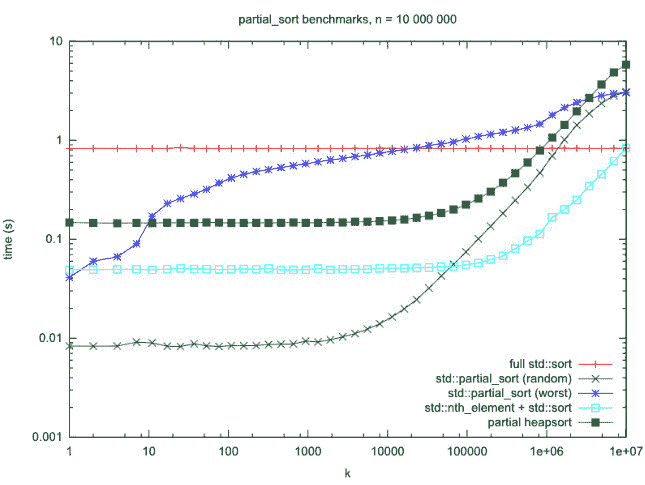

# c++ STL 中 sort()对 partial_sort()对 nth_element() + sort()

> 原文:[https://www . geesforgeks . org/sort-vs-partial _ sort-vs-n th _ element-sort-in-c-STL/](https://www.geeksforgeeks.org/sort-vs-partial_sort-vs-nth_element-sort-in-c-stl/)

在本文中，我们将讨论 [sort()](https://www.geeksforgeeks.org/sort-c-stl/) 、 [partial_sort()](https://www.geeksforgeeks.org/stdpartial_sort-in-cpp/) 和 [nth_element()](https://www.geeksforgeeks.org/stdnth_element-in-cpp/) +sort()。

以下是上述功能的图示:

1.  **sort():** [C++ STL](https://www.geeksforgeeks.org/the-c-standard-template-library-stl/) 提供了一个函数 **sort()** 在 O(N*log N)时间内对元素列表进行排序。默认情况下，sort()按升序对数组进行排序。下面是程序说明排序():

    ```
    // C++ program to illustrate the default behaviour
    // of sort() in STL
    #include <bits/stdc++.h>
    using namespace std;

    // Driver Code
    int main()
    {
        // Given array of elements
        int arr[] = { 1, 5, 8, 9, 6, 7, 3, 4, 2, 0 };
        int n = sizeof(arr) / sizeof(arr[0]);

        // Function sort() to sort the element of
        // the array in increasing order
        sort(arr, arr + n);

        // Print the array elements after sorting
        cout << "\nArray after sorting using "
                "default sort is: \n";
        for (int i = 0; i < n; ++i) {
            cout << arr[i] << " ";
        }

        return 0;
    }
    ```

    **输出:**

    ```
    Array after sorting using default sort is : 
    0 1 2 3 4 5 6 7 8 9

    ```

2.  **partial _ sort():****STD::sort()**的变体之一是 **std::partial_sort()** ，用于排序的不是整个范围，而是其中的一个子部分。它重新排列**【第一个，最后一个】**范围内的元素，中间之前的元素按升序排序，而中间之后的元素没有任何特定的顺序。
    下面是说明 partial_sort()的程序:

```
// C++ program to demonstrate the use of
// partial_sort()
#include <bits/stdc++.h>
using namespace std;

// Driver Code
int main()
{
    // Given array of elements
    vector<int> v = { 1, 3, 1, 10, 3, 3, 7, 7, 8 };

    // Using std::partial_sort() to sort
    // first 3 elements
    partial_sort(v.begin(), v.begin() + 3, v.end());

    // Displaying the vector after applying
    // partial_sort()
    for (int ip : v) {
        cout << ip << " ";
    }

    return 0;
}
```

**Output:**

```
1 1 3 10 3 3 7 7 8

```

**partial_sort()** 的复杂度为 *O(N*log K)* ，其中 N 为数组中的元素个数，K 为中间与开始之间的元素个数。如果 **K** 明显小于 **N** ，则 **partial_sort()** 比 **sort()** 快，因为 **partial_sort()** 将首先对 **K** 元素进行排序，而 **sort()** 将对所有 **N** 元素进行排序。
最差情况 *O(N*log K)* 运行时间 **partial_sort()** 并不能说明全部情况。其随机输入的平均情况运行时间为***O(N+K * log K+K *(log K)*(log Nk))***。
因为忽略每个不在最小 **K** 中的元素所做的工作非常少，到目前为止仅通过一次比较就可以看出，对于小 **K** 来说，常数因子很难超越，即使有一个渐近更好的算法。

*   **nth_element():** The **nth_element()** is an STL algorithm which rearranges the list in such a way such that the element at the **nth** position is the one which should be at that position if we sort the list.
    It does not sort the list, just that all the elements, which precede the nth element are not greater than it, and all the elements which succeed it are not less than it.
    Below is the program to illustrate nth_element():

    ```
    // C++ program to demonstrate the use
    // of std::nth_element
    #include <bits/stdc++.h>
    using namespace std;

    // Driver Code
    int main()
    {
        // Given array v[]
        int v[] = { 3, 2, 10, 45, 33, 56, 23, 47 };

        // Using nth_element with n as 5
        nth_element(v, v + 4, v + 8);

        // Since, n is 5 so 5th element
        // should be sorted
        for (int i = 0; i < 8; i++)
            cout << v[i] << " ";

        return 0;
    }
    ```

    **Output:**

    ```
    3 2 10 23 33 56 45 47

    ```

    下面是三种算法的基准比较，N 从 0 到 10 不等 <sup>7</sup> (图中 X 轴):
    [](https://media.geeksforgeeks.org/wp-content/uploads/20200616101133/Benchmark_Untitled-Diagram.jpg)

    **第 n _ element()+sort()**解是渐近最快的，对于更大的 **K** (其中大部分都注意到对数刻度)执行更好的结果。但在随机输入 **K < 70000** 时，它确实输给了 **partial_sort()** ，输率高达 **6** 的一倍。