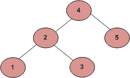

# 代表一个 BST 的给定数组的有序打印

> 原文:[https://www . geeksforgeeks . org/sorted-order-printing-of-of-a-BST/](https://www.geeksforgeeks.org/sorted-order-printing-of-an-array-that-represents-a-bst/)

给定一个存储完整二叉查找树的数组，编写一个函数，以升序高效地打印给定的数组。
例如，给定一个数组[4，2，5，1，3]，函数应该打印 1，2，3，4，5



**解:**
有序遍历 BST 以升序打印。唯一的技巧是修改[标准有序树遍历](https://www.geeksforgeeks.org/tree-traversals-inorder-preorder-and-postorder/)中的递归终止条件。

**实施:**

## C++

```
// C++ Code for Sorted order printing of a
// given array that represents a BST
#include<bits/stdc++.h>
using namespace std;

void printSorted(int arr[], int start, int end)
{    
    if(start > end)
        return;

    // print left subtree
    printSorted(arr, start*2 + 1, end);

    // print root
    cout << arr[start] << " ";

    // print right subtree
    printSorted(arr, start*2 + 2, end);
}

int main()
{
    int arr[] = {4, 2, 5, 1, 3};
    int arr_size = sizeof(arr)/sizeof(int);
    printSorted(arr, 0, arr_size-1);
    getchar();
    return 0;
}

// This code is contributed by Akanksha Rai
```

## C

```
// C Code for Sorted order printing of a
// given array that represents a BST
#include<stdio.h>

void printSorted(int arr[], int start, int end)
{    
  if(start > end)
    return;

  // print left subtree
  printSorted(arr, start*2 + 1, end);

  // print root
  printf("%d  ", arr[start]);

  // print right subtree
  printSorted(arr, start*2 + 2, end); 
}

int main()
{
  int arr[] = {4, 2, 5, 1, 3};
  int arr_size = sizeof(arr)/sizeof(int);
  printSorted(arr, 0, arr_size-1);
  getchar();
  return 0;
}
```

## Java 语言(一种计算机语言，尤用于创建网站)

```
// JAVA Code for Sorted order printing of a
// given array that represents a BST
class GFG{

private static void printSorted(int[] arr, int start,
                                        int end) {
        if(start > end)
            return;

        // print left subtree
        printSorted(arr, start*2 + 1, end);

        // print root
        System.out.print(arr[start] + " ");

        // print right subtree
        printSorted(arr, start*2 + 2, end);
        }

    // driver program to test above function
    public static void main(String[] args) {
        int arr[] = {4, 2, 5, 1, 3};

        printSorted(arr, 0, arr.length-1);
    }
}

// This code is contributed by Arnav Kr. Mandal.
```

## 蟒蛇 3

```
# Python3 Code for Sorted order printing of a
# given array that represents a BST
def printSorted(arr, start, end):
    if start > end:
        return

    # print left subtree
    printSorted(arr, start * 2 + 1, end)

    # print root
    print(arr[start], end = " ")

    # print right subtree
    printSorted(arr, start * 2 + 2, end)

# Driver Code   
if __name__ == '__main__':
    arr = [4, 2, 5, 1, 3]
    arr_size = len(arr)
    printSorted(arr, 0, arr_size - 1)

# This code is contributed by PranchalK
```

## C#

```
// C# Code for Sorted order printing
// of a given array that represents a BST
using System;

class GFG
{
static private void printSorted(int []arr,
                                int start,
                                int end)
{
    if(start > end)
        return;

    // print left subtree
    printSorted(arr, start * 2 + 1, end);

    // print root
    Console.Write(arr[start] + " ");

    // print right subtree
    printSorted(arr, start * 2 + 2, end);
    }

// Driver Code
static public void Main(String []args)
{
    int []arr= {4, 2, 5, 1, 3};

    printSorted(arr, 0, arr.Length - 1);
}
}

// This code is contributed by Arnab Kundu
```

## 服务器端编程语言（Professional Hypertext Preprocessor 的缩写）

```
<?php
// PHP Code for Sorted order printing of a
// given array that represents a BST

function printSorted($arr, $start, $end)
{
    if($start > $end)
        return;

    // print left subtree
    printSorted($arr, $start * 2 + 1, $end);

    // print root
    echo($arr[$start] . " ");

    // print right subtree
    printSorted($arr, $start * 2 + 2, $end);
}

// Driver Code
$arr = array(4, 2, 5, 1, 3);

printSorted($arr, 0, sizeof($arr) - 1);

// This code is contributed by Code_Mech.
```

## java 描述语言

```
<script>

// Javascript Code for Sorted order printing of a
// given array that represents a BST
function printSorted(arr, start, end)
{
    if (start > end)
        return;

    // Print var left subtree
    printSorted(arr, start * 2 + 1, end);

    // Print var root
    document.write(arr[start] + " ");

    // Print var right subtree
    printSorted(arr, start * 2 + 2, end);
}

// Driver code
var arr = [4, 2, 5, 1, 3];

printSorted(arr, 0, arr.length - 1);

// This code is contributed by shikhasingrajput

</script>
```

**输出:**

```
1 2 3 4 5 
```

**时间复杂度:** O(n)

如果您发现上述解决方案不正确，请写评论，或者找到更好的方法来解决相同的问题。