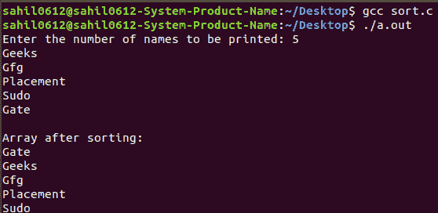

# 对字符串的动态二维数组进行排序

> 原文:[https://www . geesforgeks . org/sorting-a-dynamic-2 维字符串数组/](https://www.geeksforgeeks.org/sorting-a-dynamic-2-dimensional-array-of-strings/)

**先决条件:** [如何在 C 中动态分配一个 2D 阵？](https://www.geeksforgeeks.org/dynamically-allocate-2d-array-c/)

**双指针:**指向另一个指针的指针称为双指针。使用“**”来表示双指针。双指针也被称为指针对指针。

示例:

```
Input: Geeks, Gfg,  Placement, Sudo, Gate
Output: Gate, Geeks, Gfg, Placement, Sudo

```

其思想是以二维数组的形式为字符串动态分配内存和值。然后使用 [strcmp](https://www.geeksforgeeks.org/strcmp-in-c-cpp/) 和 [strcpy](https://www.geeksforgeeks.org/strcpy-in-c-cpp/) 功能进行气泡排序。

**下面是需要的实现:**

```
// C program to sort an array of strings
#include <stdio.h>
#include <stdlib.h>
#include <string.h>

// Function to sort the values
void sort(char** names, int n)
{
    int i, j;

    // Perform sort operation using bubble sort
    for (i = 0; i < n - 1; i++)
        for (j = 0; j < n - i - 1; j++)
            if (strcmp(names[j], names[j + 1]) > 0) {
                char* temp;
                temp = (char*)calloc(30, sizeof(char));
                strcpy(temp, names[j]);
                strcpy(names[j], names[j + 1]);
                strcpy(names[j + 1], temp);
            }
}

// Driver code
int main()
{
    char** names;
    int n, i;
    printf("Enter the number of names to be printed: ");
    scanf("%d\n", &n);

    // allocating memory for 1st dimension
    names = (char**)calloc(n, sizeof(char*));

    for (i = 0; i < n; i++)
    // allocating memory for 2nd dimension
    {
        names[i] = (char*)calloc(30, sizeof(char));
        scanf("%s", names[i]);
    }
    sort(names, n);

    printf("\nArray after sorting:\n");
    for (i = 0; i < n; i++)
        printf("%s\n", names[i]);

    return 0;
}
```

**输出:** 