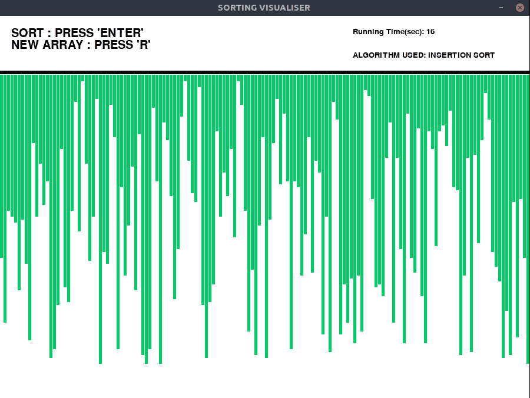
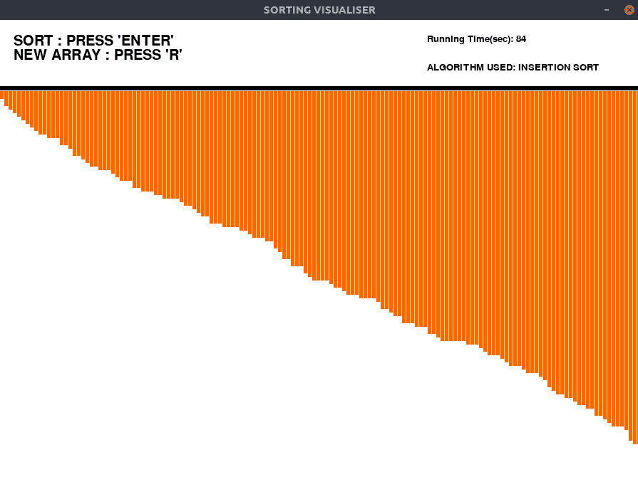

# 排序算法可视化:插入排序

> 原文:[https://www . geesforgeks . org/sorting-算法-可视化-插入-排序/](https://www.geeksforgeeks.org/sorting-algorithm-visualization-insertion-sort/)

像[插入排序](https://www.geeksforgeeks.org/insertion-sort/)这样的算法通过可视化很容易理解。在本文中，实现了一个可视化插入排序算法的程序。
图形用户界面(GUI)使用 [pygame](https://www.geeksforgeeks.org/introduction-to-pygame/) 库以 python 实现。
**进场:**

*   生成随机数组并用条填充 pygame 窗口。条形是垂直的直线，代表数组元素。
*   将所有条形设置为绿色(未排序)。
*   使用 **pygame.time.delay()** 来降低算法的速度，这样我们就可以看到排序的过程。
*   实现一个计时器，看看算法如何执行。
*   这些操作是使用“pygame.event.get()”方法执行的，该方法存储用户执行的所有事件，如启动、重置。
*   蓝色用于突出显示在特定时间参与排序的条。
*   橙色突出显示已排序的条。

**观察:**
我们从 insert Sort 可视化中可以清楚地看到，与 Mergesort 或 Quicksort 等其他排序算法相比，insert Sort 非常慢。
**示例:**

> **输入:**
> 按“回车”键进行可视化。
> 按“R”键生成新数组。
> **输出:**
> **初始:**
> 
> 
> 
> **排序:**
> 
> 
> 
> **决赛:**
> 
> 

运行以下程序前，请确保[安装 pygame 库](https://www.geeksforgeeks.org/introduction-to-pygame/)。
下面是上面可视化工具的实现:

## 蟒蛇 3

```
# Python implementation of the
# Sorting visualiser: Insertion Sort

# Imports
import pygame
import random
import time
pygame.font.init()
startTime = time.time()
# Total window
screen = pygame.display.set_mode(
                        (900, 650)
                    )

# Title and Icon
pygame.display.set_caption(
            "SORTING VISUALISER"
            )

# Uncomment below lines for setting
# up the icon for the visuliser
# img = pygame.image.load('sorticon.png')
# pygame.display.set_icon(img)

# Boolean variable to run
# the program in while loop
run = True

# Window size and some initials
width = 900
length = 600
array =[0]*151
arr_clr =[(0, 204, 102)]*151
clr_ind = 0
clr =[(0, 204, 102), (255, 0, 0), \
       (0, 0, 153), (255, 102, 0)]
fnt = pygame.font.SysFont("comicsans", 30)
fnt1 = pygame.font.SysFont("comicsans", 20)

# Function to generate new Array
def generate_arr():
    for i in range(1, 151):
        arr_clr[i]= clr[0]
        array[i]= random.randrange(1, 100)

# Initially generate a array
generate_arr()

# Function to refill the
# updates on the window
def refill():
    screen.fill((255, 255, 255))
    draw()
    pygame.display.update()
    pygame.time.delay(10)

# Sorting Algorithm: Insertion sort
def insertionSort(array):

    for i in range(1, len(array)):
        pygame.event.pump()
        refill()
        key = array[i]
        arr_clr[i]= clr[2]
        j = i-1
        while j>= 0 and key<array[j]:
            arr_clr[j]= clr[2]
            array[j + 1]= array[j]
            refill()
            arr_clr[j]= clr[3]
            j = j-1
        array[j + 1]= key
        refill()
        arr_clr[i]= clr[0]

# Function to Draw the array values
def draw():
    # Text should be rendered
    txt = fnt.render("SORT: PRESS 'ENTER'", \
                                1, (0, 0, 0))
    # Position where text is placed
    screen.blit(txt, (20, 20))
    txt1 = fnt.render("NEW ARRAY: PRESS 'R'", \
                                1, (0, 0, 0))
    screen.blit(txt1, (20, 40))
    txt2 = fnt1.render("ALGORITHM USED:"\
           "INSERTION SORT", 1, (0, 0, 0))
    screen.blit(txt2, (600, 60))
    text3 = fnt1.render("Running Time(sec): "+\
            str(int(time.time() - startTime)), \
                                  1, (0, 0, 0))
    screen.blit(text3, (600, 20))
    element_width =(width-150)//150
    boundry_arr = 900 / 150
    boundry_grp = 550 / 100
    pygame.draw.line(screen, (0, 0, 0), (0, 95), \
                                  (900, 95), 6)

    # Drawing the array values as lines
    for i in range(1, 151):
        pygame.draw.line(screen, arr_clr[i], \
                   (boundry_arr * i-3, 100), \
                   (boundry_arr * i-3, \
     array[i]*boundry_grp + 100), element_width)

# Program should be run
# continuously to keep the window open
while run:
    # background
    screen.fill((255, 255, 255))

    # Event handler stores all event
    for event in pygame.event.get():

        # If we click Close button in window
        if event.type == pygame.QUIT:
            run = False
        if event.type == pygame.KEYDOWN:
            if event.key == pygame.K_r:
                generate_arr()
            if event.key == pygame.K_RETURN:
                insertionSort(array)    
    draw()
    pygame.display.update()

pygame.quit()
```

**输出:**

<video class="wp-video-shortcode" id="video-436452-1" width="640" height="360" preload="metadata" controls=""><source type="video/mp4" src="https://media.geeksforgeeks.org/wp-content/cdn-uploads/20200623001915/visualiser16-2020-06-23_00.14.17.mp4?_=1">[https://media.geeksforgeeks.org/wp-content/cdn-uploads/20200623001915/visualiser16-2020-06-23_00.14.17.mp4](https://media.geeksforgeeks.org/wp-content/cdn-uploads/20200623001915/visualiser16-2020-06-23_00.14.17.mp4)</video>