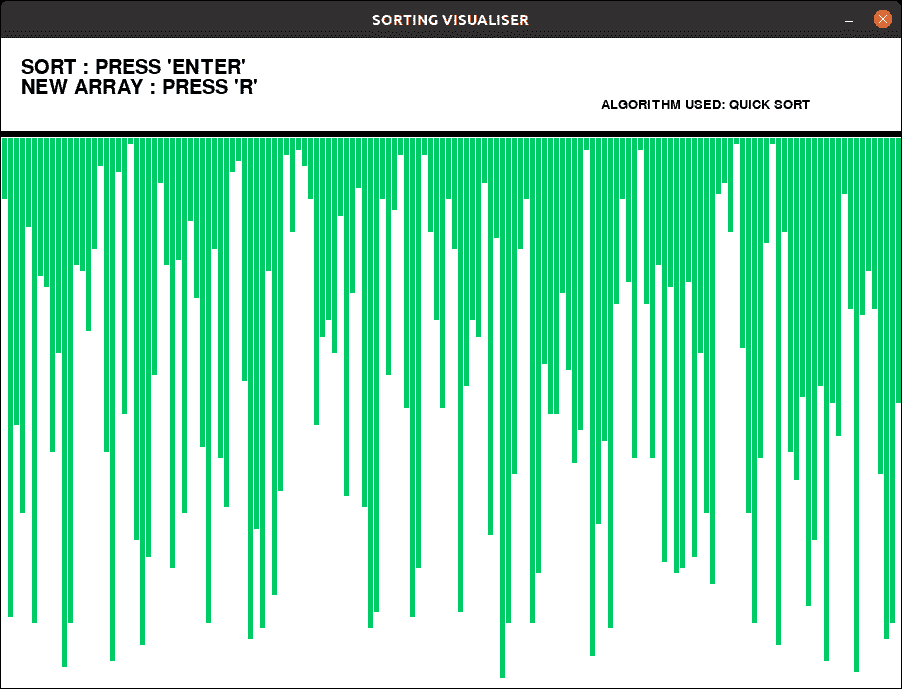
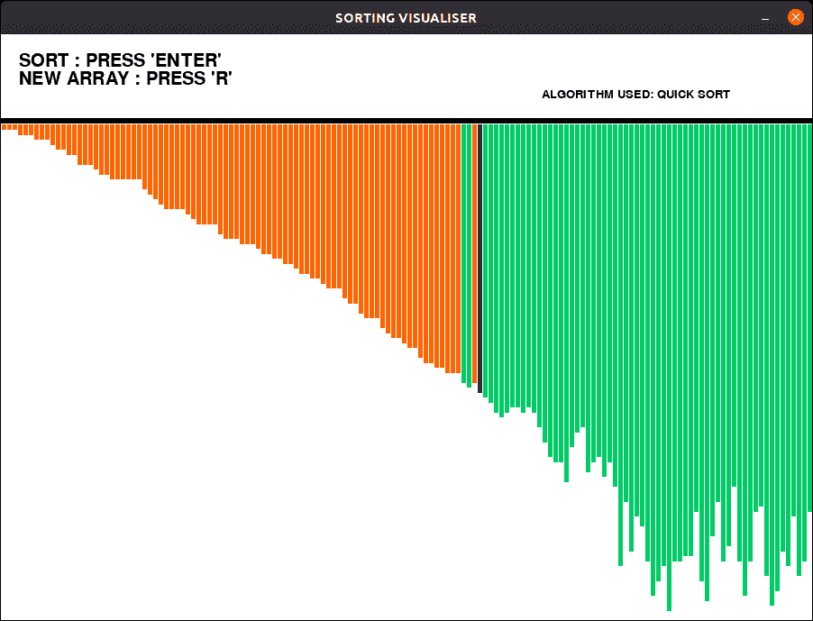
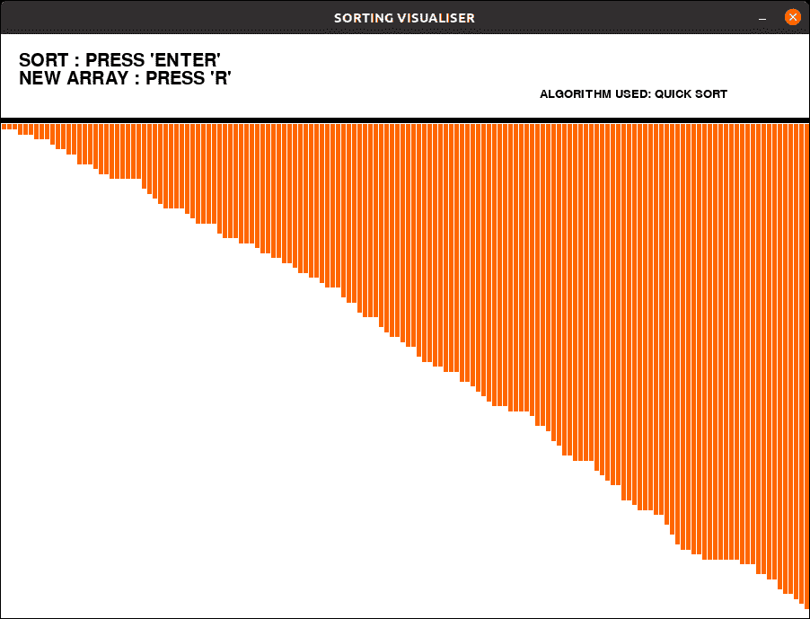

# 排序算法可视化:快速排序

> 原文:[https://www . geesforgeks . org/排序-算法-可视化-快速-排序/](https://www.geeksforgeeks.org/sorting-algorithm-visualization-quick-sort/)

像 Quicksort 算法这样的算法，理论上很难理解。通过可视化这种算法，我们可以很容易理解。本文实现了一个可视化[快速排序算法](https://www.geeksforgeeks.org/quick-sort/)的程序。
图形用户界面(GUI)使用 [pygame](https://www.geeksforgeeks.org/introduction-to-pygame/) 库以 python 实现。
**进近:**

*   生成随机值的数组，并在窗口中绘制为线(条)。
*   由于算法的运算速度非常快，pygame.time.delay()被用来降低运算速度。
*   为每个操作分配特定的键(开始排序，重置条)。
*   使用`‘pygame.event.get()’`方法执行动作，该方法存储用户执行的所有事件。
*   不同的颜色用来表示酒吧的类型。
    *   绿色–未排序的栏
    *   蓝色–枢轴条
    *   橙色–分类栏

**示例:**

> **输入:**
> 按“回车”键进行可视化。
> 按“r”键生成新数组。
> **输出:**
> **初始:**
> [](https://media.geeksforgeeks.org/wp-content/uploads/20200619155517/intial_quick_sort.png)
> **排序:**
> [](https://media.geeksforgeeks.org/wp-content/uploads/20200619155542/sorting_quick_sort.png)
> **最终:**
> [](https://media.geeksforgeeks.org/wp-content/uploads/20200619155605/final_quick_sort.png)

请确保在您的系统中安装 pygame 库。

下面是上述可视化工具的实现:

## 计算机编程语言

```
# Python implementation of the
# Sorting visualiser: Quick Sort

# Imports
import pygame
import random
pygame.font.init()

# Total window
screen = pygame.display.set_mode(
            (900, 650)
        )

# Title and Icon
pygame.display.set_caption("SORTING VISUALISER")

# Uncomment below lines for setting
# up the icon for the visuliser
# img = pygame.image.load('sort_icon.png')
# pygame.display.set_icon(img)

# Boolean variable to run
# the program in while loop
run = True

# Window size and some initials
width = 900
length = 600
array =[0]*151
arr_clr =[(0, 204, 102)]*151
clr_ind = 0
clr =[(0, 204, 102), (255, 0, 0),\
      (0, 0, 153), (255, 102, 0)]
fnt = pygame.font.SysFont("comicsans", 30)
fnt1 = pygame.font.SysFont("comicsans", 20)

# Function to generate new Array
def generate_arr():
    for i in range(1, 151):
        arr_clr[i]= clr[0]
        array[i]= random.randrange(1, 100)

# Initially generate a array
generate_arr()

# Function to refill the
# updates on the window
def refill():
    screen.fill((255, 255, 255))
    draw()
    pygame.display.update()
    pygame.time.delay(30)

# Sorting Algo:Quick sort
def quicksort(array, l, r):
    if l<r:
        pi = partition(array, l, r)
        quicksort(array, l, pi-1)
        refill()
        for i in range(0, pi + 1):
            arr_clr[i]= clr[3]
        quicksort(array, pi + 1, r)

# Function to partition the array
def partition(array, low, high):
    pygame.event.pump()
    pivot = array[high]
    arr_clr[high]= clr[2]
    i = low-1
    for j in range(low, high):
        arr_clr[j]= clr[1]
        refill()
        arr_clr[high]= clr[2]
        arr_clr[j]= clr[0]
        arr_clr[i]= clr[0]
        if array[j]<pivot:
            i = i + 1
            arr_clr[i]= clr[1]
            array[i], array[j]= array[j], array[i]
    refill()
    arr_clr[i]= clr[0]
    arr_clr[high]= clr[0]
    array[i + 1], array[high] = array[high], array[i + 1]

    return ( i + 1 )

# Function to Draw the
# array values
def draw():
    # Text should be rendered
    txt = fnt.render("SORT : PRESS 'ENTER'",\
                       1, (0, 0, 0))

    # Position where text is placed
    screen.blit(txt, (20, 20))
    txt1 = fnt.render("NEW ARRAY : PRESS 'R'",\
                      1, (0, 0, 0))
    screen.blit(txt1, (20, 40))
    txt2 = fnt1.render("ALGORITHM USED: QUICK SORT",\
                       1, (0, 0, 0))
    screen.blit(txt2, (600, 60))
    element_width =(width-150)//150
    boundry_arr = 900 / 150
    boundry_grp = 550 / 100
    pygame.draw.line(screen, (0, 0, 0),\
                (0, 95), (900, 95), 6)

    # Drawing the array values as lines
    for i in range(1, 151):
        pygame.draw.line(screen,\
                arr_clr[i], (boundry_arr * i-3, 100),\
                (boundry_arr * i-3,\
                 array[i]*boundry_grp + 100),\
                 element_width)

# Program should be run
# continuously to keep the window open
while run:
    # background
    screen.fill((255, 255, 255))

    # Event handler stores all event
    for event in pygame.event.get():

        # If we click Close button in window
        if event.type == pygame.QUIT:
            run = False
        if event.type == pygame.KEYDOWN:
            if event.key == pygame.K_r:
                generate_arr()
            if event.key == pygame.K_RETURN:
                quicksort(array, 1, len(array)-1)    
    draw()
    pygame.display.update()

pygame.quit()
```

**输出:**

```

<video class="wp-video-shortcode" id="video-434352-1" width="665" height="505" preload="metadata" controls=""><source type="video/mp4" src="https://media.geeksforgeeks.org/wp-content/uploads/20200619155939/visualiser15-2020-06-19_15.49.43.mp4?_=1">[https://media.geeksforgeeks.org/wp-content/uploads/20200619155939/visualiser15-2020-06-19_15.49.43.mp4](https://media.geeksforgeeks.org/wp-content/uploads/20200619155939/visualiser15-2020-06-19_15.49.43.mp4)</video>

```