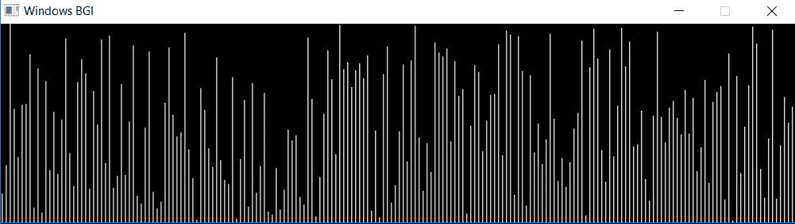
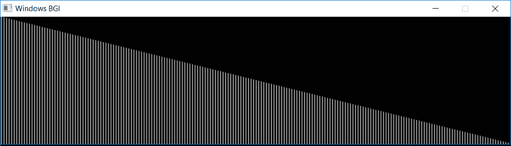

# 排序算法可视化:冒泡排序

> 原文:[https://www . geesforgeks . org/sorting-algorithms-visualization-bubble-sort/](https://www.geeksforgeeks.org/sorting-algorithms-visualization-bubble-sort/)

尽管需要很长的代码来理解算法，但人脑可以轻松处理视觉信息。在本文中， **[冒泡排序](https://www.geeksforgeeks.org/bubble-sort/)可视化**已经使用 **[graphics.h](https://www.geeksforgeeks.org/add-graphics-h-c-library-gcc-compiler-linux/) 库**实现。众所周知，冒泡排序会交换相邻的元素，如果它们没有排序的话，最后较大的元素会在每次传递中被移向数组的末尾。有时，手动分析数据变得很困难，但是在图形绘制之后，就更容易理解了，如下图所示。

[](https://www.geeksforgeeks.org/bubble-sort/)

**进场:**

*   如果数组的大小很大，即使用数字来比较两种类型的数据集也很困难。
*   **随机分布数字**和**反向排序数字**的图形表示如下。
*   白线用于表示数字的长度(9 由垂直向上的 9 个像素表示)，而它的位置表示它在数组中的索引。
*   图形排序可以简单地通过交换行来显示。
*   当我们在冒泡排序中交换数字时，可以使用不同的颜色线来查看数组中的当前索引(这里是绿色)。
*   这里 **[延迟()](https://www.geeksforgeeks.org/time-delay-c/)** 可以增加来查看图中的过渡。

**示例:**

```

[](https://media.geeksforgeeks.org/wp-content/uploads/20190528203655/Screenshot-3441.png)

无规则排列

[](https://media.geeksforgeeks.org/wp-content/uploads/20190528204525/Screenshot-3461.png)

反向排序数组

```

**使用的预定义功能:**

*   **setcurrentwindow():** 用于设置当前窗口大小的函数。
*   **setcolor(n):** 通过改变 n 的值来改变光标颜色的函数。
*   **延迟(n):** 用于将程序延迟 n 毫秒的功能。它被用来降低转换速度
*   **直线(x1，y1，x2，y2):** 用于绘制从点(x1，y1)到点(x2，y2)的直线的函数。(0，0)是屏幕的左上角，右下角是(n1，n2 ),其中 n1，n2 是当前窗口的宽度和高度。使用 **setcolor()** 还有其他图形可以应用到该行。

下面是可视化[气泡排序算法](https://www.geeksforgeeks.org/bubble-sort/)的程序:

**Implementation**

```
// C++ program for visualization of bubble sort

#include "graphics.h"
#include <bits/stdc++.h>

using namespace std;

// Initialize the size
// with the total numbers to sorted
// and the gap to be maintained in graph
vector<int> numbers;
int size = 200;
int gap = 4;

// Function for swapping the lines graphically
void swap(int i, int j, int x, int y)
{
    // Swapping the first line with the correct line
    // by making it black again and then draw the pixel
    // for white color.

    setcolor(GREEN);
    line(i, size, i, size - x);
    setcolor(BLACK);
    line(i, size, i, size - x); 
    setcolor(WHITE);
    line(i, size, i, size - y); 

    // Swapping the first line with the correct line
    // by making it black again and then draw the pixel
    // for white color.
    setcolor(GREEN);
    line(j, size, j, size - y);
    setcolor(BLACK);
    line(j, size, j, size - y);
    setcolor(WHITE);
    line(j, size, j, size - x);
}

// Bubble sort function
void bubbleSort()
{
    int temp, i, j;

    for (i = 1; i < size; i++) {
        for (j = 0; j < size - i; j++) {
            if (numbers[j] > numbers[j + 1]) {
                temp = numbers[j];
                numbers[j] = numbers[j + 1];
                numbers[j + 1] = temp;

                // As we swapped the last two numbers
                // just swap the lines with the values.
                // This is function call
                // for swapping the lines
                swap(gap * j + 1,
                     gap * (j + 1) + 1,
                     numbers[j + 1],
                     numbers[j]);
            }
        }
    }
}

// Driver program
int main()
{

    // auto detection of screen size
    int gd = DETECT, gm;
    int wid1;

    // Graph initialization
    initgraph(&gd, &gm, NULL);

    // setting up window size (gap*size) * (size)
    wid1 = initwindow(gap * size + 1, size + 1);
    setcurrentwindow(wid1);

    // Initializing the array
    for (int i = 1; i <= size; i++)
        numbers.push_back(i);

    // Find a seed and shuffle the array
    // to make it random.
    // Here  different type of array
    // can be taken to results
    // such as nearly sorted, already sorted,
    // reverse sorted to visualize the result
    unsigned seed
        = chrono::system_clock::now()
              .time_since_epoch()
              .count();

    shuffle(numbers.begin(),
            numbers.end(),
            default_random_engine(seed));

    // Initial plot of numbers in graph taking
    // the vector position as x-axis and its
    // corresponding value will be the height of line.
    for (int i = 1; i <= gap * size; i += gap) {
        line(i, size, i, (size - numbers[i / gap]));
    }

    // Delay the code
    delay(200);

    // Call sort
    bubbleSort();

    for (int i = 0; i < size; i++) {
        cout << numbers[i] << " ";
    }
    cout << endl;

    // Wait for sometime .
    delay(5000);

    // Close the graph
    closegraph();

    return 0;
}
```

**Output:**

```
1 2 3 4 5 6 7 8 9 10 11 12 13 14 15 16 17 18 19 20 21 22 23 24 25 26 27 28 29 30 31 32 
33 34 35 36 37 38 39 40 41 42 43 44 45 46 47 48 49 50 51 52 53 54 55 56 57 58 59 60 61 
62 63 64 65 66 67 68 69 70 71 72 73 74 75 76 77 78 79 80 81 82 83 84 85 86 87 88 89 90 
91 92 93 94 95 96 97 98 99 100 101 102 103 104 105 106 107 108 109 110 111 112 113 114 
115 116 117 118 119 120 121 122 123 124 125 126 127 128 129 130 131 132 133 134 135 136 
137 138 139 140 141 142 143 144 145 146 147 148 149 150 151 152 153 154 155 156 157 158 
159 160 161 162 163 164 165 166 167 168 169 170 171 172 173 174 175 176 177 178 179 180 
181 182 183 184 185 186 187 188 189 190 191 192 193 194 195 196 197 198 199 200

<video class="wp-video-shortcode" id="video-309111-1" width="640" height="192" preload="metadata" controls=""><source type="video/mp4" src="https://media.geeksforgeeks.org/wp-content/uploads/20190528234141/WhatsApp-Video-2019-05-28-at-11.40.34-PM.mp4?_=1">[https://media.geeksforgeeks.org/wp-content/uploads/20190528234141/WhatsApp-Video-2019-05-28-at-11.40.34-PM.mp4](https://media.geeksforgeeks.org/wp-content/uploads/20190528234141/WhatsApp-Video-2019-05-28-at-11.40.34-PM.mp4)</video>

```