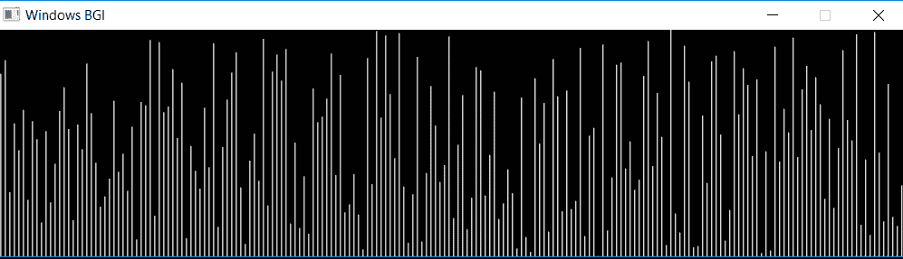
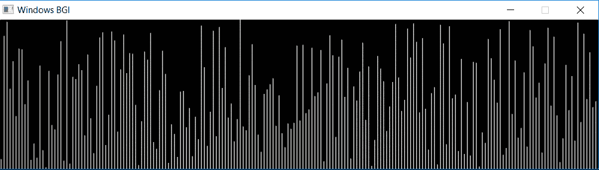

# 排序算法可视化|选择排序

> 原文:[https://www . geesforgeks . org/sorting-算法-可视化-选择-排序/](https://www.geeksforgeeks.org/sorting-algorithms-visualization-selection-sort/)

**先决条件:[选择类别](https://www.geeksforgeeks.org/selection-sort/)**

尽管需要很长的代码来理解算法，但人脑可以轻松处理视觉信息。在本文中， **[选择排序](https://www.geeksforgeeks.org/selection-sort/)** 可视化已经使用 **[graphics.h](https://www.geeksforgeeks.org/add-graphics-h-c-library-gcc-compiler-linux/) 库**实现。众所周知，选择排序首先从未排序的数组中找到最小元素，并在每次传递中将其与未排序数组的第一个元素交换。在两种算法之间手动分析数据变得很困难，反之亦然，但是用图形绘制更容易理解。

**进场:**

*   白线用于表示数字的长度(9 由垂直向上的 9 个像素表示)，而它的位置表示它在数组中的索引。
*   **随机分布的数字**的图形表示如下。
*   图形排序可以通过首先将未排序数组中的最小元素着色为**绿色**来显示。
*   现在用未排序数组的第一个元素交换它，也用这两个数字交换颜色，如 **swap_colors()函数**代码所示。
*   这里 **[延迟()](https://www.geeksforgeeks.org/time-delay-c/)** 可以增加来查看图中的过渡。

**例:**
[](https://media.geeksforgeeks.org/wp-content/uploads/20190707173538/Screenshot-5071.png)

**使用的预定义功能:**

*   **setcurrentwindow():** 用于设置当前窗口大小的函数。
*   **setcolor(n):** 通过改变 n 的值来改变光标颜色的函数。
*   **延迟(n):** 用于将程序延迟 n 毫秒的功能。它被用来降低转换速度
*   **直线(x1，y1，x2，y2):** 用于绘制从点(x1，y1)到点(x2，y2)的直线的函数。(0，0)是屏幕的左上角，右下角是(n1，n2 ),其中 n1，n2 是当前窗口的宽度和高度。使用 **setcolor()** 还有其他图形可以应用到该行。

下面是可视化 **[选择排序算法](https://www.geeksforgeeks.org/selection-sort/)** 的程序:

```
// C++ program for visualization
// of bubble sort

#include "graphics.h"
#include <bits/stdc++.h>

using namespace std;

// Initialize the size
// with the total numbers to sorted
// and the gap to be maintained in graph
vector<int> numbers;
int size = 200;
int gap = 4;

// Function for swapping the lines graphically
void swap_colors(int i, int j, int x, int y)
{

    // y is the minimum element,
    // first make this number green
    // Now, swapping it by making black again
    // and then draw the pixels
    // for white colour with x value.
    setcolor(GREEN);
    line(j, size, j, size - y);

    delay(500);

    setcolor(BLACK);
    line(j, size, j, size - y);

    setcolor(WHITE);
    line(j, size, j, size - x);

    // X is the element to be swapped,
    // first make this number black
    // Now, highlight y with green
    // representing the minimum element
    // and then draw the pixels
    // for white colour with y value.
    setcolor(BLACK);
    line(i, size, i, size - x);

    setcolor(GREEN);
    line(i, size, i, size - y);

    delay(500);

    setcolor(WHITE);
    line(i, size, i, size - y);
}

// Function for swapping two numbers
void swap(int* xp, int* yp)
{
    int temp = *xp;
    *xp = *yp;
    *yp = temp;
}

// Selection sort function
void selsort()
{
    for (int i = 0; i < size - 1; i++) {

        // Find the minimum element
        // in unsorted array
        int min_idx = i;

        for (int j = i + 1; j < size; j++) {
            if (numbers[j] < numbers[min_idx]) {
                min_idx = j;
            }
        }

        // Swap the found minimum element
        // with the first element
        // delay(500);
        swap(&numbers[min_idx],
             &numbers[i]);

        // Function to show transition in swapping
        swap_colors(gap * i + 1,
                    gap * (min_idx) + 1,
                    numbers[min_idx],
                    numbers[i]);
    }
}

// Driver program
int main()
{

    // auto detection of screen size
    int gd = DETECT, gm;
    int wid1;

    // Graph initialization
    initgraph(&gd, &gm, NULL);

    // setting up window size (gap*size) * (size)
    wid1 = initwindow(gap * size + 1, size + 1);
    setcurrentwindow(wid1);

    // Initializing the array
    for (int i = 1; i <= size; i++)
        numbers.push_back(i);

    // Find a seed and shuffle the array
    // to make it random.
    // Here  different type of array
    // can be taken to results
    // such as nearly sorted, already sorted,
    // reverse sorted to visualize the result
    unsigned seed
        = chrono::system_clock::now()
              .time_since_epoch()
              .count();

    shuffle(numbers.begin(),
            numbers.end(),
            default_random_engine(seed));

    // Initial plot of numbers in graph taking
    // the vector position as x-axis and its
    // corresponding value will be the height of line.
    for (int i = 1; i <= gap * size; i += gap) {
        line(i, size, i, (size - numbers[i / gap]));
    }

    // Delay the code
    delay(200);

    // Call sort
    selSort();

    for (int i = 0; i < size; i++) {
        cout << numbers[i] << " ";
    }
    cout << endl;

    // Wait for sometime .
    delay(5000);

    // Close the graph
    closegraph();

    return 0;
}
```

**Output:**

> 1 2 3 4 5 6 7 8 9 10 11 12 13 14 15 16 17 18 19 20 21 22 23 24 25 26 27 28 29 30
> 31 32 33 34 35 36 37 38 39 40 41 42 43 44 45 46 47 48 49 50 51 52 53 54 55 56 57
> 58 59 60 61 62 63 64 64 80 81 82 83 84
> 85 86 87 88 89 90 91 92 93 94 95 96 97 98 99 100 101 102 103 104 105 106 107 108
> 109 110 111 112 113 114 115 116 117 118 119 120 121 122 123 124 125 1225 157 158 159 160 161 162 163 164 165 166 167 168
> 169 170 171 172 173 174 175 176 177 178 179 180 181 182 183 184 185 186 187 188
> 189 190 191 192 193 194 195 196

**可视化:**

*   **输入可视化:**
    [](https://media.geeksforgeeks.org/wp-content/uploads/20190707173538/Screenshot-5071.png) 

    未排序数组

*   **Output visualization:**
    [](https://media.geeksforgeeks.org/wp-content/uploads/20190727021429/Webp.net-gifmaker-21.gif) 

    Sort the array by selecting sort