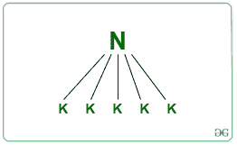
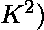
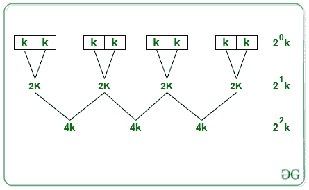

# 通过组合插入排序和合并排序算法进行排序

> 原文:[https://www . geesforgeks . org/排序-合并-插入-排序-合并-排序-算法/](https://www.geeksforgeeks.org/sorting-by-combining-insertion-sort-and-merge-sort-algorithms/)

[插入排序](https://www.geeksforgeeks.org/insertion-sort/) : 数组实际上被拆分成一个已排序的部分和一个未排序的部分。未排序部分的值被拾取并放置在排序部分的正确位置。
**优势:**以下是插入排序的优势:

*   如果要排序的列表很小，插入排序会运行得更快
*   当元素已经排序时，插入排序需要花费 O(N)个时间
*   它是一个就地算法 O(1)，不需要辅助空间

[合并排序](https://www.geeksforgeeks.org/merge-sort/) : 合并排序是一个 [分治](https://www.geeksforgeeks.org/divide-and-conquer-introduction/) 算法。它将输入数组分成两半，调用它自己的两半，然后合并这两个已排序的一半。

**优势:**合并排序的优势如下:

*   将主问题划分为子问题没有主要成本

从以上两种比较来看，两种排序算法的优点可以结合起来，得到的算法将具有时间复杂度 O(N[K+log(N/K)])。下面是这个组合算法时间复杂度的推导:
Let，列表中元素个数= N
**除**:

*   我们首先把这 N 个元素分成大小为 K 的(N/K)组

**排序**:

*   对于大小为 K 的子阵列的每个划分，执行插入排序操作来对该子阵列进行排序
*   单块 K 元素插入排序的总成本:
    *   最佳情况:好的
    *   最坏情况:O( 
*   因为有(N/K)个这样的块，每个块的大小为 K，所以我们得到应用插入排序的总成本如下:
    *   最佳情况下:(N/K)* K = O(N)
    *   最差情况下:(n/k)* k^{2} = o(NK)

**合并**:

*   在对(N/K)组的 K 个排序元素中的每一个应用插入排序之后
*   要合并这些(不适用)组:

*   假设我们对合并排序进行 I 次迭代。所以，为了让循环停止，我们需要把它等同于:
*   (2^i) * K = N
*   (2^i) = N/K
*   i*log(2) = log(N/K)取两边的原木
*   i =对数(不适用)
*   合并成本= O(N)
*   合并总成本=迭代次数*迭代成本
    *   =对数(N/K)*N
    *   = N*log(N/K)
    *   = O(N * Log(N/K))< –( 3)

算法(插入+合并)的总成本为:

*   最佳情况:N+Nlog(N/K)
*   最差情况:从(2)和(3)开始，NK+Nlog(N/K)

如果 K = 1，则是时间复杂度更好的完全合并排序
如果 K = N，则是空间复杂度更好的完全插入排序