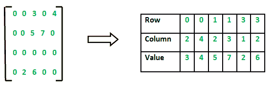
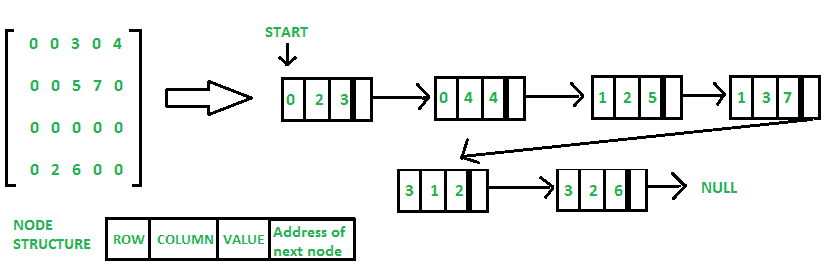

# 稀疏矩阵及其表示|集合 1(使用数组和链表)

> 原文:[https://www.geeksforgeeks.org/sparse-matrix-representation/](https://www.geeksforgeeks.org/sparse-matrix-representation/)

一个[矩阵](https://www.geeksforgeeks.org/data-structures/#Matrix)是一个由 m 行 n 列组成的二维数据对象，因此总共有 m×n 个值。如果矩阵的大部分元素都有 **0 值**，则称之为稀疏矩阵。

**为什么用稀疏矩阵代替简单矩阵？**

*   **存储:**非零元素比零少，因此可以使用更少的内存来仅存储这些元素。
*   **计算时间:**通过逻辑设计只遍历非零元素的数据结构，可以节省计算时间..

示例:

```
0 0 3 0 4            
0 0 5 7 0
0 0 0 0 0
0 2 6 0 0
```

用 2D 阵列表示稀疏矩阵会导致大量内存的浪费，因为矩阵中的零在大多数情况下都没有用。所以，我们不是用非零元素存储零，而是只存储非零元素。这意味着用**三元组(行、列、值)存储非零元素。**

稀疏矩阵表示可以通过多种方式完成，以下是两种常见的表示:

1.  数组表示
2.  链表表示

**方法 1:使用数组:**
2D 数组用于表示稀疏矩阵，其中有三行，命名为

*   **行:**非零元素所在行的索引
*   **列:**非零元素所在列的索引
*   **值:**位于索引–(行，列)的非零元素的值



## C++

```
// C++ program for Sparse Matrix Representation
// using Array
#include <iostream>
using namespace std;

int main()
{
    // Assume 4x5 sparse matrix
    int sparseMatrix[4][5] =
    {
        {0 , 0 , 3 , 0 , 4 },
        {0 , 0 , 5 , 7 , 0 },
        {0 , 0 , 0 , 0 , 0 },
        {0 , 2 , 6 , 0 , 0 }
    };

    int size = 0;
    for (int i = 0; i < 4; i++)
        for (int j = 0; j < 5; j++)
            if (sparseMatrix[i][j] != 0)
                size++;

    // number of columns in compactMatrix (size) must be
    // equal to number of non - zero elements in
    // sparseMatrix
    int compactMatrix[3][size];

    // Making of new matrix
    int k = 0;
    for (int i = 0; i < 4; i++)
        for (int j = 0; j < 5; j++)
            if (sparseMatrix[i][j] != 0)
            {
                compactMatrix[0][k] = i;
                compactMatrix[1][k] = j;
                compactMatrix[2][k] = sparseMatrix[i][j];
                k++;
            }

    for (int i=0; i<3; i++)
    {
        for (int j=0; j<size; j++)
            cout <<" "<< compactMatrix[i][j];

        cout <<"\n";
    }
    return 0;
}

// this code is contributed by shivanisinghss2110
```

## C

```
// C++ program for Sparse Matrix Representation
// using Array
#include<stdio.h>

int main()
{
    // Assume 4x5 sparse matrix
    int sparseMatrix[4][5] =
    {
        {0 , 0 , 3 , 0 , 4 },
        {0 , 0 , 5 , 7 , 0 },
        {0 , 0 , 0 , 0 , 0 },
        {0 , 2 , 6 , 0 , 0 }
    };

    int size = 0;
    for (int i = 0; i < 4; i++)
        for (int j = 0; j < 5; j++)
            if (sparseMatrix[i][j] != 0)
                size++;

    // number of columns in compactMatrix (size) must be
    // equal to number of non - zero elements in
    // sparseMatrix
    int compactMatrix[3][size];

    // Making of new matrix
    int k = 0;
    for (int i = 0; i < 4; i++)
        for (int j = 0; j < 5; j++)
            if (sparseMatrix[i][j] != 0)
            {
                compactMatrix[0][k] = i;
                compactMatrix[1][k] = j;
                compactMatrix[2][k] = sparseMatrix[i][j];
                k++;
            }

    for (int i=0; i<3; i++)
    {
        for (int j=0; j<size; j++)
            printf("%d ", compactMatrix[i][j]);

        printf("\n");
    }
    return 0;
}
```

## Java 语言(一种计算机语言，尤用于创建网站)

```
// Java program for Sparse Matrix Representation
// using Array
class GFG
{

    public static void main(String[] args)
    {
        int sparseMatrix[][]
                = {
                    {0, 0, 3, 0, 4},
                    {0, 0, 5, 7, 0},
                    {0, 0, 0, 0, 0},
                    {0, 2, 6, 0, 0}
                };

        int size = 0;
        for (int i = 0; i < 4; i++)
        {
            for (int j = 0; j < 5; j++)
            {
                if (sparseMatrix[i][j] != 0)
                {
                    size++;
                }
            }
        }

        // number of columns in compactMatrix (size) must be
        // equal to number of non - zero elements in
        // sparseMatrix
        int compactMatrix[][] = new int[3][size];

        // Making of new matrix
        int k = 0;
        for (int i = 0; i < 4; i++)
        {
            for (int j = 0; j < 5; j++)
            {
                if (sparseMatrix[i][j] != 0)
                {
                    compactMatrix[0][k] = i;
                    compactMatrix[1][k] = j;
                    compactMatrix[2][k] = sparseMatrix[i][j];
                    k++;
                }
            }
        }

        for (int i = 0; i < 3; i++)
        {
            for (int j = 0; j < size; j++)
            {
                System.out.printf("%d ", compactMatrix[i][j]);
            }
            System.out.printf("\n");
        }
    }
}

/* This code contributed by PrinciRaj1992 */
```

## 蟒蛇 3

```
# Python program for Sparse Matrix Representation
# using arrays

# assume a sparse matrix of order 4*5
# let assume another matrix compactMatrix
# now store the value,row,column of arr1 in sparse matrix compactMatrix

sparseMatrix = [[0,0,3,0,4],[0,0,5,7,0],[0,0,0,0,0],[0,2,6,0,0]]

# initialize size as 0
size = 0

for i in range(4):
    for j in range(5):
        if (sparseMatrix[i][j] != 0):
            size += 1

# number of columns in compactMatrix(size) should
# be equal to number of non-zero elements in sparseMatrix
rows, cols = (3, size)
compactMatrix = [[0 for i in range(cols)] for j in range(rows)]

k = 0
for i in range(4):
    for j in range(5):
        if (sparseMatrix[i][j] != 0):
            compactMatrix[0][k] = i
            compactMatrix[1][k] = j
            compactMatrix[2][k] = sparseMatrix[i][j]
            k += 1

for i in compactMatrix:
    print(i)

# This code is contributed by MRINALWALIA
```

**输出:**

```
0 0 1 1 3 3 
2 4 2 3 1 2 
3 4 5 7 2 6 
```

**方法二:使用链表**
在链表中，每个节点有四个字段。这四个字段定义为:

*   **行:**非零元素所在行的索引
*   **列:**非零元素所在列的索引
*   **值:**位于索引–(行，列)的非零元素的值
*   **下一个节点:**下一个节点的地址



## C++

```
// C++ program for sparse matrix representation.
// Using Link list
#include<iostream>
using namespace std;

// Node class to represent link list
class Node
{
    public:
    int row;
    int col;
    int data;
    Node *next;
};

// Function to create new node
void create_new_node(Node **p, int row_index,
                     int col_index, int x)
{
    Node *temp = *p;
    Node *r;

    // If link list is empty then
    // create first node and assign value.
    if (temp == NULL)
    {
        temp = new Node();
        temp->row = row_index;
        temp->col = col_index;
        temp->data = x;
        temp->next = NULL;
        *p = temp;
    }

    // If link list is already created
    // then append newly created node
    else
    {
        while (temp->next != NULL)  
            temp = temp->next;

        r = new Node();
        r->row = row_index;
        r->col = col_index;
        r->data = x;
        r->next = NULL;
        temp->next = r;
    }
}

// Function prints contents of linked list
// starting from start
void printList(Node *start)
{
    Node *ptr = start;
    cout << "row_position:";
    while (ptr != NULL)
    {
        cout << ptr->row << " ";
        ptr = ptr->next;
    }
    cout << endl;
    cout << "column_position:";

    ptr = start;
    while (ptr != NULL)
    {
        cout << ptr->col << " ";
        ptr = ptr->next;
    }
    cout << endl;
    cout << "Value:";
    ptr = start;

    while (ptr != NULL)
    {
        cout << ptr->data << " ";
        ptr = ptr->next;
    }
}

// Driver Code
int main()
{

    // 4x5 sparse matrix
    int sparseMatrix[4][5] = { { 0 , 0 , 3 , 0 , 4 },
                               { 0 , 0 , 5 , 7 , 0 },
                               { 0 , 0 , 0 , 0 , 0 },
                               { 0 , 2 , 6 , 0 , 0 } };

    // Creating head/first node of list as NULL
    Node *first = NULL;
    for(int i = 0; i < 4; i++)
    {
        for(int j = 0; j < 5; j++)
        {

            // Pass only those values which
            // are non - zero
            if (sparseMatrix[i][j] != 0)
                create_new_node(&first, i, j,
                                sparseMatrix[i][j]);
        }
    }
    printList(first);

    return 0;
}

// This code is contributed by ronaksuba
```

## C

```
// C program for Sparse Matrix Representation
// using Linked Lists
#include<stdio.h>
#include<stdlib.h>

// Node to represent sparse matrix
struct Node
{
    int value;
    int row_position;
    int column_postion;
    struct Node *next;
};

// Function to create new node
void create_new_node(struct Node** start, int non_zero_element,
                     int row_index, int column_index )
{
    struct Node *temp, *r;
    temp = *start;
    if (temp == NULL)
    {
        // Create new node dynamically
        temp = (struct Node *) malloc (sizeof(struct Node));
        temp->value = non_zero_element;
        temp->row_position = row_index;
        temp->column_postion = column_index;
        temp->next = NULL;
        *start = temp;

    }
    else
    {
        while (temp->next != NULL)
            temp = temp->next;

        // Create new node dynamically
        r = (struct Node *) malloc (sizeof(struct Node));
        r->value = non_zero_element;
        r->row_position = row_index;
        r->column_postion = column_index;
        r->next = NULL;
        temp->next = r;

    }
}

// This function prints contents of linked list
// starting from start
void PrintList(struct Node* start)
{
    struct Node *temp, *r, *s;
    temp = r = s = start;

    printf("row_position: ");
    while(temp != NULL)
    {

        printf("%d ", temp->row_position);
        temp = temp->next;
    }
    printf("\n");

    printf("column_postion: ");
    while(r != NULL)
    {
        printf("%d ", r->column_postion);
        r = r->next;
    }
    printf("\n");
    printf("Value: ");
    while(s != NULL)
    {
        printf("%d ", s->value);
        s = s->next;
    }
    printf("\n");
}

// Driver of the program
int main()
{
   // Assume 4x5 sparse matrix
    int sparseMatric[4][5] =
    {
        {0 , 0 , 3 , 0 , 4 },
        {0 , 0 , 5 , 7 , 0 },
        {0 , 0 , 0 , 0 , 0 },
        {0 , 2 , 6 , 0 , 0 }
    };

    /* Start with the empty list */
    struct Node* start = NULL;

    for (int i = 0; i < 4; i++)
        for (int j = 0; j < 5; j++)

            // Pass only those values which are non - zero
            if (sparseMatric[i][j] != 0)
                create_new_node(&start, sparseMatric[i][j], i, j);

    PrintList(start);

    return 0;
}
```

## 蟒蛇 3

```
# Python Program for Representation of
# Sparse Matrix into Linked List

# Node Class to represent Linked List Node
class Node:

    # Making the slots for storing row,
    # column, value, and address
    __slots__ = "row", "col", "data", "next"

    # Constructor to initialize the values
    def __init__(self, row=0, col=0, data=0, next=None):

        self.row = row
        self.col = col
        self.data = data
        self.next = next

# Class to convert Sparse Matrix
# into Linked List
class Sparse:

    # Initialize Class Variables
    def __init__(self):
        self.head = None
        self.temp = None
        self.size = 0

    # Function which returns the size
    # of the Linked List
    def __len__(self):
        return self.size

    # Check the Linked List is
    # Empty or not
    def isempty(self):
        return self.size == 0

    # Responsible function to create
    # Linked List from Sparse Matrix
    def create_new_node(self, row, col, data):

        # Creating New Node
        newNode = Node(row, col, data, None)

        # Check whether the List is
        # empty or not
        if self.isempty():
            self.head = newNode
        else:
            self.temp.next = newNode
        self.temp = newNode

        # Incrementing the size
        self.size += 1

    # Function display the contents of
    # Linked List
    def PrintList(self):
        temp = r = s = self.head
        print("row_position:", end=" ")
        while temp != None:
            print(temp.row, end=" ")
            temp = temp.next
        print()
        print("column_postion:", end=" ")
        while r != None:
            print(r.col, end=" ")
            r = r.next
        print()
        print("Value:", end=" ")
        while s != None:
            print(s.data, end=" ")
            s = s.next
        print()

# Driver Code
if __name__ == "__main__":

    # Creating Object
    s = Sparse()

    # Assuming 4x5 Sparse Matrix
    sparseMatric = [[0, 0, 3, 0, 4],
                    [0, 0, 5, 7, 0],
                    [0, 0, 0, 0, 0],
                    [0, 2, 6, 0, 0]]
    for i in range(4):
        for j in range(5):

            # Creating Linked List by only those
            # elements which are non-zero
            if sparseMatric[i][j] != 0:
                s.create_new_node(i, j, sparseMatric[i][j])

    # Printing the Linked List Representation
    # of the sparse matrix
    s.PrintList()

    # This code is contributed by Naveen Rathore
```

**输出:**

```
row_position: 0 0 1 1 3 3 
column_postion: 2 4 2 3 1 2 
Value: 3 4 5 7 2 6              
```

**其他表示法:**
作为**字典**其中行号和列号用作关键字，值是矩阵条目。这种方法节省了空间，但是项目的顺序访问是昂贵的。

作为列表的**列表。想法是制作一个行列表，列表中的每一项都包含值。我们可以保持列表项按列号排序。
[稀疏矩阵及其表示|集合 2(使用列表列表和关键字字典)](https://www.geeksforgeeks.org/sparse-matrix-representations-using-list-lists-dictionary-keys/)**

本文由**阿卡什·古普塔**供稿。如果你喜欢 GeeksforGeeks 并想投稿，你也可以使用[write.geeksforgeeks.org](https://write.geeksforgeeks.org)写一篇文章或者把你的文章邮寄到 review-team@geeksforgeeks.org。看到你的文章出现在极客博客主页上，帮助其他极客。
如果你发现任何不正确的地方，或者你想分享更多关于上面讨论的话题的信息，请写评论。