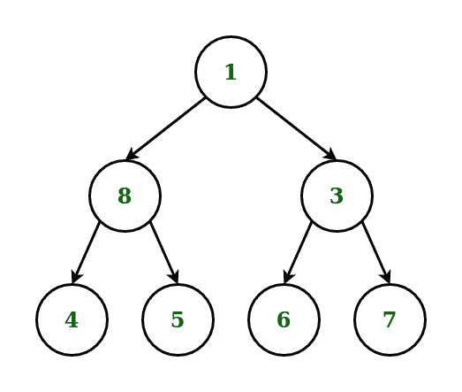

# 二叉树的具体级次遍历

> 原文:[https://www . geeksforgeeks . org/特定级别-顺序-遍历二叉树/](https://www.geeksforgeeks.org/specific-level-order-traversal-of-binary-tree/)

给定一个[二叉树](https://www.geeksforgeeks.org/binary-tree-data-structure/)，任务是执行树的[特定级别顺序遍历](https://www.geeksforgeeks.org/perfect-binary-tree-specific-level-order-traversal/)，使得在每个级别打印第一个元素，然后是最后一个元素，然后是第二个元素和第二个最后一个元素，直到该级别的所有元素都被打印，以此类推。

**示例:**

> **输入:**下面是给定的树:
> 
> 
> 
> **输出:** 1 8 3 4 7 5 6
> **说明:**
> 1 级:1(根)
> 2 级:8(左)、3(右)
> 3 级:4(左)、7(右)、5(左)、6(右)
> 
> **输入:**下面是给定的树:
> 
> 
> 
> **输出:** 20 8 22 4 12 10 14
> **说明:**
> 第 1 关:20(根)
> 第 2 关:8(左)、22(右)
> 第 3 关:4(左)、12(右)
> 第 4 关:10(左)、14(右)

**方法:**想法是对给定的二叉树进行[级顺序遍历，并将该树转换为](https://www.geeksforgeeks.org/level-order-tree-traversal/)[完美二叉树](https://www.geeksforgeeks.org/check-weather-given-binary-tree-perfect-not/)。遍历时，如果任何节点的**子节点**不存在，则在[队列](https://www.geeksforgeeks.org/queue-data-structure/)中追加**空**节点作为子节点。以下是步骤:

1.  执行给定树的级别顺序遍历。
2.  在遍历过程中，如果任何节点的**子节点**不存在，则在[队列](https://www.geeksforgeeks.org/queue-data-structure/)中追加**空**节点作为子节点
3.  在每个级别的遍历过程中，请执行以下操作:
    *   维护两个队列来存储每个级别的两个半部分的节点。
    *   对于前半个级别，以从左到右的方式存储节点。
    *   对于后半层，以从右到左的方式存储节点。
    *   迭代以上两个队列，并以交替的方式进行打印，以实现特定级别的顺序遍历。

下面是上述方法的实现:

## Java 语言(一种计算机语言，尤用于创建网站)

```
// Java program for the above approach
import java.util.*;

class GFG{

// Node structure
static class node
{
    int data;
    node left = null;
    node right = null;
}

// Creates and initialize a new node
static node newNode(int ch)
{

    // Allocating memory to a new node
    node n = new node();
    n.data = ch;
    n.left = null;
    n.right = null;
    return n;
}

// Function to find the height of tree   
static int Height(node root)
{
    if (root == null)
        return 0;

    return 1 + Math.max(Height(root.left),
                        Height(root.right));
}

// Given a perfect binary tree
// print its node in Specific order
static void printSpecificLevelOrder(Queue<node> A,
                                    Queue<node> B,
                                    int height)
{
    while (height != 0)
    {

        // Get each one front
        // element of both queue
        node  X = A.poll();
        node  Y = B.poll();

        // Check if X exist or not 
        if (X == null)
        {

            // Assume is has and put
            // their both child as none
            A.add(null);
            A.add(null);
        }
        else
        {

            // print the data and store
            // their child first left
            // then right
            System.out.print(X.data + " ");
            A.add(X.left);
            A.add(X.right);
        }

        // Check Y exist or not   
        if (Y == null)
        {   

            // Assume is has and put
            // their both child as none
            B.add(null);
            B.add(null);
        }
        else
        {

            // Print the data and store their
            // child first left then right
            System.out.print(Y.data + " ");
            B.add(Y.right);
            B.add(Y.left);
        }

        // Decrease by 1 unit   
        height -= 1;     
    }
}

// Driver Code    
public static void main (String[] args)
{

    // Given tree
    node root = newNode(1);
    root.left = newNode(2);
    root.right = newNode(3);

    root.left.left = newNode(4);
     root.left.right = newNode(5);
     root.right.right = newNode(7);

    root.left.left.left = newNode(8);
    root.left.left.right = newNode(9);
    root.left.right.left = newNode(10);
    root.left.right.right = newNode(11);
    root.right.right.left = newNode(14);
    root.right.right.right = newNode(15);

    root.left.left.left.left = newNode(16);
    root.left.left.left.right = newNode(17);
    root.left.left.right.left = newNode(18);
    root.left.left.right.right = newNode(19);
    root.left.right.left.left = newNode(20);
    root.left.right.left.right = newNode(21);
    root.left.right.right.left = newNode(22);
    root.left.right.right.right = newNode(23);
    root.right.right.left.left = newNode(28);
    root.right.right.left.right = newNode(29);
    root.right.right.right.left = newNode(30);
    root.right.right.right.right = newNode(31);

    // Initialise Queue
    Queue<node> A = new LinkedList<>();
    Queue<node> B = new LinkedList<>();

    int height = 0;

    // Check top root manually
    if (root != null)
    {
        System.out.print(root.data + " ");

        A.add(root.left);
        B.add(root.right);

        height = Height(root);
        height = (int)Math.pow(2, (height - 1)) - 1;
    }

    // Function Call
    printSpecificLevelOrder(A, B, height);
}
}

// This code is contributed by offbeat
```

## 蟒蛇 3

```
# Python3 program for the above approach
from queue import Queue

# A binary tree node
class Node:

    # A constructor for making
    # a new node
    def __init__(self, key):
        self.data = key
        self.left = None
        self.right = None

# Function to find the height of tree   
def Height(root):
    if root == None:
        return 0
    return 1 + max(Height(root.left), Height(root.right))

# Given a perfect binary tree
# print its node in Specific order
def printSpecificLevelOrder(A, B, height):

    while height != 0:

        # Get each one front
        # element of both queue
        X = A.get()
        Y = B.get()

        # Check if X exist or not 
        if X == None:
            # Assume is has and put
            # their both child as none
            A.put(None)
            A.put(None)
        else:       
            # print the data and store
            # their child first left
            # then right
            print(X.data, end =" ")
            A.put(X.left)
            A.put(X.right)

        # Check Y exist or not   
        if Y == None:      
            # Assume is has and put
            # their both child as none
            B.put(None)
            B.put(None)   
        else:
            # print the data and store their
            # child first left then right
            print(Y.data, end =" ")
            B.put(Y.right)
            B.put(Y.left)
        # Decrease by 1 unit   
        height-= 1

# Driver Code

# Given Tree
root = Node(1)

root.left = Node(2)
root.right = Node(3)

root.left.left = Node(4)
root.left.right = Node(5)
root.right.right = Node(7)

root.left.left.left = Node(8)
root.left.left.right = Node(9)
root.left.right.left = Node(10)
root.left.right.right = Node(11)
root.right.right.left = Node(14)
root.right.right.right = Node(15)

root.left.left.left.left = Node(16)
root.left.left.left.right = Node(17)
root.left.left.right.left = Node(18)
root.left.left.right.right = Node(19)
root.left.right.left.left = Node(20)
root.left.right.left.right = Node(21)
root.left.right.right.left = Node(22)
root.left.right.right.right = Node(23)
root.right.right.left.left = Node(28)
root.right.right.left.right = Node(29)
root.right.right.right.left = Node(30)
root.right.right.right.right = Node(31)

# Initialise Queue
A = Queue(100)
B = Queue(100)

# Check top root manually
if root != None: 
    print(root.data, end =" ")

    A.put(root.left)
    B.put(root.right)

    height = Height(root)
    height = 2**(height-1)-1

# Function Call
    printSpecificLevelOrder(A, B, height)
```

## C#

```
// C# program for the above approach
using System;
using System.Collections.Generic;

class GFG{

// Node structure
class node
{
    public int data;
    public node left = null;
    public node right = null;
}

// Creates and initialize a new node
static node newNode(int ch)
{

    // Allocating memory to a new node
    node n = new node();
    n.data = ch;
    n.left = null;
    n.right = null;
    return n;
}

// Function to find the height of tree   
static int Height(node root)
{
    if (root == null)
        return 0;

    return 1 + Math.Max(Height(root.left),
                        Height(root.right));
}

// Given a perfect binary tree
// print its node in Specific order
static void printSpecificLevelOrder(Queue<node> A,
                                    Queue<node> B,
                                    int height)
{
    while (height != 0)
    {

        // Get each one front
        // element of both queue
        node X = A.Peek();
        A.Dequeue();
        node Y = B.Peek();
        B.Dequeue();

        // Check if X exist or not 
        if (X == null)
        {

            // Assume is has and put
            // their both child as none
            A.Enqueue(null);
            A.Enqueue(null);
        }
        else
        {

            // print the data and store
            // their child first left
            // then right
            Console.Write(X.data + " ");
            A.Enqueue(X.left);
            A.Enqueue(X.right);
        }

        // Check Y exist or not   
        if (Y == null)
        {   

            // Assume is has and put
            // their both child as none
            B.Enqueue(null);
            B.Enqueue(null);
        }
        else
        {

            // Print the data and store their
            // child first left then right
            Console.Write(Y.data + " ");
            B.Enqueue(Y.right);
            B.Enqueue(Y.left);
        }

        // Decrease by 1 unit   
        height -= 1;     
    }
}

// Driver Code    
public static void Main()
{

    // Given tree
    node root = newNode(1);
    root.left = newNode(2);
    root.right = newNode(3);

    root.left.left = newNode(4);
     root.left.right = newNode(5);
     root.right.right = newNode(7);

    root.left.left.left = newNode(8);
    root.left.left.right = newNode(9);
    root.left.right.left = newNode(10);
    root.left.right.right = newNode(11);
    root.right.right.left = newNode(14);
    root.right.right.right = newNode(15);

    root.left.left.left.left = newNode(16);
    root.left.left.left.right = newNode(17);
    root.left.left.right.left = newNode(18);
    root.left.left.right.right = newNode(19);
    root.left.right.left.left = newNode(20);
    root.left.right.left.right = newNode(21);
    root.left.right.right.left = newNode(22);
    root.left.right.right.right = newNode(23);
    root.right.right.left.left = newNode(28);
    root.right.right.left.right = newNode(29);
    root.right.right.right.left = newNode(30);
    root.right.right.right.right = newNode(31);

    // Initialise Queue
    Queue<node> A = new Queue<node>();
    Queue<node> B = new Queue<node>();

    int height = 0;

    // Check top root manually
    if (root != null)
    {
        Console.Write(root.data + " ");

        A.Enqueue(root.left);
        B.Enqueue(root.right);

        height = Height(root);
        height = (int)Math.Pow(2, (height - 1)) - 1;
    }

    // Function Call
    printSpecificLevelOrder(A, B, height);
}
}

// This code is contributed by ipg2016107
```

## java 描述语言

```
<script>
    // Javascript program for the above approach

    // Node structure
    class node
    {
        constructor(ch) {
           this.data = ch;
           this.left = this.right = null;
        }
    }

    // Creates and initialize a new node
    function newNode(ch)
    {

        // Allocating memory to a new node
        let n = new node(ch);
        return n;
    }

    // Function to find the height of tree  
    function Height(root)
    {
        if (root == null)
            return 0;

        return 1 + Math.max(Height(root.left),
                            Height(root.right));
    }

    // Given a perfect binary tree
    // print its node in Specific order
    function printSpecificLevelOrder(A, B, height)
    {
        while (height != 0)
        {

            // Get each one front
            // element of both queue
            let X = A[0];
            A.shift();
            let Y = B[0];
            B.shift();

            // Check if X exist or not
            if (X == null)
            {

                // Assume is has and put
                // their both child as none
                A.push(null);
                A.push(null);
            }
            else
            {

                // print the data and store
                // their child first left
                // then right
                document.write(X.data + " ");
                A.push(X.left);
                A.push(X.right);
            }

            // Check Y exist or not  
            if (Y == null)
            {  

                // Assume is has and put
                // their both child as none
                B.push(null);
                B.push(null);
            }
            else
            {

                // Print the data and store their
                // child first left then right
                document.write(Y.data + " ");
                B.push(Y.right);
                B.push(Y.left);
            }

            // Decrease by 1 unit  
            height -= 1;    
        }
    }

    // Given tree
    let root = newNode(1);
    root.left = newNode(2);
    root.right = newNode(3);

    root.left.left = newNode(4);
    root.left.right = newNode(5);
    root.right.right = newNode(7);

    root.left.left.left = newNode(8);
    root.left.left.right = newNode(9);
    root.left.right.left = newNode(10);
    root.left.right.right = newNode(11);
    root.right.right.left = newNode(14);
    root.right.right.right = newNode(15);

    root.left.left.left.left = newNode(16);
    root.left.left.left.right = newNode(17);
    root.left.left.right.left = newNode(18);
    root.left.left.right.right = newNode(19);
    root.left.right.left.left = newNode(20);
    root.left.right.left.right = newNode(21);
    root.left.right.right.left = newNode(22);
    root.left.right.right.right = newNode(23);
    root.right.right.left.left = newNode(28);
    root.right.right.left.right = newNode(29);
    root.right.right.right.left = newNode(30);
    root.right.right.right.right = newNode(31);

    // Initialise Queue
    let A = [];
    let B = [];

    let height = 0;

    // Check top root manually
    if (root != null)
    {
        document.write(root.data + " ");

        A.push(root.left);
        B.push(root.right);

        height = Height(root);
        height = Math.pow(2, (height - 1)) - 1;
    }

    // Function Call
    printSpecificLevelOrder(A, B, height);

</script>
```

**Output:** 1 2 3 4 7 5 8 15 9 14 10 11 16 31 17 30 18 29 19 28 20 21 22 23  

***时间复杂度:** O(N)，N 为节点数*
***辅助空间:** O(N)，N 为节点数*