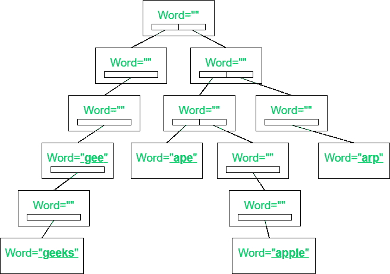

# 使用特里的拼写检查器

> 原文:[https://www.geeksforgeeks.org/spell-checker-using-trie/](https://www.geeksforgeeks.org/spell-checker-using-trie/)

给定一组[字符串](https://www.geeksforgeeks.org/string-data-structure/) **字符串[]** 和一个字符串**键**，任务是检查**键**的拼写是否正确。如果发现是真的，则打印**“是”**。否则，打印建议的正确拼写。

**示例:**

> **输入:**str[]= {“gee”、“geeks”、“ape”、“apple”、“geeks forgeeks”}，key =“geek”
> **输出:** geeks geeksforgeeks
> **解释:**
> 字符串“geek”不在字符串数组中。
> 所以建议用的词是{“极客”、“极客暴发户”}。
> 
> **输入:**str[]= {“gee”、“极客”、“猿猴”、“苹果”、“ARP”}，key =“极客”
> **输出:** YES。

[](https://media.geeksforgeeks.org/wp-content/cdn-uploads/20201221201932/SpellChecker.png)

**方法:**使用[特里](https://www.geeksforgeeks.org/trie-insert-and-search/)可以解决问题。其思想是[遍历字符串的数组](https://www.geeksforgeeks.org/c-program-to-traverse-an-array/)、 **str[]** 和[将字符串插入到 Trie](https://www.geeksforgeeks.org/trie-insert-and-search/) 中，使得 **Trie** 的每个节点包含字符串的字符和一个布尔值，以检查该字符是否是字符串的最后一个字符。按照以下步骤解决问题:

*   初始化一个 [Trie](https://www.geeksforgeeks.org/trie-insert-and-search/) ，比如说**根**，这样 **Trie** 的每个节点由一个字符串的字符和一个布尔值组成，以检查该字符是否是该字符串的最后一个字符。
*   [遍历字符串数组](https://www.geeksforgeeks.org/c-program-to-traverse-an-array/) **arr[]** ，然后[将所有字符串插入 Trie](https://www.geeksforgeeks.org/trie-insert-and-search/) 。
*   最后，[遍历字符串](https://www.geeksforgeeks.org/iterate-over-characters-of-a-string-in-c/) **键**。对于每个 **i <sup>th</sup>** 字符，检查该字符是否出现在 **Trie** 中。如果发现为真，则移动到 Trie 的下一个节点。
*   否则，打印前缀为字符串**键**的所有可能的字符串。

下面是上述方法的实现:

## C++

```
// C++ program to implement
// the above approach
#include <bits/stdc++.h>
using namespace std;

// Structure of a Trie node
struct TrieNode {

    // Store address of a character
    TrieNode* Trie[256];

    // Check if the character is
    // last character of a string or not
    bool isEnd;

    // Constructor function
    TrieNode()
    {

        for (int i = 0; i < 256; i++) {

            Trie[i] = NULL;
        }
        isEnd = false;
    }
};

// Function to insert a string into Trie
void InsertTrie(TrieNode* root, string s)
{

    TrieNode* temp = root;

    // Traverse the string, s
    for (int i = 0; i < s.length(); i++) {

        if (temp->Trie[s[i]] == NULL) {

            // Initialize a node
            temp->Trie[s[i]] = new TrieNode();
        }

        // Update temp
        temp = temp->Trie[s[i]];
    }

    // Mark the last character of
    // the string to true
    temp->isEnd = true;
}

// Function to print suggestions of the string
void printSuggestions(TrieNode* root, string res)
{

    // If current character is
    // the last character of a string
    if (root->isEnd == true) {

        cout << res << " ";
    }

    // Iterate over all possible
    // characters of the string
    for (int i = 0; i < 256; i++) {

        // If current character
        // present in the Trie
        if (root->Trie[i] != NULL) {

            // Insert current character
            // into Trie
            res.push_back(i);
            printSuggestions(root->Trie[i], res);
            res.pop_back();
        }
    }
}

// Function to check if the string
// is present in Trie or not
bool checkPresent(TrieNode* root, string key)
{

    // Traverse the string
    for (int i = 0; i < key.length(); i++) {

        // If current character not
        // present in the Trie
        if (root->Trie[key[i]] == NULL) {

            printSuggestions(root, key.substr(0, i));

            return false;
        }

        // Update root
        root = root->Trie[key[i]];
    }
    if (root->isEnd == true) {

        return true;
    }
    printSuggestions(root, key);

    return false;
}

// Driver Code
int main()
{

    // Given array of strings
    vector<string> str = { "gee", "geeks", "ape",
                           "apple", "geeksforgeeks" };

    string key = "geek";

    // Initialize a Trie
    TrieNode* root = new TrieNode();

    // Insert strings to trie
    for (int i = 0; i < str.size(); i++) {
        InsertTrie(root, str[i]);
    }

    if (checkPresent(root, key)) {

        cout << "YES";
    }
    return 0;
}
```

## Java 语言(一种计算机语言，尤用于创建网站)

```
// Java program to implement
// the above approach
import java.io.*;

// Structure of a Trie node
class TrieNode
{

    // Store address of a character
    TrieNode Trie[];

    // Check if the character is
    // last character of a string or not
    boolean isEnd;

    // Constructor function
    public TrieNode()
    {
        Trie = new TrieNode[256];
        for(int i = 0; i < 256; i++)
        {
            Trie[i] = null;
        }
        isEnd = false;
    }
}

class GFG{

// Function to insert a string into Trie
static void InsertTrie(TrieNode root, String s)
{
    TrieNode temp = root;

    // Traverse the string, s
    for(int i = 0; i < s.length(); i++)
    {
        if (temp.Trie[s.charAt(i)] == null)
        {

            // Initialize a node
            temp.Trie[s.charAt(i)] = new TrieNode();
        }

        // Update temp
        temp = temp.Trie[s.charAt(i)];
    }

    // Mark the last character of
    // the string to true
    temp.isEnd = true;
}

// Function to print suggestions of the string
static void printSuggestions(TrieNode root, String res)
{

    // If current character is
    // the last character of a string
    if (root.isEnd == true)
    {
        System.out.print(res + " ");
    }

    // Iterate over all possible
    // characters of the string
    for(int i = 0; i < 256; i++)
    {

        // If current character
        // present in the Trie
        if (root.Trie[i] != null)
        {

            // Insert current character
            // into Trie
            res += (char)i;
            printSuggestions(root.Trie[i], res);
            res = res.substring(0, res.length() - 2);
        }
    }
}

// Function to check if the string
// is present in Trie or not
static boolean checkPresent(TrieNode root, String key)
{

    // Traverse the string
    for(int i = 0; i < key.length(); i++)
    {

        // If current character not
        // present in the Trie
        if (root.Trie[key.charAt(i)] == null)
        {
            printSuggestions(root, key.substring(0, i));
            return false;
        }

        // Update root
        root = root.Trie[key.charAt(i)];
    }
    if (root.isEnd == true)
    {
        return true;
    }
    printSuggestions(root, key);

    return false;
}

// Driver Code
public static void main(String[] args)
{

    // Given array of strings
    String str[] = { "gee", "geeks", "ape", "apple",
                     "geeksforgeeks" };

    String key = "geek";

    // Initialize a Trie
    TrieNode root = new TrieNode();

    // Insert strings to trie
    for(int i = 0; i < str.length; i++)
    {
        InsertTrie(root, str[i]);
    }

    if (checkPresent(root, key))
    {
        System.out.println("YES");
    }
}
}

// This code is contributed by Dharanendra L V.
```

**Output:** 

```
geeks geeksforgeeks
```

***时间复杂度:** O(N * M)，其中 M 为弦的最大长度*
***辅助空间:** O(N * 256)*