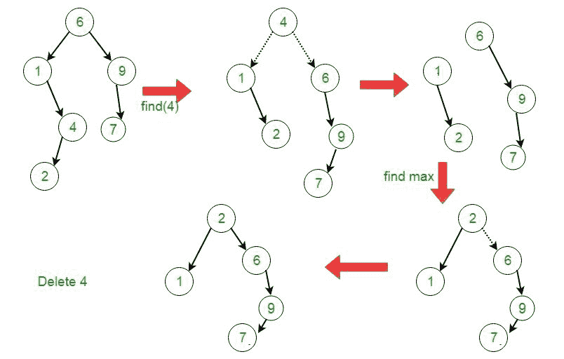

# 显示树|集合 3(删除)

> 原文:[https://www.geeksforgeeks.org/splay-tree-set-3-delete/](https://www.geeksforgeeks.org/splay-tree-set-3-delete/)

建议将以下职位作为该职位的先决条件。

[显示树|集合 1(搜索)](https://www.geeksforgeeks.org/splay-tree-set-1-insert/)

以下是从展开树中删除键 **k** 的不同情况。

1.  如果**根为空:**我们只需返回根即可。
2.  否则[显示](https://www.geeksforgeeks.org/splay-tree-set-1-insert/)给定的密钥 k，如果 k 存在，那么它就成为新的根。如果不存在，则最后访问的叶节点成为新的根。
3.  如果新根的密钥与 **k** 不相同，则返回根，因为 **k** 不存在。
4.  否则键 **k** 存在。
    *   将树拆分为两棵树 **Tree1** =根的左子树和 **Tree2** =根的右子树，删除根节点。
    *   让**树 1** 和**树 2** 的根分别为**根 1** 和**根 2** 。
    *   如果**根 1** 为空:返回**根 2** 。
    *   否则，显示**树 1** 的最大节点(具有最大值的节点)。
    *   展开程序后，将 **Root2** 设为 **Root1** 的右子，返回 **Root1** 。



```
// C implementation to delete a node from Splay Tree
#include<stdio.h>
#include<stdlib.h>

// An AVL tree node
struct node
{
    int key;
    struct node *left, *right;
};

/* Helper function that allocates a new node with the given key and
    NULL left and right pointers. */
struct node* newNode(int key)
{
    struct node* node = (struct node*)malloc(sizeof(struct node));
    node->key   = key;
    node->left  = node->right  = NULL;
    return (node);
}

// A utility function to right rotate subtree rooted with y
// See the diagram given above.
struct node *rightRotate(struct node *x)
{
    struct node *y = x->left;
    x->left = y->right;
    y->right = x;
    return y;
}

// A utility function to left rotate subtree rooted with x
// See the diagram given above.
struct node *leftRotate(struct node *x)
{
    struct node *y = x->right;
    x->right = y->left;
    y->left = x;
    return y;
}

// This function brings the key at root if key is present in tree.
// If key is not present, then it brings the last accessed item at
// root.  This function modifies the tree and returns the new root
struct node *splay(struct node *root, int key)
{
    // Base cases: root is NULL or key is present at root
    if (root == NULL || root->key == key)
        return root;

    // Key lies in left subtree
    if (root->key > key)
    {
        // Key is not in tree, we are done
        if (root->left == NULL) return root;

        // Zig-Zig (Left Left)
        if (root->left->key > key)
        {
            // First recursively bring the key as root of left-left
            root->left->left = splay(root->left->left, key);

            // Do first rotation for root, second rotation is 
            // done after else
            root = rightRotate(root);
        }
        else if (root->left->key < key) // Zig-Zag (Left Right)
        {
            // First recursively bring the key as root of left-right
            root->left->right = splay(root->left->right, key);

            // Do first rotation for root->left
            if (root->left->right != NULL)
                root->left = leftRotate(root->left);
        }

        // Do second rotation for root
        return (root->left == NULL)? root: rightRotate(root);
    }
    else // Key lies in right subtree
    {
        // Key is not in tree, we are done
        if (root->right == NULL) return root;

        // Zag-Zig (Right Left)
        if (root->right->key > key)
        {
            // Bring the key as root of right-left
            root->right->left = splay(root->right->left, key);

            // Do first rotation for root->right
            if (root->right->left != NULL)
                root->right = rightRotate(root->right);
        }
        else if (root->right->key < key)// Zag-Zag (Right Right)
        {
            // Bring the key as root of right-right and do 
            // first rotation
            root->right->right = splay(root->right->right, key);
            root = leftRotate(root);
        }

        // Do second rotation for root
        return (root->right == NULL)? root: leftRotate(root);
    }
}

// The delete function for Splay tree. Note that this function
// returns the new root of Splay Tree after removing the key 
struct node* delete_key(struct node *root, int key)
{
    struct node *temp;
    if (!root)
        return NULL;

    // Splay the given key    
    root = splay(root, key);

    // If key is not present, then
    // return root
    if (key != root->key)
        return root;

    // If key is present
    // If left child of root does not exist
    // make root->right as root   
    if (!root->left)
    {
        temp = root;
        root = root->right;
    }

    // Else if left child exits
    else
    {
        temp = root;

        /*Note: Since key == root->key,
        so after Splay(key, root->lchild),
        the tree we get will have no right child tree
        and maximum node in left subtree will get splayed*/
        // New root
        root = splay(root->left, key);

        // Make right child of previous root  as
        // new root's right child
        root->right = temp->right;
    }

    // free the previous root node, that is,
    // the node containing the key
    free(temp);

    // return root of the new Splay Tree
    return root;

}

// A utility function to print preorder traversal of the tree.
// The function also prints height of every node
void preOrder(struct node *root)
{
    if (root != NULL)
    {
        printf("%d ", root->key);
        preOrder(root->left);
        preOrder(root->right);
    }
}

/* Driver program to test above function*/
int main()
{
    // Splay Tree Formation
    struct node *root = newNode(6);
    root->left = newNode(1);
    root->right = newNode(9);
    root->left->right = newNode(4);
    root->left->right->left = newNode(2);
    root->right->left = newNode(7);

     int key = 4;

    root = delete_key(root, key);
    printf("Preorder traversal of the modified Splay tree is \n");
    preOrder(root);
    return 0;
} 
```

输出:

```
Preorder traversal of the modified Splay tree is
2 1 6 9 7

```

**参考文献:**

[https://www.geeksforgeeks.org/splay-tree-set-1-insert/](https://www.geeksforgeeks.org/splay-tree-set-1-insert/)
[http://courses . cs . Washington . edu/courses/CSE 326/01 au/讲座/sparstrees . PPT](http://courses.cs.washington.edu/courses/cse326/01au/lectures/SplayTrees.ppt)

本文由**阿育什·乔哈里**供稿。如果你喜欢 GeeksforGeeks 并想投稿，你也可以使用[contribute.geeksforgeeks.org](http://www.contribute.geeksforgeeks.org)写一篇文章或者把你的文章邮寄到 contribute@geeksforgeeks.org。看到你的文章出现在极客博客主页上，帮助其他极客。

如果你发现任何不正确的地方，或者你想分享更多关于上面讨论的话题的信息，请写评论。