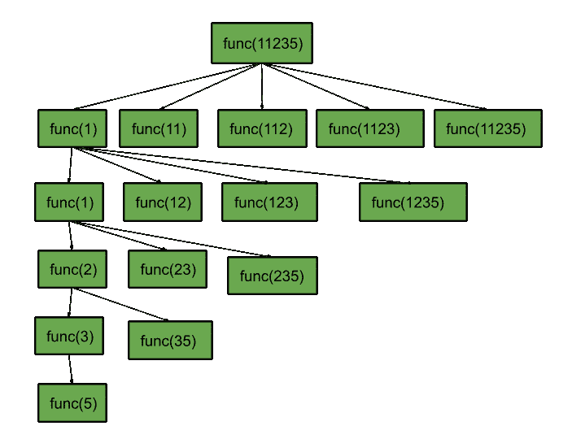

# 将一个数字串分割成斐波那契数列

> 原文:[https://www . geesforgeks . org/split-a-numeric-string-in-Fibonacci-sequence/](https://www.geeksforgeeks.org/split-a-numeric-string-into-fibonacci-sequence/)

给定一个代表一个大数的数字字符串 **S** ，任务是从给定的字符串形成至少长度为 3 的[斐波那契序列](https://www.geeksforgeeks.org/program-for-nth-fibonacci-number/)。如果这样的分裂是不可能的，打印 **-1。**

**示例:**

> **输入:** S = "5712"
> **输出:** 5 7 12
> **解释:**
> 由于 5 + 7 = 12，拆分{5}、{7}、{12}形成一个斐波那契数列。
> 
> **输入:**S = " 11235813 "
> T3】输出: 1 1 2 3 5 8 13

**方法:**
要解决这个问题，思路是使用[回溯](https://www.geeksforgeeks.org/backtracking-algorithms/)找到符合**斐波那契数列**条件的数列。

按照以下步骤解决问题:

1.  初始化一个[向量](https://www.geeksforgeeks.org/vector-in-cpp-stl/) **序列[]** 来存储**斐波那契序列**。
2.  初始化一个指向字符串当前索引的变量**pos****S**，最初为*T5【0】*。
3.  重复索引**【位置，长度–1】**:
    *   如果**序列**的长度小于 *2* 或者当前数字等于**序列**的最后两个数字之和，则将数字**S【pos:****I】**添加到斐波那契序列**序列**中。重复索引 **i + 1** 并继续。
    *   如果最后添加的数字**S【pos:****I】**没有形成斐波那契数列，并且在递归后返回 *false* ，则将其从**序列中移除。**
    *   否则，结束循环，并在形成斐波那契序列时返回真。
4.  如果**位置**超过了 **S** 的长度，那么:
    *   如果序列**序列**的长度大于或等于 *3* ，则找到斐波那契序列，因此返回*真*。
    *   否则，斐波那契数列是不可能的，因此返回*假*。
5.  最后，如果**序列**的长度大于或等于 *3、*，则打印**序列**中的数字作为所需的斐波那契序列，否则打印 *-1* 。

下面是递归结构的图示，其中只有一个分支被扩展以获得结果:



下面是上述方法的实现:

## C++

```
// C++ program of the above approach
#include <bits/stdc++.h>
using namespace std;

#define LL long long

// Function that returns true if
// Fibonacci sequence is found
bool splitIntoFibonacciHelper(int pos,
                              string S,
                              vector<int>& seq)
{
    // Base condition:
    // If pos is equal to length of S
    // and seq length is greater than 3
    if (pos == S.length()
        and (seq.size() >= 3)) {

        // Return true
        return true;
    }

    // Stores current number
    LL num = 0;

    for (int i = pos; i < S.length(); i++) {

        // Add current digit to num
        num = num * 10 + (S[i] - '0');

        // Avoid integer overflow
        if (num > INT_MAX)
            break;

        // Avoid leading zeros
        if (S[pos] == '0' and i > pos)
            break;

        // If current number is greater
        // than last two number of seq
        if (seq.size() > 2
            and (num > ((LL)seq.back()
                        + (LL)seq[seq.size()
                                  - 2])))
            break;

        // If seq length is less
        // 2 or current number is
        // is equal to the last
        // two of the seq
        if (seq.size() < 2
            or (num == ((LL)seq.back()
                        + (LL)seq[seq.size()
                                  - 2]))) {

            // Add to the seq
            seq.push_back(num);

            // Recur for i+1
            if (splitIntoFibonacciHelper(i + 1,
                                         S, seq))
                return true;

            // Remove last added number
            seq.pop_back();
        }
    }

    // If no sequence is found
    return false;
}

// Function that prints the Fibonacci
// sequence from the split of string S
void splitIntoFibonacci(string S)
{
    // Initialize a vector to
    // store the sequence
    vector<int> seq;

    // Call helper function
    splitIntoFibonacciHelper(0, S,
                             seq);

    // If sequence length is
    // greater than 3
    if (seq.size() >= 3) {

        // Print the sequence
        for (int i : seq)
            cout << i << " ";
    }

    // If no sequence is found
    else {

        // Print -1
        cout << -1;
    }
}

// Driver Code
int main()
{
    // Given String
    string S = "11235813";

    // Function Call
    splitIntoFibonacci(S);
    return 0;
}
```

## Java 语言(一种计算机语言，尤用于创建网站)

```
// Java program of the above approach
import java.util.*;

class GFG{

// Function that returns true if
// Fibonacci sequence is found
static boolean splitIntoFibonacciHelper(int pos,
                                        String S,
                              ArrayList<Long> seq)
{

    // Base condition:
    // If pos is equal to length of S
    // and seq length is greater than 3
    if (pos == S.length() && (seq.size() >= 3))
    {

        // Return true
        return true;
    }

    // Stores current number
    long num = 0;

    for(int i = pos; i < S.length(); i++)
    {

        // Add current digit to num
        num = num * 10 + (S.charAt(i) - '0');

        // Avoid integer overflow
        if (num > Integer.MAX_VALUE)
            break;

        // Avoid leading zeros
        if (S.charAt(pos) == '0' && i > pos)
            break;

        // If current number is greater
        // than last two number of seq
        if (seq.size() > 2 &&
           (num > ((long)seq.get(seq.size() - 1) +
                   (long)seq.get(seq.size() - 2))))
            break;

        // If seq length is less
        // 2 or current number is
        // is equal to the last
        // two of the seq
        if (seq.size() < 2 ||
            (num == ((long)seq.get(seq.size() - 1) +
                     (long)seq.get(seq.size() - 2))))
        {

            // Add to the seq
            seq.add(num);

            // Recur for i+1
            if (splitIntoFibonacciHelper(i + 1,
                                         S, seq))
                return true;

            // Remove last added number
            seq.remove(seq.size() - 1);
        }
    }

    // If no sequence is found
    return false;
}

// Function that prints the Fibonacci
// sequence from the split of string S
static void splitIntoFibonacci(String S)
{

    // Initialize a vector to
    // store the sequence
    ArrayList<Long> seq = new ArrayList<>();

    // Call helper function
    splitIntoFibonacciHelper(0, S, seq);

    // If sequence length is
    // greater than 3
    if (seq.size() >= 3)
    {

        // Print the sequence
        for (int i = 0; i < seq.size(); i++)
            System.out.print(seq.get(i) + " ");
    }

    // If no sequence is found
    else
    {

        // Print -1
        System.out.print("-1");
    }
}

// Driver code
public static void main(String[] args)
{

    // Given String
    String S = "11235813";

    // Function Call
    splitIntoFibonacci(S);
}
}

// This code is contributed by offbeat
```

## 蟒蛇 3

```
# Python3 program of the above approach
import sys

# Function that returns true if
# Fibonacci sequence is found
def splitIntoFibonacciHelper(pos, S, seq):

    # Base condition:
    # If pos is equal to length of S
    # and seq length is greater than 3
    if (pos == len(S) and (len(seq) >= 3)):

        # Return true
        return True

    # Stores current number
    num = 0

    for i in range(pos, len(S)):

        # Add current digit to num
        num = num * 10 + (ord(S[i]) - ord('0'))

        # Avoid integer overflow
        if (num > sys.maxsize):
            break

        # Avoid leading zeros
        if (ord(S[pos]) == ord('0') and i > pos):
            break

        # If current number is greater
        # than last two number of seq
        if (len(seq) > 2 and
                (num > (seq[-1] +
                        seq[len(seq) - 2]))):
            break

        # If seq length is less
        # 2 or current number is
        # is equal to the last
        # two of the seq
        if (len(seq) < 2 or
           (num == (seq[-1] +
                    seq[len(seq) - 2]))):

            # Add to the seq
            seq.append(num)

            # Recur for i+1
            if (splitIntoFibonacciHelper(
                i + 1, S, seq)):
                return True

            # Remove last added number
            seq.pop()

    # If no sequence is found
    return False

# Function that prints the Fibonacci
# sequence from the split of string S
def splitIntoFibonacci(S):

    # Initialize a vector to
    # store the sequence
    seq = []

    # Call helper function
    splitIntoFibonacciHelper(0, S, seq)

    # If sequence length is
    # greater than 3
    if (len(seq) >= 3):

        # Print the sequence
        for i in seq:
            print(i, end = ' ')

    # If no sequence is found
    else:

        # Print -1
        print(-1, end = '')

# Driver Code
if __name__=='__main__':

    # Given String
    S = "11235813"

    # Function Call
    splitIntoFibonacci(S)

# This code is contributed by pratham76
```

## C#

```
// C# program of the above approach
using System;
using System.Collections;
using System.Collections.Generic;

class GFG{

// Function that returns true if
// Fibonacci sequence is found
static bool splitIntoFibonacciHelper(int pos,
                                     string S,
                                ArrayList seq)
{

    // Base condition:
    // If pos is equal to length of S
    // and seq length is greater than 3
    if (pos == S.Length && (seq.Count >= 3))
    {

        // Return true
        return true;
    }

    // Stores current number
    long num = 0;

    for(int i = pos; i < S.Length; i++)
    {

        // Add current digit to num
        num = num * 10 + (S[i] - '0');

        // Avoid integer overflow
        if (num > Int64.MaxValue)
            break;

        // Avoid leading zeros
        if (S[pos] == '0' && i > pos)
            break;

        // If current number is greater
        // than last two number of seq
        if (seq.Count> 2 &&
           (num > ((long)seq[seq.Count - 1] +
                   (long)seq[seq.Count - 2])))
            break;

        // If seq length is less
        // 2 or current number is
        // is equal to the last
        // two of the seq
        if (seq.Count < 2 ||
           (num == ((long)seq[seq.Count - 1] +
                    (long)seq[seq.Count - 2])))
        {

            // Add to the seq
            seq.Add(num);

            // Recur for i+1
            if (splitIntoFibonacciHelper(i + 1,
                                         S, seq))
                return true;

            // Remove last added number
            seq.Remove(seq.Count - 1);
        }
    }

    // If no sequence is found
    return false;
}

// Function that prints the Fibonacci
// sequence from the split of string S
static void splitIntoFibonacci(string S)
{

    // Initialize a vector to
    // store the sequence
    ArrayList seq = new ArrayList();

    // Call helper function
    splitIntoFibonacciHelper(0, S, seq);

    // If sequence length is
    // greater than 3
    if (seq.Count >= 3)
    {

        // Print the sequence
        for(int i = 0; i < seq.Count; i++)
            Console.Write(seq[i] + " ");
    }

    // If no sequence is found
    else
    {

        // Print -1
        Console.Write("-1");
    }
}

// Driver Code
public static void Main(string[] args)
{

    // Given String
    string S = "11235813";

    // Function call
    splitIntoFibonacci(S);
}
}

// This code is contributed by rutvik_56
```

## java 描述语言

```
<script>
    // Javascript program of the above approach

    // Function that returns true if
    // Fibonacci sequence is found
    function splitIntoFibonacciHelper(pos, S, seq)
    {

        // Base condition:
        // If pos is equal to length of S
        // and seq length is greater than 3
        if (pos == S.length && (seq.length >= 3))
        {

            // Return true
            return true;
        }

        // Stores current number
        let num = 0;

        for(let i = pos; i < S.length; i++)
        {

            // Add current digit to num
            num = num * 10 + (S[i] - '0');

            // Avoid integer overflow
            if (num > Number.MAX_VALUE)
                break;

            // Avoid leading zeros
            if (S[pos] == '0' && i > pos)
                break;

            // If current number is greater
            // than last two number of seq
            if (seq.length> 2 &&
               (num > (seq[seq.length - 1] +
                       seq[seq.length - 2])))
                break;

            // If seq length is less
            // 2 or current number is
            // is equal to the last
            // two of the seq
            if (seq.length < 2 ||
               (num == (seq[seq.length - 1] +
                        seq[seq.length - 2])))
            {

                // Add to the seq
                seq.push(num);

                // Recur for i+1
                if (splitIntoFibonacciHelper(i + 1, S, seq))
                    return true;

                // Remove last added number
                seq.pop();
            }
        }

        // If no sequence is found
        return false;
    }

    // Function that prints the Fibonacci
    // sequence from the split of string S
    function splitIntoFibonacci(S)
    {

        // Initialize a vector to
        // store the sequence
        let seq = [];

        // Call helper function
        splitIntoFibonacciHelper(0, S, seq);

        // If sequence length is
        // greater than 3
        if (seq.length >= 3)
        {

            // Print the sequence
            for(let i = 0; i < seq.length; i++)
                document.write(seq[i] + " ");
        }

        // If no sequence is found
        else
        {

            // Print -1
            document.write("-1");
        }
    }

    // Given String
    let S = "11235813";

    // Function call
    splitIntoFibonacci(S);

// This code is contributed by suresh07.
</script>
```

**Output:** 

```
1 1 2 3 5 8 13
```

***时间复杂度:**O(N<sup>2</sup>)*
***空间复杂度:** O(N)*