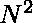

# 将阵列分成最小数量的子阵列，其第一个和最后一个元素的 GCD 超过 1

> 原文:[https://www . geeksforgeeks . org/将数组拆分为最小数量的子数组，其第一个和最后一个元素的 gcd 超过-1/](https://www.geeksforgeeks.org/split-array-into-minimum-number-of-subarrays-having-gcd-of-its-first-and-last-element-exceeding-1/)

给定一个大小为 **N** 的[阵列](https://www.geeksforgeeks.org/array-data-structure/)**arr【】**，任务是将整个阵列分成最小数量的子阵列，使得对于每个[子阵列](https://www.geeksforgeeks.org/subarraysubstring-vs-subsequence-and-programs-to-generate-them/)，子阵列的第一个和最后一个元素的 [GCD](https://www.geeksforgeeks.org/c-program-find-gcd-hcf-two-numbers/) 大于 1。

**示例:**

> **输入:** arr[] = {2，3，4，4，4，3}
> **输出:** 2
> **解释:**
> 将给定数组拆分为【2，3，4，4，4】和【3】。
> 第一子阵 gcd(2，4) = 2 大于 1
> 第二子阵 gcd(3，3) = 3 也大于 1。
> 
> **输入:** arr[] = {1，2，3}
> **输出:** 0
> **解释:**
> 不可能将给定阵列拆分为子阵列，其中子阵列的第一个和最后一个元素的 GCD 大于 1。

**天真方法:**解决问题最简单的方法是在给定的数组中执行所有可能的拆分，对于每个拆分，检查所有子数组的第一个和最后一个元素的 GCD 是否大于 1。对于发现为真的所有子阵列，存储子阵列的计数。最后，打印这些拆分中获得的最小计数。
***时间复杂度:**O(2<sup>N</sup>)*
***辅助空间:** O(1)*

**高效方法:**该方法基于这样的思想，即总是使用原始数组的第一个和最后一个元素。第一个元素将用于第一个子阵列分割，最后一个元素将用于最后一个子阵列分割。要最小化有效子阵列的数量，请执行以下步骤:

1.  将一个**右**指针固定到原始数组的最后一个元素 **arr[]** ，并找到原始数组中最左边的元素，使得 **GCD(左，右)> 1** 。如果没有找到这样的元素，就没有有效的答案。
2.  如果找到这样的元素，那就意味着我们找到了一个有效的子数组。然后将**右**指针改为**(左–1)**，再次开始搜索有效的子阵列。
3.  重复上述步骤，直到**右侧**大于 **0** 为止，并继续增加找到的子阵数量，直到现在。
4.  完成上述所有步骤后，打印计数值。

下面是上述方法的实现:

## C++

```
// C++ program for the above approach
#include <bits/stdc++.h>
using namespace std;

// Function to find the
// minimum number of subarrays
int minSubarrays(int arr[], int n)
{
    // Right pointer
    int right = n - 1;

    // Left pointer
    int left = 0;

    // Count of subarrays
    int subarrays = 0;

    while (right >= 0) {

        for (left = 0; left <= right;
             left += 1) {

            // Find GCD(left, right)
            if (__gcd(arr[left],
                      arr[right])
                > 1) {

                // Found a valid large
                // subarray between
                // arr[left, right]
                subarrays += 1;
                right = left - 1;
                break;
            }

            // Searched the arr[0..right]
            // and found no subarray
            // having size >1 and having
            // gcd(left, right) > 1
            if (left == right
                && __gcd(arr[left],
                         arr[right])
                       == 1) {
                return 0;
            }
        }
    }
    return subarrays;
}

// Driver Code
int main()
{
    int N = 6;
    int arr[] = { 2, 3, 4, 4, 4, 3 };

    // Function call
    cout << minSubarrays(arr, N);
    return 0;
}
```

## Java 语言(一种计算机语言，尤用于创建网站)

```
// Java program for the above approach
import java.util.*;
class GFG{

// Function to find the
// minimum number of subarrays
static int minSubarrays(int arr[], int n)
{
    // Right pointer
    int right = n - 1;

    // Left pointer
    int left = 0;

    // Count of subarrays
    int subarrays = 0;

    while (right >= 0)
    {
        for (left = 0; left <= right; left += 1)
        {
            // Find GCD(left, right)
            if (__gcd(arr[left],
                      arr[right]) > 1)
            {
                // Found a valid large
                // subarray between
                // arr[left, right]
                subarrays += 1;
                right = left - 1;
                break;
            }

            // Searched the arr[0..right]
            // and found no subarray
            // having size >1 and having
            // gcd(left, right) > 1
            if (left == right &&
                __gcd(arr[left],
                arr[right]) == 1)
            {
                return 0;
            }
        }
    }
    return subarrays;
}
static int __gcd(int a, int b) 
{ 
    return b == 0 ? a : __gcd(b, a % b);    
}
// Driver Code
public static void main(String[] args)
{
    int N = 6;
    int arr[] = {2, 3, 4, 4, 4, 3};

    // Function call
    System.out.print(minSubarrays(arr, N));
}
}

// This code is contributed by Rajput-Ji
```

## 蟒蛇 3

```
# Python3 program for the above approach
from math import gcd

# Function to find the
# minimum number of subarrays
def minSubarrays(arr, n):

    # Right pointer
    right = n - 1

    # Left pointer
    left = 0

    # Count of subarrays
    subarrays = 0

    while (right >= 0):
        for left in range(right + 1):

            # Find GCD(left, right)
            if (gcd(arr[left], arr[right]) > 1):

                # Found a valid large
                # subarray between
                # arr[left, right]
                subarrays += 1
                right = left - 1
                break

            # Searched the arr[0..right]
            # and found no subarray
            # having size >1 and having
            # gcd(left, right) > 1
            if (left == right and
                __gcd(arr[left],
                      arr[right]) == 1):
                return 0

    return subarrays

# Driver Code
if __name__ == '__main__':

    N = 6
    arr = [ 2, 3, 4, 4, 4, 3 ]

    # Function call
    print(minSubarrays(arr, N))

# This code is contributed by mohit kumar 29
```

## C#

```
// C# program for the above approach
using System;
class GFG{

// Function to find the
// minimum number of subarrays
static int minSubarrays(int[] arr, int n)
{
    // Right pointer
    int right = n - 1;

    // Left pointer
    int left = 0;

    // Count of subarrays
    int subarrays = 0;

    while (right >= 0)
    {
        for (left = 0; left <= right; left += 1)
        {
            // Find GCD(left, right)
            if (__gcd(arr[left],
                      arr[right]) > 1)
            {
                // Found a valid large
                // subarray between
                // arr[left, right]
                subarrays += 1;
                right = left - 1;
                break;
            }

            // Searched the arr[0..right]
            // and found no subarray
            // having size >1 and having
            // gcd(left, right) > 1
            if (left == right &&
                __gcd(arr[left],
                      arr[right]) == 1)
            {
                return 0;
            }
        }
    }
    return subarrays;
}

static int __gcd(int a, int b) 
{ 
    return b == 0 ? a : __gcd(b, a % b);    
}

// Driver Code
public static void Main()
{
    int N = 6;
    int[] arr = {2, 3, 4, 4, 4, 3};

    // Function call
    Console.Write(minSubarrays(arr, N));
}
}

// This code is contributed by Chitranayal
```

## java 描述语言

```
<script>
// javascript program for the above approach

    // Function to find the
    // minimum number of subarrays
    function minSubarrays(arr , n) {
        // Right pointer
        var right = n - 1;

        // Left pointer
        var left = 0;

        // Count of subarrays
        var subarrays = 0;

        while (right >= 0) {
            for (left = 0; left <= right; left += 1) {
                // Find GCD(left, right)
                if (__gcd(arr[left], arr[right]) > 1) {
                    // Found a valid large
                    // subarray between
                    // arr[left, right]
                    subarrays += 1;
                    right = left - 1;
                    break;
                }

                // Searched the arr[0..right]
                // and found no subarray
                // having size >1 and having
                // gcd(left, right) > 1
                if (left == right && __gcd(arr[left], arr[right]) == 1) {
                    return 0;
                }
            }
        }
        return subarrays;
    }

    function __gcd(a , b) {
        return b == 0 ? a : __gcd(b, a % b);
    }

    // Driver Code

        var N = 6;
        var arr = [ 2, 3, 4, 4, 4, 3 ];

        // Function call
        document.write(minSubarrays(arr, N));

// This code contributed by umadevi9616
</script>
```

**Output:** 

```
2
```

***时间复杂度:**O(**)*
***辅助空间:** O(1)*