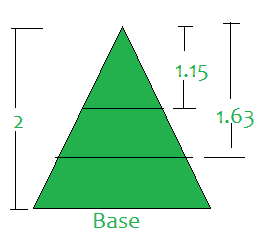

# 将给定的高度为 H 的等腰三角形分成 N 等份

> 原文:[https://www . geeksforgeeks . org/将给定高度的等腰三角形分成 n 等份/](https://www.geeksforgeeks.org/split-given-isosceles-triangle-of-height-h-into-n-equal-parts/)

给定一个整数 **N** 和一个由高度 **H** 组成的[等腰三角形](https://en.wikipedia.org/wiki/Isosceles_triangle)，任务是在三角形上寻找**(N–1)**点，使得通过这些点并平行于三角形底部的直线将总面积分成 **N** 等分。

**示例:**

> **输入:** N = 3，H = 2
> **输出:** 1.15 1.63
> **说明:**在 1.15 和 1.63 点进行切割，如下图:
> 
> 
> 
> **输入:** N = 2，H = 1000
> T3】输出: 70710.67

**方法:**通过观察以下性质可以解决问题:

> 划分三角形，使**(x<sub>I</sub>/h)<sup>2</sup>= I/N**
> =>**x<sub>I</sub>= h *√(I/N)**
> x<sub>I</sub>=从三角形顶点切下的 i <sup>th</sup> 的高度

按照以下步骤解决问题:

1.  迭代范围**【1，N-1】**。
2.  在每次 **i <sup>第</sup>T3】次迭代中，使用上述公式打印 **x <sub>i</sub>** 的值。**

下面是上述方法的实现:

## C++

```
// C++ Code for above approach
#include <bits/stdc++.h>
using namespace std;

// Function to divide the isosceles triangle
// in equal parts by making N-1 cuts
// parallel to the base
void findPoint(int n, int h)
{

    // Iterate over the range [1, n - 1]
    for (int i = 1; i < n; i++)
        printf("%.2f ", sqrt(i / (n*1.0)) * h);
}

// Driver code
int main()
{
  // Given N
  int n = 3;

  // Given H
  int h = 2;

  // Function call
  findPoint(n, h);

  return 0;
}

// This code is contributed by mohit kumar 29
```

## Java 语言(一种计算机语言，尤用于创建网站)

```
// Java Code for above approach
import java.util.*;
class GFG
{

    // Function to divide the isosceles triangle
    // in equal parts by making N-1 cuts
    // parallel to the base
    static void findPoint(int n, int h)
    {

        // Iterate over the range [1, n - 1]
        for (int i = 1; i < n; i++)
            System.out.printf("%.2f ",
                    Math.sqrt(i / (n * 1.0)) * h);
    }

    // Driver code
    public static void main(String[] args)
    {

        // Given N
        int n = 3;

        // Given H
        int h = 2;

        // Function call
        findPoint(n, h);
    }
}

// This code is contributed by shikhasingrajput
```

## 蟒蛇 3

```
# Python Code for above approach

# Function to divide the isosceles triangle
# in equal parts by making N-1 cuts
# parallel to the base
def findPoint(n, h):

    # Iterate over the range [1, n - 1]
    for i in range(1, n):
        print("{0:.2f}".format(((i / n) ** 0.5) * h), end =' ')

# Driver Code
if __name__ == '__main__':

    # Given N
    n = 3

    # Given H
    h = 2

    # Function call
    findPoint(n, h)
```

## C#

```
// C# Code for above approach
using System;
class GFG
{

  // Function to divide the isosceles triangle
  // in equal parts by making N-1 cuts
  // parallel to the base
  static void findPoint(int n, int h)
  {

    // Iterate over the range [1, n - 1]
    for (int i = 1; i < n; i++)
      Console.Write("{0:F2} ",
                    Math.Sqrt(i / (n * 1.0)) * h);
  }

  // Driver code
  public static void Main(String[] args)
  {

    // Given N
    int n = 3;

    // Given H
    int h = 2;

    // Function call
    findPoint(n, h);
  }
}

// This code is contributed by shikhasingrajput
```

## java 描述语言

```
<script>
// Javascript program for the above approach

    // Function to divide the isosceles triangle
    // in equal parts by making N-1 cuts
    // parallel to the base
    function findPolet(n, h)
    {

        // Iterate over the range [1, n - 1]
        for (let i = 1; i < n; i++)
            document.write(
                    Math.sqrt(i / (n * 1.0)) * h + " ");
    }

// driver function

        // Given N
        let n = 3;

        // Given H
        let h = 2;

        // Function call
        findPolet(n, h);;

     // This code is contributed by souravghosh0416.
</script>   
```

**Output:** 

```
1.15 1.63
```

***时间复杂度:**O(N)*
T5**辅助空间:** O(1)