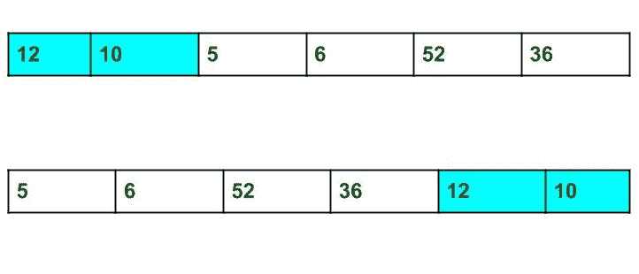

# 拆分数组，将第一部分添加到末尾|设置 2

> 原文:[https://www . geesforgeks . org/拆分阵列并添加第一部分到末端集-2/](https://www.geeksforgeeks.org/split-the-array-and-add-the-first-part-to-the-end-set-2/)

给定一个数组，从指定的位置将其拆分，并将数组的第一部分移到末尾。



**例:**

```
Input : arr[] = {12, 10, 5, 6, 52, 36}
            k = 2
Output : arr[] = {5, 6, 52, 36, 12, 10}
Explanation : Split from index 2 and first 
part {12, 10} add to the end .

Input : arr[] = {3, 1, 2}
           k = 1
Output : arr[] = {1, 2, 3}
Explanation : Split from index 1 and first
part add to the end.
```

这里讨论的是 O(n*k)解。
这个问题可以用下面讨论的反转算法在 O(n)时间内解决，
1。将数组从 0 反转为 n–1(其中 n 是数组的大小)。
2。从 0 到 n–k–1 反向排列。
3。从 n–k 到 n–1 反向排列。

## C++

```
// C++ program to Split the array and
// add the first part to the end
#include <bits/stdc++.h>

using namespace std;

/* Function to reverse arr[] from index start to end*/
void rvereseArray(int arr[], int start, int end)
{
    while (start < end) {
        int temp = arr[start];
        arr[start] = arr[end];
        arr[end] = temp;
        start++;
        end--;
    }
}

// Function to print an array
void printArray(int arr[], int size)
{
    for (int i = 0; i < size; i++)
        cout << arr[i] << " ";
}

/* Function to left rotate arr[] of size n by k */
void splitArr(int arr[], int k, int n)
{
    rvereseArray(arr, 0, n - 1);
    rvereseArray(arr, 0, n - k - 1);
    rvereseArray(arr, n - k, n - 1);
}

/* Driver program to test above functions */
int main()
{
    int arr[] = { 12, 10, 5, 6, 52, 36 };
    int n = sizeof(arr) / sizeof(arr[0]);
    int k = 2;

    // Function calling
    splitArr(arr, k, n);
    printArray(arr, n);

    return 0;
}
```

## Java 语言(一种计算机语言，尤用于创建网站)

```
// Java program to Split the array and
// add the first part to the end
class Geeks
{

/* Function to reverse arr[] from index start to end*/
static void rvereseArray(int arr[], int start, int end)
{
    while (start < end) {
        int temp = arr[start];
        arr[start] = arr[end];
        arr[end] = temp;
        start++;
        end--;
    }
}

// Function to print an array
static void printArray(int arr[], int size)
{
    for (int i = 0; i < size; i++)
        System.out.print(arr[i] +" ");
}

/* Function to left rotate arr[] of size n by k */
static void splitArr(int arr[], int k, int n)
{
    rvereseArray(arr, 0, n - 1);
    rvereseArray(arr, 0, n - k - 1);
    rvereseArray(arr, n - k, n - 1);
}

/* Driver program to test above functions */
public static void main(String args[])
{
    int arr[] = { 12, 10, 5, 6, 52, 36 };
    int n = arr.length;
    int k = 2;

    // Function calling
    splitArr(arr, k, n);
    printArray(arr, n);

}

}

// This code is contributed by ankita_saini.
```

## 蟒蛇 3

```
# Python3 program to Split the array
# and add the first part to the end

# Function to reverse arr[]
# from index start to end*/
def rvereseArray(arr, start, end):
    while start < end :
        temp = arr[start]
        arr[start] = arr[end]
        arr[end] =temp
        start += 1
        end -= 1

# Function to print an array
def printArray(arr, n) :
    for i in range(n):
        print(arr[i], end = " ")

# Function to left rotate
# arr[] of size n by k */
def splitArr(arr, k, n):
    rvereseArray(arr, 0, n - 1)
    rvereseArray(arr, 0, n - k - 1)
    rvereseArray(arr, n - k, n - 1)

# Driver Code
arr = [12, 10, 5, 6, 52, 36]
n = len(arr)
k = 2
splitArr(arr, k, n)
printArray(arr, n)

# This code is contributed
# by Shrikant13
```

## C#

```
// C# program to Split the array and
// add the first part to the end
using System;
class GFG
{

/* Function to reverse arr[] from index start to end*/
static void rvereseArray(int[] arr, int start, int end)
{
    while (start < end)
    {
        int temp = arr[start];
        arr[start] = arr[end];
        arr[end] = temp;
        start++;
        end--;
    }
}

// Function to print an array
static void printArray(int[] arr, int size)
{
    for (int i = 0; i < size; i++)
        Console.Write(arr[i] +" ");
}

/* Function to left rotate arr[] of size n by k */
static void splitArr(int[] arr, int k, int n)
{
    rvereseArray(arr, 0, n - 1);
    rvereseArray(arr, 0, n - k - 1);
    rvereseArray(arr, n - k, n - 1);
}

// Driver code
public static void Main()
{
    int[] arr = { 12, 10, 5, 6, 52, 36 };
    int n = arr.Length;
    int k = 2;

    // Function calling
    splitArr(arr, k, n);
    printArray(arr, n);
}
}

// This code is contributed
// by Akanksha Rai(Abby_akku)
```

## 服务器端编程语言（Professional Hypertext Preprocessor 的缩写）

```
<?php
// PHP program to Split the array and
// add the first part to the end

/* Function to reverse arr[] from index start to end*/
function rvereseArray(&$arr, $start, $end)
{
    while ($start < $end)
    {
        $temp = $arr[$start];
        $arr[$start] = $arr[$end];
        $arr[$end] = $temp;
        $start++;
        $end--;
    }
}

// Function to print an array
function printArray(&$arr, $size)
{
    for ($i = 0; $i < $size; $i++)
        echo $arr[$i] . " ";
}

/* Function to left rotate arr[] of size n by k */
function splitArr(&$arr, $k, $n)
{
    rvereseArray($arr, 0, $n - 1);
    rvereseArray($arr, 0, $n - $k - 1);
    rvereseArray($arr, $n - $k, $n - 1);
}

/* Driver program to test above functions */
$arr = array( 12, 10, 5, 6, 52, 36 );
$n = sizeof($arr);
$k = 2;

// Function calling
splitArr($arr, $k, $n);
printArray($arr, $n);

// This code is contributed
// by Akanksha Rai(Abby_akku)
?>
```

## java 描述语言

```
<script>
// Javascript program to Split the array and
// add the first part to the end

/* Function to reverse arr[] from index start to end*/
function rvereseArray(arr, start, end)
{
    while (start < end)
    {
        let temp = arr[start];
        arr[start] = arr[end];
        arr[end] = temp;
        start++;
        end--;
    }
}

// Function to print an array
function printArray(arr, size)
{
    for (let i = 0; i < size; i++)
        document.write(arr[i] + " ");
}

/* Function to left rotate arr[] of size n by k */
function splitArr(arr, k, n)
{
    rvereseArray(arr, 0, n - 1);
    rvereseArray(arr, 0, n - k - 1);
    rvereseArray(arr, n - k, n - 1);
}

/* Driver program to test above functions */
let arr = new Array( 12, 10, 5, 6, 52, 36 );
let n = arr.length;
let k = 2;

// Function calling
splitArr(arr, k, n);
printArray(arr, n);

// This code is contributed
// by _saurabh_jaiswal
</script>
```

**输出:**

```
5 6 52 36 12 10 
```