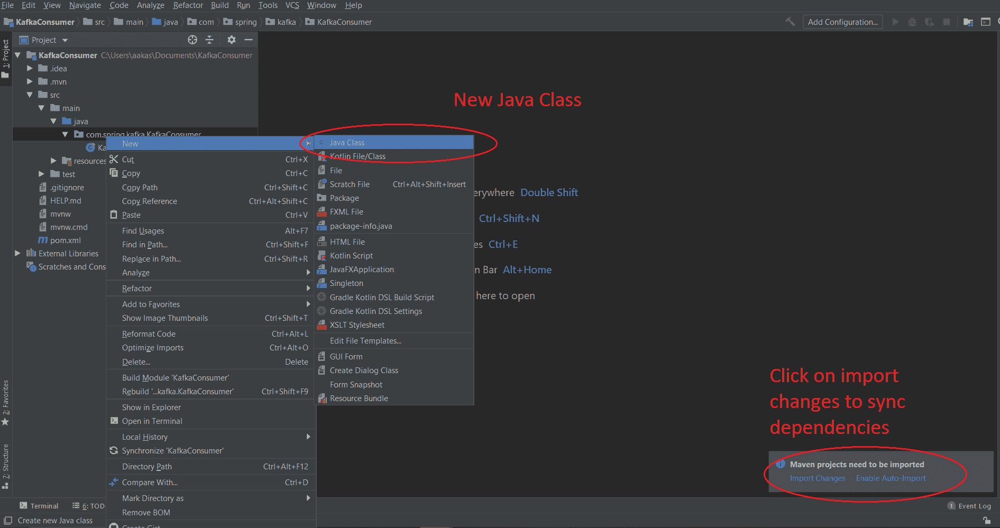

# Spring Boot |如何使用 Apache Kafka 消费字符串消息

> 原文:[https://www . geesforgeks . org/spring-boot-how-consume-string-messages-use-Apache-Kafka/](https://www.geeksforgeeks.org/spring-boot-how-to-consume-string-messages-using-apache-kafka/)

[Apache Kafka](https://www.geeksforgeeks.org/apache-kafka/) 是一个用于实时数据流的发布-订阅消息队列。消息队列允许您在进程、应用程序和服务器之间发送消息。在本文中，我们将看到如何将字符串消息从 apache kafka 发送到 spring boot 应用程序的控制台。

**进场:**

**步骤 1:** 转到 [spring initializr](https://start.spring.io/) 并创建一个具有以下依赖关系的初始项目:

*   阿帕奇卡夫卡的春天


**注意:**我们还可以创建一个 maven 项目，并将以下代码添加到 *pom.xml* 文件中。

## 可扩展标记语言

```
<dependencies>
        <dependency>
            <groupId>org.springframework.boot</groupId>
            <artifactId>spring-boot-starter</artifactId>
        </dependency>
        <dependency>
            <groupId>org.springframework.kafka</groupId>
            <artifactId>spring-kafka</artifactId>
        </dependency>

        <dependency>
            <groupId>org.springframework.boot</groupId>
            <artifactId>spring-boot-starter-test</artifactId>
            <scope>test</scope>
            <exclusions>
                <exclusion>
                    <groupId>org.junit.vintage</groupId>
                    <artifactId>junit-vintage-engine</artifactId>
                </exclusion>
            </exclusions>
        </dependency>
        <dependency>
            <groupId>org.springframework.kafka</groupId>
            <artifactId>spring-kafka-test</artifactId>
            <scope>test</scope>
        </dependency>
    </dependencies>

    <build>
        <plugins>
            <plugin>
                <groupId>org.springframework.boot</groupId>
                <artifactId>spring-boot-maven-plugin</artifactId>
            </plugin>
        </plugins>
    </build>
```

**第 2 步:**在 IDE 中打开项目，同步依赖项。现在创建一个新的类*配置*并添加注释*@配置*和*@启用卡夫卡*。



**第三步:**现在用 String 对象创建 bean*消费工厂*和*并发类*。

## Java 语言(一种计算机语言，尤用于创建网站)

```
// Java program to consume string
// messages using spring kafka

@EnableKafka
@Configuration
public class Config {

    // Function to establish
    // connection between spring
    // application and kafka server
    @Bean
    public ConsumerFactory<String, String>
    consumerFactory()
    {

        // HashMap to store the configurations
        Map<String, Object> map = new HashMap<>();

        // put the host IP inn the map
        map.put(ConsumerConfig
                    .BOOTSTRAP_SERVERS_CONFIG,
                "127.0.0.1:9092");

        // put the group ID in the map
        map.put(ConsumerConfig
                    .GROUP_ID_CONFIG,
                "id");
        map.put(ConsumerConfig
                    .KEY_DESERIALIZER_CLASS_CONFIG,
                StringDeserializer.class);
        map.put(ConsumerConfig
                    .VALUE_DESERIALIZER_CLASS_CONFIG,
                StringDeserializer.class);

        return new DefaultKafkaConsumerFactory<>(map);
    }

    @Bean
    public ConcurrentKafkaListenerContainerFactory<String,
                                                   String>
    kafkaListner()
    {
        ConcurrentKafkaListenerContainerFactory<String,
                                                String>
            obj
            = new ConcurrentKafkaListenerContainerFactory<>();
        obj.setConsumerFactory(consumerFactory());
        return obj;
    }
}
```

**第四步:**用 *@Service* 标注创建类 *KafkaService* 。此类将包含在控制台上发布消息的侦听器方法。

## Java 语言(一种计算机语言，尤用于创建网站)

```
@Service
public class KafkaService {

    // Annotation required to listen the
    // message from kafka server
    @KafkaListener(topics = "StringProducer",
                   groupId = "id")
    public void
    publish(String message)
    {
        System.out.println(
            "You have a new message: "
            + message);
    }
}
```