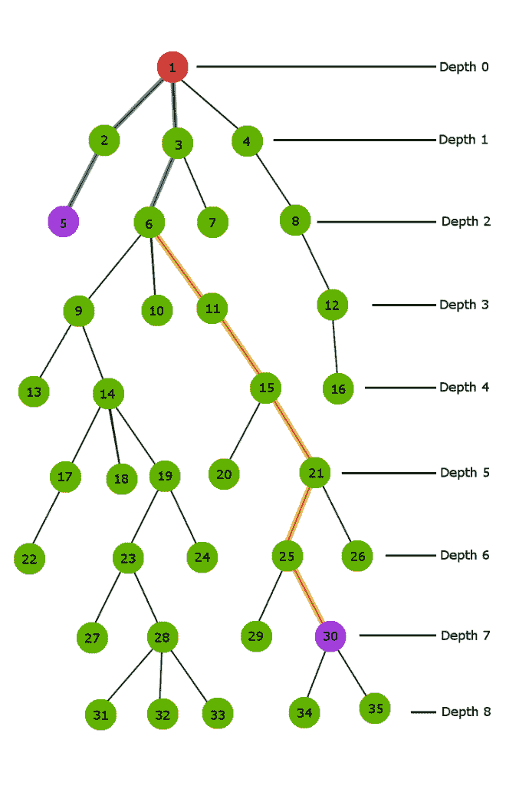
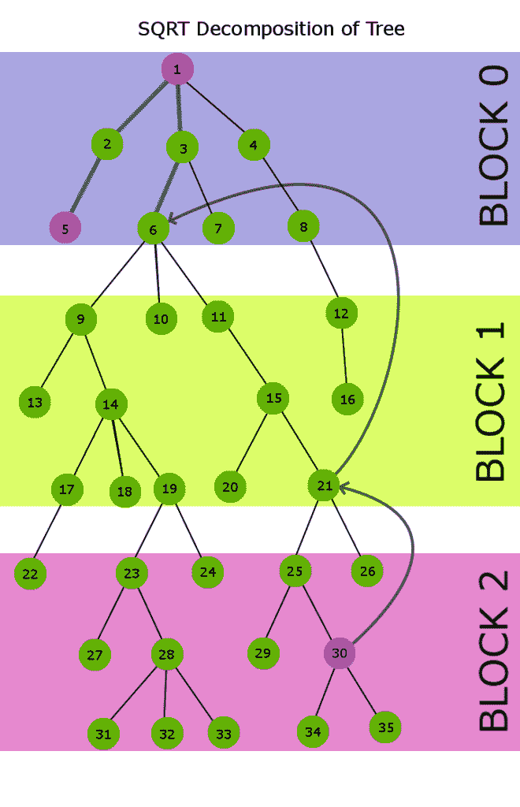

# Sqrt(或平方根)分解|集合 2(树在 O(sqrt(高度))时间内的 LCA)

> 原文:[https://www . geesforgeks . org/sqrt-平方根-分解-集合-2-lca-tree-osqrth-time/](https://www.geeksforgeeks.org/sqrt-square-root-decomposition-set-2-lca-tree-osqrth-time/)

先决条件:[简介](https://www.geeksforgeeks.org/sqrt-square-root-decomposition-technique-set-1-introduction/)和 [DFS](https://www.geeksforgeeks.org/depth-first-traversal-for-a-graph/)
任务是找到一棵树(不一定是二叉树)中两个给定节点的 LCA。在之前的帖子中，我们已经看到了如何使用[稀疏矩阵 DP 方法](https://www.geeksforgeeks.org/lca-for-general-or-n-ary-trees-sparse-matrix-dp-approach-onlogn-ologn/)计算[生命周期评价。在这篇文章中，我们将看到通过 sqrt 分解技术对朴素方法进行的优化，它比朴素方法运行得更好。](https://www.geeksforgeeks.org/lca-for-general-or-n-ary-trees-sparse-matrix-dp-approach-onlogn-ologn/)

**天真的方法**
首先计算两个节点的生命周期评价，我们将通过使深度更大的节点从一个父节点跳到树上，直到两个节点处于相同的高度，从而将两个节点带到相同的高度。一旦两个节点处于相同的高度，我们就可以开始同时为两个节点跳过一个父节点，直到两个节点相等，并且该节点将是两个最初给定节点的生命周期评价。

考虑下面深度为 9 的 n 元树，让我们来看看这个简单的方法是如何在这个样本树中工作的。



**在上面的树中，我们需要计算节点 6 和节点 30 的生命周期评价**
显然，节点 30 比节点 6 有更大的深度。因此，首先，我们开始在节点 30 上方跳过一个父节点，直到到达节点 6 的深度值，即深度 2。

上图中的**橙色路径**演示了到达深度 2 的跳跃顺序。在这个过程中，我们只需在当前节点上跳转一个父节点。

现在两个节点都在相同的深度 2。因此，现在两个节点将跳过一个父节点，直到两个节点变得相等。两个节点第一次变得相等的这个端节点就是我们的 LCA。
上图中的**蓝色路径**显示了两个节点的跳跃路线

**上述实施的代码:-**

## C++

```
// Naive C++ implementation to find LCA in a tree
#include<bits/stdc++.h>
using namespace std;
#define MAXN 1001

int depth[MAXN];           // stores depth for each node
int parent[MAXN];          // stores first parent for each node

vector < int > adj[MAXN];

void addEdge(int u,int v)
{
    adj[u].push_back(v);
    adj[v].push_back(u);
}

void dfs(int cur, int prev)
{
    // marking parent for each node
    parent[cur] = prev;

    // marking depth for each node
    depth[cur] = depth[prev] + 1;

    // propogating marking down the tree
    for (int i=0; i<adj[cur].size(); i++)
        if (adj[cur][i] != prev)
            dfs(adj[cur][i],cur);
}

void preprocess()
{
    // a dummy node
    depth[0] = -1;

    // precalclating 1)depth.  2)parent.
    // for each node
    dfs(1,0);
}

// Time Complexity : O(Height of tree)
// recursively jumps one node above
// till both the nodes become equal
int LCANaive(int u,int v)
{
    if (u == v)  return u;
    if (depth[u] > depth[v])
        swap(u, v);
    v = parent[v];
    return LCANaive(u,v);
}

// Driver function to call the above functions
int main(int argc, char const *argv[])
{
    // adding edges to the tree
    addEdge(1,2);
    addEdge(1,3);
    addEdge(1,4);
    addEdge(2,5);
    addEdge(2,6);
    addEdge(3,7);
    addEdge(4,8);
    addEdge(4,9);
    addEdge(9,10);
    addEdge(9,11);
    addEdge(7,12);
    addEdge(7,13);

    preprocess();

    cout << "LCA(11,8) : " << LCANaive(11,8) << endl;
    cout << "LCA(3,13) : " << LCANaive(3,13) << endl;

    return 0;
}
```

## Java 语言(一种计算机语言，尤用于创建网站)

```
// Naive Java implementation to find LCA in a tree.
import java.io.*;
import java.util.*;

class GFG
{
    static int MAXN = 1001;

    // stores depth for each node
    static int[] depth = new int[MAXN];

     // stores first parent for each node
    static int[] parent = new int[MAXN];

    @SuppressWarnings("unchecked")
    static Vector<Integer>[] adj = new Vector[MAXN];
    static
    {
        for (int i = 0; i < MAXN; i++)
            adj[i] = new Vector<>();
    }

    static void addEdge(int u, int v)
    {
        adj[u].add(v);
        adj[v].add(u);
    }

    static void dfs(int cur, int prev)
    {

        // marking parent for each node
        parent[cur] = prev;

        // marking depth for each node
        depth[cur] = depth[prev] + 1;

        // propogating marking down the tree
        for (int i = 0; i < adj[cur].size(); i++)
            if (adj[cur].elementAt(i) != prev)
                dfs(adj[cur].elementAt(i), cur);
    }

    static void preprocess()
    {

        // a dummy node
        depth[0] = -1;

        // precalclating 1)depth. 2)parent.
        // for each node
        dfs(1, 0);
    }

    // Time Complexity : O(Height of tree)
    // recursively jumps one node above
    // till both the nodes become equal
    static int LCANaive(int u, int v)
    {
        if (u == v)
            return u;
        if (depth[u] > depth[v])
        {
            int temp = u;
            u = v;
            v = temp;
        }
        v = parent[v];
        return LCANaive(u, v);
    }

    // Driver Code
    public static void main(String[] args)
    {

        // adding edges to the tree
        addEdge(1, 2);
        addEdge(1, 3);
        addEdge(1, 4);
        addEdge(2, 5);
        addEdge(2, 6);
        addEdge(3, 7);
        addEdge(4, 8);
        addEdge(4, 9);
        addEdge(9, 10);
        addEdge(9, 11);
        addEdge(7, 12);
        addEdge(7, 13);

        preprocess();

        System.out.println("LCA(11,8) : " + LCANaive(11, 8));
        System.out.println("LCA(3,13) : " + LCANaive(3, 13));
    }
}

// This code is contributed by
// sanjeev2552
```

## 蟒蛇 3

```
# Python3 implementation to
# find LCA in a tree
MAXN = 1001

# stores depth for each node
depth = [0 for i in range(MAXN)];

# stores first parent for each node
parent = [0 for i in range(MAXN)];         

adj = [[] for i in range(MAXN)]

def addEdge(u, v):

    adj[u].append(v);
    adj[v].append(u);

def dfs(cur, prev):

    # marking parent for
    # each node
    parent[cur] = prev;

    # marking depth for
    # each node
    depth[cur] = depth[prev] + 1;

    # propogating marking down
    # the tree
    for i in range(len(adj[cur])):   
        if (adj[cur][i] != prev):
            dfs(adj[cur][i], cur);

def preprocess():

    # a dummy node
    depth[0] = -1;

    # precalculating 1)depth. 
    # 2)parent. for each node
    dfs(1, 0);

# Time Complexity : O(Height of tree)
# recursively jumps one node above
# till both the nodes become equal
def LCANaive(u, v):

    if (u == v):
        return u;

    if (depth[u] > depth[v]):
        u, v = v, u

    v = parent[v];   
    return LCANaive(u, v);

# Driver code
if __name__ == "__main__":

    # adding edges to the tree
    addEdge(1, 2);
    addEdge(1, 3);
    addEdge(1, 4);
    addEdge(2, 5);
    addEdge(2, 6);
    addEdge(3, 7);
    addEdge(4, 8);
    addEdge(4, 9);
    addEdge(9, 10);
    addEdge(9, 11);
    addEdge(7, 12);
    addEdge(7, 13);

    preprocess();

    print('LCA(11,8) : ' +
           str(LCANaive(11, 8)))
    print('LCA(3,13) : ' +
           str(LCANaive(3, 13)))

# This code is contributed by RUtvik_56
```

## C#

```
// Naive C# implementation to find
// LCA in a tree.
using System;
using System.Collections;

class GFG{

static int MAXN = 1001;

// Stores depth for each node
static int[] depth = new int[MAXN];

// Stores first parent for each node
static int[] parent = new int[MAXN];

static ArrayList[] adj = new ArrayList[MAXN];

static void addEdge(int u, int v)
{
    adj[u].Add(v);
    adj[v].Add(u);
}

static void dfs(int cur, int prev)
{

    // Marking parent for each node
    parent[cur] = prev;

    // Marking depth for each node
    depth[cur] = depth[prev] + 1;

    // Propogating marking down the tree
    for(int i = 0; i < adj[cur].Count; i++)
        if ((int)adj[cur][i] != prev)
            dfs((int)adj[cur][i], cur);
}

static void preprocess()
{

    // A dummy node
    depth[0] = -1;

    // Precalclating 1)depth. 2)parent.
    // for each node
    dfs(1, 0);
}

// Time Complexity : O(Height of tree)
// recursively jumps one node above
// till both the nodes become equal
static int LCANaive(int u, int v)
{
    if (u == v)
        return u;

    if (depth[u] > depth[v])
    {
        int temp = u;
        u = v;
        v = temp;
    }
    v = parent[v];
    return LCANaive(u, v);
}

// Driver Code
public static void Main(string[] args)
{
    for(int i = 0; i < MAXN; i++)
        adj[i] = new ArrayList();

    // Adding edges to the tree
    addEdge(1, 2);
    addEdge(1, 3);
    addEdge(1, 4);
    addEdge(2, 5);
    addEdge(2, 6);
    addEdge(3, 7);
    addEdge(4, 8);
    addEdge(4, 9);
    addEdge(9, 10);
    addEdge(9, 11);
    addEdge(7, 12);
    addEdge(7, 13);

    preprocess();

    Console.WriteLine("LCA(11, 8) : " +
                       LCANaive(11, 8));
    Console.WriteLine("LCA(3, 13) : " +
                       LCANaive(3, 13));
}
}

// This code is contributed by pratham76
```

## java 描述语言

```
<script>
// Naive Javascript implementation to find
// LCA in a tree.
var MAXN = 1001;

// Stores depth for each node
var depth = Array(MAXN);

// Stores first parent for each node
var parent = Array(MAXN);

var adj = Array.from(Array(MAXN), ()=>Array());

function addEdge(u, v)
{
    adj[u].push(v);
    adj[v].push(u);
}

function dfs(cur, prev)
{

    // Marking parent for each node
    parent[cur] = prev;

    // Marking depth for each node
    depth[cur] = depth[prev] + 1;

    // Propogating marking down the tree
    for(var i = 0; i < adj[cur].length; i++)
        if (adj[cur][i] != prev)
            dfs(adj[cur][i], cur);
}

function preprocess()
{

    // A dummy node
    depth[0] = -1;

    // Precalclating 1)depth. 2)parent.
    // for each node
    dfs(1, 0);
}

// Time Complexity : O(Height of tree)
// recursively jumps one node above
// till both the nodes become equal
function LCANaive(u, v)
{
    if (u == v)
        return u;

    if (depth[u] > depth[v])
    {
        var temp = u;
        u = v;
        v = temp;
    }
    v = parent[v];
    return LCANaive(u, v);
}

// Driver Code
for(var i = 0; i < MAXN; i++)
    adj[i] = [];

// Adding edges to the tree
addEdge(1, 2);
addEdge(1, 3);
addEdge(1, 4);
addEdge(2, 5);
addEdge(2, 6);
addEdge(3, 7);
addEdge(4, 8);
addEdge(4, 9);
addEdge(9, 10);
addEdge(9, 11);
addEdge(7, 12);
addEdge(7, 13);
preprocess();
document.write("LCA(11, 8) : " +
                   LCANaive(11, 8)+"<br>");
document.write("LCA(3, 13) : " +
                   LCANaive(3, 13));

// This code is contributed by famously.
</script>
```

**Output:** 

```
LCA(11,8) : 4
LCA(3,13) : 3
```

**时间复杂度**:我们使用 O(n) 中的一个 **DFS 遍历来预先计算每个节点的深度。现在，在最坏的情况下，这两个节点将是根节点的不同子分支中树的两个最底部的节点。因此，在这种情况下，根将是两个节点的生命周期评价。因此，两个节点都必须精确地跳到 h 高度以上，其中 h 是树的高度。因此，回答每个**生命周期评价查询的时间复杂度将为 0(h)**。**

**Sqrt 分解技巧:**
我们根据深度将树的节点分为不同的组。假设树 h 的深度是一个完美的正方形。所以再次像[一般的 sqrt 分解方法](https://www.geeksforgeeks.org/sqrt-square-root-decomposition-technique-set-1-introduction/)一样，我们将拥有 sqrt(h)块或组。深度 *0 至深度 sqrt(h)–1*的节点位于第一组；那么深度为 *sqrt(H)到 2*sqrt(h)-1* 的节点位于第二组，以此类推，直到最后一个节点。
我们跟踪每个节点对应的组号以及每个节点的深度。这可以通过树上的一个单独的 dfs 来完成(为了更好的理解，请参见代码)。

**Sqrt 技巧** :-在天真的方法中，我们将一个父节点跳到树上，直到两个节点不在同一深度。但是在这里，我们进行分组跳跃。为了执行这种分组方式的跳转，我们需要与每个节点相关联的两个参数:1)父节点和 2)跳转父节点
这里每个节点的**父节点**被定义为直接连接到它的当前节点之上的第一个节点，而每个节点的 **jump_parent** 是当前节点之上的组中当前节点的第一个祖先节点。

所以，现在我们需要为每个节点维护 3 个参数:
**1)深度**
**2)父节点**
**3)jump _ parent**
这三个参数都可以在一个 dfs 中维护(为了更好的理解，请参考代码)

**优化过程的伪代码**

```
  LCAsqrt(u, v){

       *// assuming v is at greater depth*
       while (jump_parent[u]!=jump_parent[v]){       
            v = jump_parent[v]; 
       } 

       *// now both nodes are in same group*
       *// and have same jump_parent*
       return LCAnaive(u,v); 
    }
```

这里的关键概念是，首先我们将两个节点都放在同一个组中，并且通过逐个爬上树上方的分解块来拥有相同的跳转父节点，然后当两个节点都在同一个组中并且拥有相同的跳转父节点时，我们使用我们的天真方法来寻找节点的生命周期评价。
这种优化的组跳跃技术将迭代空间减少了 **sqrt(h)** 的一个因子，因此降低了时间复杂度(参考下面更好的时间复杂度分析)

让我们将上面的树分解为 sqrt(h)组(h = 9)并计算节点 6 和 30 的生命周期评价。



在上面分解的树上

```
Jump_parent[6]  =  0        parent[6]  =  3
Jump_parent[5]  =  0        parent[5]  =  2
Jump_parent[1]  =  0        parent[1]  =  0 
Jump_parent[11] =  6        parent[11] =  6 
Jump_parent[15] =  6        parent[15] = 11 
Jump_parent[21] =  6        parent[21] = 15
Jump_parent[25] = 21        parent[25] = 21 
Jump_parent[26] = 21        parent[26] = 21 
Jump_parent[30] = 21        parent[30] = 25
```

现在在这个阶段，节点 30 的 Jump_parent 是 21，节点 5 的 Jump_parent 是 0，所以我们将爬升到 jump_parent[30]即节点 21
现在节点 21 的 jump_parent 又一次不等于节点 5 的 Jump_parent，所以我们将再次爬升到 jump_parent[21]即节点 6
在这个阶段 jump_parent[6] == jump_parent[5]，所以现在我们将使用我们的天真的爬升方法，为两个节点爬升一个父节点直到上图中
**蓝色路径**描述了节点 6 和节点 5 的跳跃路径序列。

**上述描述的 C++代码如下:-**

## C++

```
// C++ program to find LCA using Sqrt decomposition
#include "iostream"
#include "vector"
#include "math.h"
using namespace std;
#define MAXN 1001

int block_sz;          // block size = sqrt(height)
int depth[MAXN];       // stores depth for each node
int parent[MAXN];      // stores first parent for
                       // each node
int jump_parent[MAXN]; // stores first ancestor in
                       // previous block

vector < int > adj[MAXN];

void addEdge(int u,int v)
{
    adj[u].push_back(v);
    adj[v].push_back(u);
}

int LCANaive(int u,int v)
{
    if (u == v)  return u;
    if (depth[u] > depth[v])
        swap(u,v);
    v = parent[v];
    return LCANaive(u,v);
}

// precalculating the required parameters
// associated with every node
void dfs(int cur, int prev)
{
    // marking depth of cur node
    depth[cur] = depth[prev] + 1;

    // marking parent of cur node
    parent[cur] = prev;

    // making jump_parent of cur node
    if (depth[cur] % block_sz == 0)

        /* if it is first node of the block
           then its jump_parent is its cur parent */
        jump_parent[cur] = parent[cur];

    else

        /* if it is not the first node of this block
           then its jump_parent is jump_parent of
           its parent */
        jump_parent[cur] = jump_parent[prev];

    // propogating the marking down the subtree
    for (int i = 0; i<adj[cur].size(); ++i)
        if (adj[cur][i] != prev)
            dfs(adj[cur][i], cur);
}

// using sqrt decomposition trick
int LCASQRT(int u, int v)
{
    while (jump_parent[u] != jump_parent[v])
    {
        if (depth[u] > depth[v])

            // maintaining depth[v] > depth[u]
            swap(u,v);

        // climb to its jump parent
        v = jump_parent[v];
    }

    // u and v have same jump_parent
    return LCANaive(u,v);
}

void preprocess(int height)
{
    block_sz = sqrt(height);
    depth[0] = -1;

    // precalclating 1)depth.  2)parent.  3)jump_parent
    // for each node
    dfs(1, 0);
}

// Driver function to call the above functions
int main(int argc, char const *argv[])
{
    // adding edges to the tree
    addEdge(1,2);
    addEdge(1,3);
    addEdge(1,4);
    addEdge(2,5);
    addEdge(2,6);
    addEdge(3,7);
    addEdge(4,8);
    addEdge(4,9);
    addEdge(9,10);
    addEdge(9,11);
    addEdge(7,12);
    addEdge(7,13);

    // here we are directly taking height = 4
    // according to the given tree but we can
    // pre-calculate height = max depth
    // in one more dfs
    int height = 4;
    preprocess(height);

    cout << "LCA(11,8) : " << LCASQRT(11,8) << endl;
    cout << "LCA(3,13) : " << LCASQRT(3,13) << endl;

    return 0;
}
```

## Java 语言(一种计算机语言，尤用于创建网站)

```
// Java program to find LCA using Sqrt decomposition
import java.util.*;
class GFG
{
static final int MAXN = 1001;

static int block_sz;          // block size = Math.sqrt(height)
static int []depth = new int[MAXN];       // stores depth for each node
static int []parent = new int[MAXN];      // stores first parent for
                       // each node
static int []jump_parent = new int[MAXN]; // stores first ancestor in
                       // previous block

static Vector <Integer > []adj = new Vector[MAXN];

static void addEdge(int u,int v)
{
    adj[u].add(v);
    adj[v].add(u);
}

static int LCANaive(int u,int v)
{
    if (u == v)  return u;
    if (depth[u] > depth[v])
    {
        int t = u;
        u = v;
        v = t;
    }    
    v = parent[v];
    return LCANaive(u, v);
}

// precalculating the required parameters
// associated with every node
static void dfs(int cur, int prev)
{

    // marking depth of cur node
    depth[cur] = depth[prev] + 1;

    // marking parent of cur node
    parent[cur] = prev;

    // making jump_parent of cur node
    if (depth[cur] % block_sz == 0)

        /* if it is first node of the block
           then its jump_parent is its cur parent */
        jump_parent[cur] = parent[cur];
    else

        /* if it is not the first node of this block
           then its jump_parent is jump_parent of
           its parent */
        jump_parent[cur] = jump_parent[prev];

    // propogating the marking down the subtree
    for (int i = 0; i < adj[cur].size(); ++i)
        if (adj[cur].get(i) != prev)
            dfs(adj[cur].get(i), cur);
}

// using sqrt decomposition trick
static int LCASQRT(int u, int v)
{
    while (jump_parent[u] != jump_parent[v])
    {
        if (depth[u] > depth[v])
        {

            // maintaining depth[v] > depth[u]
            int t = u;
            u = v;
            v = t;
        }

        // climb to its jump parent
        v = jump_parent[v];
    }

    // u and v have same jump_parent
    return LCANaive(u, v);
}

static void preprocess(int height)
{
    block_sz = (int)Math.sqrt(height);
    depth[0] = -1;

    // precalclating 1)depth.  2)parent.  3)jump_parent
    // for each node
    dfs(1, 0);
}

// Driver code
public static void  main(String []args)
{
    for (int i = 0; i < adj.length; i++)
        adj[i] = new Vector<Integer>();

    // adding edges to the tree
    addEdge(1, 2);
    addEdge(1, 3);
    addEdge(1, 4);
    addEdge(2, 5);
    addEdge(2, 6);
    addEdge(3, 7);
    addEdge(4, 8);
    addEdge(4, 9);
    addEdge(9, 10);
    addEdge(9, 11);
    addEdge(7, 12);
    addEdge(7, 13);

    // here we are directly taking height = 4
    // according to the given tree but we can
    // pre-calculate height = max depth
    // in one more dfs
    int height = 4;
    preprocess(height);
    System.out.print("LCA(11,8) : " +  LCASQRT(11, 8) +"\n");
    System.out.print("LCA(3,13) : " +  LCASQRT(3, 13) +"\n");
}
}

// This code is contributed by aashish1995.
```

## C#

```
// C# program to find LCA using Sqrt decomposition
using System;
using System.Collections.Generic;
public class GFG
{
  static readonly int MAXN = 1001;

  static int block_sz;          // block size = Math.Sqrt(height)
  static int []depth = new int[MAXN];       // stores depth for each node
  static int []parent = new int[MAXN];      // stores first parent for
  // each node
  static int []jump_parent = new int[MAXN]; // stores first ancestor in
  // previous block

  static List <int > []adj = new List<int>[MAXN];
  static void addEdge(int u, int v)
  {
    adj[u].Add(v);
    adj[v].Add(u);
  }

  static int LCANaive(int u, int v)
  {
    if (u == v)  return u;
    if (depth[u] > depth[v])
    {
      int t = u;
      u = v;
      v = t;
    }    
    v = parent[v];
    return LCANaive(u, v);
  }

  // precalculating the required parameters
  // associated with every node
  static void dfs(int cur, int prev)
  {

    // marking depth of cur node
    depth[cur] = depth[prev] + 1;

    // marking parent of cur node
    parent[cur] = prev;

    // making jump_parent of cur node
    if (depth[cur] % block_sz == 0)

      /* if it is first node of the block
           then its jump_parent is its cur parent */
      jump_parent[cur] = parent[cur];
    else

      /* if it is not the first node of this block
           then its jump_parent is jump_parent of
           its parent */
      jump_parent[cur] = jump_parent[prev];

    // propogating the marking down the subtree
    for (int i = 0; i < adj[cur].Count; ++i)
      if (adj[cur][i] != prev)
        dfs(adj[cur][i], cur);
  }

  // using sqrt decomposition trick
  static int LCASQRT(int u, int v)
  {
    while (jump_parent[u] != jump_parent[v])
    {
      if (depth[u] > depth[v])
      {

        // maintaining depth[v] > depth[u]
        int t = u;
        u = v;
        v = t;
      }

      // climb to its jump parent
      v = jump_parent[v];
    }

    // u and v have same jump_parent
    return LCANaive(u, v);
  }

  static void preprocess(int height)
  {
    block_sz = (int)Math.Sqrt(height);
    depth[0] = -1;

    // precalclating 1)depth.  2)parent.  3)jump_parent
    // for each node
    dfs(1, 0);
  }

  // Driver code
  public static void  Main(String []args)
  {
    for (int i = 0; i < adj.Length; i++)
      adj[i] = new List<int>();

    // adding edges to the tree
    addEdge(1, 2);
    addEdge(1, 3);
    addEdge(1, 4);
    addEdge(2, 5);
    addEdge(2, 6);
    addEdge(3, 7);
    addEdge(4, 8);
    addEdge(4, 9);
    addEdge(9, 10);
    addEdge(9, 11);
    addEdge(7, 12);
    addEdge(7, 13);

    // here we are directly taking height = 4
    // according to the given tree but we can
    // pre-calculate height = max depth
    // in one more dfs
    int height = 4;
    preprocess(height);
    Console.Write("LCA(11,8) : " +  LCASQRT(11, 8) +"\n");
    Console.Write("LCA(3,13) : " +  LCASQRT(3, 13) +"\n");
  }
}

// This code is contributed by Rajput-Ji
```

## java 描述语言

```
<script>

// Javascript program to find LCA
// using Sqrt decomposition
let MAXN = 1001;

// Block size = Math.sqrt(height)
let block_sz;   

// Stores depth for each node
let depth = new Array(MAXN); 

// Stores first parent for
// each node
let parent = new Array(MAXN);     

// Stores first ancestor in
// previous block
let jump_parent = new Array(MAXN);
let adj = new Array(MAXN);

function addEdge(u, v)
{
    adj[u].push(v);
    adj[v].push(u);
}

function LCANaive(u, v)
{
    if (u == v) 
        return u;

    if (depth[u] > depth[v])
    {
        let t = u;
        u = v;
        v = t;
    }   
    v = parent[v];
    return LCANaive(u, v);
}

// Precalculating the required parameters
// associated with every node
function dfs(cur, prev)
{

    // Marking depth of cur node
    depth[cur] = depth[prev] + 1;

    // Marking parent of cur node
    parent[cur] = prev;

    // Making jump_parent of cur node
    if (depth[cur] % block_sz == 0)

        // If it is first node of the block
        // then its jump_parent is its cur parent
        jump_parent[cur] = parent[cur];
    else

        // If it is not the first node of this block
        // then its jump_parent is jump_parent of
        // its parent
        jump_parent[cur] = jump_parent[prev];

    // Propogating the marking down the subtree
    for(let i = 0; i < adj[cur].length; ++i)
        if (adj[cur][i] != prev)
            dfs(adj[cur][i], cur);
}

// Using sqrt decomposition trick
function LCASQRT(u, v)
{
    while (jump_parent[u] != jump_parent[v])
    {
        if (depth[u] > depth[v])
        {

            // Maintaining depth[v] > depth[u]
            let t = u;
            u = v;
            v = t;
        }

        // Climb to its jump parent
        v = jump_parent[v];
    }

    // u and v have same jump_parent
    return LCANaive(u, v);
}

function preprocess(height)
{
    block_sz = parseInt(Math.sqrt(height), 10);
    depth[0] = -1;

    // Precalclating 1)depth.  2)parent.  3)
    // jump_parent for each node
    dfs(1, 0);
}

// Driver code
for(let i = 0; i < adj.length; i++)
    adj[i] = [];

// Adding edges to the tree
addEdge(1, 2);
addEdge(1, 3);
addEdge(1, 4);
addEdge(2, 5);
addEdge(2, 6);
addEdge(3, 7);
addEdge(4, 8);
addEdge(4, 9);
addEdge(9, 10);
addEdge(9, 11);
addEdge(7, 12);
addEdge(7, 13);

// Here we are directly taking height = 4
// according to the given tree but we can
// pre-calculate height = max depth
// in one more dfs
let height = 4;
preprocess(height);
document.write("LCA(11,8) : " + 
               LCASQRT(11, 8) + "</br>");
document.write("LCA(3,13) : " + 
               LCASQRT(3, 13) + "</br>");

// This code is contributed by divyeshrabadiya07

</script>
```

**输出:**

```
LCA(11,8) : 4
LCA(3,13) : 3
```

**注:**以上代码即使高度不是完美的正方形也能工作。

现在让我们看看时间复杂性是如何通过这种简单的分组技术改变的:

**时间复杂度分析:**
我们根据深度将树分为 sqrt(h)组，每组包含深度最大差值等于 sqrt(h)的节点。现在再举一个最坏情况的例子，假设第一个节点“u”在第一组，节点“v”在第 sqrt(h)组(最后一组)。所以，首先我们会进行小组跳跃(单个小组跳跃)，直到我们从最后一组到达第一组；这将需要 sqrt(h)-1 次迭代或跳跃。所以，直到这一步，时间复杂度是 **O(sqrt(h))** 。
现在一旦我们在同一个组中，我们就调用 LCAnaive 函数。LCA_Naive 的时间复杂度是 O(sqrt(h’)，其中 h’是树的高度。现在，在我们的例子中，h’的值将是 sqrt(h)，因为每个组都有一个在最大 sqrt(h)高度的子树。所以这一步的复杂度也是 O(sqrt(h))。

因此，总时间复杂度将为**O(sqrt(h)+sqrt(h))~ O(sqrt(h))**。

本文由 [**尼提什·库马尔**](https://in.linkedin.com/in/nk17kumar) 供稿。如果你喜欢 GeeksforGeeks 并想投稿，你也可以使用[write.geeksforgeeks.org](https://write.geeksforgeeks.org)写一篇文章或者把你的文章邮寄到 review-team@geeksforgeeks.org。看到你的文章出现在极客博客主页上，帮助其他极客。
如果发现有不正确的地方，或者想分享更多关于上述话题的信息，请写评论。