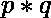
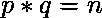
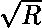
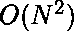
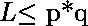
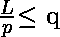
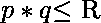
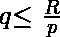
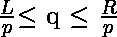
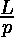

# 使用 C++ STL 在给定范围内的正方形自由半原色

> 原文:[https://www . geesforgeks . org/square-free-semi primes-in-a-给定范围-use-c-STL/](https://www.geeksforgeeks.org/square-free-semiprimes-in-a-given-range-using-c-stl/)

给定两个整数 **L** 和 **R** (L < = R)。任务是找到从左到右(包括左和右)范围内的所有正方形自由[半原色](https://www.geeksforgeeks.org/check-whether-number-semiprime-not/)。

**示例:**

> **输入:** L = 1，R = 10
> T3】输出: 2
> 4，6，9，10 为半素数。但是 6，10 是平方自由半素数。
> 
> **输入:** L = 10，R = 20
> T3】输出: 3

**先决条件:** [厄拉多塞筛](https://www.geeksforgeeks.org/sieve-of-eratosthenes/)[上下界](https://www.geeksforgeeks.org/upper_bound-and-lower_bound-for-vector-in-cpp-stl/)

**理解:**
半素数是形式为的数，其中 p 和 q 是素数，不一定是截然不同的。所有半素只有 4 个因子，其中 p 和 q 是仅有的两个素因子。

**天真方法:**
预计算所有素数直到 **** 。找出两个质数 **p** 和 **q** 的所有组合，使在 **L** 和 **R** 之间。迭代质数的所有组合会产生时间复杂度。然而，该解决方案不适用于大的 **L** 和 **R** 值。

**时间复杂度:** O(N^2)

**有效方法:**
预计算所有素数直到。我们可以把寻找两个素数 p 和 q 的问题分成更简单的形式。
作为我们可以说。类似于我们可以说。
现在问题简化为寻找 q 的计数，使得为所有 p。

在这里，我们可以使用二分搜索法从素数列表中找到的[上界](https://www.geeksforgeeks.org/upper_bound-and-lower_bound-for-vector-in-cpp-stl/)，并从素数列表中的[下界](https://www.geeksforgeeks.org/upper_bound-and-lower_bound-for-vector-in-cpp-stl/)的索引中减去它，以找到给定的 **p** 范围内所有 **q** 的计数。对所有素数重复上述步骤 **p** 将给出给定范围 **L** 到 **R** 的答案

下面是上述方法的实现:

```
// CPP program to find square free semiprimes in the range
#include <bits/stdc++.h>
using namespace std;

#define N 78498

void Sieve(int pre[])
{
    // Max size of prime array
    int MX = 1e6;

    // Array of prime of size 1000001.
    // will be marked true for prime, false otherwise
    // i     = [0, 1, 2, 3, 4, 5, 6, 7, 8, 9, ...]
    // prime = {0, 0, 1, 1, 0, 1, 0, 1, 0, 0, ...}
    bool prime[MX + 1];

    // i -> keeps track of index of prime 
    // (current integer)
    // idx -> keeps track of index of pre
    int i = 2;
    int idx = 0;

    // Initialize all entries to true
    memset(prime, true, sizeof(prime));

    // For all i from 2 to MX iterate
    for (i = 2; i <= MX; i++)
    {
        // If i is prime
        if (prime[i]) 
        {
            // Set idx'th index of pre as i and 
            // increment idx after setting the value
            pre[idx++] = i;

            // For all multiple of i from 2*i to MX
            // mark them as false i.e. not prime
            for (int j = (i << 1); j <= MX; j += i)
                prime[j] = false;
        }
    }
}

// Function to find square free semi primes in the range
int semiPrimeCount(int L, int R)
{

    // Array of prime integer
    // will contain first 78498 primes
    // idx = [0, 1, 2, 3, 4, 5, 6, 7, 8, 9, ...]
    // pre = {2, 3, 5, 7, 11, 13, 17, 19, 23, 29, ...}
    int pre[N];

    // Prepare pre array
    Sieve(pre);

    // Result of current query
    int res = 0;

    // Offset index from start
    int j = 1;

    // For all prime integers p in pre 
    // from 2 to sqrt(R) iterate
    for (auto p : pre) {
        // ub_num     = count of all multiple of p less 
        //             than R => p = R/p
        //
        // ub     = iterator of first element greater 
        //         than ub_num in pre
        //
        int ub_num = R / p;
        auto ub = upper_bound(pre + j, pre + N, ub_num);

        // lb_num     = count of all multiple of p 
        //             less than L => p = L/p
        // If L is divisible by p increment p by 
        // 1 => p = p+1 = p+(L%p>0)
        //
        // lb     = iterator of first element greater 
        //         than or equal lb_num in pre

        int lb_num = (L / p) + ((L % p) > 0);
        auto lb = lower_bound(pre + j, pre + N, lb_num);

        // Add the difference between ub and lb
        res += ub - lb;

        // Increment j
        j++;

        // If prime p is greater than or equal to sqrt(R)
        if (p * p >= R)
            break;
    }
    return res;
}

// Driver code
int main()
{
    int L = 10, R = 20;

    // Function call
    cout << semiPrimeCount(L, R);

    return 0;
}
```

**Output:**

```
3

```

**时间复杂度:** O(N*logN)