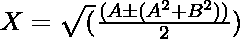
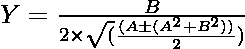

# 两个复数的平方根

> 原文:[https://www . geeksforgeeks . org/两位复数的平方根/](https://www.geeksforgeeks.org/square-root-of-two-complex-numbers/)

给定两个正整数 **A** 和 **B** 以 **Z = A + i * B** 的形式表示[复数](https://www.geeksforgeeks.org/complex-numbers-c-set-1/) **Z** ，任务是求给定复数的[平方根](https://www.geeksforgeeks.org/square-root-of-an-integer/)。

**示例:**

> **输入:** A = 0，B =1
> **输出:**
> 平方根为:
> 0.707107+0.707107 * I
> -0.707107–0.707107 * I
> 
> **输入:** A = 4，B = 0
> **输出:**
> 平方根为:
> 2
> -2

**方法:**给定的问题可以基于以下观察来解决:

*   已知一个[复数](https://www.geeksforgeeks.org/complex-numbers-c-set-1/)的平方根也是一个复数。
*   然后考虑复数的平方根等于 **X + i*Y** ， **(A + i*B)** 的值可以表示为:
    *   **A + i * B = (X + i * Y) * (X + i * Y)**
    *   **A+I * B = X<sup>2</sup>–Y<sup>2</sup>+2 * I * X * Y**
*   将真实零件和复杂零件的价值分别等同起来:
    *   
    *   

根据以上观察，使用上述公式计算 **X** 和 **Y** 的值，并将值 **(X + i*Y)** 打印为给定复数的合成平方根值。

下面是上述方法的实现:

## C++

```
// C++ program for the above approach

#include <bits/stdc++.h>
using namespace std;

// Function to find the square root of
// a complex number
void complexRoot(int A, int B)
{
    // Stores all the square roots
    vector<pair<double, double> > ans;

    // Stores the first square root
    double X1 = abs(sqrt((A + sqrt(A * A
                                   + B * B))
                         / 2));
    double Y1 = B / (2 * X1);

    // Push the square root in the ans
    ans.push_back({ X1, Y1 });

    // Stores the second square root
    double X2 = -1 * X1;
    double Y2 = B / (2 * X2);

    // If X2 is not 0
    if (X2 != 0) {

        // Push the square root in
        // the array ans[]
        ans.push_back({ X2, Y2 });
    }

    // Stores the third square root
    double X3 = (A - sqrt(A * A + B * B)) / 2;

    // If X3 is greater than 0
    if (X3 > 0) {
        X3 = abs(sqrt(X3));
        double Y3 = B / (2 * X3);

        // Push the square root in
        // the array ans[]
        ans.push_back({ X3, Y3 });

        // Stores the fourth square root
        double X4 = -1 * X3;
        double Y4 = B / (2 * X4);

        if (X4 != 0) {

            // Push the square root
            // in the array ans[]
            ans.push_back({ X4, Y4 });
        }
    }

    // Prints the square roots
    cout << "The Square roots are: "
         << endl;

    for (auto p : ans) {
        cout << p.first;
        if (p.second > 0)
            cout << "+";
        if (p.second)
            cout << p.second
                 << "*i" << endl;
        else
            cout << endl;
    }
}

// Driver Code
int main()
{
    int A = 0, B = 1;
    complexRoot(A, B);

    return 0;
}
```

## Java 语言(一种计算机语言，尤用于创建网站)

```
// Java program for the above approach
import java.util.*;

class GFG{

static class pair
{
    double first, second;
    public pair(double first,
                double second) 
    {
        this.first = first;
        this.second = second;
    }   
}

// Function to find the square root of
// a complex number
static void complexRoot(int A, int B)
{

    // Stores all the square roots
    Vector<pair> ans = new Vector<pair>();

    // Stores the first square root
    double X1 = Math.abs(Math.sqrt((A + Math.sqrt(A * A +
                                    B * B)) / 2));
    double Y1 = B / (2 * X1);

    // Push the square root in the ans
    ans.add(new pair( X1, Y1 ));

    // Stores the second square root
    double X2 = -1 * X1;
    double Y2 = B / (2 * X2);

    // If X2 is not 0
    if (X2 != 0)
    {

        // Push the square root in
        // the array ans[]
        ans.add(new pair(X2, Y2));
    }

    // Stores the third square root
    double X3 = (A - Math.sqrt(A * A + B * B)) / 2;

    // If X3 is greater than 0
    if (X3 > 0)
    {
        X3 = Math.abs(Math.sqrt(X3));
        double Y3 = B / (2 * X3);

        // Push the square root in
        // the array ans[]
        ans.add(new pair(X3, Y3));

        // Stores the fourth square root
        double X4 = -1 * X3;
        double Y4 = B / (2 * X4);

        if (X4 != 0)
        {

            // Push the square root
            // in the array ans[]
            ans.add(new pair(X4, Y4));
        }
    }

    // Prints the square roots
    System.out.print("The Square roots are: " + "\n");

    for(pair p : ans)
    {
        System.out.printf("%.4f", p.first);
        if (p.second > 0)
            System.out.print("+");
        if (p.second != 0)
            System.out.printf("%.4f*i\n", p.second);
        else
            System.out.println();
    }
}

// Driver Code
public static void main(String[] args)
{
    int A = 0, B = 1;

    complexRoot(A, B);
}
}

// This code is contributed by shikhasingrajput
```

## 蟒蛇 3

```
# Python3 program for the above approach
from math import sqrt

# Function to find the square root of
# a complex number
def complexRoot(A, B):

    # Stores all the square roots
    ans = []

    # Stores the first square root
    X1 = abs(sqrt((A + sqrt(A * A + B * B)) / 2))
    Y1 = B / (2 * X1)

    # Push the square root in the ans
    ans.append([X1, Y1])

    # Stores the second square root
    X2 = -1 * X1
    Y2 = B / (2 * X2)

    # If X2 is not 0
    if (X2 != 0):

        # Push the square root in
        # the array ans[]
        ans.append([X2, Y2])

    # Stores the third square root
    X3 = (A - sqrt(A * A + B * B)) / 2

    # If X3 is greater than 0
    if (X3 > 0):
        X3 = abs(sqrt(X3))
        Y3 = B / (2 * X3)

        # Push the square root in
        # the array ans[]
        ans.append([X3, Y3])

        # Stores the fourth square root
        X4 = -1 * X3
        Y4 = B / (2 * X4)

        if (X4 != 0):

            # Push the square root
            # in the array ans[]
            ans.append([X4, Y4])

    # Prints the square roots
    print("The Square roots are: ")

    for p in ans:
        print(round(p[0], 6), end = "")
        if (p[1] > 0):
            print("+", end = "")
        if (p[1]):
            print(str(round(p[1], 6)) + "*i")
        else:
            print()

# Driver Code
if __name__ == '__main__':

    A,B = 0, 1
    complexRoot(A, B)

# This code is contributed by mohit kumar 29
```

## java 描述语言

```
<script>

// Javascript program for the above approach

// Function to find the square root of
// a complex number
function complexRoot(A, B)
{
    // Stores all the square roots
    var ans = [];

    // Stores the first square root
    var X1 = Math.abs(Math.sqrt((A + Math.sqrt(A * A
                                   + B * B))
                         / 2));
    var Y1 = B / (2 * X1);

    // Push the square root in the ans
    ans.push([X1, Y1]);

    // Stores the second square root
    var X2 = -1 * X1;
    var Y2 = B / (2 * X2);

    // If X2 is not 0
    if (X2 != 0) {

        // Push the square root in
        // the array ans[]
        ans.push([X2, Y2]);
    }

    // Stores the third square root
    var X3 = (A - Math.sqrt(A * A + B * B)) / 2;

    // If X3 is greater than 0
    if (X3 > 0) {
        X3 = Math.abs(Math.sqrt(X3));
        var Y3 = B / (2 * X3);

        // Push the square root in
        // the array ans[]
        ans.push([X3, Y3]);

        // Stores the fourth square root
        var X4 = -1 * X3;
        var Y4 = B / (2 * X4);

        if (X4 != 0) {

            // Push the square root
            // in the array ans[]
            ans.push([X4, Y4]);
        }
    }

    // Prints the square roots
    document.write( "The Square roots are: <br>");

    ans.forEach(p => {
        document.write( p[0].toFixed(6));
        if (p[1] > 0)
            document.write( "+");
        if (p[1])
            document.write( p[1].toFixed(6)
                 + "*i<br>" );
        else
            document.write("<br>");
    });
}

// Driver Code
var A = 0, B = 1;
complexRoot(A, B);

</script>
```

**Output:** 

```
The Square roots are: 
0.707107+0.707107*i
-0.707107-0.707107*i
```

***时间复杂度:**O(1)*
T5**辅助空间:** O(1)