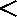
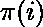
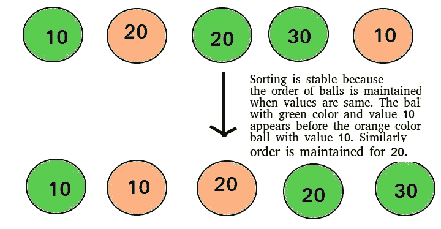
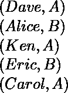
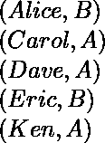
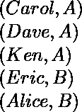
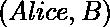
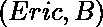
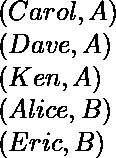

# 排序算法的稳定性

> 原文:[https://www . geeksforgeeks . org/稳定性排序算法/](https://www.geeksforgeeks.org/stability-in-sorting-algorithms/)

当我们有可能有重复键的键值对时(像人名作为键，他们的细节作为值)，稳定性是非常重要的。我们希望通过键来分类这些对象。

**是什么？**
如果两个具有相同键的对象在排序的输出中出现的顺序与它们在要排序的输入数组中出现的顺序相同，则排序算法被认为是稳定的。

形式上的稳定可以定义为，
让成为一个数组，让成为元素上的严格弱序。
如果-
![i < j\:\:and\:\:A[i]\equiv A[j]\:\:implies\:\:\pi (i) < \pi (j)](img/398299bccd2f206e3916b3b42d95f58d.png "Rendered by QuickLaTeX.com")
【其中是排序排列(排序将![A[i]](img/04fad40105934b09fe41a985f7ffa806.png "Rendered by QuickLaTeX.com")移动到位置 )
则排序算法是稳定的。非正式地说，稳定性是指在排序之后，等价元素保留它们的相对位置。

**我们关心像整数数组这样的简单数组吗？**
当相等的元素无法区分时，比如用整数，或者更一般地说，任何以整个元素为关键的数据，稳定性都不是问题。如果所有的键都不同，稳定性也不是问题。

**一个有用的例子**
考虑以下学生姓名及其各自班级部分的数据集。

如果我们仅根据名称对这些数据进行排序，那么生成的数据集也不太可能根据部分进行分组。

因此，我们可能需要再次排序，以获得学生部分的名单。但是这样做，如果排序算法不稳定，我们可能会得到这样的结果-

数据集现在是根据部分排序的，而不是根据名称。
在名称排序的数据集中，元组在之前，但由于排序算法不稳定，相对顺序丢失。
另一方面，如果我们使用稳定的排序算法，结果会是-

这里保持了不同元组之间的相对顺序。可能会出现相对顺序保持在不稳定排序的情况，但这是极不可能的。

**哪些排序算法比较稳定？**
有些排序算法本质上是稳定的，比如[冒泡排序](https://www.geeksforgeeks.org/bubble-sort/)、[插入排序](https://www.geeksforgeeks.org/insertion-sort/)、[合并排序](https://www.geeksforgeeks.org/merge-sort/)、[计数排序](https://www.geeksforgeeks.org/counting-sort/)等。
基于比较的稳定排序，如合并排序和插入排序，通过确保-
元素![A[j]](img/3ab8b21af2d370570e0098e2364e9639.png "Rendered by QuickLaTeX.com")在![A[i]](img/04fad40105934b09fe41a985f7ffa806.png "Rendered by QuickLaTeX.com")之前，当且仅当![A[j] < A[i]](img/a19929d6e25f25d8e03a9cde3d6fe695.png "Rendered by QuickLaTeX.com")时，保持稳定性，这里 I、j 是索引和。
自起，相对顺序保留![if A[i]\equiv A[j]](img/d406f3f901e0b8a36ff82a8151ea1389.png "Rendered by QuickLaTeX.com")，即![A[i]](img/04fad40105934b09fe41a985f7ffa806.png "Rendered by QuickLaTeX.com")先于![ A[j]](img/7cb0e1ce1c6bab20f5d804e2b435f25f.png "Rendered by QuickLaTeX.com")。
其他非基于比较的排序，如[计数排序](https://www.geeksforgeeks.org/counting-sort/)通过确保排序数组以相反的顺序填充，以使具有等效键的元素具有相同的相对位置，从而保持稳定性。
有些排序如[基数排序](https://www.geeksforgeeks.org/radix-sort/)依赖于另一个排序，唯一的要求是另一个排序要稳定。

**哪些排序算法不稳定？**
[快速排序](https://www.geeksforgeeks.org/quick-sort/)[堆排序](https://www.geeksforgeeks.org/heap-sort/)等。也可以通过考虑元件的位置而变得稳定。这种改变可能不会对性能造成很大影响，并且会占用一些额外的空间，可能是。

**我们能让任何排序算法稳定吗？**
任何给定的不稳定排序算法都可以修改为稳定。可以有排序算法特定的方法使其稳定，但一般来说，任何本质上不稳定的基于比较的排序算法都可以通过更改键比较操作来修改为稳定，以便两个键的比较将位置视为具有相等键的对象的一个因素。

**参考文献:**
[http://www . math . UIC . edu/~ Leon/cs-MC s401-s08/讲义/stability . pdf](http://www.math.uic.edu/~leon/cs-mcs401-s08/handouts/stability.pdf)
T6】http://en.wikipedia.org/wiki/Sorting_algorithm#Stability

本文由**奇拉·曼瓦尼**供稿。如果你喜欢 GeeksforGeeks 并想投稿，你也可以使用[contribute.geeksforgeeks.org](http://www.contribute.geeksforgeeks.org)写一篇文章或者把你的文章邮寄到 contribute@geeksforgeeks.org。看到你的文章出现在极客博客主页上，帮助其他极客。

如果你发现任何不正确的地方，或者你想分享更多关于上面讨论的话题的信息，请写评论。