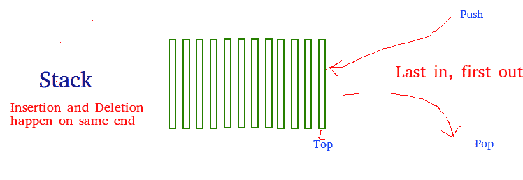

# Python 中的堆栈

> 原文:[https://www.geeksforgeeks.org/stack-in-python/](https://www.geeksforgeeks.org/stack-in-python/)

堆栈是一种线性数据结构，它以后进先出或先进先出的方式存储项目。在堆栈中，在一端添加一个新元素，并且只从该端移除一个元素。插入和删除操作通常称为推送和弹出。



**与栈相关联的功能有:**

*   **空()**–返回堆栈是否为空–时间复杂度:O(1)
*   **大小()**–返回堆栈的大小–时间复杂度:O(1)
*   **top()**–返回对堆栈最顶层元素的引用–时间复杂度:O(1)
*   **推(a)**–将元素‘a’插入堆栈顶部–时间复杂度:O(1)
*   **pop()**–删除堆栈的最顶层元素–时间复杂度:O(1)

## 履行

有多种方法可以在 Python 中实现堆栈。本文介绍了使用 Python 库中的数据结构和模块来实现堆栈。
Python 中的栈可以通过以下方式实现:

*   目录
*   Collections.deque
*   尾巴！尾巴！利沃夫伫列

### 使用列表实现:

Python 内置的数据结构列表可以作为堆栈使用。使用 append()代替 push()，将元素添加到堆栈顶部，而 pop()按后进先出顺序移除元素。
遗憾的是，这份榜单有几个缺点。最大的问题是它在成长过程中会遇到速度问题。列表中的项目一个接一个地存储在内存中，如果堆栈变得比当前容纳它的内存块大，那么 Python 需要进行一些内存分配。这可能会导致一些 append()调用比其他调用花费更长的时间。

## 蟒蛇 3

```
# Python program to
# demonstrate stack implementation
# using list

stack = []

# append() function to push
# element in the stack
stack.append('a')
stack.append('b')
stack.append('c')

print('Initial stack')
print(stack)

# pop() function to pop
# element from stack in
# LIFO order
print('\nElements popped from stack:')
print(stack.pop())
print(stack.pop())
print(stack.pop())

print('\nStack after elements are popped:')
print(stack)

# uncommenting print(stack.pop())
# will cause an IndexError
# as the stack is now empty
```

**输出:**

```
Initial stack
['a', 'b', 'c']

Elements popped from stack:
c
b
a

Stack after elements are popped:
[]
```

```
Traceback (most recent call last):
  File "/home/2426bc32be6a59881fde0eec91247623.py", line 25, in <module>
    print(stack.pop())  
IndexError: pop from empty list
```

### 使用集合实现。

Python 堆栈可以使用集合模块中的 deque 类来实现。在我们需要从容器两端进行更快的追加和弹出操作的情况下，dequee 优于 list，因为 dequee 为追加和弹出操作提供了 O(1)的时间复杂度，而 list 提供了 O(n)的时间复杂度。
使用列表中所示的相同方法，追加()和弹出()。

## 蟒蛇 3

```
# Python program to
# demonstrate stack implementation
# using collections.deque

from collections import deque

stack = deque()

# append() function to push
# element in the stack
stack.append('a')
stack.append('b')
stack.append('c')

print('Initial stack:')
print(stack)

# pop() function to pop
# element from stack in
# LIFO order
print('\nElements popped from stack:')
print(stack.pop())
print(stack.pop())
print(stack.pop())

print('\nStack after elements are popped:')
print(stack)

# uncommenting print(stack.pop())
# will cause an IndexError
# as the stack is now empty
```

**输出:**

```
Initial stack:
deque(['a', 'b', 'c'])

Elements popped from stack:
c
b
a

Stack after elements are popped:
deque([])
```

```
Traceback (most recent call last):
  File "/home/97171a8f6fead6988ea96f86e4b01c32.py", line 29, in <module>
    print(stack.pop())  
IndexError: pop from an empty deque
```

### 使用队列模块实现

队列模块也有一个后进先出队列，它基本上是一个堆栈。使用 put()函数将数据插入队列，get()从队列中取出数据。

本模块中有多种可用功能:

*   **最大大小**–队列中允许的项目数。
*   **空()**–如果队列为空，则返回真，否则返回假。
*   **满()**–如果队列中有 *maxsize* 物品，返回真。如果队列初始化时 maxsize=0(默认值)，则 full()永远不会返回 True。
*   **get()**–从队列中移除并返回一个项目。如果队列为空，请等待，直到某个项目可用。
*   **get _ nowait()**–如果一个项目立即可用，则返回该项目，否则引发 QueueEmpty。
*   **将(物品)**–将物品放入队列。如果队列已满，请等到有可用的空位后再添加项目。
*   **Put _ nowait(item)**–将一个项目放入队列而不阻塞。
*   **qsize()**–返回队列中的项目数。如果没有立即可用的空闲插槽，请提高 QueueFull。

## 蟒蛇 3

```
# Python program to
# demonstrate stack implementation
# using queue module

from queue import LifoQueue

# Initializing a stack
stack = LifoQueue(maxsize=3)

# qsize() show the number of elements
# in the stack
print(stack.qsize())

# put() function to push
# element in the stack
stack.put('a')
stack.put('b')
stack.put('c')

print("Full: ", stack.full())
print("Size: ", stack.qsize())

# get() function to pop
# element from stack in
# LIFO order
print('\nElements popped from the stack')
print(stack.get())
print(stack.get())
print(stack.get())

print("\nEmpty: ", stack.empty())
```

**输出:**

```
0
Full:  True
Size:  3

Elements popped from the stack
c
b
a

Empty:  True
```

### 使用单链表实现:

链表有两个方法 addHead(item)和 removeHead()在恒定时间内运行。这两种方法适合实现堆栈。

*   **getSize()**–获取堆栈中的项目数。
*   **isEmpty()**–如果堆栈为空，则返回 True，否则返回 False。
*   **peek()**–返回堆栈中的顶部项目。如果堆栈为空，则引发异常。
*   **推入(值)**–将一个值推入堆栈的头部。
*   **pop()**–移除并返回堆栈头部的值。如果堆栈为空，则引发异常。

**以下是上述方法的实现:**

## 蟒蛇 3

```
# Python program to demonstrate
# stack implementation using a linked list.
# node class

class Node:
    def __init__(self, value):
        self.value = value
        self.next = None

class Stack:

    # Initializing a stack.
    # Use a dummy node, which is
    # easier for handling edge cases.
    def __init__(self):
        self.head = Node("head")
        self.size = 0

    # String representation of the stack
    def __str__(self):
        cur = self.head.next
        out = ""
        while cur:
            out += str(cur.value) + "->"
            cur = cur.next
        return out[:-3]

    # Get the current size of the stack
    def getSize(self):
        return self.size

    # Check if the stack is empty
    def isEmpty(self):
        return self.size == 0

    # Get the top item of the stack
    def peek(self):

        # Sanitary check to see if we
        # are peeking an empty stack.
        if self.isEmpty():
            raise Exception("Peeking from an empty stack")
        return self.head.next.value

    # Push a value into the stack.
    def push(self, value):
        node = Node(value)
        node.next = self.head.next
        self.head.next = node
        self.size += 1

    # Remove a value from the stack and return.
    def pop(self):
        if self.isEmpty():
            raise Exception("Popping from an empty stack")
        remove = self.head.next
        self.head.next = self.head.next.next
        self.size -= 1
        return remove.value

# Driver Code
if __name__ == "__main__":
    stack = Stack()
    for i in range(1, 11):
        stack.push(i)
    print(f"Stack: {stack}")

    for _ in range(1, 6):
        remove = stack.pop()
        print(f"Pop: {remove}")
    print(f"Stack: {stack}")
```

**输出:**

```
Stack: 10 -> 9 -> 8 -> 7 -> 6 -> 5 -> 4 -> 3 -> 2 -> 1

Pop: 10
Pop: 9
Pop: 8
Pop: 7
Pop: 6

Stack: 5 -> 4 -> 3 -> 2 -> 1
```