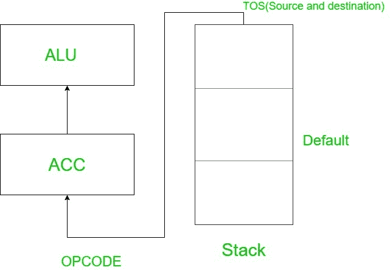

# 电脑组织中的堆垛机

> 原文:[https://www . geeksforgeeks . org/stack-计算机中的机器-organization/](https://www.geeksforgeeks.org/stack-machine-in-computer-organisation/)

[指令格式](https://www.geeksforgeeks.org/computer-organization-instruction-formats-zero-one-two-three-address-instruction/)根据 CPU 组织分为不同的类型。 [CPU 组织](https://www.geeksforgeeks.org/introduction-of-stack-based-cpu-organization/)再次根据内部存储分为三种:堆栈机、累加器机、通用组织或通用寄存器。在本文中，我们将了解计算机组织中的堆栈机器。

**堆垛机:**
在堆垛机中，数据默认位于栈顶。堆栈充当源和目的地，推送和弹出指令用于从堆栈中访问指令和数据。不需要传递源地址和目的地址，因为默认地址在堆栈顶部。在堆栈机器中，不需要在指令中传递显式地址。因此[指令格式仅由操作码(操作码)字段组成](https://www.geeksforgeeks.org/introduction-of-single-accumulator-based-cpu-organization/)。这种指令格式被称为零地址指令。

堆栈的两个操作是插入(推送)和删除(弹出)堆栈中的项目。但是，在计算机堆栈中不会推送或弹出任何内容。



**示例:**
执行以下打算在堆栈机上执行的指令集:

```
PUSH B, 
PUSH X, 
ADD, 
POP C, 
PUSH C, 
PUSH Y, 
SUB, 
POP Z 
```

首先在堆栈中推送 B 和 X，然后先添加 POP X，然后是 B，ADD (B+X)，POP C=B+X(没有名为 C 的数据，所以呈现的数据存储在变量 C 中)然后是 POP C。
同样，要执行 SUB (Y-C)先执行 POP 操作 POP 为 z，见下图更好理解:

