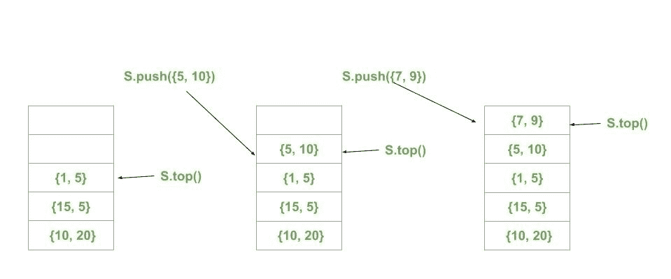

# c++ STL 中配对的堆栈，示例

> 原文:[https://www . geesforgeks . org/c-STL-with-examples 中的成对堆栈/](https://www.geeksforgeeks.org/stack-of-pair-in-c-stl-with-examples/)

**[STL 中的堆栈](https://www.geeksforgeeks.org/stack-in-cpp-stl/)** 堆栈是一种后进先出(LIFO)工作方式的容器适配器，其中在一端添加一个新元素，并且(顶部)仅从该端移除一个元素。

**[STL 中的配对](https://www.geeksforgeeks.org/pair-in-cpp-stl/)** 配对容器是一个简单的容器，在头部定义，由两个数据元素或对象组成。第一个元素被称为“第一”，第二个元素被称为“第二”，顺序是固定的(第一，第二)。

**STL 中的对栈:**对栈在设计复杂数据结构时可以非常高效。

**语法:**

```
stack<pair<datatype, datatype>> stack_of_pair;

```

下面是一个显示配对堆栈的示例:

```
// CPP program to demonstrate
// the working of STL stack of pairs

#include <bits/stdc++.h>
using namespace std;

// Print the current pair
void printPair(pair<int, int> p)
{

    cout << "("
         << p.first << ", "
         << p.second << ") ";
}

// Print the Stack of Pairs
void Showstack(stack<pair<int, int> > s)
{
    while (!s.empty()) {
        printPair(s.top());
        s.pop();
    }

    cout << '\n';
}

// Driver code
int main()
{
    stack<pair<int, int> > s;

    s.push({ 10, 20 });
    s.push({ 15, 5 });
    s.push({ 1, 5 });
    s.push({ 5, 10 });
    s.push({ 7, 9 });

    cout << "Stack of Pairs: ";
    Showstack(s);

    cout << "\nSize of Stack of Pairs: "
         << s.size();
    cout << "\nTop of Stack of Pairs: ";
    printPair(s.top());

    cout << "\n\nRemoving the top pair\n";
    s.pop();

    cout << "Current Stack of Pairs: ";
    Showstack(s);

    return 0;
}
```

**Output:**

```
Stack of Pairs: (7, 9) (5, 10) (1, 5) (15, 5) (10, 20) 

Size of Stack of Pairs: 5
Top of Stack of Pairs: (7, 9) 

Removing the top pair
Current Stack of Pairs: (5, 10) (1, 5) (15, 5) (10, 20)

```

下图显示了“配对堆栈”的工作情况:
[](https://media.geeksforgeeks.org/wp-content/uploads/20200319125426/Untitled-drawing-214.jpg)

[](https://media.geeksforgeeks.org/wp-content/uploads/20200319125509/Untitled-drawing-314.jpg)