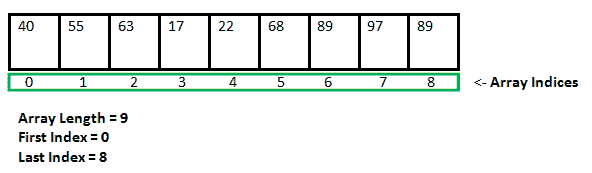
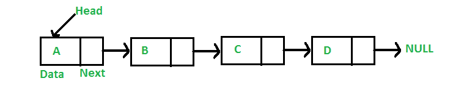

# 静态数据结构对比动态数据结构

> 原文:[https://www . geesforgeks . org/static-data-structure-vs-dynamic-data-structure/](https://www.geeksforgeeks.org/static-data-structure-vs-dynamic-data-structure/)

[数据结构](https://www.geeksforgeeks.org/data-structures/)是一种有效存储和组织数据的方式，这样就可以在时间和内存方面高效地执行所需的操作。简单地说，数据结构用于降低代码的复杂性(主要是时间复杂性)。

数据结构可以有两种类型:
1。静态数据结构
2。动态数据结构

**什么是静态数据结构？**
在静态数据结构中，结构的大小是固定的。数据结构的内容可以修改，但不改变分配给它的内存空间。

静态数据结构示例:[数组](https://www.geeksforgeeks.org/array-data-structure/)

**什么是动态数据结构？**
在动态数据结构中，结构的大小不是固定的，可以在对其执行操作的过程中进行修改。动态数据结构旨在便于在运行时更改数据结构。

动态数据结构示例:[链表](https://www.geeksforgeeks.org/data-structures/linked-list/)

**静态数据结构 vs 动态数据结构**
静态数据结构具有固定的内存大小，而在动态数据结构中，该大小可以在运行期间随机更新，这可以被认为对于代码的内存复杂性是有效的。相对于动态数据结构，静态数据结构提供了对元素更容易的访问。与静态数据结构不同，动态数据结构是灵活的。

**在竞争编程中使用动态数据结构**
在竞争编程中，对内存限制的限制并不高，我们不能超过内存限制。给定更高的约束值，我们不能分配这样大小的静态数据结构，因此动态数据结构可能是有用的。

另外，更多信息请参考[链表 vs 数组](https://www.geeksforgeeks.org/linked-list-vs-array/)。