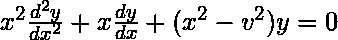
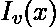
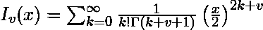

# 标准::C++17 中的 cyl _ Bessel _ I

> 原文:[https://www.geeksforgeeks.org/stdcyl_bessel_i-in-c17/](https://www.geeksforgeeks.org/stdcyl_bessel_i-in-c17/)

在数学中，微分方程，



尤为重要。方程的解是参数的函数。对于的积分和半积分值，特别感兴趣的解被称为圆柱贝塞尔函数，以德国著名数学家弗雷德里克·威廉·贝塞尔的名字命名。要求积分或半积分的原因将在下面的解释中阐明。

由于这是一个二阶微分方程，必然有两个线性独立的解，称为第一类和第二类。因此，微分方程可以用[弗罗贝尼乌斯方法](https://en.wikipedia.org/wiki/Frobenius_method)手工求解。对于复杂参数，第一类贝塞尔函数被称为第一类修正贝塞尔函数，用表示。该方法的应用产生了包含项和的无穷级数，



由于表达式中含有 Gamma 函数，只能对整数值和半整数值进行计算，因此参数必须是整数值或半整数值。

C++17 (GCC 7.1)标准库`cmath`给出了计算第一类圆柱贝塞尔函数 **`(std::cyl_bessel_j)`** (这里不讨论，但与我们已经讨论过的非常相似)的值和正则修正贝塞尔函数 **`(std::cyl_bessel_i)`** 的值的函数。两者对于小输入都有可观的精度，并可用于各种工程应用。

**示例:**

> **输入:** x = 2.798465，v = 0
> T3】输出: 4.152234090041574
> 
> **输入:** x = 3.04513，v = 0.5
> **输出:**4.494666646004

**注意:**以下源代码应该只能在 C++17 及以上版本上运行。给定代码的运行样本可以在[这里](http://coliru.stacked-crooked.com/a/627e342f9efd3b51)查看。要运行不同的输入，请访问链接并单击右下角的“编辑”。

```
// C++17 code for bessel function
#include <bits/stdc++.h>
using namespace std;

// Compute the answer from the formulae for first 10 terms
long double answer(long double x, long double v)
{

    long double ans_by_expansion = 0;
    long double fact = 1;

    for (int k = 0; k < 10; fact = fact * (++k)) {
        ans_by_expansion += pow((x / 2), (2 * k)) / pow(fact, 2);
        cout << "ans_by_expansion till term k = ";
        cout << k << " is " << ans_by_expansion << "\n";
    }

  return ans_by_expansion;
}

// Driver code
int main()
{
    long double x = 2.798465;
    long double v = 0;

    // Compute the Regular Modified Bessel Function
    // for v = 0, x = 2.798465
    long double ans_by_function = cyl_bessel_i(v, x);

    cout << setprecision(15) << fixed;
    cout << "The answer by function for "
         << "Regular_Modified_Bessel_Function" << endl
         << "(" << v << ", " << x << ") = "
         << ans_by_function << "\n";

    // calculate answer by expansion
    long double ans_by_expansion = answer(x, v);

    cout << "Absolute Error in answer by both the methods is = ";
    cout << abs(ans_by_expansion - ans_by_function) << "\n";

    return 0;
}
```

**输出:**

```
The answer by function for Regular_Modified_Bessel_Function
(0.000000000000000, 2.798465000000000) = 4.152234090041574
ans_by_expansion till term k = 0 is 1.000000000000000
ans_by_expansion till term k = 1 is 2.957851589056250
ans_by_expansion till term k = 2 is 3.916147300248771
ans_by_expansion till term k = 3 is 4.124614053687001
ans_by_expansion till term k = 4 is 4.150123238967278
ans_by_expansion till term k = 5 is 4.152120966924739
ans_by_expansion till term k = 6 is 4.152229612892962
ans_by_expansion till term k = 7 is 4.152233953968095
ans_by_expansion till term k = 8 is 4.152234086767796
ans_by_expansion till term k = 9 is 4.152234089977698
Absolute Error in answer by both the methods is = 0.000000000063876

```