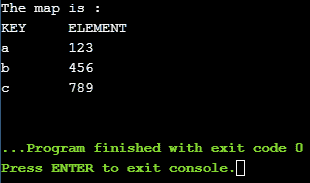

# 标准::C++17 的地图和无序地图中的 try _ 侵位()

> 原文:[https://www . geeksforgeeks . org/stdtry _ 侵位地图和无序地图-of-c17/](https://www.geeksforgeeks.org/stdtry_emplace-in-maps-and-unordered-maps-of-c17/)

在本文中，我们将在[地图](https://www.geeksforgeeks.org/map-associative-containers-the-c-standard-template-library-stl/)和[无序地图](https://www.geeksforgeeks.org/unordered_map-in-cpp-stl/)中学习 try _ 侵位方法。这个方法是在 [C++17](https://en.cppreference.com/w/cpp/17) (即 gcc 9.1)版本中增加的。提出的这个新函数的行为类似于[定位()](https://www.geeksforgeeks.org/map-emplace-in-c-stl/?ref=lbp)，但是有一个优点，即如果该键已经存在，它将不会构造与该键相关联的对象。如果创建这种类型的对象成本很高，这将提高性能。

**头文件:**

```
#include <utility>

```

**语法:**

```
map_name.try_emplace(key, element);

```

**参数:**该功能接受两个强制参数，如下所述:

*   **键:**指定要插入多映射容器的键。
*   **元素:**指定要插入到地图容器中的键的元素。

**返回值:**函数不返回任何内容。

下面是用 C++说明**try _ 侵位()**的程序:

```
// C++ program for the illustration of
// map::try_emplace() function in map
#include <bits/stdc++.h>
using namespace std;

// Driver Code
int main()
{
    // Initializing a container
    map<string, string> m;

    // Inserting elements in random order
    m.try_emplace("a", "123");
    m.try_emplace("b", "456");
    m.try_emplace("a", "Won't be inserted");
    m.try_emplace("c", "789");
    m.try_emplace("c", "Won't be inserted");

    // Print the elements
    cout << "\nThe map is : \n";
    cout << "KEY\tELEMENT\n";

    for (auto p : m) {
        cout << p.first << "\t"
             << p.second
             << endl;
    }
    return 0;
}
```

**输出:**
[](https://media.geeksforgeeks.org/wp-content/uploads/20200701215302/Capture_try.png)