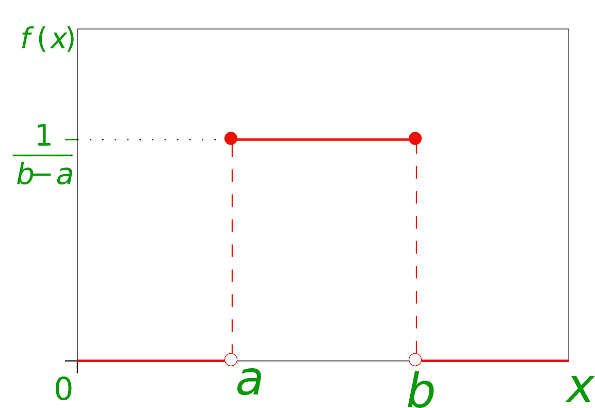

# 标准::C++中的 uniform_int_distribution 类

> 原文:[https://www . geesforgeks . org/stduniform _ int _ distribution-class-in-c/](https://www.geeksforgeeks.org/stduniform_int_distribution-class-in-c/)

在概率中，[离散均匀分布函数](https://www.geeksforgeeks.org/mathematics-probability-distributions-set-1/)是指离散值在一定范围内概率不变，范围外概率为零的分布。区间[a，b]中均匀离散分布的概率密度函数 P(x)对于范围[a，b]中的离散值是常数，否则为零。数学上，该函数定义为:

![\[ f(x) = \begin{cases} \frac{1}{b-a}, & a\leq x \leq b\\ 0, & \text{otherwise}\\ \end{cases} \]    ](img/9555d62de2d0d1e2a65fbd23c32a0215.png "Rendered by QuickLaTeX.com")

 [ ](https://www.geeksforgeeks.org/mathematics-probability-distributions-set-1/)

C++在**随机库**中引入了 **uniform_int_distribution** 类，其成员函数以均匀的概率给出来自给定输入范围的随机整数或离散值。
**uniform _ int _ distribution 类中的公共成员函数:**

1.  **运算符():**该函数返回给定分布范围内的随机数。从这个函数中得到任何数的概率都是一样的。Operator()函数需要恒定的生成时间。
    **例:**

## 卡片打印处理机（Card Print Processor 的缩写）

```
// C++ code to demonstrate the working of
// operator() function

#include <iostream>

// for uniform_int_distribution function
#include <random>

using namespace std;

int main()
{
    // Here default_random_engine object
    // is used as source of randomness
    // We can give seed also to default_random_engine
    // if psuedorandom numbers are required
    default_random_engine generator;

    int a = 0, b = 9;

    // Initializing of uniform_int_distribution class
    uniform_int_distribution<int> distribution(a, b);

    // number of experiments
    const int num_of_exp = 10000;

    int n = b - a + 1;
    int p[n] = {};
    for (int i = 0; i < num_of_exp; ++i) {

        // using operator() function
        // to give random values
        int number = distribution(generator);
        ++p[number-a];
    }

    cout << "Expected probability: "
         << float(1) / float(n) << endl;

    cout << "uniform_int_distribution ("
         << a << ", " << b << ")" << endl;

    // Displaying the probability of each number
    // after generating values 10000 times.
    for (int i = 0; i < n; ++i)
        cout << a + i << ": "
             << (float)p[i] / (float)(num_of_exp)
             << endl;

    return 0;
}
```

**Output:** 

```
Expected probability: 0.1
uniform_int_distribution (0, 9)
0: 0.0993
1: 0.1007
2: 0.0998
3: 0.0958
4: 0.1001
5: 0.1049
6: 0.0989
7: 0.0963
8: 0.1026
9: 0.1016
```

我们可以从输出中观察到，从随机数中获得的每个数的概率与计算的概率非常接近。

1.  **a():** 返回范围的下限参数。这指定了其成员运算符()可能返回的值范围的下限。

2.  **b():** 返回范围的较高参数。这指定了其成员运算符()可能返回的值范围的上限。

3.  **max():** 此函数返回运算符()函数可能输出的最小上界。

4.  **min():** 此函数返回运算符()函数可能输出的最高下限。

5.  **reset():** 此功能重置分布，使得后续分布不依赖于之前生成的数字。

**例:**

## 卡片打印处理机（Card Print Processor 的缩写）

```
// C++ code to demonstrate the working of
// a(), b(), min(), max(), reset() function

#include <iostream>

// for uniform_int_distribution function
#include <random>

using namespace std;

int main()
{
    int a = 10, b = 100;

    // Initializing of uniform_int_distribution class
    uniform_int_distribution<int> distribution(a, b);

    // Using a() and b()
    cout << "Lower Bound"
         << " " << distribution.a() << endl;
    cout << "Upper Bound"
         << " " << distribution.b() << endl;

    // Using min() and max()
    cout << "Minimum possible output"
         << " " << distribution.min() << endl;
    cout << "Maximum possible output"
         << " " << distribution.max() << endl;

    // Using reset()
    distribution.reset();
    return 0;
}
```

**Output:** 

```
Lower Bound 10
Upper Bound 100
Minimum possible output 10
Maximum possible output 100
```

**参考:**[https://en . cppreference . com/w/CPP/numeric/random/uniform _ int _ distribution](https://en.cppreference.com/w/cpp/numeric/random/uniform_int_distribution)T4】