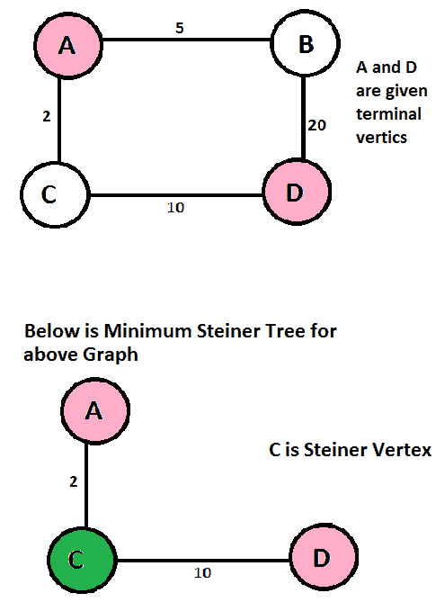

# 斯坦纳树问题

> 原文:[https://www.geeksforgeeks.org/steiner-tree/](https://www.geeksforgeeks.org/steiner-tree/)

**什么是斯坦纳树？**
给定一个图和图中顶点的**子集**，斯坦纳树跨越给定的子集。斯坦纳树可能包含一些不在给定子集内但用于连接子集顶点的顶点。

给定的一组顶点称为 ***【终端顶点】*** ，而用于构建斯坦纳树的其他顶点称为 ***斯坦纳顶点*** 。
 **斯坦纳树问题**是寻找成本最小的斯坦纳树。下面是一个例子。

[](https://media.geeksforgeeks.org/wp-content/cdn-uploads/steiner.png)

**生成树 vs 斯坦纳树**
[最小生成树 i](https://www.geeksforgeeks.org/greedy-algorithms-set-2-kruskals-minimum-spanning-tree-mst/) 是一棵最小权重树，它跨越**所有**顶点。

如果斯坦纳树问题中给定的顶点子集(或终端)等于所有顶点的集合，那么问题就变成了最小生成树问题。而如果给定的子集只包含两个顶点，那么它就是两个顶点之间的最短路径问题。

求最小生成树是多项式时间可解的，但最小斯坦纳树问题是 NP 难的，相关的决策问题是 NP 完全的。

**斯坦纳树的应用**
任何情况下的任务都是最小化一些重要位置之间的连接成本，如超大规模集成电路设计、计算机网络等。

**基于最短路径的近似算法**
由于斯坦纳树问题是 NP-Hard 问题，因此不存在总能给出最优代价的多项式时间解。因此，有近似算法来解决同样的问题。下面是一个简单的近似算法。

```
1) Start with a subtree T consisting of 
   one given terminal vertex
2) While T does not span all terminals
   a) Select a terminal x not in T that is closest 
      to a vertex in T.
   b) Add to T the shortest path that connects x with T

```

上述算法是(2-2/n)近似的，即对于给定的有 n 个顶点的图，它保证由该算法产生的解不大于优化解的这个比值。也有更好的算法提供更好的比率。更多详情请参考以下参考资料。

**参考文献:**
[www.cs.uu.nl/docs/vakken/an/teoud/an-steiner.ppt](http://www.cs.uu.nl/docs/vakken/an/teoud/an-steiner.ppt)

本文由**希瓦姆·古普塔**供稿。如果您发现任何不正确的地方，或者您想分享更多关于上面讨论的主题的信息，请写评论