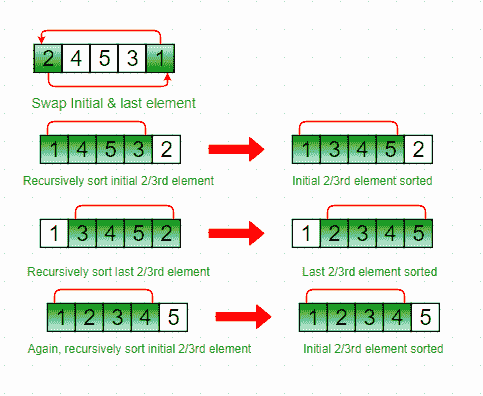

# 走狗排序

> 原文:[https://www.geeksforgeeks.org/stooge-sort/](https://www.geeksforgeeks.org/stooge-sort/)

Stooge 排序是一种递归排序算法。其定义如下(用于升序排序)。

```
Step 1 : If value at index 0 is greater than
         value at last index, swap them.
Step 2:  Recursively, 
       a) Stooge sort the initial 2/3rd of the array.
       b) Stooge sort the last 2/3rd of the array.
       c) Stooge sort the initial 2/3rd again to confirm.
```

**注意:**选择元素时始终取((2/3)*N)的上限。

插图:

```
Input :   2 4 5 3 1
Output : 1 2 3 4 5
Explanation:
Initially, swap 2 and 1 following above step 1.
          1 4 5 3 2
          Now, recursively sort initial 2/3rd of the elements.
          1 4 5 3 2
          1 3 4 5 2 
          Then, recursively sort last 2/3rd of the elements.
          1 3 4 5 2
          1 2 3 4 5
          Again, sort the initial 2/3rd of the elements to confirm final data is sorted.
          1 2 3 4 5
```



## C++

```
// C++ code to implement stooge sort
#include <iostream>
using namespace std;

// Function to implement stooge sort
void stoogesort(int arr[], int l, int h)
{
    if (l >= h)
        return;

    // If first element is smaller than last,
    // swap them
    if (arr[l] > arr[h])
        swap(arr[l], arr[h]);

    // If there are more than 2 elements in
    // the array
    if (h - l + 1 > 2) {
        int t = (h - l + 1) / 3;

        // Recursively sort first 2/3 elements
        stoogesort(arr, l, h - t);

        // Recursively sort last 2/3 elements
        stoogesort(arr, l + t, h);

        // Recursively sort first 2/3 elements
        // again to confirm
        stoogesort(arr, l, h - t);
    }
}

// Driver Code
int main()
{
    int arr[] = { 2, 4, 5, 3, 1 };
    int n = sizeof(arr) / sizeof(arr[0]);

    // Calling Stooge Sort function to sort
    // the array
    stoogesort(arr, 0, n - 1);

    // Display the sorted array
    for (int i = 0; i < n; i++)
        cout << arr[i] << " ";

    return 0;
}
```

## Java 语言(一种计算机语言，尤用于创建网站)

```
// Java program to implement stooge sort
import java.io.*;

public class stooge {
    // Function to implement stooge sort
    static void stoogesort(int arr[], int l, int h)
    {
        if (l >= h)
            return;

        // If first element is smaller
        // than last, swap them
        if (arr[l] > arr[h]) {
            int t = arr[l];
            arr[l] = arr[h];
            arr[h] = t;
        }

        // If there are more than 2 elements in
        // the array
        if (h - l + 1 > 2) {
            int t = (h - l + 1) / 3;

            // Recursively sort first 2/3 elements
            stoogesort(arr, l, h - t);

            // Recursively sort last 2/3 elements
            stoogesort(arr, l + t, h);

            // Recursively sort first 2/3 elements
            // again to confirm
            stoogesort(arr, l, h - t);
        }
    }

    // Driver Code
    public static void main(String args[])
    {
        int arr[] = { 2, 4, 5, 3, 1 };
        int n = arr.length;

        stoogesort(arr, 0, n - 1);

        for (int i = 0; i < n; i++)
            System.out.print(arr[i] + " ");
    }
}
// Code Contributed by Mohit Gupta_OMG <(0_o)>
```

## 蟒蛇 3

```
# Python program to implement stooge sort

def stoogesort(arr, l, h):
    if l >= h:
        return

    # If first element is smaller
    # than last, swap them
    if arr[l]>arr[h]:
        t = arr[l]
        arr[l] = arr[h]
        arr[h] = t

    # If there are more than 2 elements in
    # the array
    if h-l + 1 > 2:
        t = (int)((h-l + 1)/3)

        # Recursively sort first 2 / 3 elements
        stoogesort(arr, l, (h-t))

        # Recursively sort last 2 / 3 elements
        stoogesort(arr, l + t, (h))

        # Recursively sort first 2 / 3 elements
        # again to confirm
        stoogesort(arr, l, (h-t))

# deriver
arr = [2, 4, 5, 3, 1]
n = len(arr)

stoogesort(arr, 0, n-1)

for i in range(0, n):
    print(arr[i], end = ' ')

# Code Contributed by Mohit Gupta_OMG <(0_o)>
```

## C#

```
// C# program to implement stooge sort
using System;

class GFG {

    // Function to implement stooge sort
    static void stoogesort(int[] arr,
                            int l, int h)
    {
        if (l >= h)
            return;

        // If first element is smaller
        // than last, swap them
        if (arr[l] > arr[h]) {
            int t = arr[l];
            arr[l] = arr[h];
            arr[h] = t;
        }

        // If there are more than 2
        // elements in the array
        if (h - l + 1 > 2) {
            int t = (h - l + 1) / 3;

            // Recursively sort first
            // 2/3 elements
            stoogesort(arr, l, h - t);

            // Recursively sort last
            // 2/3 elements
            stoogesort(arr, l + t, h);

            // Recursively sort first
            // 2/3 elements again to
            // confirm
            stoogesort(arr, l, h - t);
        }
    }

    // Driver Code
    public static void Main()
    {
        int[] arr = { 2, 4, 5, 3, 1 };
        int n = arr.Length;

        // Calling Stooge Sort function
        // to sort the array
        stoogesort(arr, 0, n - 1);

        // Display the sorted array
        for (int i = 0; i < n; i++)
            Console.Write(arr[i] + " ");
    }
}

// This code is contributed by Sam007.
```

## java 描述语言

```
<script>
    // Javascript program to implement stooge sort

    // Function to implement stooge sort
    function stoogesort(arr, l, h)
    {
        if (l >= h)
            return;

        // If first element is smaller
        // than last, swap them
        if (arr[l] > arr[h]) {
            let t = arr[l];
            arr[l] = arr[h];
            arr[h] = t;
        }

        // If there are more than 2
        // elements in the array
        if (h - l + 1 > 2) {
            let t = parseInt((h - l + 1) / 3, 10);

            // Recursively sort first
            // 2/3 elements
            stoogesort(arr, l, h - t);

            // Recursively sort last
            // 2/3 elements
            stoogesort(arr, l + t, h);

            // Recursively sort first
            // 2/3 elements again to
            // confirm
            stoogesort(arr, l, h - t);
        }
    }

    let arr = [ 2, 4, 5, 3, 1 ];
    let n = arr.length;

    // Calling Stooge Sort function
    // to sort the array
    stoogesort(arr, 0, n - 1);

    // Display the sorted array
    for (let i = 0; i < n; i++)
      document.write(arr[i] + " ");

</script>
```

**输出:**

```
1 2 3 4 5 
```

走狗排序的运行时间复杂度可以写成，
T(n) = 3T(3n/2) +？(1)上述递归的
解为 o(n<sup>(log3/log1.5)</sup>)= o(n<sup>2.709</sup>，因此比连泡 sort(n^2).都慢

本文由 [**丹麦 KALEEM**](http://linkedin.com/in/mohdanishh) 供稿。如果你喜欢 GeeksforGeeks 并想投稿，你也可以使用[write.geeksforgeeks.org](https://write.geeksforgeeks.org)写一篇文章或者把你的文章邮寄到 contribute@geeksforgeeks.org。看到你的文章出现在极客博客主页上，帮助其他极客。
如果发现有不正确的地方，或者想分享更多关于上述话题的信息，请写评论。