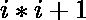
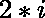

# 风暴号

> 原文:[https://www.geeksforgeeks.org/stormer-numbers/](https://www.geeksforgeeks.org/stormer-numbers/)

给定一个数字“n”，任务是生成第一个“n”个斯托默数字。
A [斯托默数](https://en.wikipedia.org/wiki/St%C3%B8rmer_number)是正整数‘I’，因此术语的最大质因数大于或等于。
例如，5 是斯托默数，因为 26(即 5*5 + 1)的最大质因数是 13，大于或等于 10(即 2*5)

> **输入:** 5
> **输出:** 1 2 4 5 6
> 这里 3 不是斯托默数，因为 10(即 3*3 + 1)的最大质因数
> 是 5，不大于
> 或等于 6(即 2*3)
> **输入:** 10
> **输出:**1 2 4 5 6 10 11 12 14

1.  对于一个数‘I’，首先求数 i*i + 1 的最大质因数。
2.  接下来，测试质因数是否大于或等于 2*i。
3.  如果它更大，那么“我”就是斯托默数。

以下是上述方法的实现:

## C++

```
// C++ program to print
// Stormer numbers
// Function to find
// largest prime factor

#include <iostream>
using namespace std;

 int maxPrimeFactors(int n)
{
    // Initialize the maximum
    // prime factor variable
    // with the lowest one
    int maxPrime = -1;

    // Print the number of
    // 2's that divide n
    while(n % 2 == 0)
    {
        maxPrime = 2;
        n /= 2;
    }

    // n must be odd at this
    // point, thus skip the
    // even numbers and iterate
    // only for odd integers
    for(int i = 3; i < (int)(n * 1 /
                2 + 1); i += 2)
        while(n % i == 0)
        {
            maxPrime = i;
            n /= i;
        }

    // This condition is to handle
    // the case when n is a prime
    // number greater than 2
    if (n > 2)
        maxPrime = n;

    return (int)(maxPrime);
}

// Function to generate
// Stormer Numbers
 int stormer(int n)
{
    int i = 1;

    // Stores the number of
    // Stormer numbers found
    int count = 0;
    while(count < n)
    {
        int t = i * i + 1;
        if (maxPrimeFactors(t) >= 2 * i)
        {
            cout << i ;
            cout <<" ";
            count += 1;
        }
        i += 1;
    }
    return i;
}

    // Driver Code
int main() {

    int n = 10;
    stormer(n);

    }
```

## Java 语言(一种计算机语言，尤用于创建网站)

```
// Java program to print
// Stormer numbers

// Function to find
// largest prime factor

import java.io.*;

class GFG {
static int maxPrimeFactors(int n)
{
    // Initialize the maximum
    // prime factor variable
    // with the lowest one
    int maxPrime = -1;

    // Print the number of
    // 2's that divide n
    while(n % 2 == 0)
    {
        maxPrime = 2;
        n /= 2;
    }

    // n must be odd at this
    // point, thus skip the
    // even numbers and iterate
    // only for odd integers
    for(int i = 3; i < (int)(n * 1 /
                2 + 1); i += 2)
        while(n % i == 0)
        {
            maxPrime = i;
            n /= i;
        }

    // This condition is to handle
    // the case when n is a prime
    // number greater than 2
    if (n > 2)
        maxPrime = n;

    return (int)(maxPrime);
}

// Function to generate
// Stormer Numbers
static int stormer(int n)
{
    int i = 1;

    // Stores the number of
    // Stormer numbers found
    int count = 0;
    while(count < n)
    {
        int t = i * i + 1;
        if (maxPrimeFactors(t) >= 2 * i)
        {
            System.out.print (i +" ");
            count += 1;
        }
        i += 1;
    }
    return i;
}

    // Driver Code
    public static void main (String[] args) {

    int n = 10;
    stormer(n);

    }
}
//This code is contributed akt_mit
```

## 蟒蛇 3

```
# Python program to print Stormer numbers

from __future__ import print_function

# Function to find largest prime factor

def maxPrimeFactors(n):
    # Initialize the maximum prime factor
    # variable with the lowest one
    maxPrime = -1

    # Print the number of 2's that divide n
    while n % 2 == 0:
        maxPrime = 2
        n /= 2

    # n must be odd at this point, thus skip
    # the even numbers and iterate only for
    # odd integers
    for i in range(3, int(n**0.5)+1, 2):
        while n % i == 0:
            maxPrime = i
            n /= i

    # This condition is to handle the case when
    # n is a prime number greater than 2
    if n > 2:
        maxPrime = n

    return int(maxPrime)

# Function to generate Stormer Numbers

def stormer(n):
    i = 1
    # Stores the number of Stormer numbers found
    count = 0
    while(count < n):
        t = i * i + 1
        if maxPrimeFactors(t) >= 2 * i:
            print(i, end =' ')
            count += 1
        i += 1

# Driver Method

if __name__=='__main__':
    n = 10
    stormer(n)
```

## C#

```
// C#  program to print
// Stormer numbers
using System;

// Function to find
// largest prime factor
public class GFG{

    static int maxPrimeFactors(int n)
{
    // Initialize the maximum
    // prime factor variable
    // with the lowest one
    int maxPrime = -1;

    // Print the number of
    // 2's that divide n
    while(n % 2 == 0)
    {
        maxPrime = 2;
        n /= 2;
    }

    // n must be odd at this
    // point, thus skip the
    // even numbers and iterate
    // only for odd integers
    for(int i = 3; i < (int)(n * 1 /
                2 + 1); i += 2)
        while(n % i == 0)
        {
            maxPrime = i;
            n /= i;
        }

    // This condition is to handle
    // the case when n is a prime
    // number greater than 2
    if (n > 2)
        maxPrime = n;

    return (int)(maxPrime);
}

// Function to generate
// Stormer Numbers
static int stormer(int n)
{
    int i = 1;

    // Stores the number of
    // Stormer numbers found
    int count = 0;
    while(count < n)
    {
        int t = i * i + 1;
        if (maxPrimeFactors(t) >= 2 * i)
        {
            Console.Write(i +" ");
            count += 1;
        }
        i += 1;
    }
    return i;
}

    // Driver Code
    static public void Main (){
            int n = 10;
            stormer(n);

    }
}
//This code is contributed akt_mit
```

## 服务器端编程语言（Professional Hypertext Preprocessor 的缩写）

```
<?php
// PHP program to print
// Stormer numbers

// Function to find
// largest prime factor
function maxPrimeFactors($n)
{
    // Initialize the maximum
    // prime factor variable
    // with the lowest one
    $maxPrime = -1;

    // Print the number of
    // 2's that divide n
    while($n % 2 == 0)
    {
        $maxPrime = 2;
        $n /= 2;
    }

    // n must be odd at this
    // point, thus skip the
    // even numbers and iterate
    // only for odd integers
    for($i = 3; $i < (int)($n * 1 /
                   2 + 1); $i += 2)
        while($n % $i == 0)
        {
            $maxPrime = $i;
            $n /= $i;
        }

    // This condition is to handle
    // the case when n is a prime
    // number greater than 2
    if ($n > 2)
        $maxPrime = $n;

    return (int)($maxPrime);
}

// Function to generate
// Stormer Numbers
function stormer($n)
{
    $i = 1;

    // Stores the number of
    // Stormer numbers found
    $count = 0;
    while($count < $n)
    {
        $t = $i * $i + 1;
        if (maxPrimeFactors($t) >= 2 * $i)
        {
            echo $i." ";
            $count += 1;
        }
        $i += 1;
    }
}

// Driver Code
$n = 10;
stormer($n);

// This code is contributed
// by mits
?>
```

## java 描述语言

```
<script>
    // Javascript program to print Stormer numbers

    // Function to find largest prime factor
    function maxPrimeFactors(n)
    {

        // Initialize the maximum
        // prime factor variable
        // with the lowest one
        let maxPrime = -1;

        // Print the number of
        // 2's that divide n
        while(n % 2 == 0)
        {
            maxPrime = 2;
            n = parseInt(n / 2, 10);
        }

        // n must be odd at this
        // point, thus skip the
        // even numbers and iterate
        // only for odd integers
        for(let i = 3; i < (n * 1 / 2 + 1); i += 2)
            while(n % i == 0)
            {
                maxPrime = i;
                n = parseInt(n / i, 10);
            }

        // This condition is to handle
        // the case when n is a prime
        // number greater than 2
        if (n > 2)
            maxPrime = n;

        return (maxPrime);
    }

    // Function to generate
    // Stormer Numbers
    function stormer(n)
    {
        let i = 1;

        // Stores the number of
        // Stormer numbers found
        let count = 0;
        while(count < n)
        {
            let t = i * i + 1;
            if (maxPrimeFactors(t) >= 2 * i)
            {
                document.write(i +" ");
                count += 1;
            }
            i += 1;
        }
        return i;
    }

    let n = 10;
    stormer(n);

// This code is contributed by rameshtravel07.
</script>
```

**Output:** 

```
1 2 4 5 6 9 10 11 12 14
```