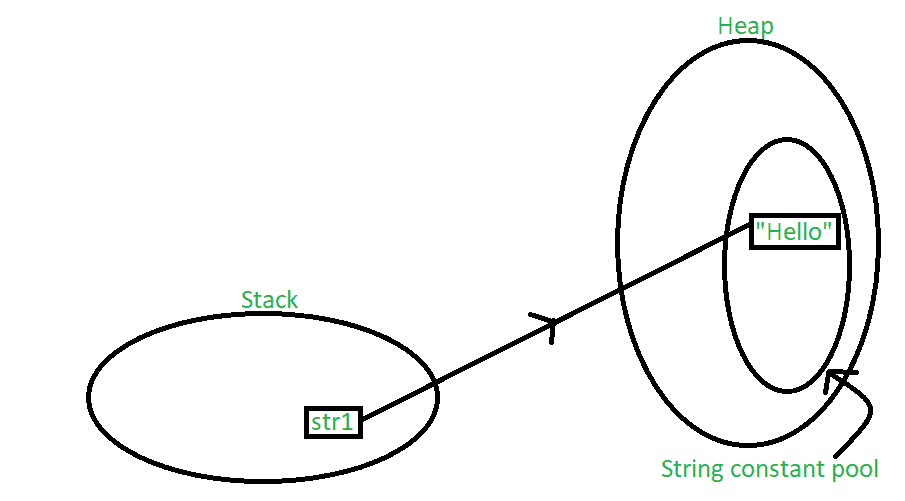
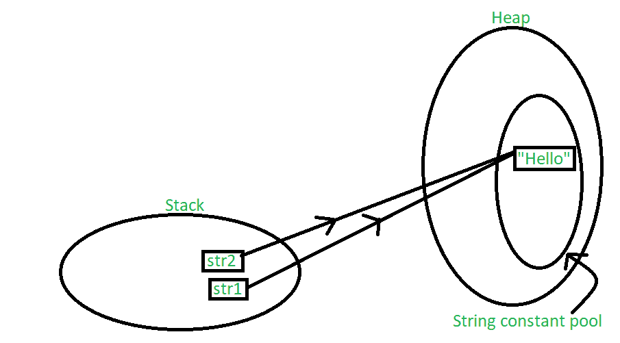
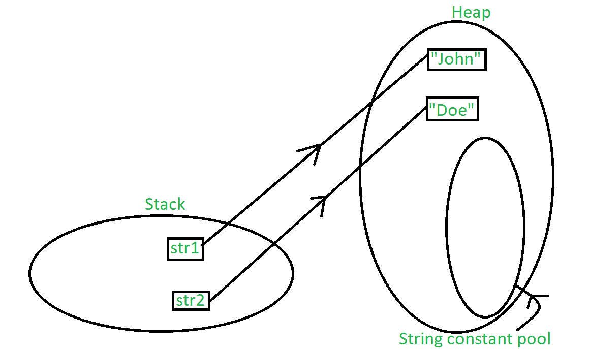

# Java 中的字符串常量池

> 原文:[https://www.geeksforgeeks.org/string-constant-pool-in-java/](https://www.geeksforgeeks.org/string-constant-pool-in-java/)

考虑下面两个 Java 程序，第一个程序产生的输出是“是”，但是第二个程序产生的输出是“否”。你能猜出原因吗？

```
// Program 1: Comparing two references to objects
// created using literals.
import java.util.*;

class GFG {
    public static void main(String[] args)
    {
        String s1 = "abc";
        String s2 = "abc";

        // Note that this == compares whether
        // s1 and s2 refer to same object or not
        if (s1 == s2)
           System.out.println("Yes");
        else
           System.out.println("No");
    }
}
```

**Output:**

```
Yes

```

```
// Program 2: Comparing two references to objects
// created using new operator.
import java.util.*;

class GFG {
    public static void main(String[] args)
    {
        String s1 = new String("abc");
        String s2 = new String("abc");

        // Note that this == compares whether
        // s1 and s2 refer to same object or not
        if (s1 == s2)
           System.out.println("Yes");
        else
           System.out.println("No");
    }
}
```

**Output:**

```
No

```

让我们用下面的解释来理解为什么我们会得到不同的输出。

[字符串](https://www.geeksforgeeks.org/string-class-in-java/)是一个字符序列。Java 中字符串最重要的特征之一是它们是不可变的。换句话说，一旦创建，字符串的内部状态在整个程序执行过程中保持不变。这种不变性是通过在堆中使用特殊的字符串常量池来实现的。在本文中，我们将了解字符串的存储。

字符串常量池是堆内存中的一个独立位置，程序中定义的所有字符串的值都存储在这里。当我们声明一个字符串时，在堆栈中创建一个 string 类型的对象，而在堆中创建一个具有该字符串值的实例。在字符串变量的标准赋值中，变量被分配堆栈，而值存储在字符串常量池的堆中。例如，让我们给字符串 str1 赋值。在 java 中，定义了一个字符串，并将该值赋值为:

```
String str1 = "Hello";

```

下图解释了上述声明的内存分配:

[](https://media.geeksforgeeks.org/wp-content/uploads/20200601211147/string_pool_11.png)

在上面的场景中，在堆栈中创建了一个字符串对象，值“Hello”被创建并存储在堆中。因为我们通常已经赋值，所以它存储在堆的常量池区域。指针从堆栈中的对象指向存储在堆中的值。现在，让我们以具有相同值的多个字符串变量为例，如下所示:

```
String str1 = "Hello";
String str2 = "Hello";

```

下图解释了上述声明的内存分配:

[](https://media.geeksforgeeks.org/wp-content/uploads/20200601211203/string_pool_2.png)

在这种情况下，两个字符串对象都在堆栈中创建，但是“Hello”值的另一个实例没有在堆中创建。相反，“你好”的前一个实例被重复使用。*字符串常量池*是一个驻留在堆中的小缓存。Java 将所有的*值*存储在直接分配的字符串常量池中。这样，如果需要再次访问类似的值，在堆栈中创建的新字符串对象可以在指针的帮助下直接引用它。换句话说，字符串常量池的存在主要是为了减少内存使用，提高内存中现有实例的重用。当字符串对象被赋予不同的值时，新值将作为单独的实例注册到字符串常量池中。让我们用下面的例子来理解这一点:

```
String str1 = "Hello";
String str2 = "Hello";
String str3 = "Class";

```

下图解释了上述声明的内存分配:

[](https://media.geeksforgeeks.org/wp-content/uploads/20200602014728/string_pool_3.png)

跳过内存分配的一种方法是在创建新的字符串对象时使用 [new 关键字](https://www.geeksforgeeks.org/new-operator-java/)。“new”关键字强制总是创建一个新实例，而不管以前是否使用过相同的值。使用“new”会强制在字符串常量池之外的堆中创建实例，这是显而易见的，因为这里不允许缓存和重用实例。让我们用一个例子来理解这一点:

```
String str1 = new String("John");
String str2 = new String("Doe");

```

下图解释了上述声明的内存分配:

[](https://media.geeksforgeeks.org/wp-content/uploads/20200602104736/output_string_4.png)