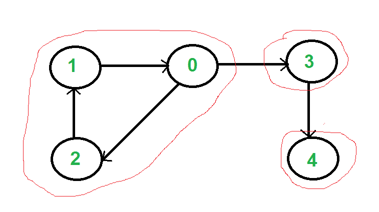
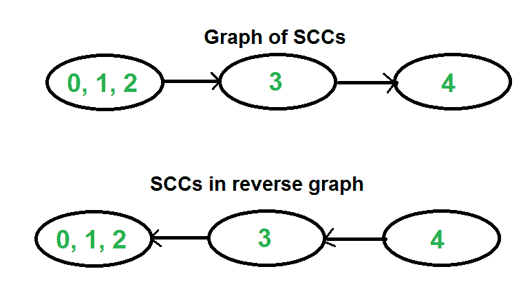

# 强连接组件

> 原文:[https://www . geesforgeks . org/强连接组件/](https://www.geeksforgeeks.org/strongly-connected-components/)

如果所有顶点对之间都有一条路径，则有向图是强连通的。有向图的强连通分支( **SCC** )是极大强连通子图。例如，下图中有 3 个 SCC。

[](https://media.geeksforgeeks.org/wp-content/cdn-uploads/SCC.png)

我们可以使用 [Kosaraju 的算法](http://en.wikipedia.org/wiki/Kosaraju%27s_algorithm)找到 O(V+E)时间内的所有强连通分量。下面是详细的 Kosaraju 的算法。
**1)** 创建一个空栈‘S’并对一个图进行 DFS 遍历。在 DFS 遍历中，对一个顶点的相邻顶点调用递归 DFS 后，将该顶点推送到栈中。在上图中，如果我们从顶点 0 开始 DFS，我们得到堆栈中的顶点为 1，2，4，3，0。
**2)** 反转所有弧的方向，得到转置图。
**3)** 当 S 不为空时，从 S 开始逐个弹出一个顶点。让弹出的顶点为“v”。以 v 为源，做 DFS(调用 [DFSUtil(v)](https://www.geeksforgeeks.org/depth-first-traversal-for-a-graph/) )。从 v 开始的 DFS 打印 v 的强连通分量。在上面的例子中，我们按照 0，3，4，2，1 的顺序处理顶点(从堆栈中逐个弹出)。

**这是如何工作的？**
以上算法是基于 DFS 的。它做了两次 DFS。如果所有的顶点都可以从 DFS 的起点到达，那么图的 DFS 生成一棵单独的树。否则，DFS 会生成一个林。所以只有一个 SCC 的图的 DFS 总是产生一棵树。需要注意的重要一点是，根据所选的起点，当有多个 SCC 时，DFS 可能会生成一棵树或一个林。例如，在上图中，如果我们从顶点 0 或 1 或 2 开始 DFS，我们会得到一棵树作为输出。如果我们从 3 或 4 开始，我们会得到一片森林。要查找和打印所有 SCC，我们希望从顶点 4(它是一个汇点顶点)开始 DFS，然后移动到 3(它是剩余集合(集合不包括 4)中的汇点)，最后是任何剩余的顶点(0，1，2)。那么我们如何找到这个挑选顶点的序列作为 DFS 的起点呢？不幸的是，没有直接的方法得到这个序列。然而，如果我们做一个图的 DFS，并根据顶点的完成时间存储它们，我们确保一个顶点连接到其他 SCC(除了它自己的 SCC)的完成时间将总是大于其他 SCC 中顶点的完成时间(见[这个](http://www.personal.kent.edu/~rmuhamma/Algorithms/MyAlgorithms/GraphAlgor/strongComponent.htm)的证明)。例如，在上述示例图的 DFS 中，结束时间 0 总是大于 3 和 4(与 DFS 考虑的顶点顺序无关)。3 的完成时间总是大于 4。DFS 不保证其他顶点，例如，完成时间 1 和 2 可能小于或大于 3 和 4，这取决于 DFS 考虑的顶点顺序。因此，为了使用这个属性，我们对完全图进行 DFS 遍历，并将每个完成的顶点推送到堆栈中。在堆栈中，3 总是出现在 4 之后，0 出现在 3 和 4 之后。
下一步，我们反转图形。考虑 SCCs 的图表。在反向图中，连接两个组件的边是反向的。因此，SCC {0，1，2}成为接收器，SCC {4}成为源。如上所述，在堆栈中，我们总是在 3 和 4 之前有 0。因此，如果我们使用堆栈中的顶点序列对反向图进行 DFS，我们将从宿点到源点(在反向图中)处理顶点。这就是我们想要实现的，也是一个一个打印 SCC 所需要的。
[](https://media.geeksforgeeks.org/wp-content/cdn-uploads/SCCGraph2.png)

下面是 Kosaraju 算法的 C++实现。

## C++

```
// C++ Implementation of Kosaraju's algorithm to print all SCCs
#include <iostream>
#include <list>
#include <stack>
using namespace std;

class Graph
{
    int V;    // No. of vertices
    list<int> *adj;    // An array of adjacency lists

    // Fills Stack with vertices (in increasing order of finishing
    // times). The top element of stack has the maximum finishing 
    // time
    void fillOrder(int v, bool visited[], stack<int> &Stack);

    // A recursive function to print DFS starting from v
    void DFSUtil(int v, bool visited[]);
public:
    Graph(int V);
    void addEdge(int v, int w);

    // The main function that finds and prints strongly connected
    // components
    void printSCCs();

    // Function that returns reverse (or transpose) of this graph
    Graph getTranspose();
};

Graph::Graph(int V)
{
    this->V = V;
    adj = new list<int>[V];
}

// A recursive function to print DFS starting from v
void Graph::DFSUtil(int v, bool visited[])
{
    // Mark the current node as visited and print it
    visited[v] = true;
    cout << v << " ";

    // Recur for all the vertices adjacent to this vertex
    list<int>::iterator i;
    for (i = adj[v].begin(); i != adj[v].end(); ++i)
        if (!visited[*i])
            DFSUtil(*i, visited);
}

Graph Graph::getTranspose()
{
    Graph g(V);
    for (int v = 0; v < V; v++)
    {
        // Recur for all the vertices adjacent to this vertex
        list<int>::iterator i;
        for(i = adj[v].begin(); i != adj[v].end(); ++i)
        {
            g.adj[*i].push_back(v);
        }
    }
    return g;
}

void Graph::addEdge(int v, int w)
{
    adj[v].push_back(w); // Add w to v’s list.
}

void Graph::fillOrder(int v, bool visited[], stack<int> &Stack)
{
    // Mark the current node as visited and print it
    visited[v] = true;

    // Recur for all the vertices adjacent to this vertex
    list<int>::iterator i;
    for(i = adj[v].begin(); i != adj[v].end(); ++i)
        if(!visited[*i])
            fillOrder(*i, visited, Stack);

    // All vertices reachable from v are processed by now, push v 
    Stack.push(v);
}

// The main function that finds and prints all strongly connected 
// components
void Graph::printSCCs()
{
    stack<int> Stack;

    // Mark all the vertices as not visited (For first DFS)
    bool *visited = new bool[V];
    for(int i = 0; i < V; i++)
        visited[i] = false;

    // Fill vertices in stack according to their finishing times
    for(int i = 0; i < V; i++)
        if(visited[i] == false)
            fillOrder(i, visited, Stack);

    // Create a reversed graph
    Graph gr = getTranspose();

    // Mark all the vertices as not visited (For second DFS)
    for(int i = 0; i < V; i++)
        visited[i] = false;

    // Now process all vertices in order defined by Stack
    while (Stack.empty() == false)
    {
        // Pop a vertex from stack
        int v = Stack.top();
        Stack.pop();

        // Print Strongly connected component of the popped vertex
        if (visited[v] == false)
        {
            gr.DFSUtil(v, visited);
            cout << endl;
        }
    }
}

// Driver program to test above functions
int main()
{
    // Create a graph given in the above diagram
    Graph g(5);
    g.addEdge(1, 0);
    g.addEdge(0, 2);
    g.addEdge(2, 1);
    g.addEdge(0, 3);
    g.addEdge(3, 4);

    cout << "Following are strongly connected components in "
            "given graph \n";
    g.printSCCs();

    return 0;
}
```

## Java 语言(一种计算机语言，尤用于创建网站)

```
// Java implementation of Kosaraju's algorithm to print all SCCs
import java.io.*;
import java.util.*;
import java.util.LinkedList;

// This class represents a directed graph using adjacency list
// representation
class Graph
{
    private int V;   // No. of vertices
    private LinkedList<Integer> adj[]; //Adjacency List

    //Constructor
    Graph(int v)
    {
        V = v;
        adj = new LinkedList[v];
        for (int i=0; i<v; ++i)
            adj[i] = new LinkedList();
    }

    //Function to add an edge into the graph
    void addEdge(int v, int w)  { adj[v].add(w); }

    // A recursive function to print DFS starting from v
    void DFSUtil(int v,boolean visited[])
    {
        // Mark the current node as visited and print it
        visited[v] = true;
        System.out.print(v + " ");

        int n;

        // Recur for all the vertices adjacent to this vertex
        Iterator<Integer> i =adj[v].iterator();
        while (i.hasNext())
        {
            n = i.next();
            if (!visited[n])
                DFSUtil(n,visited);
        }
    }

    // Function that returns reverse (or transpose) of this graph
    Graph getTranspose()
    {
        Graph g = new Graph(V);
        for (int v = 0; v < V; v++)
        {
            // Recur for all the vertices adjacent to this vertex
            Iterator<Integer> i =adj[v].listIterator();
            while(i.hasNext())
                g.adj[i.next()].add(v);
        }
        return g;
    }

    void fillOrder(int v, boolean visited[], Stack stack)
    {
        // Mark the current node as visited and print it
        visited[v] = true;

        // Recur for all the vertices adjacent to this vertex
        Iterator<Integer> i = adj[v].iterator();
        while (i.hasNext())
        {
            int n = i.next();
            if(!visited[n])
                fillOrder(n, visited, stack);
        }

        // All vertices reachable from v are processed by now,
        // push v to Stack
        stack.push(new Integer(v));
    }

    // The main function that finds and prints all strongly
    // connected components
    void printSCCs()
    {
        Stack stack = new Stack();

        // Mark all the vertices as not visited (For first DFS)
        boolean visited[] = new boolean[V];
        for(int i = 0; i < V; i++)
            visited[i] = false;

        // Fill vertices in stack according to their finishing
        // times
        for (int i = 0; i < V; i++)
            if (visited[i] == false)
                fillOrder(i, visited, stack);

        // Create a reversed graph
        Graph gr = getTranspose();

        // Mark all the vertices as not visited (For second DFS)
        for (int i = 0; i < V; i++)
            visited[i] = false;

        // Now process all vertices in order defined by Stack
        while (stack.empty() == false)
        {
            // Pop a vertex from stack
            int v = (int)stack.pop();

            // Print Strongly connected component of the popped vertex
            if (visited[v] == false)
            {
                gr.DFSUtil(v, visited);
                System.out.println();
            }
        }
    }

    // Driver method
    public static void main(String args[])
    {
        // Create a graph given in the above diagram
        Graph g = new Graph(5);
        g.addEdge(1, 0);
        g.addEdge(0, 2);
        g.addEdge(2, 1);
        g.addEdge(0, 3);
        g.addEdge(3, 4);

        System.out.println("Following are strongly connected components "+
                           "in given graph ");
        g.printSCCs();
    }
}
// This code is contributed by Aakash Hasija
```

## 计算机编程语言

```
# Python implementation of Kosaraju's algorithm to print all SCCs

from collections import defaultdict

#This class represents a directed graph using adjacency list representation
class Graph:

    def __init__(self,vertices):
        self.V= vertices #No. of vertices
        self.graph = defaultdict(list) # default dictionary to store graph

    # function to add an edge to graph
    def addEdge(self,u,v):
        self.graph[u].append(v)

    # A function used by DFS
    def DFSUtil(self,v,visited):
        # Mark the current node as visited and print it
        visited[v]= True
        print v,
        #Recur for all the vertices adjacent to this vertex
        for i in self.graph[v]:
            if visited[i]==False:
                self.DFSUtil(i,visited)

    def fillOrder(self,v,visited, stack):
        # Mark the current node as visited 
        visited[v]= True
        #Recur for all the vertices adjacent to this vertex
        for i in self.graph[v]:
            if visited[i]==False:
                self.fillOrder(i, visited, stack)
        stack = stack.append(v)

    # Function that returns reverse (or transpose) of this graph
    def getTranspose(self):
        g = Graph(self.V)

        # Recur for all the vertices adjacent to this vertex
        for i in self.graph:
            for j in self.graph[i]:
                g.addEdge(j,i)
        return g

    # The main function that finds and prints all strongly
    # connected components
    def printSCCs(self):

         stack = []
        # Mark all the vertices as not visited (For first DFS)
        visited =[False]*(self.V)
        # Fill vertices in stack according to their finishing
        # times
        for i in range(self.V):
            if visited[i]==False:
                self.fillOrder(i, visited, stack)

        # Create a reversed graph
         gr = self.getTranspose()

         # Mark all the vertices as not visited (For second DFS)
         visited =[False]*(self.V)

         # Now process all vertices in order defined by Stack
         while stack:
             i = stack.pop()
             if visited[i]==False:
                gr.DFSUtil(i, visited)
                print""

# Create a graph given in the above diagram
g = Graph(5)
g.addEdge(1, 0)
g.addEdge(0, 2)
g.addEdge(2, 1)
g.addEdge(0, 3)
g.addEdge(3, 4)

print ("Following are strongly connected components " +
                           "in given graph")
g.printSCCs()
#This code is contributed by Neelam Yadav
```

Output:

```
Following are strongly connected components in given graph
0 1 2
3
4
```

**时间复杂度:**以上算法调用 DFS，找到图的逆向，再次调用 DFS。DFS 对用邻接表表示的图取 O(V+E)。反转图形也需要 O(V+E)时间。为了反转图，我们简单地遍历所有邻接表。

上述算法是渐近最优算法，但也有其他算法像[塔尔扬算法](http://en.wikipedia.org/wiki/Tarjan%27s_strongly_connected_components_algorithm)和[基于路径的](http://en.wikipedia.org/wiki/Path-based_strong_component_algorithm)具有相同的时间复杂度，但使用单个 DFS 找到 SCC。塔尔扬算法将在下一篇文章中讨论。

[塔尔扬寻找强连通分量的算法](https://www.geeksforgeeks.org/tarjan-algorithm-find-strongly-connected-components/)

**应用:**
SCC 算法可以作为许多只在强连通图上工作的图算法的第一步。
在社交网络中，一群人一般都是强关联的(比如一个班级的学生或者其他任何共同的地方)。这些群体中的很多人一般都喜欢一些普通的页面或者玩普通的游戏。SCC 算法可以用于找到这样的组，并向组中还没有喜欢共同喜欢的页面或玩游戏的人建议共同喜欢的页面或游戏。

**参考文献:**T2[http://en.wikipedia.org/wiki/Kosaraju%27s_algorithm](http://en.wikipedia.org/wiki/Kosaraju%27s_algorithm)T5[https://www.youtube.com/watch?v=PZQ0Pdk15RA](https://www.youtube.com/watch?v=PZQ0Pdk15RA)

你可能还想看看[塔尔扬寻找强连通分量的算法](https://www.geeksforgeeks.org/tarjan-algorithm-find-strongly-connected-components/)。

如果您发现任何不正确的地方，或者您想分享更多关于上面讨论的主题的信息，请写评论