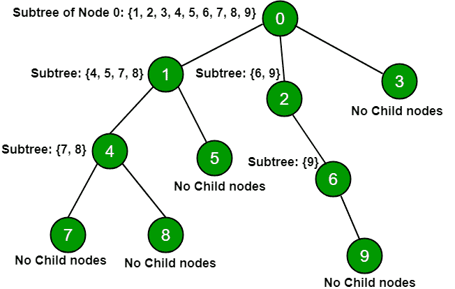

# 使用 DFS 的树中所有节点的子树

> 原文:[https://www . geesforgeks . org/sub tree-nodes-tree-using-DFS/](https://www.geeksforgeeks.org/sub-tree-nodes-tree-using-dfs/)

给定一棵树的 n 个节点及其连接，打印每个节点的子树节点。节点的
**子树**被定义为节点的子树。这个名字强调的是，作为树节点后代的所有东西也是树，并且是更大的树的子集。



**例:**

```
Input: N = 5
  0 1
  1 2
  0 3
  3 4
Output: 
Subtree of node 0 is 1 2 3 4 
Subtree of node 1 is 2 
Subtree of node 3 is 4

Input: N = 7
  0 1
  1 2
  2 3
  0 4
  4 5
  4 6
Output:
Subtree of node 0 is 1 2 3 4 5 6 
Subtree of node 1 is 2 3 
Subtree of node 4 is 5 6 
```

**方法:**对每个节点进行 DFS 遍历，并打印从特定节点可到达的所有节点。
**以下代码解释:**

1.  当函数 dfs(0，0)被调用时，start[0] = 0，dfs_order.push_back(0)，visited[0] = 1 来跟踪 dfs 顺序。
2.  现在，考虑邻接列表(adj[100001])，因为考虑到连接到节点 0 的方向路径元素将在对应于节点 0 的邻接列表中。
3.  现在，递归调用 dfs 函数，直到 adj[0]遍历的所有元素。
4.  现在，dfs(1，2)被调用，现在开始[1] = 1，dfs_order.push_back(1)，在 adj[1]元素被遍历后被访问[1] = 1。
5.  现在 adj [1]被遍历，它只包含节点 2。当 adj[2]被遍历时，它不包含任何元素，它将断开并结束[1]=2。
6.  类似地，遍历所有节点并将 dfs_order 存储在数组中，以查找节点的子树。

## C++

```
// C++ code to print subtree of all nodes
#include<bits/stdc++.h>
using namespace std;

// arrays for keeping position
// at each dfs traversal for each node
int start[100001];
int end[100001];

// Storing dfs order
vector<int>dfs_order;
vector<int>adj[100001];
int visited[100001];

// Recursive function for dfs
// traversal dfsUtil()
void dfs(int a,int &b)
{

    // keep track of node visited
    visited[a]=1;
    b++;
    start[a]=b;
    dfs_order.push_back(a);

    for(vector<int>:: iterator it=adj[a].begin();
                           it!=adj[a].end();it++)
    {
        if(!visited[*it])
        {
            dfs(*it,b);
        }
    }
    endd[a]=b;
}

// Function to print the subtree nodes
void Print(int n)
{
    for(int i = 0; i < n; i++)
    {
        // if node is leaf node
        // start[i] is equals to endd[i]
        if(start[i]!=endd[i])
        {
            cout<<"subtree of node "<<i<<" is ";
            for(int j=start[i]+1;j<=endd[i];j++)
            {
                cout<<dfs_order[j-1]<<" ";
            }
            cout<<endl;
        }
    }
}

// Driver code
int main()
{
    // No of nodes n = 10
    int n =10, c = 0;

    adj[0].push_back(1);
    adj[0].push_back(2);
    adj[0].push_back(3);
    adj[1].push_back(4);
    adj[1].push_back(5);
    adj[4].push_back(7);
    adj[4].push_back(8);
    adj[2].push_back(6);
    adj[6].push_back(9);

    // Calling dfs for node 0
    // Considering root node at 0
    dfs(0, c);

    // Print child nodes
    Print(n);

    return 0;

}
```

## Java 语言(一种计算机语言，尤用于创建网站)

```
// Java code to print subtree of all nodes
import java.util.*;
public class Main
{
    // arrays for keeping position
    // at each dfs traversal for each node
    static int[] start = new int[100001];
    static int[] end = new int[100001];

    // Storing dfs order
    static Vector<Integer> dfs_order = new Vector<Integer>();
    static Vector<Vector<Integer>> adj = new Vector<Vector<Integer>>();
    static boolean[] visited = new boolean[100001];

    // Recursive function for dfs traversal dfsUtil()
    static int dfs(int a, int b)
    {
        // keep track of node visited
        visited[a] = true;
        b += 1;
        start[a] = b;
        dfs_order.add(a);

        for(int it = 0; it < adj.get(a).size(); it++)
        {
            if(!visited[adj.get(a).get(it)])
                b = dfs(adj.get(a).get(it), b);
        }

        endd[a] = b;
        return b;
    }

    // Function to print the subtree nodes
    static void Print(int n)
    {
        for(int i = 0; i < n; i++)
        {
            // If node is leaf node
            // start[i] is equals to endd[i]
            if(start[i] != endd[i])
            {
                System.out.print("subtree of node "+ i + " is ");
                for(int j = start[i]+1; j < endd[i]+1; j++)
                {
                    System.out.print(dfs_order.get(j-1) +  " ");
                }
                System.out.println();
            }
        }
    }

    public static void main(String[] args) {
        // No of nodes n = 10
        int n =10, c = 0;

        for(int i = 0; i < 100001; i++)
        {
            adj.add(new Vector<Integer>());
        }

        adj.get(0).add(1);
        adj.get(0).add(2);
        adj.get(0).add(3);
        adj.get(1).add(4);
        adj.get(1).add(5);
        adj.get(4).add(7);
        adj.get(4).add(8);
        adj.get(2).add(6);
        adj.get(6).add(9);

        // Calling dfs for node 0
        // Considering root node at 0
        dfs(0, c);

        // Print child nodes
        Print(n);
    }
}

// This code is contributed by divyeshrabadiya07.
```

## 蟒蛇 3

```
# Python3 code to print subtree of all nodes

# arrays for keeping position at
# each dfs traversal for each node
start = [None] * 100001
end = [None] * 100001

# Storing dfs order
dfs_order = []
adj = [[] for i in range(100001)]
visited = [False] * 100001

# Recursive function for dfs traversal dfsUtil()
def dfs(a, b):

    # keep track of node visited
    visited[a] = 1
    b += 1
    start[a] = b
    dfs_order.append(a)

    for it in adj[a]:
        if not visited[it]:
            b = dfs(it, b)

    endd[a] = b
    return b

# Function to print the subtree nodes
def Print(n):

    for i in range(0, n):

        # If node is leaf node
        # start[i] is equals to endd[i]
        if start[i] != endd[i]:

            print("subtree of node", i, "is", end = " ")
            for j in range(start[i]+1, endd[i]+1):

                print(dfs_order[j-1], end = " ")

            print()

# Driver code
if __name__ == "__main__":

    # No of nodes n = 10
    n, c = 10, 0

    adj[0].append(1)
    adj[0].append(2)
    adj[0].append(3)
    adj[1].append(4)
    adj[1].append(5)
    adj[4].append(7)
    adj[4].append(8)
    adj[2].append(6)
    adj[6].append(9)

    # Calling dfs for node 0
    # Considering root node at 0
    dfs(0, c)

    # Print child nodes
    Print(n)

# This code is contributed by Rituraj Jain
```

## C#

```
// C# code to print subtree of all nodes
using System;
using System.Collections.Generic;
class GFG {

    // arrays for keeping position
    // at each dfs traversal for each node
    static int[] start = new int[100001];
    static int[] end = new int[100001];

    // Storing dfs order
    static List<int> dfs_order = new List<int>();
    static List<List<int>> adj = new List<List<int>>();
    static bool[] visited = new bool[100001];

    // Recursive function for dfs traversal dfsUtil()
    static int dfs(int a, int b)
    {
        // keep track of node visited
        visited[a] = true;
        b += 1;
        start[a] = b;
        dfs_order.Add(a);

        for(int it = 0; it < adj[a].Count; it++)
        {
            if(!visited[adj[a][it]])
                b = dfs(adj[a][it], b);
        }

        endd[a] = b;
        return b;
    }

    // Function to print the subtree nodes
    static void Print(int n)
    {
        for(int i = 0; i < n; i++)
        {
            // If node is leaf node
            // start[i] is equals to endd[i]
            if(start[i] != endd[i])
            {
                Console.Write("subtree of node "+ i + " is ");
                for(int j = start[i]+1; j < endd[i]+1; j++)
                {
                    Console.Write(dfs_order[j-1] +  " ");
                }
                Console.WriteLine();
            }
        }
    }

  static void Main() {
    // No of nodes n = 10
    int n =10, c = 0;

    for(int i = 0; i < 100001; i++)
    {
        adj.Add(new List<int>());
    }

    adj[0].Add(1);
    adj[0].Add(2);
    adj[0].Add(3);
    adj[1].Add(4);
    adj[1].Add(5);
    adj[4].Add(7);
    adj[4].Add(8);
    adj[2].Add(6);
    adj[6].Add(9);

    // Calling dfs for node 0
    // Considering root node at 0
    dfs(0, c);

    // Print child nodes
    Print(n);
  }
}

// This code is contributed by divyesh072019.
```

## java 描述语言

```
<script>
    // Javascript code to print subtree of all nodes

    // arrays for keeping position
    // at each dfs traversal for each node
    let start = new Array(100001);
    let end = new Array(100001);

    // Storing dfs order
    let dfs_order = [];
    let adj = [];
    for(let i = 0; i < 100001; i++)
    {
        adj.push([]);
    }
    let visited = new Array(100001);
    visited.fill(false);

    // Recursive function for dfs traversal dfsUtil()
    function dfs(a, b)
    {
        // keep track of node visited
        visited[a] = true;
        b += 1;
        start[a] = b;
        dfs_order.push(a);

        for(let it = 0; it < adj[a].length; it++)
        {
            if(!visited[adj[a][it]])
                b = dfs(adj[a][it], b);
        }

        endd[a] = b;
        return b;
    }

    // Function to print the subtree nodes
    function Print(n)
    {
        for(let i = 0; i < n; i++)
        {
            // If node is leaf node
            // start[i] is equals to endd[i]
            if(start[i] != endd[i])
            {
                document.write("subtree of node "+ i + " is ");
                for(let j = start[i]+1; j < endd[i]+1; j++)
                {
                    document.write(dfs_order[j-1] +  " ");
                }
                document.write("</br>");
            }
        }
    }

    // No of nodes n = 10
    let n = 10, c = 0;

    adj[0].push(1);
    adj[0].push(2);
    adj[0].push(3);
    adj[1].push(4);
    adj[1].push(5);
    adj[4].push(7);
    adj[4].push(8);
    adj[2].push(6);
    adj[6].push(9);

    // Calling dfs for node 0
    // Considering root node at 0
    dfs(0, c);

    // Print child nodes
    Print(n);

// This code is contributed by suresh07.
</script>
```

**Output:** 

```
subtree of node 0 is 1 4 7 8 5 2 6 9 3 
subtree of node 1 is 4 7 8 5 
subtree of node 2 is 6 9 
subtree of node 4 is 7 8 
subtree of node 6 is 9
```

***时间复杂度:** O(N ^ 2)*
***辅助空间:** O(N)*