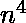

# 没有可被 K 整除的对和的子阵列

> 原文:[https://www . geesforgeks . org/subarray-no-pair-sum-除尽-k/](https://www.geeksforgeeks.org/subarray-no-pair-sum-divisible-k/)

给定一个由 N 个非负整数组成的数组，任务是找到一个子数组的最大大小，使得这个子数组的元素的成对和不能被一个给定的整数 k 整除。如果有两个或多个子阵列符合上述条件，则从左边打印第一个。
**先决条件:** [没有可被 K 整除的对和的子集](https://www.geeksforgeeks.org/subset-no-pair-sum-divisible-k/)
**示例:**

```
Input : arr[] = [3, 7, 1, 9, 2]        
        K = 3
Output : 3
         [3, 7, 1]
3 + 7 = 10, 3 + 1 = 4, 7 + 1 = 8, all are 
not divisible by 3\. 
It is not possible to get a subarray of size bigger
than 3 with the above-mentioned property.
[7, 1, 9] is also of the same size but [3, 7, 1] comes first.

Input : arr[] = [2, 4, 4, 3]        
        K = 4
Output : 2
         [2, 4]
2 + 4 = 6 is not divisible by 4\. 
It is not possible to get a subarray of size bigger 
than 2 with the above-mentioned property.
[4, 3] is also of the same size but [2, 4] comes first.
```

**天真的方法:**
天真的方法是考虑所有的子阵列。当考虑一个子阵列时，成对地获取元素，并计算该对元素的两个元素之和。如果计算出的和可以被 K 整除，那么忽略这个子阵列，继续下一个子阵列。否则，以类似的方式计算该子阵列的其他对的总和。如果没有对的和是 K 的倍数，那么将这个子阵列的大小与迄今为止获得的最大大小进行比较，并在需要时进行更新。
该方法的时间复杂度为 0()。
**高效方法(使用哈希):**
我们创建一个空哈希表，并在其中插入 arr[0] % k。现在，我们遍历剩余的元素，并维护一个窗口，使得窗口中没有一对元素可被 k 整除。对于每个遍历的元素，我们移除起始元素，同时当前窗口中存在一个元素，该元素与当前元素形成可整除的对。为了检查当前窗口中是否有元素，我们检查以下内容。
1)如果有一个元素 x 使得(K–x % K)等于 arr[i] % K
2) OR arr[i] % k 为 0，并且它存在于哈希中。
一旦我们确定所有可以与 arr[i]配对的元素都被移除，我们就将 arr[i]添加到当前窗口，并检查当前窗口的大小是否超过了迄今为止的最大窗口。

## C++

```
// CPP code to find the subarray with
// no pair sum divisible by K
#include<bits/stdc++.h>
using namespace std;

// function to find the subarray with
// no pair sum divisible by k
void subarrayDivisibleByK(int arr[], int n, int k)
{
    // hash table to store the remainders
    // obtained on dividing by K
    map<int,int> mp;

    // s : starting index of the
    // current subarray, e : ending
    // index of the current subarray, maxs :
    // starting index of the maximum
    // size subarray so far, maxe : ending
    // index of the maximum size subarray
    // so far
    int s = 0, e = 0, maxs = 0, maxe = 0;

    // insert the first element in the set
    mp[arr[0] % k]++;

    for (int i = 1; i < n; i++)
    {
        int mod = arr[i] % k;

        // Removing starting elements of current
        // subarray while there is an element in
        // set which makes a pair with mod[i] such
        // that the pair sum is divisible.
        while (mp[k - mod] != 0 ||
              (mod == 0 && mp[mod] != 0))
        {
            mp[arr[s] % k]--;
            s++;
        }

        // include the current element in
        // the current subarray the ending
        // index of the current subarray
        // increments by one
        mp[mod]++;
        e++;

        // compare the size of the current
        // subarray with the maximum size so
        // far
        if ((e - s) > (maxe - maxs))
        {
            maxe = e;
            maxs = s;
        }

    }

    cout << "The maximum size is "
         << maxe - maxs + 1 << " and "
         "the subarray is as follows\n";

    for (int i=maxs; i<=maxe; i++)
        cout << arr[i] << " ";
}

int main()
{
    int k = 3;
    int arr[] = {5, 10, 15, 20, 25};
    int n = sizeof(arr)/sizeof(arr[0]);
    subarrayDivisibleByK(arr, n, k);
    return 0;
}
```

## Java 语言(一种计算机语言，尤用于创建网站)

```
// Java Program to find the subarray with
// no pair sum divisible by K
import java.io.*;
import java.util.*;

public class GFG {

    // function to find the subarray with
    // no pair sum divisible by k
    static void subarrayDivisibleByK(int []arr,
                                int n, int k)
    {

        // hash table to store the remainders
        // obtained on dividing by K
        int []mp = new int[1000];

        // s : starting index of the
        // current subarray, e : ending
        // index of the current subarray, maxs :
        // starting index of the maximum
        // size subarray so far, maxe : ending
        // index of the maximum size subarray
        // so far
        int s = 0, e = 0, maxs = 0, maxe = 0;

        // insert the first element in the set
        mp[arr[0] % k]++;

        for (int i = 1; i < n; i++)
        {
            int mod = arr[i] % k;

            // Removing starting elements of current
            // subarray while there is an element in
            // set which makes a pair with mod[i] such
            // that the pair sum is divisible.
            while (mp[k - mod] != 0 ||
                (mod == 0 && mp[mod] != 0))
            {
                mp[arr[s] % k]--;
                s++;
            }

            // include the current element in
            // the current subarray the ending
            // index of the current subarray
            // increments by one
            mp[mod]++;
            e++;

            // compare the size of the current
            // subarray with the maximum size so
            // far
            if ((e - s) > (maxe - maxs))
            {
                maxe = e;
                maxs = s;
            }

        }

        System.out.print("The maximum size is "
                            + (maxe - maxs + 1)
        + " and the subarray is as follows\n");

        for (int i = maxs; i <= maxe; i++)
            System.out.print(arr[i] + " ");
    }

    // Driver Code
    public static void main(String args[])
    {
        int k = 3;
        int []arr = {5, 10, 15, 20, 25};
        int n = arr.length;
        subarrayDivisibleByK(arr, n, k);
    }
}

// This code is contributed by
// Manish Shaw (manishshaw1)
```

## 蟒蛇 3

```
# Python3 Program to find the subarray with
# no pair sum divisible by K

# function to find the subarray with
# no pair sum divisible by k
def subarrayDivisibleByK(arr, n, k) :

    # hash table to store the remainders
    # obtained on dividing by K
    mp = [0] * 1000

    # s : starting index of the
    # current subarray, e : ending
    # index of the current subarray, maxs :
    # starting index of the maximum
    # size subarray so far, maxe : ending
    # index of the maximum size subarray
    # so far
    s = 0; e = 0; maxs = 0; maxe = 0;

    # insert the first element in the set
    mp[arr[0] % k] = mp[arr[0] % k] + 1;

    for i in range(1, n):
        mod = arr[i] % k

        # Removing starting elements of current
        # subarray while there is an element in
        # set which makes a pair with mod[i] such
        # that the pair sum is divisible.
        while (mp[k - mod] != 0 or (mod == 0
                            and mp[mod] != 0)) :
            mp[arr[s] % k] = mp[arr[s] % k] - 1
            s = s + 1

        # include the current element in
        # the current subarray the ending
        # index of the current subarray
        # increments by one
        mp[mod] = mp[mod] + 1
        e = e + 1

        # compare the size of the current
        # subarray with the maximum size so
        # far
        if ((e - s) > (maxe - maxs)) :
            maxe = e
            maxs = s

    print ("The maximum size is {} and the "
                   " subarray is as follows"
                   .format((maxe - maxs + 1)))

    for i in range(maxs, maxe + 1) :
        print ("{} ".format(arr[i]), end="")

# Driver Code
k = 3
arr = [5, 10, 15, 20, 25]
n = len(arr)
subarrayDivisibleByK(arr, n, k)

# This code is contributed by
# Manish Shaw (manishshaw1)
```

## C#

```
// C# Program to find the subarray with
// no pair sum divisible by K
using System;
using System.Collections;

class GFG {

    // function to find the subarray with
    // no pair sum divisible by k
    static void subarrayDivisibleByK(int []arr,
                                int n, int k)
    {

        // hash table to store the remainders
        // obtained on dividing by K
        int []mp = new int[1000];

        // s : starting index of the
        // current subarray, e : ending
        // index of the current subarray, maxs :
        // starting index of the maximum
        // size subarray so far, maxe : ending
        // index of the maximum size subarray
        // so far
        int s = 0, e = 0, maxs = 0, maxe = 0;

        // insert the first element in the set
        mp[arr[0] % k]++;

        for (int i = 1; i < n; i++)
        {
            int mod = arr[i] % k;

            // Removing starting elements of current
            // subarray while there is an element in
            // set which makes a pair with mod[i] such
            // that the pair sum is divisible.
            while (mp[k - mod] != 0 ||
                (mod == 0 && mp[mod] != 0))
            {
                mp[arr[s] % k]--;
                s++;
            }

            // include the current element in
            // the current subarray the ending
            // index of the current subarray
            // increments by one
            mp[mod]++;
            e++;

            // compare the size of the current
            // subarray with the maximum size so
            // far
            if ((e - s) > (maxe - maxs))
            {
                maxe = e;
                maxs = s;
            }

        }

        Console.Write("The maximum size is " +
                           (maxe - maxs + 1) +
            " and the subarray is as follows\n");

        for (int i = maxs; i <= maxe; i++)
            Console.Write(arr[i] + " ");
    }

    // Driver Code
    public static void Main()
    {
        int k = 3;
        int []arr = {5, 10, 15, 20, 25};
        int n = arr.Length;
        subarrayDivisibleByK(arr, n, k);
    }
}

// This code is contributed by
// Manish Shaw (manishshaw1)
```

## 服务器端编程语言（Professional Hypertext Preprocessor 的缩写）

```
<?php
// PHP Program to find the
// subarray with no pair
// sum divisible by K

// function to find the subarray
// with no pair sum divisible by k
function subarrayDivisibleByK($arr, $n, $k)
{        
    // hash table to store the remainders
    // obtained on dividing by K
    $mp = array_fill(0, 1000, 0);

    // s : starting index of the
    // current subarray, e : ending
    // index of the current subarray, maxs :
    // starting index of the maximum
    // size subarray so far, maxe : ending
    // index of the maximum size subarray
    // so far
    $s = 0;
    $e = 0;
    $maxs = 0;
    $maxe = 0;

    // insert the first
    // element in the set
    $mp[$arr[0] % $k]++;

    for ($i = 1; $i < $n; $i++)
    {
        $mod = $arr[$i] % $k;

        // Removing starting elements
        // of current subarray while
        // there is an element in set
        // which makes a pair with
        // mod[i] such that the pair
        // sum is divisible.
        while ($mp[$k - $mod] != 0 ||
                        ($mod == 0 &&
                         $mp[$mod] != 0))
        {
            $mp[$arr[$s] % $k]--;
            $s++;
        }

        // include the current element in
        // the current subarray the ending
        // index of the current subarray
        // increments by one
        $mp[$mod]++;
        $e++;

        // compare the size of the current
        // subarray with the maximum size so
        // far
        if (($e - $s) > ($maxe - $maxs))
        {
            $maxe = $e;
            $maxs = $s;
        }

    }

    echo ("The maximum size is ".
             ($maxe - $maxs + 1).
          " and the subarray is".
                " as follows\n");

    for ($i = $maxs; $i <= $maxe; $i++)
        echo ($arr[$i]." ");
}

// Driver Code
$k = 3;
$arr = array(5, 10, 15, 20, 25);
$n = count($arr);
subarrayDivisibleByK($arr, $n, $k);

// This code is contributed by
// Manish Shaw (manishshaw1)
?>
```

## java 描述语言

```
<script>
      // JavaScript Program to find the subarray with
      // no pair sum divisible by K
      // function to find the subarray with
      // no pair sum divisible by k
      function subarrayDivisibleByK(arr, n, k) {
        // hash table to store the remainders
        // obtained on dividing by K
        var mp = new Array(1000).fill(0);

        // s : starting index of the
        // current subarray, e : ending
        // index of the current subarray, maxs :
        // starting index of the maximum
        // size subarray so far, maxe : ending
        // index of the maximum size subarray
        // so far
        var s = 0,
          e = 0,
          maxs = 0,
          maxe = 0;

        // insert the first element in the set
        mp[arr[0] % k]++;

        for (var i = 1; i < n; i++) {
          var mod = arr[i] % k;

          // Removing starting elements of current
          // subarray while there is an element in
          // set which makes a pair with mod[i] such
          // that the pair sum is divisible.
          while (mp[k - mod] != 0 || (mod == 0 && mp[mod] != 0)) {
            mp[arr[s] % k]--;
            s++;
          }

          // include the current element in
          // the current subarray the ending
          // index of the current subarray
          // increments by one
          mp[mod]++;
          e++;

          // compare the size of the current
          // subarray with the maximum size so
          // far
          if (e - s > maxe - maxs) {
            maxe = e;
            maxs = s;
          }
        }

        document.write(
          "The maximum size is " +
            (maxe - maxs + 1) +
            " and the subarray is as follows<br>"
        );

        for (var i = maxs; i <= maxe; i++) document.write(arr[i] + " ");
      }

      // Driver Code
      var k = 3;
      var arr = [5, 10, 15, 20, 25];
      var n = arr.length;
      subarrayDivisibleByK(arr, n, k);

      // This code is contributed by rdtank.
    </script>
```

**Output :** 

```
The maximum size is 2 and the subarray is as follows
10 15
```

**时间复杂度:** O(n)