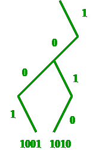

# 异或小于 k 的子阵列

> 原文:[https://www.geeksforgeeks.org/subarray-xor-less-k/](https://www.geeksforgeeks.org/subarray-xor-less-k/)

给定一个由 n 个数字和 k 个数字组成的数组，你必须编写一个程序来寻找 xor 小于 k 的子阵列的数量
**示例:**

```
Input:  arr[] = {8, 9, 10, 11, 12},  k=3
Output: 4
Sub-arrays [1:3], [2:3], [2:5], [4:5] have xor 
values 2, 1, 0, 1 respectively.

Input: arr[] = {12, 4, 6, 8, 21},  k=8
Output: 4
```

**天真法:**天真算法是简单地计算每个子阵列的 xor 值，并与给定的数 k 进行比较，找出答案。
以下是本办法的实施情况:

## C++

```
// C++ program to count number of
// subarrays with XOR less than k
#include <iostream>
using namespace std;

// function to count number of
// subarrays with XOR less than k
int xorLessK(int arr[], int n, int k)
{
    int count = 0;

    // check all subarrays
    for (int i = 0; i < n; i++) {
        int tempXor = 0;
        for (int j = i; j < n; j++) {
            tempXor ^= arr[j];
            if (tempXor < k)
                count++;
        }
    }

    return count;
}

// Driver program to test above function
int main()
{
    int n, k = 3;
    int arr[] = { 8, 9, 10, 11, 12 };

    n = sizeof(arr) / sizeof(arr[0]);

    cout << xorLessK(arr, n, k);

    return 0;
}
```

## Java 语言(一种计算机语言，尤用于创建网站)

```
// Java program to count number of
// subarrays with XOR less than k

import java.io.*;

class GFG {

// function to count number of
// subarrays with XOR less than k
static int xorLessK(int arr[], int n, int k)
{
    int count = 0;

    // check all subarrays
    for (int i = 0; i < n; i++) {
        int tempXor = 0;
        for (int j = i; j < n; j++) {
            tempXor ^= arr[j];
            if (tempXor < k)
                count++;
        }
    }

    return count;
}

// Driver program to test above function
    public static void main (String[] args) {

    int k = 3;
    int arr[] = new int[] { 8, 9, 10, 11, 12 };
    int n = arr.length;

    System.out.println(xorLessK(arr, n, k));

    }
}
```

## 蟒蛇 3

```
# Python 3 program to count number of
# subarrays with XOR less than k

# function to count number of
# subarrays with XOR less than k
def xorLessK(arr, n, k):
    count = 0

    # check all subarrays
    for i in range(n):
        tempXor = 0
        for j in range(i, n):
            tempXor ^= arr[j]
            if (tempXor < k):
                count += 1

    return count

# Driver Code
if __name__ == '__main__':
    k = 3
    arr = [8, 9, 10, 11, 12]

    n = len(arr)

    print(xorLessK(arr, n, k))

# This code is contributed by
# Sahil_shelangia
```

## C#

```
// C# program to count number of
// subarrays with XOR less than k
using System;

class GFG {

// function to count number of
// subarrays with XOR less than k
static int xorLessK(int []arr, int n, int k)
{
    int count = 0;

    // check all subarrays
    for (int i = 0; i < n; i++) {

        int tempXor = 0;

        for (int j = i; j < n; j++) {

            tempXor ^= arr[j];
            if (tempXor < k)
                count++;
        }
    }

    return count;
}

// Driver Code
static public void Main ()
{

    int k = 3;
    int []arr = new int[] {8, 9, 10,
                           11, 12 };
    int n = arr.Length;
    Console.WriteLine(xorLessK(arr, n, k));

}
}
```

## 服务器端编程语言（Professional Hypertext Preprocessor 的缩写）

```
<?php
// PHP program to count number of
// subarrays with XOR less than k

// function to count number of
// subarrays with XOR less than k
function xorLessK($arr, $n, $k)
{
    $count = 0;

    // check all subarrays
    for ($i = 0; $i < $n; $i++)
    {
        $tempXor = 0;
        for ($j = $i; $j < $n; $j++)
        {
            $tempXor ^= $arr[$j];
            if ($tempXor < $k)
                $count++;
        }
    }

    return $count;
}

    // Driver Code
    $n; $k = 3;
    $arr = array(8, 9, 10, 11, 12);

    $n = count($arr);

    echo xorLessK($arr, $n, $k);

// This code is contributed by anuj_67.
?>
```

## java 描述语言

```
<script>
    // Javascript program to count number of
    // subarrays with XOR less than k

    // function to count number of
    // subarrays with XOR less than k
    function xorLessK(arr, n, k)
    {
        let count = 0;

        // check all subarrays
        for (let i = 0; i < n; i++) {

            let tempXor = 0;

            for (let j = i; j < n; j++) {

                tempXor ^= arr[j];
                if (tempXor < k)
                    count++;
            }
        }

        return count;
    }

    let k = 3;
    let arr = [8, 9, 10, 11, 12];
    let n = arr.length;
    document.write(xorLessK(arr, n, k));

</script>
```

输出:

```
3
```

**时间复杂度** : 。
**有效方法:**有效方法是计算所有前缀 xor 值，即所有 I 的 a[1:I]。
可以验证子阵列 a[l:r]的 xor 可以写成(a[1:l-1] xor a[1:r])，其中 a[i，j]是具有索引的所有元素的 xor，使得 i < =索引< = j.
**解释:**
左边的孩子将显示下一位是 0，右边的孩子将显示下一位是 1。
例如，下图显示了 trie 中的数字 1001 和 1010。



如果 xor[i，j]表示子阵列 a[i，j]中所有元素的 xor，那么在索引 I 处，我们拥有的是一个具有 xor[1:1]，xor[1:2]的 trie..xor[1:i-1]已经插入。现在，我们以某种方式计算其中有多少(trie 中的数字)是这样的，即它与 xor[1:i]的 xor 小于 k。这将覆盖所有以索引 I 结束并具有 xor 的子阵列，即 xor[j，i] <=k;
现在问题仍然存在，如何计算 xor 小于 k 的数字。因此，例如，以第 I 个索引元素的当前位为 p，数字 k 的当前位为 q，trie 中的当前节点为节点。
以 p=1，k=1 的情况为例。那么如果我们去右边的子对象，当前的 xor 将是 0(因为右边的子对象意味着 1，p=1，1(xor)1=0)。当 k=1 时，这个节点右边的所有数字将给出小于 k 的异或值。因此，我们将计算这个节点右边的数字。
如果我们去左边的孩子，当前的 xor 将是 1(因为左边的孩子意味着 0 和 p=1，0(xor)1=1)。所以，如果我们去左边的孩子，我们仍然可以找到 xor 小于 k 的数，所以我们继续去左边的孩子。
因此，为了计算给定节点下的叶子数量，我们修改了 trie，每个节点也将在该子树中存储叶子的数量，这将在每次插入后被修改。
对于 p 和 k 值不同的其他三种情况，可以用同样的方法来计算 xor 小于 k 的数的个数
下面是上述思想的 C++实现:

## 卡片打印处理机（Card Print Processor 的缩写）

```
// C++ program to efficiently count number of
// subarrays with XOR less than k
#include <bits/stdc++.h>
using namespace std;

// trie node
struct node
{
    struct node* left;
    struct node* right;
    struct node* parent;
    int leaf = 1;
};

// head node of trie
struct node* head = new node;

// initializing a new node
void init(node* temp)
{
    temp->left = NULL;
    temp->right = NULL;
    temp->parent = NULL;
    temp->leaf = 1;
}

// updating the leaf count of trie
// nodes after insertion
void update(node* root)
{
    // updating from bottom to
    // top (leaf to root)
    if (root->right && root->left) // sum of left and right
        root->leaf = root->right->leaf + root->left->leaf;
    else if (root->left) // only the left
        root->leaf = root->left->leaf;
    else if (root->right) // only the right
        root->leaf = root->right->leaf;

    if (root->parent) // updating the parent
        update(root->parent);
}

// function to insert a new
// binary number in trie
void insert(string num, int level, node* root)
{
    // if added the last node updates the
    // leaf count using update function
    if (level == -1)
    {
        update(root);
        return;
    }

    // conversion to integer
    int x = num[level] - '0';
    if (x == 1)
    {
        // adding a right child
        if (!root->right)
        {
            struct node* temp = new node;
            init(temp);
            root->right = temp;
            temp->parent = root;
        }

        // calling for the right child
        insert(num, level - 1, root->right);
    }
    else
    {

        // adding a left child
        if (!root->left)
        {
            struct node* temp = new node;
            init(temp);
            root->left = temp;
            temp->parent = root;
        }

        // calling for the left child
        insert(num, level - 1, root->left);
    }
}

// Utility function to find the number of
// subarrays with xor less than k
void solveUtil(string num, string k, int level,
               node* root, int& ans)
{
    if (level == -1)
        return;

    if (num[level] == '1')
    {

        // numbers in the right subtree
        // added to answer
        if (k[level] == '1')
        {
            if (root->right)
                ans += root->right->leaf;
            if (root->left)
                solveUtil(num, k, level - 1, root->left, ans);
        }
        else
        {
            if (root->right)
                solveUtil(num, k, level - 1, root->right, ans);
        }

    }
    else
    {
        if (k[level] == '0')
        {
            if (root->left)
                solveUtil(num, k, level - 1, root->left, ans);
        }
        else   // then the numbers in the left
        {
            // subtree added to answer
            if (root->left)
                ans += root->left->leaf;
            if (root->right)
                solveUtil(num, k, level - 1, root->right, ans);
        }
    }
}

// function to find the number of
// subarrays with xor less than k
int solve(int a[], int n, int K)
{
    int maxEle = K;

    // Calculate maximum element in array
    for (int i = 0; i < n; i++)
        maxEle = max(maxEle, a[i]);

    // maximum height of the Trie when
    // the numbers are added as binary strings
    int height = (int)ceil(1.0 * log2(maxEle)) + 1;

    // string to store binary
    // value of K
    string k = "";

    int temp = K;

    // converting go to binary string and
    // storing in k
    for (int j = 0; j < height; j++)
    {
        k = k + char(temp % 2 + '0');
        temp /= 2;
    }

    string init = "";
    for (int i = 0; i < height; i++)
        init += '0';

    // adding 0 to the trie(initial value)
    insert(init, height - 1, head);

    int ans = 0;
    temp = 0;
    for (int i = 0; i < n; i++)
    {
        string s = "";
        temp = (temp ^ a[i]);

        // converting the array element to binary string s
        for (int j = 0; j < height; j++)
        {
            s = s + char(temp % 2 + '0');
            temp = temp >> 1;
        }

        solveUtil(s, k, height - 1, head, ans);

        insert(s, height - 1, head);
    }

    return ans;
}

// Driver program to test above function
int main()
{
    init(head); // initializing the head of trie

    int n = 5, k = 3;

    int arr[] = { 8, 9, 10, 11, 12 };

    cout << solve(arr, n, k) << endl;

    return 0;
}
```

输出:

```
4
```

**时间复杂度:** O(n*log(max))，其中 max 是数组中最大的元素。
**相关文章** :

*   [对最小异或值](https://www.geeksforgeeks.org/minimum-xor-value-pair/)
*   [最大子阵列异或](https://www.geeksforgeeks.org/find-the-maximum-subarray-xor-in-a-given-array/)

本文由[阿姆利则瓦格米](https://www.facebook.com/amritya.vagmi)供稿。如果你喜欢 GeeksforGeeks 并想投稿，你也可以使用[contribute.geeksforgeeks.org](http://www.contribute.geeksforgeeks.org)写一篇文章或者把你的文章邮寄到 contribute@geeksforgeeks.org。看到你的文章出现在极客博客主页上，帮助其他极客。
如果你发现任何不正确的地方，或者你想分享更多关于上面讨论的话题的信息，请写评论。