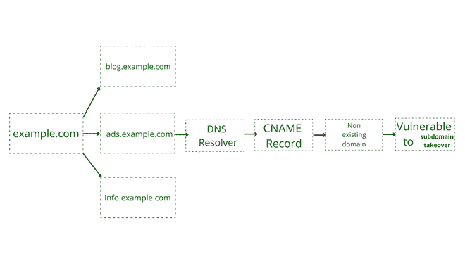

# 子域接管从头开始推进

> 原文:[https://www . geesforgeks . org/子域-从头接管到推进/](https://www.geeksforgeeks.org/subdomain-takeover-from-scratch-to-advance/)

**子域接管:**

子域接管是一个常见且最常见的漏洞。如果您没有意识到此类漏洞，那么您可以理解为类似于一类安全问题，攻击者意图通过云服务控制组织的子域。

子域接管漏洞有时可能会导致组织财务损失，危及用户对组织的信任，因为在此漏洞中，攻击者可以完全声称某个组织的特定子域为安全域，而人们在该子域上失败。在某些危险情况下，攻击者利用子域接管漏洞，将表单放在易受攻击的子域上，并从用户处获取机密信息。这些信息可能包含信用卡/借记卡详细信息、CVV 或用户的任何其他个人和机密信息。

**子域接管漏洞原因:**

当一个子域指向当前不存在的另一个域(CNAME)时，就会出现子域接管。如果攻击者注册了该不存在的域，则子域指向攻击者注册的域。通过对域名系统的一次更改，使攻击者成为该特定子域的所有者，此后，攻击者可以根据自己的选择管理该子域，这就是“子域接管漏洞”的威力。

**撞击:**

它为攻击者提供了代表组织出于任何恶意目的使用子域的机会。

**示例:**

您可以考虑一个例子，假设这个例子是一个组织，域是一个 example.com，正如您在图表中可以清楚地看到的，blog.example.com、ads.example.com 和 info.example.com 是子域。让我们来看看如何理解子域接管。

子域接管

**图解子域接管说明–**

如果 http://example.com/是组织的主域(高级域)并且 http://example.com/的开发者创建了一个子域 http://blog.example.com/，但是没有为其提供内容的主机，那么攻击者可以为这个子域(例如 http://blog . example . com/)提供一个主机并获得子域的所有权，这导致了子域接管漏洞。

**缓解:**

1.  定期监控网站的数字基础设施。
2.  如果外部服务指向不存在的服务或主机，请删除您子域上外部服务的 DNS 配置。